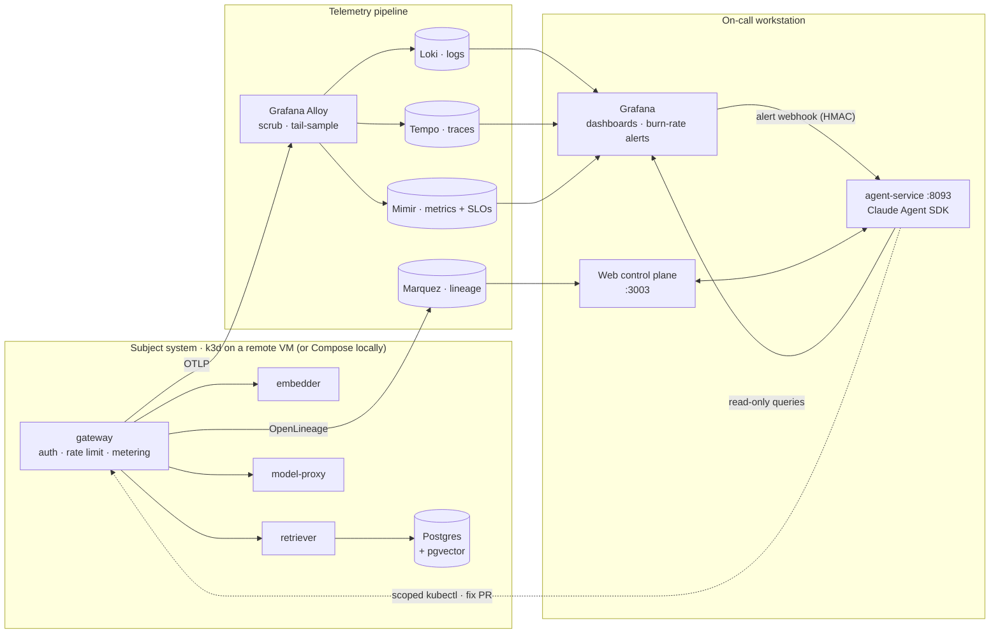
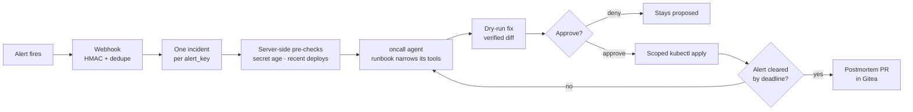

# AI Observability Lab

An AI inference platform instrumented end to end — and the on-call arrangement that watches it. A RAG gateway serves real traffic, every layer emits telemetry into one pipeline, and Claude agents read that telemetry to diagnose incidents, propose fixes behind approval gates, and write the postmortem.


## Architecture

Three planes, deliberately separated. The **subject system** is disposable and lives on a remote k3d cluster. The **telemetry pipeline** and the **on-call workstation** stay on the laptop, so no amount of cluster mayhem can destroy the evidence.



### Design decisions

| Decision                                      | Why                                                                                                                                     |
| --------------------------------------------- | --------------------------------------------------------------------------------------------------------------------------------------- |
| Observability plane off-cluster               | The thing being broken can't take its own evidence down with it                                                                         |
| Manual OpenTelemetry, no auto-instrumentation | Spans and attributes are chosen, not inherited — the trace tells the story of the request                                               |
| `infra/ports.env` as the single address book  | Compose, `obs`, the k3d config and the URL aliases all read one file; a port collision is a one-line fix                                |
| Agents get their own Kubernetes identities    | `agent-ro` reads, `agent-remediate` is fixed-argv kubectl scoped to one namespace. Bash is off the table by construction, not by prompt |
| Every mutating fix is dry-run first           | Only a server-verified diff can make an approval executable                                                                             |
| SLO specs compile to recording rules          | `slo/` is the source of truth; Mimir rules and multi-window burn-rate alerts are generated from it                                      |

### The incident loop

An alert fires and nobody dispatches anything — the `oncall` agent owns the loop from webhook to postmortem PR.



## Tech stack

| Layer                 | Built with                                                  |
| --------------------- | ----------------------------------------------------------- |
| Subject services      | Bun · TypeScript · Zod · Postgres + pgvector · Redis        |
| Instrumentation       | OpenTelemetry (manual) · Grafana Alloy · OpenLineage        |
| Storage & query       | Loki · Tempo · Mimir · Pyroscope · Marquez                  |
| Dashboards & alerting | Grafana · kubernetes-mixin · multi-window burn-rate alerts  |
| Control plane UI      | TanStack Start · shadcn (Base UI) · AI Elements             |
| Agents                | Python · FastAPI · Claude Agent SDK · kubernetes-mcp-server |
| Data quality          | Python dq-runner — freshness, volume, drift, schema, cache  |
| Platform              | k3d on a Hetzner VM over Tailscale · Docker Compose locally |
| Delivery              | Gitea Actions · Argo CD · Argo Rollouts (canary)            |
| Tooling               | Turborepo · Vitest · oxlint · oxfmt · uv                    |

## Quickstart

```bash
bun install
cp .env.example .env   # local defaults work out of the box
```

The lab is driven by the **`obs` CLI** (`scripts/obs.ps1`). Add it to your PowerShell `$PROFILE`:

```powershell
function obs { & '<path-to-repo>\scripts\obs.ps1' @args }
```

```powershell
obs all                # containers + agent-service + web + traffic, each in its own window
```

…or piece by piece:

```powershell
obs up                 # 1. the containers (subject + observability + lineage)
obs agents             # 2. agent-service :8093   (own terminal)
obs web                # 3. control plane :3003   (own terminal)
obs load 120 300       # 4. synthetic traffic so the dashboards fill in
```

The two host processes run outside Compose so the Agent SDK can use your local Claude Code login and the web app can hot-reload.

<details>
<summary>Without the wrapper (macOS / Linux)</summary>

```bash
bash scripts/dev-up.sh --build
(cd apps/agent-service && uv sync && uv run python -m agent_service)   # :8093
bun --cwd apps/web run dev                                            # :3003
GATEWAY_URL=http://localhost:8080 TARGET_QPS=120 DURATION_SECONDS=300 \
  bun --cwd apps/load-generator run start
```

</details>

**Prerequisites** — Docker Desktop, Bun ≥ 1.2, [uv](https://docs.astral.sh/uv/), and Claude Code logged in on this machine (the agent-service authenticates against your local session; no API key). Kubernetes mode additionally needs `kubectl` and a small Linux VM on your tailnet — see `infra/vm/`.

## Commands

| Command                              | What it does                                                                                                                                           |
| ------------------------------------ | ------------------------------------------------------------------------------------------------------------------------------------------------------ |
| `obs all [qps] [secs]`               | Everything at once, each piece in its own window                                                                                                       |
| `obs up [--build]` / `obs down [-v]` | Bring the lab up / tear it down (`-v` wipes volumes)                                                                                                   |
| `obs load [qps] [secs]`              | Steady traffic — also `spike`, `ramp`, `soak`, `drift`, `abuse`                                                                                        |
| `obs fail <id>`                      | Run one failure scenario as a drill: inject, dwell, auto-revert                                                                                        |
| `obs chaos <sub>`                    | `list` `inject` `verify` `revert` `selftest` a scenario by hand                                                                                        |
| `obs exam <group>`                   | Grade the on-call agent against a hidden key — `inference` `resources` `delivery` `cicd` `config`                                                      |
| `obs drill <sub>`                    | Schedule an unannounced exam question at a random time in a window                                                                                     |
| `obs k8s <sub>`                      | Cluster lifecycle: `up` `down` `status` `build` `deploy` `smoke` `monitoring` `argo` `agent-kubeconfig` `agent-remediate-kubeconfig` `node-stop/start` |
| `obs ci <sub>`                       | Gitea + Actions runner + `ci-shim` on the VM: `up` `down` `logs` `token` `status`                                                                      |
| `obs gitops <sub>`                   | Desired-state repo: `init` `push` `status` `smoke`                                                                                                     |
| `obs argocd` / `obs rollouts`        | Open the Argo CD UI (:8443) / Rollouts dashboard (:3105)                                                                                               |
| `obs demo [qps] [secs]`              | Full cycle: up → healthy → load → down                                                                                                                 |
| `obs preflight` / `obs smoke`        | Check binaries and ports / end-to-end smoke test                                                                                                       |
| `obs urls` / `obs names`             | Print the address table / register `https://obs-*.localhost` aliases                                                                                   |
| `obs ps` / `obs logs`                | Container status / follow logs                                                                                                                         |

## Endpoints

| Service       | Address               | Notes                      |
| ------------- | --------------------- | -------------------------- |
| Control plane | http://localhost:3003 | dev mode, no auth          |
| Grafana       | http://localhost:3001 | anonymous (Admin)          |
| Marquez UI    | http://localhost:3002 | lineage graph              |
| Gateway API   | http://localhost:8080 | bearer tokens below        |
| Agent service | http://localhost:8093 | host process               |
| Gitea         | http://localhost:3005 | CI, PRs, GitOps repo       |
| dq-runner     | http://localhost:8091 | `/violations`, `POST /run` |
| Pyroscope     | http://localhost:4040 | profiles (opt-in profiler) |

Every host-published port lives in **`infra/ports.env`**. Dev tenants: `dev-local-token` (test-bench), `dev-token-bravo` (bravo), `dev-token-abuser` (tiny quota — trips 429s).

> **Windows note:** the agent-service binds IPv4, so the web app points at `http://127.0.0.1:8093` — `localhost` may resolve to IPv6 first and refuse.

## Things to try

**Ask the gateway a question** (RAG over the seeded corpus):

```bash
curl -s -X POST localhost:8080/v1/chat \
  -H "authorization: Bearer dev-local-token" \
  -H "content-type: application/json" \
  -d '{"prompt":"what is pride and prejudice about","topK":3}'
```

**Run the keystone demo** — one on-purpose incident end to end, ~6–8 min:

```bash
bun run demo:incident
```

| Then                                                           | Where        |
| -------------------------------------------------------------- | ------------ |
| Chat with the RCA assistant — live tool calls, saved artifacts | `/agents`    |
| Watch the on-call loop close an incident                       | `/oncall`    |
| Walk a runbook with per-step approvals                         | `/runbooks`  |
| Read exam scorecards                                           | `/scorecard` |

**Break something** (k8s mode): `obs fail oomkill` cuts the retriever's memory limit under load — the working set flat-tops, `KubeContainerOOMKilled` fires, and the postmortem distinguishes "killed for exceeding its allowance" from "crashed". `crashloop`, `imagepull`, `readiness-break`, `bad-deploy`, `canary-bad-image`, `config-drift` and `sync-fail` tell the other stories. `obs fail stale-secret` is the flagship: rotate a Secret out from under a workload and watch the whole alert→approve→verify→postmortem loop run.

**Follow the telemetry**: click a latency exemplar on the RED dashboard to land on its Tempo trace, then "Logs for this span" for the matching `trace_id` in Loki. Every agent run is itself a trace (`service.name=agent-service`).

## Development

```bash
bun run dev          # all TS services in watch mode (stop the compose app services first)
bun run test         # vitest across the monorepo
bun run typecheck    # tsc --noEmit everywhere
bun run lint         # oxlint
bun run format       # oxfmt --write .
```

## Layout

```
apps/
  gateway/          Bun HTTP server — the AI inference gateway (OTel instrumented)
  embedder/         deterministic embedding service
  retriever/        pgvector top-k retrieval over a seeded corpus
  model-proxy/      mock LLM with a fault model + /admin/chaos control plane
  load-generator/   weighted chaotic traffic + the chaos scheduler
  web/              TanStack Start control plane (:3003)
  agent-service/    Python + Claude Agent SDK — six agents (:8093)
  dq-runner/        Python — scheduled data-quality checks (:8091)
  ci-shim/          turns Gitea deliveries into CI traces + DORA metrics
packages/
  contracts/        shared types + Zod schemas (incl. the agent wire contract)
  domain/           pure domain logic
  telemetry/        OTel init + manual instrumentation helpers
  lineage/          OpenLineage builders + Marquez emitter
infra/
  ports.env         THE address book — every host-published port, one file
  compose*.yml      subject system · observability · lineage · CI
  k8s/              k3d config, cluster bootstrap, monitoring + Argo values
  gitops/           desired-state seed (runtime truth lives in Gitea)
  vm/               VM provisioning (cloud-init, tailnet NAT unit)
slo/                SLO specs — source of truth for recording rules + alerts
runbooks/           Markdown runbooks the agents walk with approvals
scripts/            obs.ps1 (the CLI), exam.ps1, drill.ps1, k8s-build.ps1, smoke.sh
```

## Known gaps

- **Flapping alerts open one incident per cycle.** The dedupe key covers one still-open incident per alert; an alert that resolves and re-fires gets a fresh incident. Coalescing across flap cycles isn't implemented.
- **Rollout notifications stay on their own path.** Argo Rollouts' own abort/analysis events go to the gitops-reporter, not the on-call agent — which picks up a wedged canary through the Grafana `rollout-stuck` alert instead. Two triggers, by design.

Phase plans, ADRs and long-form explainers live in a local-only `docs/` folder that isn't tracked here. Operator docs ship as per-component `README.md` files under `infra/`, `apps/` and `scripts/`.
