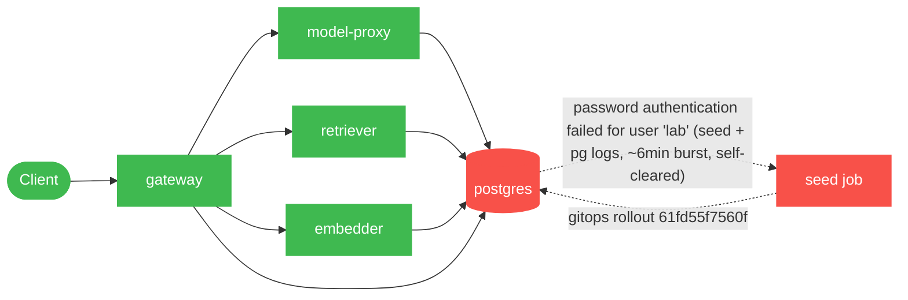

# Postmortem: TEST incident (synthetic): gateway 5xx rate above 2% - fired manually to validate postmortem visuals

- **Status:** open
- **Severity:** sev2
- **Verified:** no
- **Opened:** 2026-07-23 23:00:41Z
- **Resolved:** (still open)

## Timeline (machine-generated)

All times UTC on 2026-07-23 unless a full date is shown.

| Time (UTC) | Source | Event |
| --- | --- | --- |
| 23:00:39Z | alert | alert firing: gw-5xx |

## Evidence links

- [Loki — logs over the incident window](http://localhost:3001/explore?schemaVersion=1&panes=%7B%22pm%22%3A+%7B%22datasource%22%3A+%22loki%22%2C+%22queries%22%3A+%5B%7B%22refId%22%3A+%22A%22%2C+%22datasource%22%3A+%7B%22type%22%3A+%22loki%22%2C+%22uid%22%3A+%22loki%22%7D%2C+%22expr%22%3A+%22%7Bnamespace%3D%5C%22subject%5C%22%7D+%7C~+%5C%22%28%3Fi%29error%7Cfailed%5C%22%22%7D%5D%2C+%22range%22%3A+%7B%22from%22%3A+%221784847641246%22%2C+%22to%22%3A+%221784847907156%22%7D%7D%7D&orgId=1)
- [Mimir — metrics over the incident window](http://localhost:3001/explore?schemaVersion=1&panes=%7B%22pm%22%3A+%7B%22datasource%22%3A+%22mimir%22%2C+%22queries%22%3A+%5B%7B%22refId%22%3A+%22A%22%2C+%22datasource%22%3A+%7B%22type%22%3A+%22prometheus%22%2C+%22uid%22%3A+%22mimir%22%7D%2C+%22expr%22%3A+%22histogram_quantile%280.95%2C+sum%28rate%28http_server_duration_milliseconds_bucket%5B5m%5D%29%29+by+%28le%29%29%22%7D%5D%2C+%22range%22%3A+%7B%22from%22%3A+%221784847641246%22%2C+%22to%22%3A+%221784847907156%22%7D%7D%7D&orgId=1)

## Investigation context

**Runbook match (2):** `gateway-high-error-rate.md`, `stale-secret.md` — toolset narrowed to 13 tools: alert_status, deploy_history, kubectl_read, loki_query, mimir_query, open_postmortem_pr, request_approval, restart_workload, runbook_lookup, runbook_read, save_artifact, tempo_query, update_db_secret

Pre-check battery (as injected at run start)

## Pre-check leads

### recent_deploys — LEAD
No deploy in the last 60m — rule out the reflex answer.
- No deploy in the last 60m — rule out the reflex answer.

### kube_scan — OK
all pods Ready, no notable cluster events

### log_spike — OK
error/failed log rate normal: 0/10min vs baseline 0/10min

### rollout_state — OK
gateway and model-proxy rollouts stable, no failed analysis

### secret_age — OK
Secret subject-db-credentials last modified 4d 23h ago (created 4d 23h ago).

## Narrative

## Summary

This sev2 `gw-5xx` page (annotated by its own sender as a synthetic test "fired
manually to validate postmortem visuals") was investigated end-to-end using
the two matched runbooks (`gateway-high-error-rate.md`,
`stale-secret.md`). `alert_status` reports the alert **inactive** with
`count: 0`. Neither Mimir (gateway 5xx-rate query, both plausible metric
names) nor Loki (gateway error/5xx/failed log grep) show any gateway-side
5xx evidence anywhere in a 6-hour lookback. The only real anomaly on the
delivery path is a short, already-self-cleared burst of Postgres
`password authentication failed for user "lab"` errors on the `postgres`
and `seed` containers, which overlaps a gitops rollout and had fully
stopped well before this page fired.

## Impact

No gateway-facing impact is evidenced. All 4 running `gateway` pods show
zero restarts and zero error/5xx log lines across the lookback; the
gateway 5xx-rate metric is flat at zero the entire window. Impact was
contained to connection-log noise from the `seed` job and `postgres`
server logs during the rollout — no user-facing request failures are
visible in any signal queried.

## Root cause

The auth-failure burst (20 occurrences, `postgres` pod
`postgres-7dbfc8579d-z82lh`) lines up almost exactly with a gitops sync to
revision `61fd55f7560f` (built from commit `62eff6f727`, CI run #75 "deploy
HEAD") that redeployed `gateway`, `model-proxy`, `retriever`, `embedder`
and `load-generator`, and re-ran the `seed` job.

The `stale-secret.md` runbook's own diagnostic ordering check rules itself
out here: `secret_age` shows `subject-db-credentials` last modified ~5 days
ago, not "shortly before" the failures as the runbook's signature requires
— rotation leads the failures by days, not minutes. The `postgres` pod
itself is 2+ days old and was never restarted around the deploy, so it held
the same credential throughout; it never received a fresh Secret mount to
be "stale" against. There was also no code deploy to `gateway` specifically
in the alert-adjacent window (per the `recent_deploys` precheck), so this
isn't a bad-gateway-code-deploy story either.

The far more consistent read: a transient credential/connection race during
the rolling deploy — new pod generations (`seed`, and briefly others)
authenticating against `postgres` while the rollout was still in flight —
that cleared on its own within ~2 minutes of the rollout finishing
(18:38:23 sync complete, last auth failure ~18:40:29) and has not recurred
since (zero occurrences in the last 30 minutes checked). Combined with the
alert's own "synthetic/manual" annotation and total absence of any
gateway-side error signal, this page does not correspond to a currently
active gateway 5xx condition.

Marked hop: **seed job → postgres**, during the gitops rollout window. The
`gateway → *` legs never showed 5xx at any point and are marked clean.

## What fixed it

Nothing needed fixing at investigation time. The system had already
recovered on its own before this page was worked: `alert_status` reports
inactive/`count: 0`, all gateway pods are healthy with zero restarts, and
repeat `loki_query` checks show zero auth failures in the most recent
30-minute window. No remediation tool (`restart_workload`,
`update_db_secret`) was executed — restarting healthy gateway pods or
rotating a secret that was never actually stale would have been an
unjustified change unsupported by any of the evidence gathered, so none
was proposed for approval.

## Lessons

- The `stale-secret.md` runbook's rotation-time-vs-first-failure-time
  ordering check did exactly its job here and correctly ruled out the
  leading hypothesis (secret age 5 days vs. a failure burst that lasted
  minutes) — keep that check as step 1 for any future page matching this
  runbook.
- The gitops rollout to `61fd55f7560f` produced a real, minor, self-healing
  burst of Postgres auth failures on the `seed`/client side. It never
  became gateway-visible this time, but it's worth a follow-up look at
  whether the `seed` Job races the rollout before its DB-credential mount
  is fully synced across pod generations.
- Synthetic/manually-fired test alerts should carry a clearer marker
  reaching `alert_status` so on-call doesn't have to re-derive "was this
  ever real" from first principles across five different telemetry
  sources.
