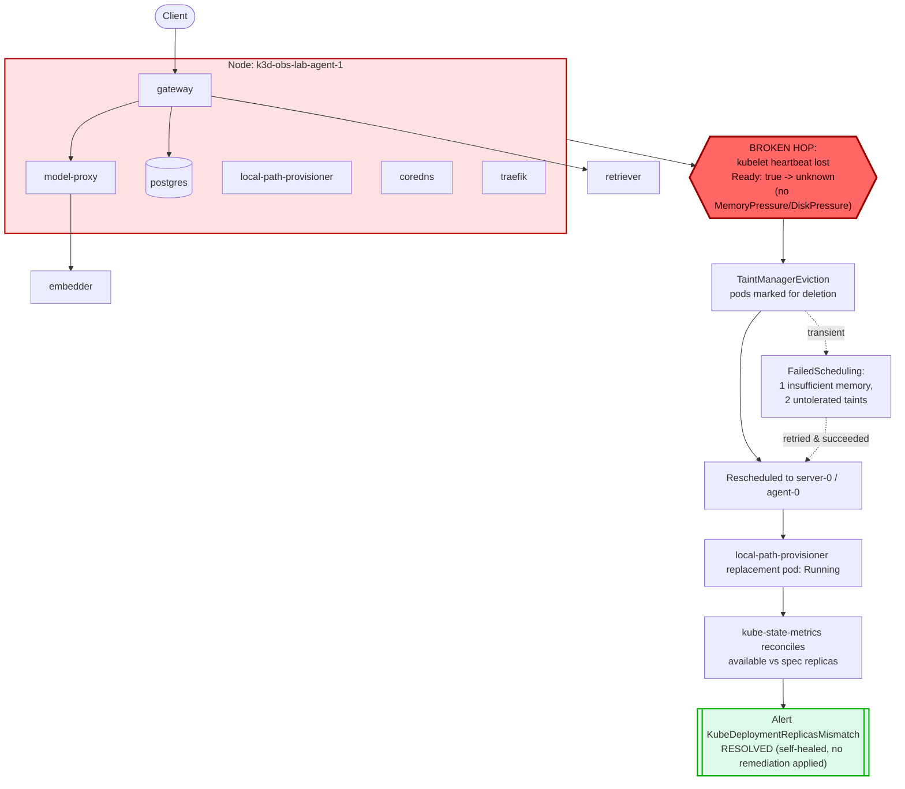

# Postmortem: kube-system/local-path-provisioner available replicas != spec for 2 minutes

- **Status:** open
- **Severity:** sev2
- **Verified:** no
- **Opened:** 2026-07-24 23:08:51Z
- **Resolved:** (still open)

## Timeline (machine-generated)

All times UTC on 2026-07-24 unless a full date is shown.

| Time (UTC) | Source | Event |
| --- | --- | --- |
| 23:00:32Z | deploy:ci | CI run #83 success on security/vm-public-exposure: obs: telemetry: collapse unmatched routes into one http_route series

routeOf fell back to the raw request path whenever |
| 23:05:54Z | k8s | Pod/retriever-597fc56f8d-vw7qb: NodeNotReady |
| 23:05:54Z | k8s | Pod/model-proxy-8ccccf4c7-6tt4v: NodeNotReady |
| 23:05:54Z | k8s | Pod/model-proxy-8ccccf4c7-5tz8s: NodeNotReady |
| 23:05:54Z | k8s | Pod/gateway-69666d8d57-5zz45: NodeNotReady |
| 23:05:54Z | k8s | Pod/gateway-69666d8d57-2vm66: NodeNotReady |
| 23:05:55Z | k8s | Pod/postgres-7dbfc8579d-z82lh: NodeNotReady |
| 23:06:24Z | k8s | Pod/retriever-597fc56f8d-vw7qb: TaintManagerEviction |
| 23:06:24Z | k8s | Pod/postgres-7dbfc8579d-z82lh: TaintManagerEviction |
| 23:06:24Z | k8s | Pod/model-proxy-8ccccf4c7-6tt4v: TaintManagerEviction |
| 23:06:24Z | k8s | Pod/model-proxy-8ccccf4c7-5tz8s: TaintManagerEviction |
| 23:06:24Z | k8s | Pod/gateway-69666d8d57-5zz45: TaintManagerEviction |
| 23:06:24Z | k8s | Pod/gateway-69666d8d57-2vm66: TaintManagerEviction |
| 23:06:25Z | k8s | ReplicaSet/retriever-597fc56f8d: SuccessfulCreate |
| 23:06:25Z | k8s | ReplicaSet/postgres-7dbfc8579d: SuccessfulCreate |
| 23:06:25Z | k8s | ReplicaSet/model-proxy-8ccccf4c7: SuccessfulCreate |
| 23:06:25Z | k8s | ReplicaSet/gateway-69666d8d57: SuccessfulCreate |
| 23:06:25Z | k8s | Pod/gateway-69666d8d57-v85mj: FailedScheduling |
| 23:06:25Z | k8s | Pod/retriever-597fc56f8d-2zxjq: Scheduled |
| 23:06:25Z | k8s | Pod/model-proxy-8ccccf4c7-9nzrr: FailedScheduling |
| 23:06:25Z | k8s | Pod/postgres-7dbfc8579d-6c92v: FailedScheduling |
| 23:06:25Z | log-spike | log-spike onset: name=gateway-69666d8d57-v85mj kind=Pod action=Scheduling objectAPIversion=v1 objectRV=567490 eventRV=567509 reportinginstance=default-scheduler-k3d-obs-lab-server-0 reportingcontroller=default-scheduler reason=FailedScheduling type=Warning msg="0/3 nodes are available: 1 Insufficient memory, 2 node(s) had untolerated taint(s). no new claims to deallocate, preemption: 0/3 nodes are available: 1 No preemption victims found for incoming pod, 2 Preemption is not helpful for scheduling."  |
| 23:06:26Z | k8s | ReplicaSet/gateway-69666d8d57: SuccessfulCreate |
| 23:06:26Z | k8s | Pod/model-proxy-8ccccf4c7-6tgv8: FailedScheduling |
| 23:06:26Z | k8s | Pod/gateway-69666d8d57-c6rlw: FailedScheduling |
| 23:06:28Z | k8s | Pod/retriever-597fc56f8d-2zxjq: Started |
| 23:06:28Z | k8s | Pod/retriever-597fc56f8d-2zxjq: Pulling |
| 23:06:28Z | k8s | Pod/retriever-597fc56f8d-2zxjq: Pulled |
| 23:06:28Z | k8s | Pod/retriever-597fc56f8d-2zxjq: Created |
| 23:08:20Z | alert | alert firing: KubeDeploymentReplicasMismatch |

## Evidence links

- [Loki — logs over the incident window](http://localhost:3001/explore?schemaVersion=1&panes=%7B%22pm%22%3A+%7B%22datasource%22%3A+%22loki%22%2C+%22queries%22%3A+%5B%7B%22refId%22%3A+%22A%22%2C+%22datasource%22%3A+%7B%22type%22%3A+%22loki%22%2C+%22uid%22%3A+%22loki%22%7D%2C+%22expr%22%3A+%22%7Bnamespace%3D%5C%22subject%5C%22%7D+%7C~+%5C%22%28%3Fi%29error%7Cfailed%5C%22%22%7D%5D%2C+%22range%22%3A+%7B%22from%22%3A+%221784934531335%22%2C+%22to%22%3A+%221784934791373%22%7D%7D%7D&orgId=1)
- [Mimir — metrics over the incident window](http://localhost:3001/explore?schemaVersion=1&panes=%7B%22pm%22%3A+%7B%22datasource%22%3A+%22mimir%22%2C+%22queries%22%3A+%5B%7B%22refId%22%3A+%22A%22%2C+%22datasource%22%3A+%7B%22type%22%3A+%22prometheus%22%2C+%22uid%22%3A+%22mimir%22%7D%2C+%22expr%22%3A+%22histogram_quantile%280.95%2C+sum%28rate%28http_server_duration_milliseconds_bucket%5B5m%5D%29%29+by+%28le%29%29%22%7D%5D%2C+%22range%22%3A+%7B%22from%22%3A+%221784934531335%22%2C+%22to%22%3A+%221784934791373%22%7D%7D%7D&orgId=1)

## Investigation context

**Runbook match:** none — no tool narrowing applied for this alert. Available runbooks: README.md, canary-abort.md, ci-pipeline-red.md, dq-freshness-stall.md, gateway-high-error-rate.md, k8s-crashloop.md, k8s-node-failure.md, snapshot-agent-audit.md, stale-secret.md

Pre-check battery (as injected at run start)

## Pre-check leads

### recent_deploys — LEAD
No deploy in the last 60m — rule out the reflex answer.
- No deploy in the last 60m — rule out the reflex answer.

### log_spike — LEAD
error/failed log rate 5/10min vs baseline 0/10min (5x baseline) — onset: name=gateway-69666d8d57-v85mj kind=Pod action=Scheduling objectAPIversion=v1 objectRV=567490 eventRV=567509 reportinginstance=default-scheduler-k3d-obs-lab-server-0 reportingcontroller=default-scheduler reason=FailedScheduling type=Warning msg="0/3 nodes are available: 1 Insufficient memory, 2 node(s) had untolerated taint(s). no new claims to deallocate, preemption: 0/3 nodes are available: 1 No preemption victims found for incoming pod, 2 Preemption is not helpful for scheduling."  at 2026-07-24T23:06:25.453349+00:00
- error/failed log rate 5/10min vs baseline 0/10min (5x baseline) — onset: name=gateway-69666d8d57-v85mj kind=Pod action=Scheduling objectAPIversion=v1 objectRV=567490 eventRV=567509 report… (truncated)

### kube_scan — UNAVAILABLE
E0725 01:08:52.370978   45200 memcache.go:265] "Unhandled Error" err="couldn't get current server API group list: Get \"https://obs-vm:6550/api?timeout=32s\": tls: failed to verify certificate: x509: certificate signed by unknown authority"
E0725 01:08:52.408474   45200 memcache.go:265] "Unhandled Error" err="couldn't get current server API group list: Get \"https://obs-vm:6550/api?timeout=32s\": tls: failed to verify certificate: x509: certificate signed by unknown authority"
E0725 01:08:52.451

### rollout_state — UNAVAILABLE
gateway: E0725 01:08:52.383299   14892 memcache.go:265] "Unhandled Error" err="couldn't get current server API group list: Get \"https://obs-vm:6550/api?timeout=32s\": tls: failed to verify certificate: x509: certificate signed by unknown authority"
E0725 01:08:52.422662   14892 memcache.go:265] "Unhandled Error" err="couldn't get current server API group list: Get \"https://obs-vm:6550/api?timeout=32s\": tls: failed to verify certificate: x509: certificate signed by unknown authority"
E0725 01:08:52.463; gateway analysis: E0725 01:08:52.855830   46596 memcache.go:265] "Unhandled Error" err="couldn't get current server API group list: Get \"https://obs-vm:6550/api?timeout=32s\": tls: failed to verify certificate: x509: certificate signed by unknown authority
… (section truncated)

### secret_age — UNAVAILABLE
E0725 01:08:52.418446   18800 memcache.go:265] "Unhandled Error" err="couldn't get current server API group list: Get \"https://obs-vm:6550/api?timeout=32s\": tls: failed to verify certificate: x509:

## Narrative

## Summary

`KubeDeploymentReplicasMismatch` fired for `kube-system/local-path-provisioner` (available replicas != spec for 2+ minutes). Root cause was a Kubernetes node (`k3d-obs-lab-agent-1`) losing kubelet heartbeat, not a bad deploy or an application-level OOM. The cluster's own node-lifecycle controller and deployment controller fully self-healed the incident before any remediation tool could be (or needed to be) applied.

## Impact

`k3d-obs-lab-agent-1` going NotReady evicted every pod scheduled on it, cluster-wide: `gateway`, `model-proxy`, `postgres`, `retriever` in the `subject` namespace, plus `local-path-provisioner`, `coredns`, `traefik`, `metrics-server`, and `argocd-applicationset-controller` in `kube-system`/`argocd`. Replacement pods hit transient `FailedScheduling` ("1 Insufficient memory, 2 node(s) had untolerated taint(s)") while the scheduler worked around the reduced capacity, but all evicted workloads were rescheduled and running again within roughly 30–60 seconds. The paging symptom (replicas mismatch) was narrowly scoped to `local-path-provisioner`'s stale pod object lagging the deployment's available-replica reconciliation.

## Root cause

`k3d-obs-lab-agent-1`'s `Ready` condition flipped from `true` to `unknown` (kubelet stopped reporting/heartbeat lost) with **no** preceding `MemoryPressure` or `DiskPressure` signal on that node — ruling out resource starvation as the trigger; this points to an infrastructure-level fault (kubelet/container/network hiccup on the node itself), not an application misbehaving. `deploy_history` showed only one unrelated CI run in the prior 3 hours (commit `10f24bc3c5`, a telemetry route-collapsing change on `security/vm-public-exposure`, no accompanying Argo/rollout deploy) — the "bad deploy" hypothesis is ruled out by evidence, not assumption. Roughly 30 seconds after NodeNotReady, the taint manager marked the node's pods for eviction and the ReplicaSet controller created `local-path-provisioner-5d9d9885bc-5db77` on `k3d-obs-lab-server-0`, which was Running within ~20 seconds. The alert kept firing for a short window afterward because the original (now-unreachable) pod object was still counted by kube-state-metrics until Kubernetes garbage-collected it and the deployment's `status.availableReplicas` reconciled.

## What fixed it

Nothing from the remediation toolset was applied — a dry-run `restart_workload` against `local-path-provisioner` was explicitly **denied** ("outside the remediation allow-list"), confirming this deployment sits outside the agent's RBAC scope (which covers only `subject`-namespace app workloads: gateway/model-proxy/retriever/embedder/load-generator). No node-level remediation tool exists in this agent's toolset. The incident resolved entirely through Kubernetes' built-in self-healing (taint-based eviction + ReplicaSet reconciliation + eventual GC of the stale pod object); `alert_status` confirmed recovery (`active: false`) on the next poll after the replacement pod stabilized.

## Lessons

- This alert class (`KubeDeploymentReplicasMismatch` on `kube-system` components) falls outside the current agent-remediate RBAC allow-list entirely — worth a purpose-built runbook that says explicitly "no in-scope action; verify self-heal, escalate to a human with node-level access on obs-vm if it doesn't clear within the pod-eviction-timeout window (~5 min)."
- No runbook currently matches this alertname at all — author one covering: check node Ready/MemoryPressure/DiskPressure conditions first, rule out deploy correlation via `deploy_history`, and set explicit self-heal expectations before escalating.
- Consider a lower-severity classification (or a longer for-duration) for `KubeDeploymentReplicasMismatch` on infra deployments like `local-path-provisioner`, given it's a normal, expected transient during any node hiccup and resolves without intervention almost every time.
- Worth alerting separately on `KubeNodeNotReady` / node heartbeat loss directly — it's the actual root cause and would page faster with clearer signal than a downstream deployment symptom.

