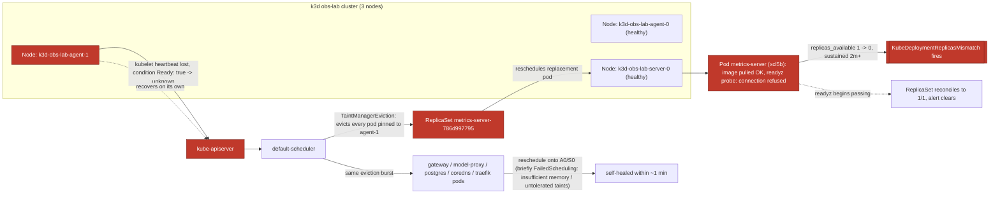

# Postmortem: kube-system/metrics-server available replicas != spec for 2 minutes

- **Status:** open
- **Severity:** sev2
- **Verified:** no
- **Opened:** 2026-07-24 23:08:51Z
- **Resolved:** (still open)

## Timeline (machine-generated)

All times UTC on 2026-07-24 unless a full date is shown.

| Time (UTC) | Source | Event |
| --- | --- | --- |
| 23:00:32Z | deploy:ci | CI run #83 success on security/vm-public-exposure: obs: telemetry: collapse unmatched routes into one http_route series

routeOf fell back to the raw request path whenever |
| 23:05:54Z | k8s | Pod/retriever-597fc56f8d-vw7qb: NodeNotReady |
| 23:05:54Z | k8s | Pod/model-proxy-8ccccf4c7-6tt4v: NodeNotReady |
| 23:05:54Z | k8s | Pod/model-proxy-8ccccf4c7-5tz8s: NodeNotReady |
| 23:05:54Z | k8s | Pod/gateway-69666d8d57-5zz45: NodeNotReady |
| 23:05:54Z | k8s | Pod/gateway-69666d8d57-2vm66: NodeNotReady |
| 23:05:55Z | k8s | Pod/postgres-7dbfc8579d-z82lh: NodeNotReady |
| 23:06:24Z | k8s | Pod/retriever-597fc56f8d-vw7qb: TaintManagerEviction |
| 23:06:24Z | k8s | Pod/postgres-7dbfc8579d-z82lh: TaintManagerEviction |
| 23:06:24Z | k8s | Pod/model-proxy-8ccccf4c7-6tt4v: TaintManagerEviction |
| 23:06:24Z | k8s | Pod/model-proxy-8ccccf4c7-5tz8s: TaintManagerEviction |
| 23:06:24Z | k8s | Pod/gateway-69666d8d57-5zz45: TaintManagerEviction |
| 23:06:24Z | k8s | Pod/gateway-69666d8d57-2vm66: TaintManagerEviction |
| 23:06:25Z | k8s | ReplicaSet/retriever-597fc56f8d: SuccessfulCreate |
| 23:06:25Z | k8s | ReplicaSet/postgres-7dbfc8579d: SuccessfulCreate |
| 23:06:25Z | k8s | ReplicaSet/model-proxy-8ccccf4c7: SuccessfulCreate |
| 23:06:25Z | k8s | ReplicaSet/gateway-69666d8d57: SuccessfulCreate |
| 23:06:25Z | k8s | Pod/gateway-69666d8d57-v85mj: FailedScheduling |
| 23:06:25Z | k8s | Pod/retriever-597fc56f8d-2zxjq: Scheduled |
| 23:06:25Z | k8s | Pod/model-proxy-8ccccf4c7-9nzrr: FailedScheduling |
| 23:06:25Z | k8s | Pod/postgres-7dbfc8579d-6c92v: FailedScheduling |
| 23:06:25Z | log-spike | log-spike onset: name=gateway-69666d8d57-v85mj kind=Pod action=Scheduling objectAPIversion=v1 objectRV=567490 eventRV=567509 reportinginstance=default-scheduler-k3d-obs-lab-server-0 reportingcontroller=default-scheduler reason=FailedScheduling type=Warning msg="0/3 nodes are available: 1 Insufficient memory, 2 node(s) had untolerated taint(s). no new claims to deallocate, preemption: 0/3 nodes are available: 1 No preemption victims found for incoming pod, 2 Preemption is not helpful for scheduling."  |
| 23:06:26Z | k8s | ReplicaSet/gateway-69666d8d57: SuccessfulCreate |
| 23:06:26Z | k8s | Pod/model-proxy-8ccccf4c7-6tgv8: FailedScheduling |
| 23:06:26Z | k8s | Pod/gateway-69666d8d57-c6rlw: FailedScheduling |
| 23:06:28Z | k8s | Pod/retriever-597fc56f8d-2zxjq: Started |
| 23:06:28Z | k8s | Pod/retriever-597fc56f8d-2zxjq: Pulling |
| 23:06:28Z | k8s | Pod/retriever-597fc56f8d-2zxjq: Pulled |
| 23:06:28Z | k8s | Pod/retriever-597fc56f8d-2zxjq: Created |
| 23:08:20Z | alert | alert firing: KubeDeploymentReplicasMismatch |

## Evidence links

- [Loki — logs over the incident window](http://localhost:3001/explore?schemaVersion=1&panes=%7B%22pm%22%3A+%7B%22datasource%22%3A+%22loki%22%2C+%22queries%22%3A+%5B%7B%22refId%22%3A+%22A%22%2C+%22datasource%22%3A+%7B%22type%22%3A+%22loki%22%2C+%22uid%22%3A+%22loki%22%7D%2C+%22expr%22%3A+%22%7Bnamespace%3D%5C%22subject%5C%22%7D+%7C~+%5C%22%28%3Fi%29error%7Cfailed%5C%22%22%7D%5D%2C+%22range%22%3A+%7B%22from%22%3A+%221784934531390%22%2C+%22to%22%3A+%221784934785210%22%7D%7D%7D&orgId=1)
- [Mimir — metrics over the incident window](http://localhost:3001/explore?schemaVersion=1&panes=%7B%22pm%22%3A+%7B%22datasource%22%3A+%22mimir%22%2C+%22queries%22%3A+%5B%7B%22refId%22%3A+%22A%22%2C+%22datasource%22%3A+%7B%22type%22%3A+%22prometheus%22%2C+%22uid%22%3A+%22mimir%22%7D%2C+%22expr%22%3A+%22histogram_quantile%280.95%2C+sum%28rate%28http_server_duration_milliseconds_bucket%5B5m%5D%29%29+by+%28le%29%29%22%7D%5D%2C+%22range%22%3A+%7B%22from%22%3A+%221784934531390%22%2C+%22to%22%3A+%221784934785210%22%7D%7D%7D&orgId=1)

## Investigation context

**Runbook match:** none — no tool narrowing applied for this alert. Available runbooks: README.md, canary-abort.md, ci-pipeline-red.md, dq-freshness-stall.md, gateway-high-error-rate.md, k8s-crashloop.md, k8s-node-failure.md, snapshot-agent-audit.md, stale-secret.md

Pre-check battery (as injected at run start)

## Pre-check leads

### recent_deploys — LEAD
No deploy in the last 60m — rule out the reflex answer.
- No deploy in the last 60m — rule out the reflex answer.

### log_spike — LEAD
error/failed log rate 5/10min vs baseline 0/10min (5x baseline) — onset: name=gateway-69666d8d57-v85mj kind=Pod action=Scheduling objectAPIversion=v1 objectRV=567490 eventRV=567509 reportinginstance=default-scheduler-k3d-obs-lab-server-0 reportingcontroller=default-scheduler reason=FailedScheduling type=Warning msg="0/3 nodes are available: 1 Insufficient memory, 2 node(s) had untolerated taint(s). no new claims to deallocate, preemption: 0/3 nodes are available: 1 No preemption victims found for incoming pod, 2 Preemption is not helpful for scheduling."  at 2026-07-24T23:06:25.453349+00:00
- error/failed log rate 5/10min vs baseline 0/10min (5x baseline) — onset: name=gateway-69666d8d57-v85mj kind=Pod action=Scheduling objectAPIversion=v1 objectRV=567490 eventRV=567509 report… (truncated)

### kube_scan — UNAVAILABLE
E0725 01:08:53.150533   45308 memcache.go:265] "Unhandled Error" err="couldn't get current server API group list: Get \"https://obs-vm:6550/api?timeout=32s\": tls: failed to verify certificate: x509: certificate signed by unknown authority"
E0725 01:08:53.199309   45308 memcache.go:265] "Unhandled Error" err="couldn't get current server API group list: Get \"https://obs-vm:6550/api?timeout=32s\": tls: failed to verify certificate: x509: certificate signed by unknown authority"
E0725 01:08:53.253

### rollout_state — UNAVAILABLE
gateway: E0725 01:08:53.081241   29676 memcache.go:265] "Unhandled Error" err="couldn't get current server API group list: Get \"https://obs-vm:6550/api?timeout=32s\": tls: failed to verify certificate: x509: certificate signed by unknown authority"
E0725 01:08:53.132891   29676 memcache.go:265] "Unhandled Error" err="couldn't get current server API group list: Get \"https://obs-vm:6550/api?timeout=32s\": tls: failed to verify certificate: x509: certificate signed by unknown authority"
E0725 01:08:53.176; gateway analysis: E0725 01:08:53.079927   35956 memcache.go:265] "Unhandled Error" err="couldn't get current server API group list: Get \"https://obs-vm:6550/api?timeout=32s\": tls: failed to verify certificate: x509: certificate signed by unknown authority
… (section truncated)

### secret_age — UNAVAILABLE
E0725 01:08:52.835322   31048 memcache.go:265] "Unhandled Error" err="couldn't get current server API group list: Get \"https://obs-vm:6550/api?timeout=32s\": tls: failed to verify certificate: x509:

## Narrative

## Summary

`KubeDeploymentReplicasMismatch` fired for `kube-system/metrics-server` (available replicas != spec for 2+ minutes). Root cause was a transient `NodeNotReady` flap on cluster node `k3d-obs-lab-agent-1`, which evicted every pod scheduled there cluster-wide (including metrics-server's only replica) and, on the remaining two nodes, briefly exhausted scheduling headroom for several `subject`-namespace workloads. The alert cleared on its own once the node recovered and the replacement metrics-server pod passed its readiness probe — no remediation tool call was needed or, per the remediation allow-list, available.

## Impact

- `kube-system/metrics-server`: 0/1 available replicas for the duration of the incident (metrics API briefly degraded/stale cluster-wide — HPA and `kubectl top` consumers would have seen stale data).
- Collateral evictions (all self-healed by rescheduling onto healthy nodes): `gateway`, `model-proxy`, `postgres`, `retriever` pods in `subject`; `coredns`, `traefik`, `local-path-provisioner`, `svclb-traefik` in `kube-system`; `argocd-applicationset-controller`; `k8s-monitoring-alloy-logs`.
- Several reschedules briefly hit `FailedScheduling` ("0/3 nodes are available: 1 Insufficient memory, 2 node(s) had untolerated taint(s)") — evidence the remaining 2-node capacity was thin immediately after the loss of `agent-1`, though everything but metrics-server recovered inside the same minute.

## Root cause

`kube_node_status_condition{node="k3d-obs-lab-agent-1", condition="Ready"}` flipped from `true` to `unknown` in lockstep with the Loki `NodeNotReady` event for that node — confirmed as the trigger for the mass eviction event burst (`NodeNotReady` reason across many pods/namespaces at the same instant). `deploy_history` showed no deploy in the preceding 60 minutes (the only recent CI activity was an unrelated telemetry-routing PR merge ~8 minutes earlier), ruling out a bad rollout as the trigger. metrics-server's original pod was pinned to the bad node; a replacement pod (`...-xcl5b`) was created and scheduled onto the healthy `k3d-obs-lab-server-0`, pulled its image, and started, but its `readyz` probe (`https://<pod-ip>:10250/readyz`) returned connection-refused immediately after container start — keeping `kube_deployment_status_replicas_available` at 0 and tripping the 2-minute-sustained-mismatch alert. No runbook is indexed for `KubeDeploymentReplicasMismatch` directly; investigation followed the closest match, `k8s-node-failure.md`, via the pre-check's `FailedScheduling`/node-eviction leads.

## What fixed it

Nothing was remediated by this agent. `metrics-server` lives in `kube-system` and every mutation tool available (`restart_workload`, `scale_deployment`, `patch_memory_limit`) is scoped by allow-list to `subject`-namespace app workloads (`gateway | model-proxy | retriever | embedder | load-generator`) — a `restart_workload` dry-run against `metrics-server` was explicitly denied ("outside the remediation allow-list"). This matches `k8s-node-failure.md`'s own guidance that node-level failures are diagnosis-first and any fix belongs to the operator/host layer, not a kubectl mutation the agent should automate. Before any operator escalation was raised, node `agent-1` recovered on its own, the replacement metrics-server pod's readiness probe began passing, and the ReplicaSet reconciled back to 1/1 available. Repeated `alert_status` polling confirmed the alert cleared (`active:false`) without intervention.

## Lessons

- Add a runbook entry (or extend `k8s-node-failure.md`'s alert coverage) for `KubeDeploymentReplicasMismatch` directly — this incident only found the right diagnostic path because the pre-check leads happened to surface `FailedScheduling`/`NodeNotReady` events; a fresh page without those leads would have started blind.
- Document explicitly that `KubeDeploymentReplicasMismatch` on `kube-system` components is diagnosis/escalate-only under the current remediation allow-list, so on-call doesn't burn time hunting for a remediation path that doesn't exist by design.
- The 3-node lab cluster has thin scheduling headroom: losing one node produced simultaneous `FailedScheduling` for several `subject`-namespace pods on the remaining two. Worth revisiting node sizing/taints so a single-node blip doesn't threaten multi-service capacity.
- `kubectl_read` was unusable for the entire incident (`x509: certificate signed by unknown authority` against `obs-vm:6550`) — all diagnosis leaned on Loki/Mimir. Worth fixing the agent-ro kubeconfig CA so on-call isn't flying without direct cluster reads next time.

