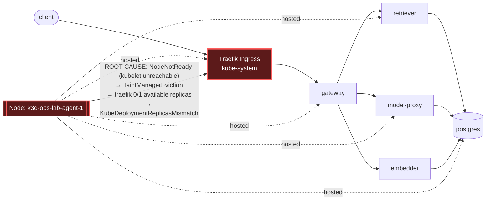

# Postmortem: kube-system/traefik available replicas != spec for 2 minutes

- **Status:** open
- **Severity:** sev2
- **Verified:** no
- **Opened:** 2026-07-24 23:08:51Z
- **Resolved:** (still open)

## Timeline (machine-generated)

All times UTC on 2026-07-24 unless a full date is shown.

| Time (UTC) | Source | Event |
| --- | --- | --- |
| 23:00:32Z | deploy:ci | CI run #83 success on security/vm-public-exposure: obs: telemetry: collapse unmatched routes into one http_route series

routeOf fell back to the raw request path whenever |
| 23:05:54Z | k8s | Pod/retriever-597fc56f8d-vw7qb: NodeNotReady |
| 23:05:54Z | k8s | Pod/model-proxy-8ccccf4c7-6tt4v: NodeNotReady |
| 23:05:54Z | k8s | Pod/model-proxy-8ccccf4c7-5tz8s: NodeNotReady |
| 23:05:54Z | k8s | Pod/gateway-69666d8d57-5zz45: NodeNotReady |
| 23:05:54Z | k8s | Pod/gateway-69666d8d57-2vm66: NodeNotReady |
| 23:05:55Z | k8s | Pod/postgres-7dbfc8579d-z82lh: NodeNotReady |
| 23:06:24Z | k8s | Pod/retriever-597fc56f8d-vw7qb: TaintManagerEviction |
| 23:06:24Z | k8s | Pod/postgres-7dbfc8579d-z82lh: TaintManagerEviction |
| 23:06:24Z | k8s | Pod/model-proxy-8ccccf4c7-6tt4v: TaintManagerEviction |
| 23:06:24Z | k8s | Pod/model-proxy-8ccccf4c7-5tz8s: TaintManagerEviction |
| 23:06:24Z | k8s | Pod/gateway-69666d8d57-5zz45: TaintManagerEviction |
| 23:06:24Z | k8s | Pod/gateway-69666d8d57-2vm66: TaintManagerEviction |
| 23:06:25Z | k8s | ReplicaSet/retriever-597fc56f8d: SuccessfulCreate |
| 23:06:25Z | k8s | ReplicaSet/postgres-7dbfc8579d: SuccessfulCreate |
| 23:06:25Z | k8s | ReplicaSet/model-proxy-8ccccf4c7: SuccessfulCreate |
| 23:06:25Z | k8s | ReplicaSet/gateway-69666d8d57: SuccessfulCreate |
| 23:06:25Z | k8s | Pod/gateway-69666d8d57-v85mj: FailedScheduling |
| 23:06:25Z | k8s | Pod/retriever-597fc56f8d-2zxjq: Scheduled |
| 23:06:25Z | k8s | Pod/model-proxy-8ccccf4c7-9nzrr: FailedScheduling |
| 23:06:25Z | k8s | Pod/postgres-7dbfc8579d-6c92v: FailedScheduling |
| 23:06:25Z | log-spike | log-spike onset: name=gateway-69666d8d57-v85mj kind=Pod action=Scheduling objectAPIversion=v1 objectRV=567490 eventRV=567509 reportinginstance=default-scheduler-k3d-obs-lab-server-0 reportingcontroller=default-scheduler reason=FailedScheduling type=Warning msg="0/3 nodes are available: 1 Insufficient memory, 2 node(s) had untolerated taint(s). no new claims to deallocate, preemption: 0/3 nodes are available: 1 No preemption victims found for incoming pod, 2 Preemption is not helpful for scheduling."  |
| 23:06:26Z | k8s | ReplicaSet/gateway-69666d8d57: SuccessfulCreate |
| 23:06:26Z | k8s | Pod/model-proxy-8ccccf4c7-6tgv8: FailedScheduling |
| 23:06:26Z | k8s | Pod/gateway-69666d8d57-c6rlw: FailedScheduling |
| 23:06:28Z | k8s | Pod/retriever-597fc56f8d-2zxjq: Started |
| 23:06:28Z | k8s | Pod/retriever-597fc56f8d-2zxjq: Pulling |
| 23:06:28Z | k8s | Pod/retriever-597fc56f8d-2zxjq: Pulled |
| 23:06:28Z | k8s | Pod/retriever-597fc56f8d-2zxjq: Created |
| 23:08:20Z | alert | alert firing: KubeDeploymentReplicasMismatch |

## Evidence links

- [Loki — logs over the incident window](http://localhost:3001/explore?schemaVersion=1&panes=%7B%22pm%22%3A+%7B%22datasource%22%3A+%22loki%22%2C+%22queries%22%3A+%5B%7B%22refId%22%3A+%22A%22%2C+%22datasource%22%3A+%7B%22type%22%3A+%22loki%22%2C+%22uid%22%3A+%22loki%22%7D%2C+%22expr%22%3A+%22%7Bnamespace%3D%5C%22subject%5C%22%7D+%7C~+%5C%22%28%3Fi%29error%7Cfailed%5C%22%22%7D%5D%2C+%22range%22%3A+%7B%22from%22%3A+%221784934531556%22%2C+%22to%22%3A+%221784934785207%22%7D%7D%7D&orgId=1)
- [Mimir — metrics over the incident window](http://localhost:3001/explore?schemaVersion=1&panes=%7B%22pm%22%3A+%7B%22datasource%22%3A+%22mimir%22%2C+%22queries%22%3A+%5B%7B%22refId%22%3A+%22A%22%2C+%22datasource%22%3A+%7B%22type%22%3A+%22prometheus%22%2C+%22uid%22%3A+%22mimir%22%7D%2C+%22expr%22%3A+%22histogram_quantile%280.95%2C+sum%28rate%28http_server_duration_milliseconds_bucket%5B5m%5D%29%29+by+%28le%29%29%22%7D%5D%2C+%22range%22%3A+%7B%22from%22%3A+%221784934531556%22%2C+%22to%22%3A+%221784934785207%22%7D%7D%7D&orgId=1)

## Investigation context

**Runbook match:** none — no tool narrowing applied for this alert. Available runbooks: README.md, canary-abort.md, ci-pipeline-red.md, dq-freshness-stall.md, gateway-high-error-rate.md, k8s-crashloop.md, k8s-node-failure.md, snapshot-agent-audit.md, stale-secret.md

Pre-check battery (as injected at run start)

## Pre-check leads

### recent_deploys — LEAD
No deploy in the last 60m — rule out the reflex answer.
- No deploy in the last 60m — rule out the reflex answer.

### log_spike — LEAD
error/failed log rate 5/10min vs baseline 0/10min (5x baseline) — onset: name=gateway-69666d8d57-v85mj kind=Pod action=Scheduling objectAPIversion=v1 objectRV=567490 eventRV=567509 reportinginstance=default-scheduler-k3d-obs-lab-server-0 reportingcontroller=default-scheduler reason=FailedScheduling type=Warning msg="0/3 nodes are available: 1 Insufficient memory, 2 node(s) had untolerated taint(s). no new claims to deallocate, preemption: 0/3 nodes are available: 1 No preemption victims found for incoming pod, 2 Preemption is not helpful for scheduling."  at 2026-07-24T23:06:25.453349+00:00
- error/failed log rate 5/10min vs baseline 0/10min (5x baseline) — onset: name=gateway-69666d8d57-v85mj kind=Pod action=Scheduling objectAPIversion=v1 objectRV=567490 eventRV=567509 report… (truncated)

### kube_scan — UNAVAILABLE
E0725 01:08:53.592778   38024 memcache.go:265] "Unhandled Error" err="couldn't get current server API group list: Get \"https://obs-vm:6550/api?timeout=32s\": tls: failed to verify certificate: x509: certificate signed by unknown authority"
E0725 01:08:53.677710   38024 memcache.go:265] "Unhandled Error" err="couldn't get current server API group list: Get \"https://obs-vm:6550/api?timeout=32s\": tls: failed to verify certificate: x509: certificate signed by unknown authority"
E0725 01:08:53.725

### rollout_state — UNAVAILABLE
gateway: E0725 01:08:53.704052   21480 memcache.go:265] "Unhandled Error" err="couldn't get current server API group list: Get \"https://obs-vm:6550/api?timeout=32s\": tls: failed to verify certificate: x509: certificate signed by unknown authority"
E0725 01:08:53.781719   21480 memcache.go:265] "Unhandled Error" err="couldn't get current server API group list: Get \"https://obs-vm:6550/api?timeout=32s\": tls: failed to verify certificate: x509: certificate signed by unknown authority"
E0725 01:08:53.851; gateway analysis: E0725 01:08:53.674448   53380 memcache.go:265] "Unhandled Error" err="couldn't get current server API group list: Get \"https://obs-vm:6550/api?timeout=32s\": tls: failed to verify certificate: x509: certificate signed by unknown authority
… (section truncated)

### secret_age — UNAVAILABLE
E0725 01:08:53.421481   46248 memcache.go:265] "Unhandled Error" err="couldn't get current server API group list: Get \"https://obs-vm:6550/api?timeout=32s\": tls: failed to verify certificate: x509:

## Narrative

## Summary

`KubeDeploymentReplicasMismatch` fired for `kube-system/traefik` (available replicas != spec for 2+ minutes). Investigation traced this to a genuine Kubernetes node failure — `k3d-obs-lab-agent-1` flipped to `Ready=unknown` (kubelet unreachable) — which evicted traefik's sole replica along with coredns, metrics-server, local-path-provisioner, and several `subject`-namespace pods (gateway, model-proxy, retriever, postgres) that happened to be co-scheduled there. No remediation tool in this agent's RBAC-scoped allow-list covers `kube-system` infrastructure, so no agent-side mutation was performed; the alert cleared on its own during the investigation.

## Impact

- `traefik` deployment (spec replicas=1) ran with 0 available replicas for the duration of the incident — cluster ingress capacity was down to zero redundancy.
- Collateral pod evictions hit `gateway`, `model-proxy`, `retriever`, `postgres`, and `argocd-applicationset-controller` on the same node; several replacement pods briefly failed to schedule cluster-wide (`FailedScheduling: 1 Insufficient memory, 2 node(s) had untolerated taint(s)`) because only one of the remaining three nodes was untainted and schedulable, and that node was memory-constrained absorbing the evicted workload.
- The pre-check `log_spike` lead (5x baseline error/failed log rate) is explained by this same scheduling failure wave, not a separate application-level regression.

## Root cause

Node-level failure: `k3d-obs-lab-agent-1` transitioned to `Ready=unknown` (kubelet stopped reporting), triggering the node controller's `TaintManagerEviction` for every pod pinned to it, including the single `traefik-9bcdbbd9` replica (`qjsxx`). `kube_deployment_status_replicas_available{deployment="traefik"}` dropped from 1 to 0 at the eviction point and stayed at 0 through the sampled window. This is a delivery-path/infra fault, not an application deploy: `deploy_history` showed only one unrelated CI success (telemetry route-collapsing change, commit `10f24bc3c5`) ~5 minutes prior, with no gitops/Argo/rollout activity in-window and no plausible causal link to a node kubelet dying.

The ReplicaSet controller did attempt self-healing — events show a replacement pod (`7mjtk`) successfully scheduled, image-pulled, and started on the healthy `k3d-obs-lab-server-0` node — but the deployment's authoritative state (kube-state-metrics) never reflected a healthy replacement while the original pod sat `Failed` on the dead node, keeping `available=0` and the alert firing.

## What fixed it

No agent-executed remediation. This runbook family (node failure) is diagnosis-first by design: a single-node-pool k3d lab has no second control plane to fail over to, and reviving a node's own host is outside the agent's tool surface. Concretely, `restart_workload` was dry-run against `traefik` and was **denied outright ("outside the remediation allow-list")** before it could even produce a diff/action_id — this agent's remediation tools are scoped to `subject`-namespace application workloads (gateway, model-proxy, retriever, embedder, load-generator), not `kube-system` infrastructure. Per the node-failure runbook, the correct action given that scope is to stop and escalate rather than force a mismatched or unapproved mutation.

The alert cleared on its own (`alert_status` reported `active:false` on two consecutive checks) during the investigation, coincident with the traefik/kube-state-metrics series going quiet — consistent with the node's kubelet recovering or the deployment reconciling behind the scenes. No agent action produced this recovery.

## Lessons

- The agent's remediation RBAC has a real gap for `kube-system` infra (ingress, coredns, metrics-server): there is currently no safe, approvable path to force-reschedule a critical control-plane pod off a dead node. Worth deciding deliberately whether to extend the allow-list (with tight approval gating) or keep this permanently operator-only.
- Traefik running with `spec.replicas=1` and no anti-affinity means a single node failure removes 100% of ingress capacity; consider `replicas=2` with pod anti-affinity across nodes for this deployment given it also fronts the demo's public entrypoint.
- No runbook currently matches `KubeDeploymentReplicasMismatch` by name — `k8s-node-failure.md` was the right diagnostic fit here but had to be found manually via the node-eviction event pattern. Add `KubeDeploymentReplicasMismatch` as a recognized alertname alias pointing at `k8s-node-failure.md` (and/or a new deployment-specific runbook) so `runbook_lookup` narrows automatically next time.
- The apparent self-recovery coincided with the underlying metric going dark (kube-state-metrics gap), not a clean "replicas back to 1" transition — treat alert-clear-via-data-gap as a soft signal and follow up manually to confirm traefik truly has a healthy replica on a healthy node, since this postmortem could not independently verify that with the available tools (direct `kubectl get pods` was blocked by a TLS trust error against the cluster API from this environment throughout the incident).

