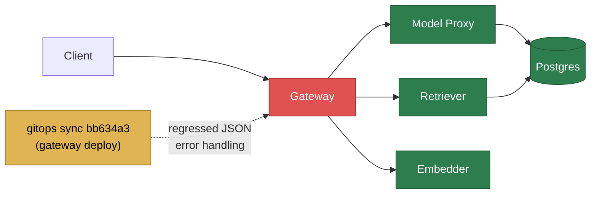

# Postmortem: gateway 5xx rate above 2%

- **Status:** open
- **Severity:** sev1
- **Verified:** no
- **Opened:** 2026-08-02 23:36:40Z
- **Resolved:** (still open)

## Timeline (machine-generated)

All times UTC on 2026-08-02 unless a full date is shown.

| Time (UTC) | Source | Event |
| --- | --- | --- |
| 22:47:29Z | k8s | Pod/gateway-dd85945b4-f9rwq: Started |
| 22:47:29Z | k8s | Pod/gateway-dd85945b4-f9rwq: Pulled |
| 22:47:29Z | k8s | Pod/gateway-dd85945b4-bnt4c: Started |
| 22:47:29Z | k8s | Pod/gateway-dd85945b4-bgsvz: Created |
| 23:11:35Z | deploy:ci | CI run #108 success on main: obs: model-proxy: pre-warm the completion path before generating |
| 23:12:23Z | deploy:ci | CI run #109 success on main: obs: Revert "model-proxy: pre-warm the completion path before generating" |
| 23:15:53Z | k8s | Job/seed: SuccessfulCreate |
| 23:15:53Z | k8s | Pod/seed-d9gxh: Scheduled |
| 23:15:54Z | k8s | Pod/seed-d9gxh: Started |
| 23:15:54Z | k8s | Pod/seed-d9gxh: Pulled |
| 23:15:54Z | k8s | Pod/seed-d9gxh: Created |
| 23:15:58Z | deploy:annotation | deploy platform via gitops 1142aba (argo sync) |
| 23:15:59Z | k8s | Job/seed: Completed |
| 23:19:25Z | k8s | Job/seed: SuccessfulCreate |
| 23:19:25Z | k8s | Pod/seed-nxgx9: Scheduled |
| 23:19:27Z | k8s | Pod/seed-nxgx9: Started |
| 23:19:27Z | k8s | Pod/seed-nxgx9: Pulled |
| 23:19:27Z | k8s | Pod/seed-nxgx9: Created |
| 23:19:30Z | deploy:annotation | deploy platform via gitops e288291 (argo sync) |
| 23:19:32Z | k8s | Job/seed: Completed |
| 23:21:53Z | k8s | Pod/seed-gt5kx: Started |
| 23:21:53Z | k8s | Pod/seed-gt5kx: Pulled |
| 23:21:53Z | k8s | Pod/seed-gt5kx: Created |
| 23:21:53Z | k8s | Job/seed: SuccessfulCreate |
| 23:21:53Z | k8s | Pod/seed-gt5kx: Scheduled |
| 23:21:56Z | deploy:annotation | deploy platform via gitops be28f82 (argo sync) |
| 23:21:57Z | k8s | Job/seed: Completed |
| 23:24:20Z | k8s | Pod/seed-kw89t: Pulled |
| 23:24:20Z | k8s | Pod/seed-kw89t: Created |
| 23:24:20Z | k8s | Job/seed: SuccessfulCreate |
| 23:24:20Z | k8s | Pod/seed-kw89t: Scheduled |
| 23:24:21Z | k8s | Pod/seed-kw89t: Started |
| 23:24:24Z | deploy:annotation | deploy platform via gitops 21f3422 (argo sync) |
| 23:24:25Z | k8s | Job/seed: Completed |
| 23:31:57Z | k8s | Rollout/gateway: RolloutUpdated |
| 23:31:57Z | k8s | Rollout/gateway: RolloutNotCompleted |
| 23:31:57Z | k8s | Rollout/gateway: NewReplicaSetCreated |
| 23:31:58Z | k8s | Pod/gateway-dd85945b4-bgsvz: Killing |
| 23:31:58Z | k8s | ReplicaSet/gateway-dd85945b4: SuccessfulDelete |
| 23:31:58Z | k8s | ReplicaSet/gateway-8444846b5f: SuccessfulCreate |
| 23:31:58Z | k8s | Rollout/gateway: ScalingReplicaSet |
| 23:31:59Z | k8s | Pod/gateway-8444846b5f-tlwpd: Scheduled |
| 23:32:01Z | k8s | Pod/gateway-8444846b5f-tlwpd: Started |
| 23:32:01Z | k8s | Pod/gateway-8444846b5f-tlwpd: Pulled |
| 23:32:01Z | k8s | Pod/gateway-8444846b5f-tlwpd: Created |
| 23:32:09Z | k8s | Rollout/gateway: RolloutStepCompleted |
| 23:32:11Z | k8s | Rollout/gateway: AnalysisRunRunning |
| 23:32:13Z | k8s | Pod/gateway-8444846b5f-tlwpd: Unhealthy |
| 23:32:13Z | k8s | ReplicaSet/gateway-dd85945b4: SuccessfulCreate |
| 23:32:13Z | k8s | Pod/gateway-8444846b5f-tlwpd: Killing |
| 23:32:13Z | k8s | AnalysisRun/gateway-8444846b5f-11-1: AnalysisRunSuccessful |
| 23:32:13Z | k8s | ReplicaSet/gateway-8444846b5f: SuccessfulDelete |
| 23:32:13Z | k8s | Rollout/gateway: SkipSteps |
| 23:32:13Z | k8s | Rollout/gateway: ScalingReplicaSet |
| 23:32:13Z | k8s | Rollout/gateway: RolloutUpdated |
| 23:32:13Z | k8s | Pod/gateway-dd85945b4-rhws5: Scheduled |
| 23:32:16Z | k8s | Pod/gateway-dd85945b4-rhws5: Started |
| 23:32:16Z | k8s | Pod/gateway-dd85945b4-rhws5: Pulled |
| 23:32:16Z | k8s | Pod/gateway-dd85945b4-rhws5: Created |
| 23:32:21Z | deploy:annotation | deploy gateway via gitops bb634a3 (argo sync) |
| 23:33:41Z | log-spike | log-spike onset: [gateway] unhandled error: 16 \| } |
| 23:33:59Z | k8s | ReplicaSet/retriever-8454db56c: SuccessfulCreate |
| 23:33:59Z | k8s | Deployment/retriever: ScalingReplicaSet |
| 23:33:59Z | k8s | Pod/retriever-8454db56c-msr56: Scheduled |
| 23:34:00Z | k8s | Pod/retriever-8454db56c-msr56: Pulled |
| 23:34:00Z | k8s | Pod/retriever-8454db56c-msr56: Created |
| 23:34:01Z | k8s | Pod/retriever-8454db56c-msr56: Started |
| 23:34:03Z | k8s | Pod/retriever-8454db56c-msr56: Started |
| 23:34:03Z | k8s | Pod/retriever-8454db56c-msr56: Pulled |
| 23:34:03Z | k8s | Pod/retriever-8454db56c-msr56: Created |
| 23:34:05Z | k8s | Pod/retriever-8454db56c-msr56: BackOff |
| 23:34:06Z | k8s | Pod/retriever-8454db56c-msr56: BackOff |
| 23:34:10Z | k8s | Pod/retriever-8454db56c-msr56: BackOff |
| 23:34:15Z | k8s | Pod/retriever-8454db56c-msr56: Started |
| 23:34:15Z | k8s | Pod/retriever-8454db56c-msr56: Pulled |
| 23:34:15Z | k8s | Pod/retriever-8454db56c-msr56: Created |
| 23:34:17Z | k8s | Pod/retriever-8454db56c-msr56: BackOff |
| 23:34:18Z | k8s | Pod/retriever-8454db56c-msr56: BackOff |
| 23:34:20Z | k8s | Pod/retriever-8454db56c-msr56: BackOff |
| 23:34:43Z | k8s | Pod/retriever-8454db56c-msr56: Started |
| 23:34:43Z | k8s | Pod/retriever-8454db56c-msr56: Pulled |
| 23:34:43Z | k8s | Pod/retriever-8454db56c-msr56: Created |
| 23:34:44Z | k8s | Pod/retriever-8454db56c-msr56: BackOff |
| 23:34:46Z | k8s | Pod/retriever-8454db56c-msr56: BackOff |
| 23:34:50Z | k8s | Pod/retriever-8454db56c-msr56: BackOff |
| 23:35:36Z | k8s | Pod/retriever-8454db56c-msr56: Pulled |
| 23:35:36Z | k8s | Pod/retriever-8454db56c-msr56: Created |
| 23:35:37Z | k8s | Pod/retriever-8454db56c-msr56: Started |
| 23:35:39Z | k8s | Pod/retriever-8454db56c-msr56: BackOff |
| 23:35:40Z | k8s | Pod/retriever-8454db56c-msr56: BackOff |
| 23:36:10Z | alert | alert firing: Gateway 5xx rate > 2% |
| 23:36:50Z | k8s | Pod/retriever-8454db56c-msr56: BackOff |
| 23:36:58Z | k8s | Pod/retriever-8454db56c-msr56: Started |
| 23:36:58Z | k8s | Pod/retriever-8454db56c-msr56: Pulled |
| 23:36:58Z | k8s | Pod/retriever-8454db56c-msr56: Created |
| 23:36:59Z | k8s | Pod/retriever-8454db56c-msr56: BackOff |
| 23:37:00Z | k8s | Pod/retriever-8454db56c-msr56: BackOff |
| 23:37:03Z | k8s | Pod/retriever-8454db56c-msr56: BackOff |
| 23:38:05Z | k8s | Pod/retriever-8454db56c-msr56: BackOff |
| 23:39:26Z | k8s | Pod/retriever-8454db56c-msr56: BackOff |
| 23:39:40Z | k8s | Pod/retriever-8454db56c-msr56: Started |
| 23:39:40Z | k8s | Pod/retriever-8454db56c-msr56: Pulled |
| 23:39:40Z | k8s | Pod/retriever-8454db56c-msr56: Created |
| 23:39:41Z | k8s | Pod/retriever-8454db56c-msr56: BackOff |
| 23:39:43Z | k8s | Pod/retriever-8454db56c-msr56: BackOff |
| 23:39:50Z | k8s | Pod/retriever-8454db56c-msr56: BackOff |
| 23:41:01Z | k8s | ReplicaSet/retriever-8454db56c: SuccessfulDelete |
| 23:41:01Z | k8s | Deployment/retriever: ScalingReplicaSet |

## Evidence links

- [Loki — logs over the incident window](http://localhost:3001/explore?schemaVersion=1&panes=%7B%22pm%22%3A+%7B%22datasource%22%3A+%22loki%22%2C+%22queries%22%3A+%5B%7B%22refId%22%3A+%22A%22%2C+%22datasource%22%3A+%7B%22type%22%3A+%22loki%22%2C+%22uid%22%3A+%22loki%22%7D%2C+%22expr%22%3A+%22%7Bnamespace%3D%5C%22subject%5C%22%7D+%7C~+%5C%22%28%3Fi%29error%7Cfailed%5C%22%22%7D%5D%2C+%22range%22%3A+%7B%22from%22%3A+%221785713800045%22%2C+%22to%22%3A+%221785714086999%22%7D%7D%7D&orgId=1)
- [Mimir — metrics over the incident window](http://localhost:3001/explore?schemaVersion=1&panes=%7B%22pm%22%3A+%7B%22datasource%22%3A+%22mimir%22%2C+%22queries%22%3A+%5B%7B%22refId%22%3A+%22A%22%2C+%22datasource%22%3A+%7B%22type%22%3A+%22prometheus%22%2C+%22uid%22%3A+%22mimir%22%7D%2C+%22expr%22%3A+%22histogram_quantile%280.95%2C+sum%28rate%28http_server_duration_milliseconds_bucket%5B5m%5D%29%29+by+%28le%29%29%22%7D%5D%2C+%22range%22%3A+%7B%22from%22%3A+%221785713800045%22%2C+%22to%22%3A+%221785714086999%22%7D%7D%7D&orgId=1)

## Investigation context

**Runbook match (2):** `gateway-high-error-rate.md`, `stale-secret.md` — toolset narrowed to 13 tools: alert_status, deploy_history, kubectl_read, loki_query, mimir_query, publish_postmortem, request_approval, restart_workload, runbook_lookup, runbook_read, save_artifact, tempo_query, update_db_secret

Pre-check battery (as injected at run start)

## Pre-check leads

### recent_deploys — LEAD
5 deploy-window leads
- deploy annotation at 2026-08-02T23:15:58.434000+00:00: deploy platform via gitops 1142aba (argo sync)
- deploy annotation at 2026-08-02T23:19:30.778000+00:00: deploy platform via gitops e288291 (argo sync)
- deploy annotation at 2026-08-02T23:21:56.437000+00:00: deploy platform via gitops be28f82 (argo sync)
- deploy annotation at 2026-08-02T23:24:24.266000+00:00: deploy platform via gitops 21f3422 (argo sync)
- deploy annotation at 2026-08-02T23:32:21.618000+00:00: deploy gateway via gitops bb634a3 (argo sync)

### log_spike — LEAD
error/failed log rate 200/10min vs baseline 5/10min (40x baseline) — onset: [gateway] unhandled error: 16 |         } at 2026-08-02T23:33:41.788197+00:00
- error/failed log rate 200/10min vs baseline 5/10min (40x baseline) — onset: [gateway] unhandled error: 16 |         } at 2026-08-02T23:33:41.788197+00:00

### kube_scan — UNAVAILABLE
error: You must be logged in to the server (Unauthorized)

### rollout_state — UNAVAILABLE
gateway: E0803 01:36:40.682132   61296 memcache.go:265] "Unhandled Error" err="couldn't get current server API group list: the server has asked for the client to provide credentials"
E0803 01:36:40.831156   61296 memcache.go:265] "Unhandled Error" err="couldn't get current server API group list: the server has asked for the client to provide credentials"
E0803 01:36:40.933250   61296 memcache.go:265] "Unhandled Error" err="couldn't get current server API group list: the server has asked for the client to; gateway analysis: E0803 01:36:40.654831   20544 memcache.go:265] "Unhandled Error" err="couldn't get current server API group list: the server has asked for the client to provide credentials"
E0803 01:36:40.783481   20544 memcache.go:265] "Unhandled Error"
… (section truncated)

### secret_age — UNAVAILABLE
error: You must be logged in to the server (Unauthorized)

## Narrative

## Summary

The `Gateway 5xx rate > 2%` sev1 alert fired for tenant `acme`. Gateway's 5xx
error ratio stepped from a ~0.35% baseline (effectively 0% for the prior 30
minutes) to 6.46% within three 5-minute evaluation windows, immediately
following a gitops-synced gateway deploy.

## Impact

All four gateway pods (`gateway-dd85945b4-bnt4c`, `-lvg8w`, `-rhws5`,
`-f9rwq`) began throwing `[gateway] unhandled error: 16 | }` alongside
`error: Malformed JSON in request body` on every affected request, turning
what should be a graceful 400 into a 500. Downstream services (retriever,
model-proxy, embedder) logged zero errors in the same window, confirming the
fault was isolated to the gateway process itself, not a downstream health
failure.

## Root cause

Gitops sync of commit **bb634a3** ("deploy gateway via gitops") regressed
the gateway's request-body error handling: malformed/edge-case JSON bodies
that previously returned a 400 now throw an unhandled exception. The error
ratio's step-function shape (flat baseline → 3.5% → 5.6% → 6.46% across
three consecutive windows, starting ~80s after the deploy annotation) is
the signature of a code regression shipping with that release, not organic
load growth or a downstream dependency issue.

Two other hypotheses were checked and ruled out with evidence:
- **Downstream failure surfaced by gateway** — retriever/model-proxy/embedder
  logs show zero errors in the incident window; ruled out.
- **Stale database secret** (the second matched runbook) — the only
  `password authentication failed` lines in the lookback window are from
  ~40 minutes before alert onset (retriever/postgres, unrelated prior blip)
  with zero recurrence in the 15 minutes around the alert. The runbook's own
  step 2 also disqualifies this path once a deploy is confirmed inside the
  window — bb634a3 is squarely inside it. Ruled out.

## What fixed it

A rolling restart of the `gateway` workload was dry-run, diffed (rolling
restart annotation only, no spec/image change), and approved by the
operator. Execution (`restart_workload` with `dry_run=false`) failed
repeatedly with `Unauthorized` against the Kubernetes API — the same
credential failure already visible in this incident's pre-check leads
(`kube_scan` and `rollout_state` both failed with the identical
"You must be logged in to the server (Unauthorized)" error). A direct
`kubectl_read` probe confirmed the failure is persistent, not transient, so
the approved remediation could not be applied.

**The alert remains active.** Nothing in this run fixed the incident — the
root cause is diagnosed and an approved remediation exists, but this
agent's cluster credentials are unauthorized for every Kubernetes-facing
call, blocking execution. This needs a human operator with working cluster
access to either (a) roll the gateway deployment back to its pre-bb634a3
revision via gitops/Argo, or (b) restore the agent's `agent-remediate`
credential and re-run the already-approved restart — and, given a restart
alone does not change the deployed image, a gitops revert of bb634a3 is the
actually-correct fix regardless.

## Lessons

- The agent's own cluster credentials were broken for the entire duration
  of this incident (pre-check `kube_scan`/`rollout_state`/`secret_age` all
  failed the same way before any remediation was attempted) — this should
  have paged infra separately from the application alert.
- No rollback tool (Argo rollout undo / gitops revert) was available in this
  incident's narrowed toolset, only `restart_workload` — which cannot fix a
  code-level regression since it doesn't change the deployed image. Runbook
  tooling for `gateway-high-error-rate` should include a rollback path, not
  just restart.
- The SLO recording rule `slo:gateway_availability:error_ratio5m` gave a
  clean, fast (3-window) signal of the regression and was more useful here
  than searching for an `http_status_code`-labeled request metric, which
  doesn't exist in this environment's Mimir — worth documenting as the
  canonical query for this alert.

