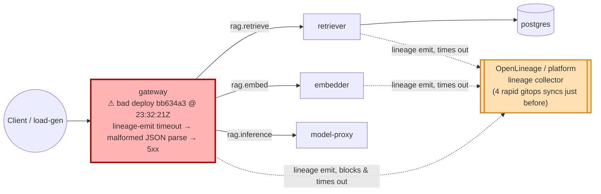

# Postmortem: gateway availability error budget burning fast (2% of the 28d budget in 1h; 5m & 1h windows)

- **Status:** open
- **Severity:** sev1
- **Verified:** no
- **Opened:** 2026-08-02 23:41:43Z
- **Resolved:** (still open)

## Timeline (machine-generated)

All times UTC on 2026-08-02 unless a full date is shown.

| Time (UTC) | Source | Event |
| --- | --- | --- |
| 22:47:29Z | k8s | Pod/gateway-dd85945b4-f9rwq: Started |
| 22:47:29Z | k8s | Pod/gateway-dd85945b4-f9rwq: Pulled |
| 22:47:29Z | k8s | Pod/gateway-dd85945b4-bnt4c: Started |
| 22:47:29Z | k8s | Pod/gateway-dd85945b4-bgsvz: Created |
| 23:11:35Z | deploy:ci | CI run #108 success on main: obs: model-proxy: pre-warm the completion path before generating |
| 23:12:23Z | deploy:ci | CI run #109 success on main: obs: Revert "model-proxy: pre-warm the completion path before generating" |
| 23:15:53Z | k8s | Job/seed: SuccessfulCreate |
| 23:15:53Z | k8s | Pod/seed-d9gxh: Scheduled |
| 23:15:54Z | k8s | Pod/seed-d9gxh: Started |
| 23:15:54Z | k8s | Pod/seed-d9gxh: Pulled |
| 23:15:54Z | k8s | Pod/seed-d9gxh: Created |
| 23:15:58Z | deploy:annotation | deploy platform via gitops 1142aba (argo sync) |
| 23:15:59Z | k8s | Job/seed: Completed |
| 23:19:25Z | k8s | Job/seed: SuccessfulCreate |
| 23:19:25Z | k8s | Pod/seed-nxgx9: Scheduled |
| 23:19:27Z | k8s | Pod/seed-nxgx9: Started |
| 23:19:27Z | k8s | Pod/seed-nxgx9: Pulled |
| 23:19:27Z | k8s | Pod/seed-nxgx9: Created |
| 23:19:30Z | deploy:annotation | deploy platform via gitops e288291 (argo sync) |
| 23:19:32Z | k8s | Job/seed: Completed |
| 23:21:53Z | k8s | Pod/seed-gt5kx: Started |
| 23:21:53Z | k8s | Pod/seed-gt5kx: Pulled |
| 23:21:53Z | k8s | Pod/seed-gt5kx: Created |
| 23:21:53Z | k8s | Job/seed: SuccessfulCreate |
| 23:21:53Z | k8s | Pod/seed-gt5kx: Scheduled |
| 23:21:56Z | deploy:annotation | deploy platform via gitops be28f82 (argo sync) |
| 23:21:57Z | k8s | Job/seed: Completed |
| 23:24:20Z | k8s | Pod/seed-kw89t: Pulled |
| 23:24:20Z | k8s | Pod/seed-kw89t: Created |
| 23:24:20Z | k8s | Job/seed: SuccessfulCreate |
| 23:24:20Z | k8s | Pod/seed-kw89t: Scheduled |
| 23:24:21Z | k8s | Pod/seed-kw89t: Started |
| 23:24:24Z | deploy:annotation | deploy platform via gitops 21f3422 (argo sync) |
| 23:24:25Z | k8s | Job/seed: Completed |
| 23:31:57Z | k8s | Rollout/gateway: RolloutUpdated |
| 23:31:57Z | k8s | Rollout/gateway: RolloutNotCompleted |
| 23:31:57Z | k8s | Rollout/gateway: NewReplicaSetCreated |
| 23:31:58Z | k8s | Pod/gateway-dd85945b4-bgsvz: Killing |
| 23:31:58Z | k8s | ReplicaSet/gateway-dd85945b4: SuccessfulDelete |
| 23:31:58Z | k8s | ReplicaSet/gateway-8444846b5f: SuccessfulCreate |
| 23:31:58Z | k8s | Rollout/gateway: ScalingReplicaSet |
| 23:31:59Z | k8s | Pod/gateway-8444846b5f-tlwpd: Scheduled |
| 23:32:01Z | k8s | Pod/gateway-8444846b5f-tlwpd: Started |
| 23:32:01Z | k8s | Pod/gateway-8444846b5f-tlwpd: Pulled |
| 23:32:01Z | k8s | Pod/gateway-8444846b5f-tlwpd: Created |
| 23:32:09Z | k8s | Rollout/gateway: RolloutStepCompleted |
| 23:32:11Z | k8s | Rollout/gateway: AnalysisRunRunning |
| 23:32:13Z | k8s | Pod/gateway-8444846b5f-tlwpd: Unhealthy |
| 23:32:13Z | k8s | ReplicaSet/gateway-dd85945b4: SuccessfulCreate |
| 23:32:13Z | k8s | Pod/gateway-8444846b5f-tlwpd: Killing |
| 23:32:13Z | k8s | AnalysisRun/gateway-8444846b5f-11-1: AnalysisRunSuccessful |
| 23:32:13Z | k8s | ReplicaSet/gateway-8444846b5f: SuccessfulDelete |
| 23:32:13Z | k8s | Rollout/gateway: SkipSteps |
| 23:32:13Z | k8s | Rollout/gateway: ScalingReplicaSet |
| 23:32:13Z | k8s | Rollout/gateway: RolloutUpdated |
| 23:32:13Z | k8s | Pod/gateway-dd85945b4-rhws5: Scheduled |
| 23:32:16Z | k8s | Pod/gateway-dd85945b4-rhws5: Started |
| 23:32:16Z | k8s | Pod/gateway-dd85945b4-rhws5: Pulled |
| 23:32:16Z | k8s | Pod/gateway-dd85945b4-rhws5: Created |
| 23:32:21Z | deploy:annotation | deploy gateway via gitops bb634a3 (argo sync) |
| 23:33:59Z | k8s | ReplicaSet/retriever-8454db56c: SuccessfulCreate |
| 23:33:59Z | k8s | Deployment/retriever: ScalingReplicaSet |
| 23:33:59Z | k8s | Pod/retriever-8454db56c-msr56: Scheduled |
| 23:34:00Z | k8s | Pod/retriever-8454db56c-msr56: Pulled |
| 23:34:00Z | k8s | Pod/retriever-8454db56c-msr56: Created |
| 23:34:01Z | k8s | Pod/retriever-8454db56c-msr56: Started |
| 23:34:03Z | k8s | Pod/retriever-8454db56c-msr56: Started |
| 23:34:03Z | k8s | Pod/retriever-8454db56c-msr56: Pulled |
| 23:34:03Z | k8s | Pod/retriever-8454db56c-msr56: Created |
| 23:34:05Z | k8s | Pod/retriever-8454db56c-msr56: BackOff |
| 23:34:06Z | k8s | Pod/retriever-8454db56c-msr56: BackOff |
| 23:34:10Z | k8s | Pod/retriever-8454db56c-msr56: BackOff |
| 23:34:15Z | k8s | Pod/retriever-8454db56c-msr56: Started |
| 23:34:15Z | k8s | Pod/retriever-8454db56c-msr56: Pulled |
| 23:34:15Z | k8s | Pod/retriever-8454db56c-msr56: Created |
| 23:34:17Z | k8s | Pod/retriever-8454db56c-msr56: BackOff |
| 23:34:18Z | k8s | Pod/retriever-8454db56c-msr56: BackOff |
| 23:34:20Z | k8s | Pod/retriever-8454db56c-msr56: BackOff |
| 23:34:43Z | k8s | Pod/retriever-8454db56c-msr56: Started |
| 23:34:43Z | k8s | Pod/retriever-8454db56c-msr56: Pulled |
| 23:34:43Z | k8s | Pod/retriever-8454db56c-msr56: Created |
| 23:34:44Z | k8s | Pod/retriever-8454db56c-msr56: BackOff |
| 23:34:46Z | k8s | Pod/retriever-8454db56c-msr56: BackOff |
| 23:34:50Z | k8s | Pod/retriever-8454db56c-msr56: BackOff |
| 23:35:36Z | k8s | Pod/retriever-8454db56c-msr56: Pulled |
| 23:35:36Z | k8s | Pod/retriever-8454db56c-msr56: Created |
| 23:35:37Z | k8s | Pod/retriever-8454db56c-msr56: Started |
| 23:35:39Z | k8s | Pod/retriever-8454db56c-msr56: BackOff |
| 23:35:40Z | k8s | Pod/retriever-8454db56c-msr56: BackOff |
| 23:36:50Z | k8s | Pod/retriever-8454db56c-msr56: BackOff |
| 23:36:58Z | k8s | Pod/retriever-8454db56c-msr56: Started |
| 23:36:58Z | k8s | Pod/retriever-8454db56c-msr56: Pulled |
| 23:36:58Z | k8s | Pod/retriever-8454db56c-msr56: Created |
| 23:36:59Z | k8s | Pod/retriever-8454db56c-msr56: BackOff |
| 23:37:00Z | k8s | Pod/retriever-8454db56c-msr56: BackOff |
| 23:37:03Z | k8s | Pod/retriever-8454db56c-msr56: BackOff |
| 23:38:05Z | k8s | Pod/retriever-8454db56c-msr56: BackOff |
| 23:39:26Z | k8s | Pod/retriever-8454db56c-msr56: BackOff |
| 23:39:40Z | k8s | Pod/retriever-8454db56c-msr56: Started |
| 23:39:40Z | k8s | Pod/retriever-8454db56c-msr56: Pulled |
| 23:39:40Z | k8s | Pod/retriever-8454db56c-msr56: Created |
| 23:39:41Z | k8s | Pod/retriever-8454db56c-msr56: BackOff |
| 23:39:43Z | k8s | Pod/retriever-8454db56c-msr56: BackOff |
| 23:39:50Z | k8s | Pod/retriever-8454db56c-msr56: BackOff |
| 23:40:28Z | log-spike | log-spike onset: {"level":"warn","service":"gateway","message":"lineage emit failed","trace_id":"b4a9628defb4f40d7472d7e67c51ec7b","span_id":"1db59c16dbe37556","time":"2026-08-02T23:40:28.063Z","reason":"The operation timed out.","job":"ra… |
| 23:41:01Z | k8s | ReplicaSet/retriever-8454db56c: SuccessfulDelete |
| 23:41:01Z | k8s | Deployment/retriever: ScalingReplicaSet |
| 23:41:10Z | alert | alert firing: SLO gateway availability — fast burn |

## Evidence links

- [Loki — logs over the incident window](http://localhost:3001/explore?schemaVersion=1&panes=%7B%22pm%22%3A+%7B%22datasource%22%3A+%22loki%22%2C+%22queries%22%3A+%5B%7B%22refId%22%3A+%22A%22%2C+%22datasource%22%3A+%7B%22type%22%3A+%22loki%22%2C+%22uid%22%3A+%22loki%22%7D%2C+%22expr%22%3A+%22%7Bnamespace%3D%5C%22subject%5C%22%7D+%7C~+%5C%22%28%3Fi%29error%7Cfailed%5C%22%22%7D%5D%2C+%22range%22%3A+%7B%22from%22%3A+%221785714103097%22%2C+%22to%22%3A+%221785714382547%22%7D%7D%7D&orgId=1)
- [Mimir — metrics over the incident window](http://localhost:3001/explore?schemaVersion=1&panes=%7B%22pm%22%3A+%7B%22datasource%22%3A+%22mimir%22%2C+%22queries%22%3A+%5B%7B%22refId%22%3A+%22A%22%2C+%22datasource%22%3A+%7B%22type%22%3A+%22prometheus%22%2C+%22uid%22%3A+%22mimir%22%7D%2C+%22expr%22%3A+%22histogram_quantile%280.95%2C+sum%28rate%28http_server_duration_milliseconds_bucket%5B5m%5D%29%29+by+%28le%29%29%22%7D%5D%2C+%22range%22%3A+%7B%22from%22%3A+%221785714103097%22%2C+%22to%22%3A+%221785714382547%22%7D%7D%7D&orgId=1)

## Investigation context

**Runbook match (2):** `gateway-high-error-rate.md`, `stale-secret.md` — toolset narrowed to 13 tools: alert_status, deploy_history, kubectl_read, loki_query, mimir_query, publish_postmortem, request_approval, restart_workload, runbook_lookup, runbook_read, save_artifact, tempo_query, update_db_secret

Pre-check battery (as injected at run start)

## Pre-check leads

### recent_deploys — LEAD
5 deploy-window leads
- deploy annotation at 2026-08-02T23:15:58.434000+00:00: deploy platform via gitops 1142aba (argo sync)
- deploy annotation at 2026-08-02T23:19:30.778000+00:00: deploy platform via gitops e288291 (argo sync)
- deploy annotation at 2026-08-02T23:21:56.437000+00:00: deploy platform via gitops be28f82 (argo sync)
- deploy annotation at 2026-08-02T23:24:24.266000+00:00: deploy platform via gitops 21f3422 (argo sync)
- deploy annotation at 2026-08-02T23:32:21.618000+00:00: deploy gateway via gitops bb634a3 (argo sync)

### log_spike — LEAD
error/failed log rate 200/10min vs baseline 4/10min (50x baseline) — onset: {"level":"warn","service":"gateway","message":"lineage emit failed","trace_id":"b4a9628defb4f40d7472d7e67c51ec7b","span_id":"1db59c16dbe37556","time":"2026-08-02T23:40:28.063Z","reason":"The operation timed out.","job":"rag.inference","eventType":"START"} at 2026-08-02T23:40:28.063515+00:00
- error/failed log rate 200/10min vs baseline 4/10min (50x baseline) — onset: {"level":"warn","service":"gateway","message":"lineage emit failed","trace_id":"b4a9628defb4f40d7472d7e67c51ec7… (truncated)

### kube_scan — UNAVAILABLE
error: You must be logged in to the server (Unauthorized)

### rollout_state — UNAVAILABLE
gateway: E0803 01:41:44.650227   55996 memcache.go:265] "Unhandled Error" err="couldn't get current server API group list: the server has asked for the client to provide credentials"
E0803 01:41:44.759723   55996 memcache.go:265] "Unhandled Error" err="couldn't get current server API group list: the server has asked for the client to provide credentials"
E0803 01:41:44.991757   55996 memcache.go:265] "Unhandled Error" err="couldn't get current server API group list: the server has asked for the client to; gateway analysis: E0803 01:41:44.650755    9156 memcache.go:265] "Unhandled Error" err="couldn't get current server API group list: the server has asked for the client to provide credentials"
E0803 01:41:44.762310    9156 memcache.go:265] "Unhandled Error"
… (section truncated)

### secret_age — UNAVAILABLE
error: You must be logged in to the server (Unauthorized)

## Narrative

## Summary
Sev1 "SLO gateway availability — fast burn" fired for tenant acme. Investigation traced the burn to a gateway release (gitops commit `bb634a3`) that started throwing request-parsing errors on essentially every pod within about a minute of rollout. Attempted remediation (rolling restart of `gateway`) could not be executed because the cluster API is currently rejecting the on-call agent's credentials — this is reported as an explicit open failure, not a resolved incident.

## Impact
Gateway error-rate (span status `STATUS_CODE_ERROR`) rose from a near-zero baseline to a sustained double-digit req/s rate almost immediately after the `bb634a3` gateway deploy, then spiked a second time to ~71 req/s around the time the SLO burn-rate alert fired, consistent with fast burn against the 28-day availability budget for tenant acme.

## Root cause
Two runbooks were in play (`gateway-high-error-rate` and `stale-secret`); the stale-secret hypothesis was ruled out first: `password authentication failed` errors from `retriever`→`postgres` began well before the deploy window and had already stopped by the time of the alert, and no secret-rotation evidence lines up with the failure onset — a pre-existing/unrelated blip, not this incident.

The real signature: five gitops deploys landed in the 20 minutes before the page (four `platform` syncs, then `gateway` via `bb634a3` at 23:32:21Z). Gateway logs immediately after that deploy show, on every gateway pod, a tight, repeating pair of symptoms:
- `warn: lineage emit failed ... reason: "The operation timed out."` for `rag.inference`/`rag.retrieve`/`rag.embed` jobs across gateway, retriever, and embedder — a synchronous OpenLineage emit call on the request path timing out against the lineage/platform backend.
- `error: Malformed JSON in request body` (hono validator, status 400) immediately following, on every pod, at high volume — consistent with the blocked/timed-out lineage call leaving the request body stream in a bad state for the JSON validator.

The `traces_spanmetrics_calls_total{status_code="STATUS_CODE_ERROR"}` rate for `gateway` confirms the timing precisely: it begins climbing from ~0.24 req/s to a sustained ramp starting at essentially the same moment as the `bb634a3` deploy (about 60–90 seconds after), well before the alert fired, and spikes again to ~71 req/s right around the alert's firing time. No deploy-free stale-secret window applies here — a deploy squarely precedes the error onset, so per the stale-secret runbook's own decision rule this is a bad-deploy investigation, not a secret-rotation issue. Commit `bb634a3` (gitops gateway sync) is named as the guilty change; the four preceding rapid `platform` gitops syncs are the most likely source of the destabilized lineage/platform backend that `bb634a3`'s gateway code now depends on synchronously.

## What fixed it
Nothing yet — remediation did not take effect. A rolling restart of `deployment/gateway` was dry-run (confirmed as a no-spec-change `restartedAt` annotation patch), summarized for approval, and **approved by the operator**. Both attempts to execute it for real failed with `You must be logged in to the server (Unauthorized)` from the k8s API — the same cluster-auth outage already visible in this incident's pre-check leads (`kube_scan` and `rollout_state` both failed identically, `secret_age` too). The alert was re-queried after both failed attempts and is still active. This incident is being closed out as **unresolved**; the cluster-auth outage itself needs separate operator attention before any remediation (restart or otherwise) can be applied.

## Lessons
- Treat the deploy-guilty-until-proven-otherwise heuristic seriously: five gitops syncs inside 20 minutes ending in a gateway deploy, followed within ~90 seconds by a clean error-rate ramp, is about as strong a correlation as telemetry gets — don't let a coincidentally-timed but unrelated older log pattern (the pre-existing password-auth failures) distract from it.
- A synchronous, blocking call to an observability side-channel (lineage/OpenLineage emission) on the hot request path is a latent single point of failure: when that side-channel backend is unstable (as the four rapid `platform` redeploys suggest it was), it takes the primary request path down with it. Lineage emission should be async/fire-and-forget with a hard timeout that can't corrupt the caller's own request handling.
- This run also surfaced an operational gap: remediation tooling was approved but blocked by an unrelated cluster-auth failure. On-call tooling should distinguish "operator denied" from "infrastructure prevented execution" in its own alerting, since the latter needs a different, faster escalation (cluster credential/token refresh) than a denied remediation.

