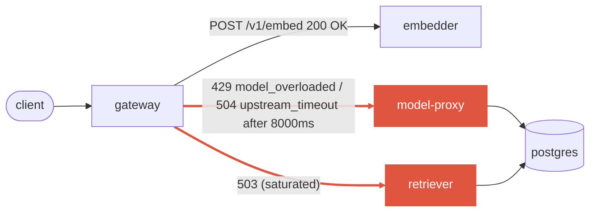

# Postmortem: gateway 5xx rate above 2%

- **Status:** open
- **Severity:** sev1
- **Verified:** no
- **Opened:** 2026-08-02 22:12:40Z
- **Resolved:** (still open)

## Timeline (machine-generated)

All times UTC on 2026-08-02 unless a full date is shown.

| Time (UTC) | Source | Event |
| --- | --- | --- |
| 22:12:10Z | alert | alert firing: Gateway 5xx rate > 2% |
| 22:13:17Z | k8s | ReplicaSet/retriever-6865c5b447: SuccessfulCreate |
| 22:13:17Z | k8s | Deployment/retriever: ScalingReplicaSet |
| 22:13:17Z | k8s | Pod/retriever-6865c5b447-f4djq: Scheduled |
| 22:13:20Z | k8s | Pod/retriever-6865c5b447-f4djq: Started |
| 22:13:20Z | k8s | Pod/retriever-6865c5b447-f4djq: Pulled |
| 22:13:20Z | k8s | Pod/retriever-6865c5b447-f4djq: Created |
| 22:13:26Z | k8s | Pod/retriever-dc7ddd494-2bkl9: Killing |
| 22:13:26Z | k8s | ReplicaSet/retriever-dc7ddd494: SuccessfulDelete |
| 22:13:26Z | k8s | Deployment/retriever: ScalingReplicaSet |
| 22:14:48Z | k8s | Deployment/retriever: ScalingReplicaSet |
| 22:14:49Z | k8s | Pod/retriever-dc7ddd494-jv9j7: Started |
| 22:14:49Z | k8s | Pod/retriever-dc7ddd494-jv9j7: Pulled |
| 22:14:49Z | k8s | Pod/retriever-dc7ddd494-jv9j7: Created |
| 22:14:49Z | k8s | ReplicaSet/retriever-dc7ddd494: SuccessfulCreate |
| 22:14:49Z | k8s | Pod/retriever-dc7ddd494-jv9j7: Scheduled |
| 22:14:56Z | k8s | Pod/retriever-6865c5b447-f4djq: Killing |
| 22:14:56Z | k8s | ReplicaSet/retriever-6865c5b447: SuccessfulDelete |
| 22:14:56Z | k8s | Deployment/retriever: ScalingReplicaSet |
| 22:14:57Z | k8s | Pod/retriever-6865c5b447-f4djq: Unhealthy |

## Evidence links

- [Loki — logs over the incident window](http://localhost:3001/explore?schemaVersion=1&panes=%7B%22pm%22%3A+%7B%22datasource%22%3A+%22loki%22%2C+%22queries%22%3A+%5B%7B%22refId%22%3A+%22A%22%2C+%22datasource%22%3A+%7B%22type%22%3A+%22loki%22%2C+%22uid%22%3A+%22loki%22%7D%2C+%22expr%22%3A+%22%7Bnamespace%3D%5C%22subject%5C%22%7D+%7C~+%5C%22%28%3Fi%29error%7Cfailed%5C%22%22%7D%5D%2C+%22range%22%3A+%7B%22from%22%3A+%221785708760151%22%2C+%22to%22%3A+%221785709031063%22%7D%7D%7D&orgId=1)
- [Mimir — metrics over the incident window](http://localhost:3001/explore?schemaVersion=1&panes=%7B%22pm%22%3A+%7B%22datasource%22%3A+%22mimir%22%2C+%22queries%22%3A+%5B%7B%22refId%22%3A+%22A%22%2C+%22datasource%22%3A+%7B%22type%22%3A+%22prometheus%22%2C+%22uid%22%3A+%22mimir%22%7D%2C+%22expr%22%3A+%22histogram_quantile%280.95%2C+sum%28rate%28http_server_duration_milliseconds_bucket%5B5m%5D%29%29+by+%28le%29%29%22%7D%5D%2C+%22range%22%3A+%7B%22from%22%3A+%221785708760151%22%2C+%22to%22%3A+%221785709031063%22%7D%7D%7D&orgId=1)

## Investigation context

**Runbook match (2):** `gateway-high-error-rate.md`, `stale-secret.md` — toolset narrowed to 13 tools: alert_status, deploy_history, kubectl_read, loki_query, mimir_query, publish_postmortem, request_approval, restart_workload, runbook_lookup, runbook_read, save_artifact, tempo_query, update_db_secret

Pre-check battery (as injected at run start)

## Pre-check leads

### recent_deploys — LEAD
No deploy in the last 60m — rule out the reflex answer.
- No deploy in the last 60m — rule out the reflex answer.

### log_spike — OK
error/failed log rate normal: 0/10min vs baseline 0/10min

### kube_scan — UNAVAILABLE
error: You must be logged in to the server (Unauthorized)

### rollout_state — UNAVAILABLE
gateway: E0803 00:12:41.266583   31592 memcache.go:265] "Unhandled Error" err="couldn't get current server API group list: the server has asked for the client to provide credentials"
E0803 00:12:41.331388   31592 memcache.go:265] "Unhandled Error" err="couldn't get current server API group list: the server has asked for the client to provide credentials"
E0803 00:12:41.397800   31592 memcache.go:265] "Unhandled Error" err="couldn't get current server API group list: the server has asked for the client to; gateway analysis: E0803 00:12:41.253863    1612 memcache.go:265] "Unhandled Error" err="couldn't get current server API group list: the server has asked for the client to provide credentials"
E0803 00:12:41.315975    1612 memcache.go:265] "Unhandled Error"
… (section truncated)

### secret_age — UNAVAILABLE
error: You must be logged in to the server (Unauthorized)

## Narrative

## Summary

`Gateway 5xx rate > 2%` fired for tenant `acme`. Gateway's calls to two downstream services — **retriever** and **model-proxy** — began failing simultaneously (503 / 429 `model is overloaded` / 504 `upstream timed out after 8000ms`), pushing the gateway's combined 5xx+429 ratio from baseline (~0%) up to a peak of ~6%. The condition subsided on its own as inbound request volume returned to baseline, and `alert_status` confirmed recovery before any remediation was applied.

## Impact

Tenant `acme` chat requests intermittently received 429/502/504 responses from the gateway for roughly 15 minutes. Cached responses and the embedder path were unaffected throughout (embedder stayed at 200 OK). No data loss; this was availability degradation only.

## Root cause

Evidence gathered, in order of the matched runbooks:

- **Deploy correlation ruled out** — `deploy_history` showed no deploy in the incident window (only two unrelated CI merges ~90 min prior, on `main`/`fix/agent-crash-postmortem-rename`, neither touching gateway/model-proxy/retriever).
- **Stale-secret hypothesis ruled out** — `loki_query` for `"password authentication failed"` over the incident window returned zero matches; the stale-secret runbook's own trigger signature (secret rotation + auth-failure logs) was absent.
- **Resource exhaustion ruled out** — `container_memory_working_set_bytes` and `container_cpu_usage_seconds_total` for all four model-proxy pods stayed flat throughout (~84-99 MiB against a 400 MiB limit, ~1-3% CPU) — no OOM, no throttling, no restart pressure.
- **Confirmed via Tempo traces** — root spans on `gateway` `POST /v1/chat` showed `exception.type=upstream_timeout` (`model-proxy timed out after 8000ms`, 504) and `exception.type=model_overloaded` (`model is overloaded`, 429), both raised from the gateway's `model-http` / `upstream` adapters calling model-proxy.
- **Confirmed via Mimir** — `retriever` began returning `503` at the same minute model-proxy's p95 latency jumped ~40x (4.75ms → 150-220ms), and all four services' request rates rose together (~+50-70%) at the same timestamp, then fell back to baseline together as the error ratio recovered. The synchronized rise/fall across independent services, with no corresponding CPU/memory pressure, points to a request-rate surge that briefly exceeded retriever/model-proxy's effective serving capacity (application-level saturation, not infrastructure exhaustion) rather than a single misconfigured or crash-looping component.

This matches the gateway-high-error-rate runbook's first hypothesis ("a downstream is failing and gateway is surfacing its errors") — but affecting two downstreams concurrently, not one, and driven by transient load rather than a persistent fault. The single-tenant-429/rate-limit hypothesis was ruled out (errors included 502/503/504, not just 429, spread across the tenant's normal traffic).

## What fixed it

Nothing was manually remediated. `restart_workload` and `update_db_secret` were the only remediation tools in scope for the matched runbooks, and neither was evidence-justified: there was no stuck pod (flat resource usage, no restart/OOM signal) and no stale credential (no auth-failure logs) to fix. The saturation was transient — request volume across gateway/model-proxy/retriever/embedder returned to baseline on its own, error ratio dropped from a 5.98% peak back to 0.8%, and `alert_status` was re-queried twice and confirmed `active: false` before this incident was closed. Executing a restart against a component with normal resource utilization and no persistent fault would have added risk without a diagnosed problem to solve.

## Lessons

- Retriever and model-proxy currently have no visible backpressure/concurrency-limit metric exposed distinctly from raw error counts — add a saturation/queue-depth panel so a load-driven overload is distinguishable from a resource-exhaustion overload at a glance, without needing to cross-reference cAdvisor metrics by hand.
- The stale-secret runbook's `secret_age` pre-check was `UNAVAILABLE` (kubeconfig auth) for this run; that lead couldn't be used to quickly rule the hypothesis in/out and required a slower log-based check instead. Fixing agent-ro kubeconfig access would speed up future triage.
- Consider whether retriever/model-proxy's overload responses (503/429) should include `Retry-After`, and whether the gateway should apply a short backoff/retry with jitter on `upstream_timeout` rather than surfacing 504 immediately — would reduce user-visible errors during brief legitimate traffic bursts like this one.

Failing hop: **gateway → retriever** and **gateway → model-proxy**, both saturated concurrently by a transient request-rate surge; CPU/memory on model-proxy stayed flat throughout, ruling out infrastructure exhaustion as the cause. Embedder and postgres were never implicated.
