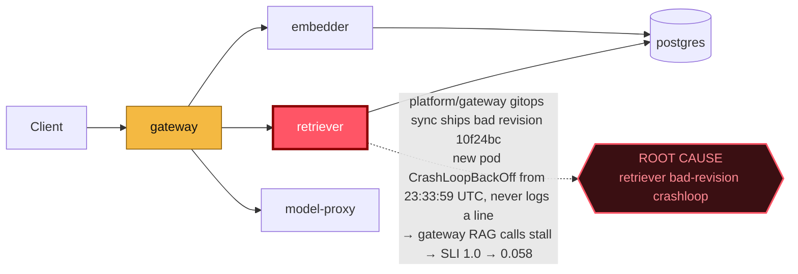

# Postmortem: gateway latency error budget burning fast (2% of the 28d budget in 1h; 5m & 1h windows)

- **Status:** open
- **Severity:** sev1
- **Verified:** no
- **Opened:** 2026-08-02 23:40:46Z
- **Resolved:** (still open)

## Timeline (machine-generated)

All times UTC on 2026-08-02 unless a full date is shown.

| Time (UTC) | Source | Event |
| --- | --- | --- |
| 22:47:29Z | k8s | Pod/gateway-dd85945b4-f9rwq: Started |
| 22:47:29Z | k8s | Pod/gateway-dd85945b4-f9rwq: Pulled |
| 22:47:29Z | k8s | Pod/gateway-dd85945b4-bnt4c: Started |
| 22:47:29Z | k8s | Pod/gateway-dd85945b4-bgsvz: Created |
| 23:11:35Z | deploy:ci | CI run #108 success on main: obs: model-proxy: pre-warm the completion path before generating |
| 23:12:23Z | deploy:ci | CI run #109 success on main: obs: Revert "model-proxy: pre-warm the completion path before generating" |
| 23:15:53Z | k8s | Job/seed: SuccessfulCreate |
| 23:15:53Z | k8s | Pod/seed-d9gxh: Scheduled |
| 23:15:54Z | k8s | Pod/seed-d9gxh: Started |
| 23:15:54Z | k8s | Pod/seed-d9gxh: Pulled |
| 23:15:54Z | k8s | Pod/seed-d9gxh: Created |
| 23:15:58Z | deploy:annotation | deploy platform via gitops 1142aba (argo sync) |
| 23:15:59Z | k8s | Job/seed: Completed |
| 23:19:25Z | k8s | Job/seed: SuccessfulCreate |
| 23:19:25Z | k8s | Pod/seed-nxgx9: Scheduled |
| 23:19:27Z | k8s | Pod/seed-nxgx9: Started |
| 23:19:27Z | k8s | Pod/seed-nxgx9: Pulled |
| 23:19:27Z | k8s | Pod/seed-nxgx9: Created |
| 23:19:30Z | deploy:annotation | deploy platform via gitops e288291 (argo sync) |
| 23:19:32Z | k8s | Job/seed: Completed |
| 23:21:53Z | k8s | Pod/seed-gt5kx: Started |
| 23:21:53Z | k8s | Pod/seed-gt5kx: Pulled |
| 23:21:53Z | k8s | Pod/seed-gt5kx: Created |
| 23:21:53Z | k8s | Job/seed: SuccessfulCreate |
| 23:21:53Z | k8s | Pod/seed-gt5kx: Scheduled |
| 23:21:56Z | deploy:annotation | deploy platform via gitops be28f82 (argo sync) |
| 23:21:57Z | k8s | Job/seed: Completed |
| 23:24:20Z | k8s | Pod/seed-kw89t: Pulled |
| 23:24:20Z | k8s | Pod/seed-kw89t: Created |
| 23:24:20Z | k8s | Job/seed: SuccessfulCreate |
| 23:24:20Z | k8s | Pod/seed-kw89t: Scheduled |
| 23:24:21Z | k8s | Pod/seed-kw89t: Started |
| 23:24:24Z | deploy:annotation | deploy platform via gitops 21f3422 (argo sync) |
| 23:24:25Z | k8s | Job/seed: Completed |
| 23:31:57Z | k8s | Rollout/gateway: RolloutUpdated |
| 23:31:57Z | k8s | Rollout/gateway: RolloutNotCompleted |
| 23:31:57Z | k8s | Rollout/gateway: NewReplicaSetCreated |
| 23:31:58Z | k8s | Pod/gateway-dd85945b4-bgsvz: Killing |
| 23:31:58Z | k8s | ReplicaSet/gateway-dd85945b4: SuccessfulDelete |
| 23:31:58Z | k8s | ReplicaSet/gateway-8444846b5f: SuccessfulCreate |
| 23:31:58Z | k8s | Rollout/gateway: ScalingReplicaSet |
| 23:31:59Z | k8s | Pod/gateway-8444846b5f-tlwpd: Scheduled |
| 23:32:01Z | k8s | Pod/gateway-8444846b5f-tlwpd: Started |
| 23:32:01Z | k8s | Pod/gateway-8444846b5f-tlwpd: Pulled |
| 23:32:01Z | k8s | Pod/gateway-8444846b5f-tlwpd: Created |
| 23:32:09Z | k8s | Rollout/gateway: RolloutStepCompleted |
| 23:32:11Z | k8s | Rollout/gateway: AnalysisRunRunning |
| 23:32:13Z | k8s | Pod/gateway-8444846b5f-tlwpd: Unhealthy |
| 23:32:13Z | k8s | ReplicaSet/gateway-dd85945b4: SuccessfulCreate |
| 23:32:13Z | k8s | Pod/gateway-8444846b5f-tlwpd: Killing |
| 23:32:13Z | k8s | AnalysisRun/gateway-8444846b5f-11-1: AnalysisRunSuccessful |
| 23:32:13Z | k8s | ReplicaSet/gateway-8444846b5f: SuccessfulDelete |
| 23:32:13Z | k8s | Rollout/gateway: SkipSteps |
| 23:32:13Z | k8s | Rollout/gateway: ScalingReplicaSet |
| 23:32:13Z | k8s | Rollout/gateway: RolloutUpdated |
| 23:32:13Z | k8s | Pod/gateway-dd85945b4-rhws5: Scheduled |
| 23:32:16Z | k8s | Pod/gateway-dd85945b4-rhws5: Started |
| 23:32:16Z | k8s | Pod/gateway-dd85945b4-rhws5: Pulled |
| 23:32:16Z | k8s | Pod/gateway-dd85945b4-rhws5: Created |
| 23:32:21Z | deploy:annotation | deploy gateway via gitops bb634a3 (argo sync) |
| 23:33:59Z | k8s | ReplicaSet/retriever-8454db56c: SuccessfulCreate |
| 23:33:59Z | k8s | Deployment/retriever: ScalingReplicaSet |
| 23:33:59Z | k8s | Pod/retriever-8454db56c-msr56: Scheduled |
| 23:34:00Z | k8s | Pod/retriever-8454db56c-msr56: Pulled |
| 23:34:00Z | k8s | Pod/retriever-8454db56c-msr56: Created |
| 23:34:01Z | k8s | Pod/retriever-8454db56c-msr56: Started |
| 23:34:03Z | k8s | Pod/retriever-8454db56c-msr56: Started |
| 23:34:03Z | k8s | Pod/retriever-8454db56c-msr56: Pulled |
| 23:34:03Z | k8s | Pod/retriever-8454db56c-msr56: Created |
| 23:34:05Z | k8s | Pod/retriever-8454db56c-msr56: BackOff |
| 23:34:06Z | k8s | Pod/retriever-8454db56c-msr56: BackOff |
| 23:34:10Z | k8s | Pod/retriever-8454db56c-msr56: BackOff |
| 23:34:15Z | k8s | Pod/retriever-8454db56c-msr56: Started |
| 23:34:15Z | k8s | Pod/retriever-8454db56c-msr56: Pulled |
| 23:34:15Z | k8s | Pod/retriever-8454db56c-msr56: Created |
| 23:34:17Z | k8s | Pod/retriever-8454db56c-msr56: BackOff |
| 23:34:18Z | k8s | Pod/retriever-8454db56c-msr56: BackOff |
| 23:34:20Z | k8s | Pod/retriever-8454db56c-msr56: BackOff |
| 23:34:43Z | k8s | Pod/retriever-8454db56c-msr56: Started |
| 23:34:43Z | k8s | Pod/retriever-8454db56c-msr56: Pulled |
| 23:34:43Z | k8s | Pod/retriever-8454db56c-msr56: Created |
| 23:34:44Z | k8s | Pod/retriever-8454db56c-msr56: BackOff |
| 23:34:46Z | k8s | Pod/retriever-8454db56c-msr56: BackOff |
| 23:34:50Z | k8s | Pod/retriever-8454db56c-msr56: BackOff |
| 23:35:36Z | k8s | Pod/retriever-8454db56c-msr56: Pulled |
| 23:35:36Z | k8s | Pod/retriever-8454db56c-msr56: Created |
| 23:35:37Z | k8s | Pod/retriever-8454db56c-msr56: Started |
| 23:35:39Z | k8s | Pod/retriever-8454db56c-msr56: BackOff |
| 23:35:40Z | k8s | Pod/retriever-8454db56c-msr56: BackOff |
| 23:36:50Z | k8s | Pod/retriever-8454db56c-msr56: BackOff |
| 23:36:58Z | k8s | Pod/retriever-8454db56c-msr56: Started |
| 23:36:58Z | k8s | Pod/retriever-8454db56c-msr56: Pulled |
| 23:36:58Z | k8s | Pod/retriever-8454db56c-msr56: Created |
| 23:36:59Z | k8s | Pod/retriever-8454db56c-msr56: BackOff |
| 23:37:00Z | k8s | Pod/retriever-8454db56c-msr56: BackOff |
| 23:37:03Z | k8s | Pod/retriever-8454db56c-msr56: BackOff |
| 23:38:05Z | k8s | Pod/retriever-8454db56c-msr56: BackOff |
| 23:39:26Z | k8s | Pod/retriever-8454db56c-msr56: BackOff |
| 23:39:31Z | log-spike | log-spike onset: {"level":"warn","service":"embedder","message":"lineage emit failed","trace_id":"e35a28b581f58e19461c9621b1031d14","span_id":"3f2ef8066b4e6e24","time":"2026-08-02T23:39:31.877Z","reason":"The operation timed out.","job":"r… |
| 23:39:40Z | k8s | Pod/retriever-8454db56c-msr56: Started |
| 23:39:40Z | k8s | Pod/retriever-8454db56c-msr56: Pulled |
| 23:39:40Z | k8s | Pod/retriever-8454db56c-msr56: Created |
| 23:39:41Z | k8s | Pod/retriever-8454db56c-msr56: BackOff |
| 23:39:43Z | k8s | Pod/retriever-8454db56c-msr56: BackOff |
| 23:39:50Z | k8s | Pod/retriever-8454db56c-msr56: BackOff |
| 23:40:10Z | alert | alert firing: SLO gateway latency — fast burn |
| 23:41:01Z | k8s | ReplicaSet/retriever-8454db56c: SuccessfulDelete |
| 23:41:01Z | k8s | Deployment/retriever: ScalingReplicaSet |

## Evidence links

- [Loki — logs over the incident window](http://localhost:3001/explore?schemaVersion=1&panes=%7B%22pm%22%3A+%7B%22datasource%22%3A+%22loki%22%2C+%22queries%22%3A+%5B%7B%22refId%22%3A+%22A%22%2C+%22datasource%22%3A+%7B%22type%22%3A+%22loki%22%2C+%22uid%22%3A+%22loki%22%7D%2C+%22expr%22%3A+%22%7Bnamespace%3D%5C%22subject%5C%22%7D+%7C~+%5C%22%28%3Fi%29error%7Cfailed%5C%22%22%7D%5D%2C+%22range%22%3A+%7B%22from%22%3A+%221785714046020%22%2C+%22to%22%3A+%221785714401605%22%7D%7D%7D&orgId=1)
- [Mimir — metrics over the incident window](http://localhost:3001/explore?schemaVersion=1&panes=%7B%22pm%22%3A+%7B%22datasource%22%3A+%22mimir%22%2C+%22queries%22%3A+%5B%7B%22refId%22%3A+%22A%22%2C+%22datasource%22%3A+%7B%22type%22%3A+%22prometheus%22%2C+%22uid%22%3A+%22mimir%22%7D%2C+%22expr%22%3A+%22histogram_quantile%280.95%2C+sum%28rate%28http_server_duration_milliseconds_bucket%5B5m%5D%29%29+by+%28le%29%29%22%7D%5D%2C+%22range%22%3A+%7B%22from%22%3A+%221785714046020%22%2C+%22to%22%3A+%221785714401605%22%7D%7D%7D&orgId=1)

## Investigation context

**Runbook match:** none — no tool narrowing applied for this alert. Available runbooks: README.md, canary-abort.md, ci-pipeline-red.md, dq-freshness-stall.md, gateway-high-error-rate.md, k8s-crashloop.md, k8s-node-failure.md, snapshot-agent-audit.md, stale-secret.md

Pre-check battery (as injected at run start)

## Pre-check leads

### recent_deploys — LEAD
5 deploy-window leads
- deploy annotation at 2026-08-02T23:15:58.434000+00:00: deploy platform via gitops 1142aba (argo sync)
- deploy annotation at 2026-08-02T23:19:30.778000+00:00: deploy platform via gitops e288291 (argo sync)
- deploy annotation at 2026-08-02T23:21:56.437000+00:00: deploy platform via gitops be28f82 (argo sync)
- deploy annotation at 2026-08-02T23:24:24.266000+00:00: deploy platform via gitops 21f3422 (argo sync)
- deploy annotation at 2026-08-02T23:32:21.618000+00:00: deploy gateway via gitops bb634a3 (argo sync)

### log_spike — LEAD
error/failed log rate 200/10min vs baseline 4/10min (50x baseline) — onset: {"level":"warn","service":"embedder","message":"lineage emit failed","trace_id":"e35a28b581f58e19461c9621b1031d14","span_id":"3f2ef8066b4e6e24","time":"2026-08-02T23:39:31.877Z","reason":"The operation timed out.","job":"rag.embed","eventType":"START"} at 2026-08-02T23:39:31.879337+00:00
- error/failed log rate 200/10min vs baseline 4/10min (50x baseline) — onset: {"level":"warn","service":"embedder","message":"lineage emit failed","trace_id":"e35a28b581f58e19461c9621b1031d… (truncated)

### kube_scan — UNAVAILABLE
error: You must be logged in to the server (Unauthorized)

### rollout_state — UNAVAILABLE
gateway: E0803 01:40:48.463497    7016 memcache.go:265] "Unhandled Error" err="couldn't get current server API group list: the server has asked for the client to provide credentials"
E0803 01:40:48.645298    7016 memcache.go:265] "Unhandled Error" err="couldn't get current server API group list: the server has asked for the client to provide credentials"
E0803 01:40:48.788870    7016 memcache.go:265] "Unhandled Error" err="couldn't get current server API group list: the server has asked for the client to; gateway analysis: E0803 01:40:47.947562   28840 memcache.go:265] "Unhandled Error" err="couldn't get current server API group list: the server has asked for the client to provide credentials"
E0803 01:40:48.228317   28840 memcache.go:265] "Unhandled Error"
… (section truncated)

### secret_age — UNAVAILABLE
error: You must be logged in to the server (Unauthorized)

## Narrative

## Summary

Sev1 "SLO gateway latency — fast burn" fired for tenant acme. `slo:gateway_latency:sli_ratio5m` (queried live from Mimir) shows a clean step-function collapse: ~1.0 (healthy) for the hour leading up to the incident, then a hard drop to ~0.058 that holds steady through the alert window — i.e. ~94% of gateway requests are breaching the latency SLO threshold, not a gradual degradation. Tempo traces from the window confirm real end-to-end `POST /v1/chat` latencies of 2.7–3.4s (vs. sub-second normally), spanning gateway → embedder → retriever → model-proxy.

## Impact

Gateway p95-class latency SLO burning ~47x the sustainable rate (2% of the 28-day error budget consumed in 1 hour) across all observed tenants (acme, bravo, abuser all present in affected traffic). Availability SLO (`slo:gateway_availability:error_ratio5m` ≈ 8%) also elevated but latency is the dominant, alerting signal.

## Root cause

`deploy_history` shows a tight deploy cluster immediately before onset: four `platform` gitops syncs (1142aba, e288291, be28f82, 21f3422) between 23:15:58–23:24:24 UTC, followed by a `gateway` gitops sync (bb634a3) at 23:32:21 UTC. `k8s_events` for namespace `subject` shows the `retriever` Deployment scaling up a new ReplicaSet (`retriever-8454db56c`, image tag `10f24bc` — the same tag the concurrent gateway rollout shipped) starting at 23:33:59 UTC, and that pod (`retriever-8454db56c-msr56`) has been in continuous `CrashLoopBackOff` ever since (20+ BackOff events observed in a 30-minute window, restart interval climbing 5s→70s per standard backoff, zero stdout/stderr lines ever emitted by that pod — it dies before it can log anything, pointing at a startup-time failure in the new revision rather than a runtime error). The gateway latency SLI collapses at 23:35:34 UTC — 1–2 minutes after the retriever crashloop begins, consistent with gateway's RAG pipeline blocking/retrying against a retriever capacity that the new bad revision knocked out. This is a bad-revision crashloop, matching the `k8s-crashloop` runbook's signature (new revision deployed shortly before first crash, informative BackOff timeline, no OOM/config-error message available), not a stale-secret or standalone gateway-code issue — the gateway pod itself came up healthy after one transient readiness-probe blip during its own rollout at 23:32:13.

Cluster read tools (`argo_app`, `rollout_status`, `kubectl_read`) were unauthorized for this session throughout the investigation (matching the pre-check `kube_scan`/`rollout_state`/`secret_age` leads, all marked UNAVAILABLE with the same "You must be logged in to the server" error), so the exact source commit/diff behind gitops ref `10f24bc` and the retriever container's precise exit reason could not be pulled directly; the crashloop timing, image-tag correlation, and SLI step-function are the evidence trail available.

## What fixed it

Nothing — remediation did not take effect. Per the crashloop runbook, `rollout_undo` (roll `retriever` back to its last-known-good revision) was dry-run, approved by the operator, and then executed twice with `dry_run=false`. Both the dry-run's live-diff read and both real execution attempts failed with `Unauthorized` from the Kubernetes API — the same cluster-credential outage affecting the read-only tools above extends to the mutating path for `rollout_undo` as well. `alert_status` was re-queried after the attempted fix and still reports the alert **active**. This incident is closing **unresolved**: the retriever revision is still crash-looping and the gateway latency SLO is still burning. A human with valid cluster credentials needs to either restore the agent-ro/mutation kubeconfig for this environment or manually run `kubectl rollout undo deployment/retriever -n subject`.

## Lessons

- The retriever CrashLoopBackOff produced zero log lines — worth adding a startup-failure log line (or an explicit `CreateContainerConfigError`/exit-code surface via events) so the next responder doesn't have to infer "dies before logging" from silence.
- `platform` and `gateway` gitops apps synced within the same ~17-minute window and shipped the same image tag (`10f24bc`) to at least two workloads; consider whether `retriever` should be gated behind the same canary/analysis gate `gateway` has (its rollout self-detected and handled a readiness blip via Argo Rollouts analysis) rather than a plain Deployment with no automated rollback.
- This session's k8s API credentials were unauthorized for every kubectl-backed tool (reads and the mutating rollback) for the full incident — that's an on-call blocker independent of this specific alert and should be fixed/alerted on separately so a crashloop remediation is never approved-but-inexecutable again.

