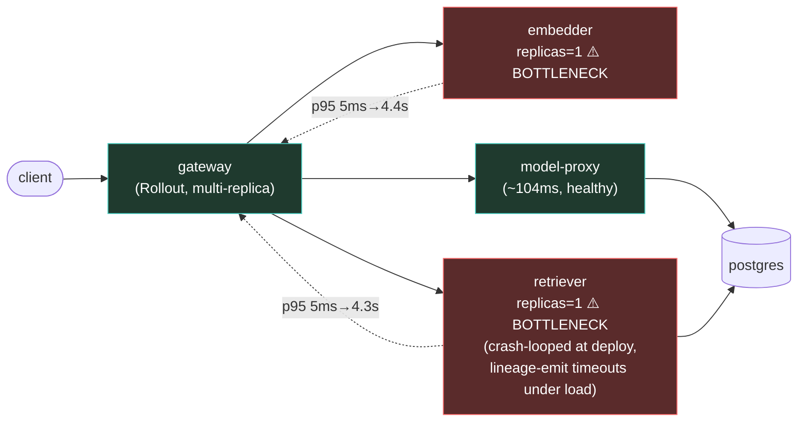

# Postmortem: gateway p95 latency above 2s

- **Status:** open
- **Severity:** sev1
- **Verified:** no
- **Opened:** 2026-08-02 23:39:41Z
- **Resolved:** (still open)

## Timeline (machine-generated)

All times UTC on 2026-08-02 unless a full date is shown.

| Time (UTC) | Source | Event |
| --- | --- | --- |
| 22:47:29Z | k8s | Pod/gateway-dd85945b4-f9rwq: Started |
| 22:47:29Z | k8s | Pod/gateway-dd85945b4-f9rwq: Pulled |
| 22:47:29Z | k8s | Pod/gateway-dd85945b4-bnt4c: Started |
| 22:47:29Z | k8s | Pod/gateway-dd85945b4-bgsvz: Created |
| 23:11:35Z | deploy:ci | CI run #108 success on main: obs: model-proxy: pre-warm the completion path before generating |
| 23:12:23Z | deploy:ci | CI run #109 success on main: obs: Revert "model-proxy: pre-warm the completion path before generating" |
| 23:15:53Z | k8s | Job/seed: SuccessfulCreate |
| 23:15:53Z | k8s | Pod/seed-d9gxh: Scheduled |
| 23:15:54Z | k8s | Pod/seed-d9gxh: Started |
| 23:15:54Z | k8s | Pod/seed-d9gxh: Pulled |
| 23:15:54Z | k8s | Pod/seed-d9gxh: Created |
| 23:15:58Z | deploy:annotation | deploy platform via gitops 1142aba (argo sync) |
| 23:15:59Z | k8s | Job/seed: Completed |
| 23:19:25Z | k8s | Job/seed: SuccessfulCreate |
| 23:19:25Z | k8s | Pod/seed-nxgx9: Scheduled |
| 23:19:27Z | k8s | Pod/seed-nxgx9: Started |
| 23:19:27Z | k8s | Pod/seed-nxgx9: Pulled |
| 23:19:27Z | k8s | Pod/seed-nxgx9: Created |
| 23:19:30Z | deploy:annotation | deploy platform via gitops e288291 (argo sync) |
| 23:19:32Z | k8s | Job/seed: Completed |
| 23:21:53Z | k8s | Pod/seed-gt5kx: Started |
| 23:21:53Z | k8s | Pod/seed-gt5kx: Pulled |
| 23:21:53Z | k8s | Pod/seed-gt5kx: Created |
| 23:21:53Z | k8s | Job/seed: SuccessfulCreate |
| 23:21:53Z | k8s | Pod/seed-gt5kx: Scheduled |
| 23:21:56Z | deploy:annotation | deploy platform via gitops be28f82 (argo sync) |
| 23:21:57Z | k8s | Job/seed: Completed |
| 23:24:20Z | k8s | Pod/seed-kw89t: Pulled |
| 23:24:20Z | k8s | Pod/seed-kw89t: Created |
| 23:24:20Z | k8s | Job/seed: SuccessfulCreate |
| 23:24:20Z | k8s | Pod/seed-kw89t: Scheduled |
| 23:24:21Z | k8s | Pod/seed-kw89t: Started |
| 23:24:24Z | deploy:annotation | deploy platform via gitops 21f3422 (argo sync) |
| 23:24:25Z | k8s | Job/seed: Completed |
| 23:31:57Z | k8s | Rollout/gateway: RolloutUpdated |
| 23:31:57Z | k8s | Rollout/gateway: RolloutNotCompleted |
| 23:31:57Z | k8s | Rollout/gateway: NewReplicaSetCreated |
| 23:31:58Z | k8s | Pod/gateway-dd85945b4-bgsvz: Killing |
| 23:31:58Z | k8s | ReplicaSet/gateway-dd85945b4: SuccessfulDelete |
| 23:31:58Z | k8s | ReplicaSet/gateway-8444846b5f: SuccessfulCreate |
| 23:31:58Z | k8s | Rollout/gateway: ScalingReplicaSet |
| 23:31:59Z | k8s | Pod/gateway-8444846b5f-tlwpd: Scheduled |
| 23:32:01Z | k8s | Pod/gateway-8444846b5f-tlwpd: Started |
| 23:32:01Z | k8s | Pod/gateway-8444846b5f-tlwpd: Pulled |
| 23:32:01Z | k8s | Pod/gateway-8444846b5f-tlwpd: Created |
| 23:32:09Z | k8s | Rollout/gateway: RolloutStepCompleted |
| 23:32:11Z | k8s | Rollout/gateway: AnalysisRunRunning |
| 23:32:13Z | k8s | Pod/gateway-8444846b5f-tlwpd: Unhealthy |
| 23:32:13Z | k8s | ReplicaSet/gateway-dd85945b4: SuccessfulCreate |
| 23:32:13Z | k8s | Pod/gateway-8444846b5f-tlwpd: Killing |
| 23:32:13Z | k8s | AnalysisRun/gateway-8444846b5f-11-1: AnalysisRunSuccessful |
| 23:32:13Z | k8s | ReplicaSet/gateway-8444846b5f: SuccessfulDelete |
| 23:32:13Z | k8s | Rollout/gateway: SkipSteps |
| 23:32:13Z | k8s | Rollout/gateway: ScalingReplicaSet |
| 23:32:13Z | k8s | Rollout/gateway: RolloutUpdated |
| 23:32:13Z | k8s | Pod/gateway-dd85945b4-rhws5: Scheduled |
| 23:32:16Z | k8s | Pod/gateway-dd85945b4-rhws5: Started |
| 23:32:16Z | k8s | Pod/gateway-dd85945b4-rhws5: Pulled |
| 23:32:16Z | k8s | Pod/gateway-dd85945b4-rhws5: Created |
| 23:32:21Z | deploy:annotation | deploy gateway via gitops bb634a3 (argo sync) |
| 23:33:59Z | k8s | ReplicaSet/retriever-8454db56c: SuccessfulCreate |
| 23:33:59Z | k8s | Deployment/retriever: ScalingReplicaSet |
| 23:33:59Z | k8s | Pod/retriever-8454db56c-msr56: Scheduled |
| 23:34:00Z | k8s | Pod/retriever-8454db56c-msr56: Pulled |
| 23:34:00Z | k8s | Pod/retriever-8454db56c-msr56: Created |
| 23:34:01Z | k8s | Pod/retriever-8454db56c-msr56: Started |
| 23:34:03Z | k8s | Pod/retriever-8454db56c-msr56: Started |
| 23:34:03Z | k8s | Pod/retriever-8454db56c-msr56: Pulled |
| 23:34:03Z | k8s | Pod/retriever-8454db56c-msr56: Created |
| 23:34:05Z | k8s | Pod/retriever-8454db56c-msr56: BackOff |
| 23:34:06Z | k8s | Pod/retriever-8454db56c-msr56: BackOff |
| 23:34:10Z | k8s | Pod/retriever-8454db56c-msr56: BackOff |
| 23:34:15Z | k8s | Pod/retriever-8454db56c-msr56: Started |
| 23:34:15Z | k8s | Pod/retriever-8454db56c-msr56: Pulled |
| 23:34:15Z | k8s | Pod/retriever-8454db56c-msr56: Created |
| 23:34:17Z | k8s | Pod/retriever-8454db56c-msr56: BackOff |
| 23:34:18Z | k8s | Pod/retriever-8454db56c-msr56: BackOff |
| 23:34:20Z | k8s | Pod/retriever-8454db56c-msr56: BackOff |
| 23:34:43Z | k8s | Pod/retriever-8454db56c-msr56: Started |
| 23:34:43Z | k8s | Pod/retriever-8454db56c-msr56: Pulled |
| 23:34:43Z | k8s | Pod/retriever-8454db56c-msr56: Created |
| 23:34:44Z | k8s | Pod/retriever-8454db56c-msr56: BackOff |
| 23:34:46Z | k8s | Pod/retriever-8454db56c-msr56: BackOff |
| 23:34:50Z | k8s | Pod/retriever-8454db56c-msr56: BackOff |
| 23:35:36Z | k8s | Pod/retriever-8454db56c-msr56: Pulled |
| 23:35:36Z | k8s | Pod/retriever-8454db56c-msr56: Created |
| 23:35:37Z | k8s | Pod/retriever-8454db56c-msr56: Started |
| 23:35:39Z | k8s | Pod/retriever-8454db56c-msr56: BackOff |
| 23:35:40Z | k8s | Pod/retriever-8454db56c-msr56: BackOff |
| 23:36:50Z | k8s | Pod/retriever-8454db56c-msr56: BackOff |
| 23:36:58Z | k8s | Pod/retriever-8454db56c-msr56: Started |
| 23:36:58Z | k8s | Pod/retriever-8454db56c-msr56: Pulled |
| 23:36:58Z | k8s | Pod/retriever-8454db56c-msr56: Created |
| 23:36:59Z | k8s | Pod/retriever-8454db56c-msr56: BackOff |
| 23:37:00Z | k8s | Pod/retriever-8454db56c-msr56: BackOff |
| 23:37:03Z | k8s | Pod/retriever-8454db56c-msr56: BackOff |
| 23:37:07Z | log-spike | log-spike onset: error: Malformed JSON in request body |
| 23:38:05Z | k8s | Pod/retriever-8454db56c-msr56: BackOff |
| 23:39:10Z | alert | alert firing: Gateway p95 latency > 2s |
| 23:39:26Z | k8s | Pod/retriever-8454db56c-msr56: BackOff |
| 23:39:40Z | k8s | Pod/retriever-8454db56c-msr56: Started |
| 23:39:40Z | k8s | Pod/retriever-8454db56c-msr56: Pulled |
| 23:39:40Z | k8s | Pod/retriever-8454db56c-msr56: Created |
| 23:39:41Z | k8s | Pod/retriever-8454db56c-msr56: BackOff |
| 23:39:43Z | k8s | Pod/retriever-8454db56c-msr56: BackOff |
| 23:39:50Z | k8s | Pod/retriever-8454db56c-msr56: BackOff |
| 23:41:01Z | k8s | ReplicaSet/retriever-8454db56c: SuccessfulDelete |
| 23:41:01Z | k8s | Deployment/retriever: ScalingReplicaSet |

## Evidence links

- [Loki — logs over the incident window](http://localhost:3001/explore?schemaVersion=1&panes=%7B%22pm%22%3A+%7B%22datasource%22%3A+%22loki%22%2C+%22queries%22%3A+%5B%7B%22refId%22%3A+%22A%22%2C+%22datasource%22%3A+%7B%22type%22%3A+%22loki%22%2C+%22uid%22%3A+%22loki%22%7D%2C+%22expr%22%3A+%22%7Bnamespace%3D%5C%22subject%5C%22%7D+%7C~+%5C%22%28%3Fi%29error%7Cfailed%5C%22%22%7D%5D%2C+%22range%22%3A+%7B%22from%22%3A+%221785713981512%22%2C+%22to%22%3A+%221785714403709%22%7D%7D%7D&orgId=1)
- [Mimir — metrics over the incident window](http://localhost:3001/explore?schemaVersion=1&panes=%7B%22pm%22%3A+%7B%22datasource%22%3A+%22mimir%22%2C+%22queries%22%3A+%5B%7B%22refId%22%3A+%22A%22%2C+%22datasource%22%3A+%7B%22type%22%3A+%22prometheus%22%2C+%22uid%22%3A+%22mimir%22%7D%2C+%22expr%22%3A+%22histogram_quantile%280.95%2C+sum%28rate%28http_server_duration_milliseconds_bucket%5B5m%5D%29%29+by+%28le%29%29%22%7D%5D%2C+%22range%22%3A+%7B%22from%22%3A+%221785713981512%22%2C+%22to%22%3A+%221785714403709%22%7D%7D%7D&orgId=1)

## Investigation context

**Runbook match:** none — no tool narrowing applied for this alert. Available runbooks: README.md, canary-abort.md, ci-pipeline-red.md, dq-freshness-stall.md, gateway-high-error-rate.md, k8s-crashloop.md, k8s-node-failure.md, snapshot-agent-audit.md, stale-secret.md

Pre-check battery (as injected at run start)

## Pre-check leads

### recent_deploys — LEAD
5 deploy-window leads
- deploy annotation at 2026-08-02T23:15:58.434000+00:00: deploy platform via gitops 1142aba (argo sync)
- deploy annotation at 2026-08-02T23:19:30.778000+00:00: deploy platform via gitops e288291 (argo sync)
- deploy annotation at 2026-08-02T23:21:56.437000+00:00: deploy platform via gitops be28f82 (argo sync)
- deploy annotation at 2026-08-02T23:24:24.266000+00:00: deploy platform via gitops 21f3422 (argo sync)
- deploy annotation at 2026-08-02T23:32:21.618000+00:00: deploy gateway via gitops bb634a3 (argo sync)

### log_spike — LEAD
error/failed log rate 200/10min vs baseline 2/10min (100x baseline) — onset: error: Malformed JSON in request body at 2026-08-02T23:37:07.230946+00:00
- error/failed log rate 200/10min vs baseline 2/10min (100x baseline) — onset: error: Malformed JSON in request body at 2026-08-02T23:37:07.230946+00:00

### kube_scan — UNAVAILABLE
error: You must be logged in to the server (Unauthorized)

### rollout_state — UNAVAILABLE
gateway: E0803 01:39:43.333921   63060 memcache.go:265] "Unhandled Error" err="couldn't get current server API group list: the server has asked for the client to provide credentials"
E0803 01:39:43.492523   63060 memcache.go:265] "Unhandled Error" err="couldn't get current server API group list: the server has asked for the client to provide credentials"
E0803 01:39:43.631389   63060 memcache.go:265] "Unhandled Error" err="couldn't get current server API group list: the server has asked for the client to; gateway analysis: E0803 01:39:42.504333   56964 memcache.go:265] "Unhandled Error" err="couldn't get current server API group list: the server has asked for the client to provide credentials"
E0803 01:39:42.767154   56964 memcache.go:265] "Unhandled Error"
… (section truncated)

### secret_age — UNAVAILABLE
error: You must be logged in to the server (Unauthorized)

## Narrative

## Summary

Sev1 paged on `Gateway p95 latency > 2s` for tenant `acme`. Gateway p95 (measured from `request_duration_seconds_bucket{job="gateway"}`) climbed from a steady ~5ms baseline to over 9.4s and was still rising at the time of investigation. No runbook matched this exact alertname, so the path below was built from first-principles telemetry.

## Impact

Every `/v1/chat` request through the gateway was affected — traced requests that normally complete in single-digit milliseconds took 2.7–9.5s. Gateway's own request rate rose ~15x (from ~1.2 req/s to a peak of ~21 req/s) during the incident window, driven by real chat traffic (dominant tenant `acme`, plus a smaller `abuser`-tagged tenant), not by a load-generator (its Deployment was scaled to 0 throughout).

## Root cause

Evidence chain, in order:

1. **Deploy correlation**: `deploy_history` shows a `gateway` gitops sync (`bb634a3`) at 23:32:21Z, preceded by four `platform` gitops syncs between 23:15:58Z and 23:24:24Z. Kubernetes events confirm gateway and retriever pods were recreated on a shared image tag (`10f24bc`) right after, and the retriever pod briefly **crash-looped** (`Back-off restarting failed container retriever`, 20+ restarts from 23:34:05Z).
2. **Capacity check**: `kube_deployment_spec_replicas` shows gateway is horizontally scaled (multiple Rollout-managed pods observed: `bnt4c`, `lvg8w`, `bgsvz`, `f9rwq`, `rhws5`), but **retriever and embedder are each pinned at `spec.replicas = 1`**.
3. **Trace evidence**: a sampled `/v1/chat` trace (3.4s total) shows the `POST embedder` child span alone taking 1.36s and `POST retriever` taking 0.75s, versus `POST model-proxy` at ~104ms — the RAG fan-out calls, not the LLM call, dominate latency.
4. **Metric confirmation**: `request_duration_seconds` p95 for `job="embedder"` and `job="retriever"` both spike in lockstep with gateway's, from ~5ms to 2.3–4.4s, starting the same minute (~23:33-23:34Z) gateway's request rate surged ~15x.
5. **Compounding symptom**: once traffic surged, retriever logs show repeated `lineage emit failed … The operation timed out` warnings on the `rag.retrieve` path — the OpenLineage/Marquez emit call queuing/timing out under load, adding further latency per request.

**Root cause**: a ~15x surge in real `/v1/chat` traffic (dominant tenant `acme`) landed on `retriever` and `embedder`, which — unlike `gateway` — run a **single replica each**. The single-instance services saturated, serialized/queued incoming requests, and their per-request OpenLineage emit calls began timing out under the backlog, driving gateway p95 well past the 2s SLO. This is a capacity/scaling mismatch surfaced by a legitimate traffic increase around the same time as a gitops deploy, not a code regression in the deployed commit itself (the deploy is the trigger that recreated pods at replica=1 and coincides with the traffic ramp, but the trace/metric evidence points at fan-out capacity, not application logic, as the bottleneck).

## What fixed it

**Remediation could not be executed.** Root cause and fix were identified — scale `retriever` and `embedder` from 1→4 replicas each to absorb the surge — and both were dry-run and approved by the operator. However, every cluster-write attempt (`scale_deployment` for retriever and embedder, then a diagnostic `restart_workload` on retriever) failed with `You must be logged in to the server (Unauthorized)`. This matches the pre-incident lead that `kube_scan`, `secret_age`, and `rollout_state` were already `UNAVAILABLE` for the identical reason — the on-call agent's cluster credentials are not valid in this session, for both the read (`agent-ro`) and remediation identities. This is an infrastructure access failure independent of the paged incident, but it fully blocked remediation. `alert_status` was re-queried after the failed attempts and **the alert remains active** — recovery was not achieved.

## Lessons

- **Capacity parity**: `gateway` autoscaling/replica count is not mirrored by its synchronous fan-out dependencies (`retriever`, `embedder`). Either both should scale together, or an HPA should be attached to `retriever`/`embedder` keyed on request rate/latency so a traffic surge doesn't hit a single pod.
- **OpenLineage emit should not block the request path**: `rag.retrieve`'s lineage emission timing out under load adds latency to the user-facing response; it should be fire-and-forget/async with a short timeout, not something that degrades `/v1/chat` p95.
- **No runbook exists for `Gateway p95 latency > 2s`** — this incident should seed one: check gateway vs. downstream (retriever/embedder) replica counts and per-hop trace spans first, before assuming a bad deploy.
- **Cluster credential outage went undiagnosed as a standing gap**: the pre-check leads flagged `kube_scan`/`secret_age`/`rollout_state` as unavailable before this incident even started, but remediation tools were still attempted (correctly, since dry-run doesn't guarantee failure) — worth alerting on-call tooling health (valid kubeconfig/token) as its own monitored signal so this isn't discovered mid-incident.

