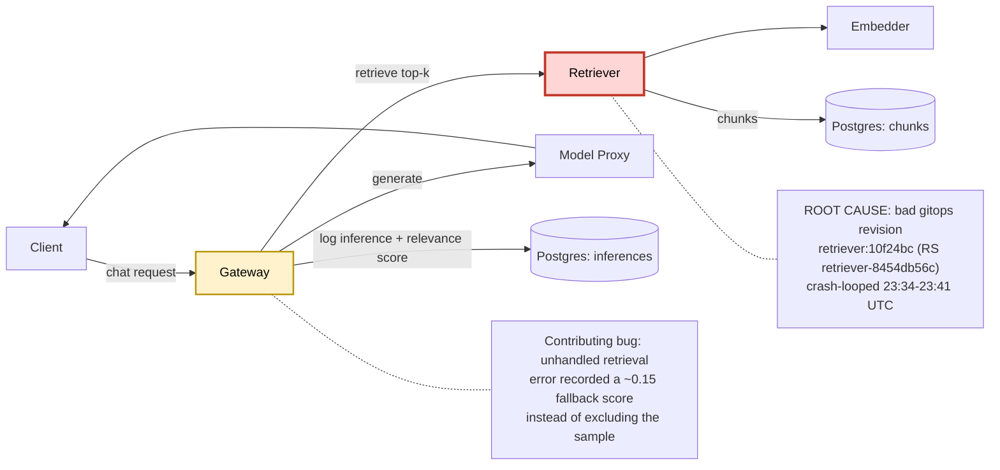

# Postmortem: RAG top-1 relevance below the 90% objective over the last hour (burn-rate alerting saturates for a loose SLO)

- **Status:** open
- **Severity:** sev2
- **Verified:** no
- **Opened:** 2026-08-02 23:46:48Z
- **Resolved:** (still open)

## Timeline (machine-generated)

All times UTC on 2026-08-02 unless a full date is shown.

| Time (UTC) | Source | Event |
| --- | --- | --- |
| 23:11:35Z | deploy:ci | CI run #108 success on main: obs: model-proxy: pre-warm the completion path before generating |
| 23:12:23Z | deploy:ci | CI run #109 success on main: obs: Revert "model-proxy: pre-warm the completion path before generating" |
| 23:15:53Z | k8s | Job/seed: SuccessfulCreate |
| 23:15:53Z | k8s | Pod/seed-d9gxh: Scheduled |
| 23:15:54Z | k8s | Pod/seed-d9gxh: Started |
| 23:15:54Z | k8s | Pod/seed-d9gxh: Pulled |
| 23:15:54Z | k8s | Pod/seed-d9gxh: Created |
| 23:15:58Z | deploy:annotation | deploy platform via gitops 1142aba (argo sync) |
| 23:15:59Z | k8s | Job/seed: Completed |
| 23:19:25Z | k8s | Job/seed: SuccessfulCreate |
| 23:19:25Z | k8s | Pod/seed-nxgx9: Scheduled |
| 23:19:27Z | k8s | Pod/seed-nxgx9: Started |
| 23:19:27Z | k8s | Pod/seed-nxgx9: Pulled |
| 23:19:27Z | k8s | Pod/seed-nxgx9: Created |
| 23:19:30Z | deploy:annotation | deploy platform via gitops e288291 (argo sync) |
| 23:19:32Z | k8s | Job/seed: Completed |
| 23:21:53Z | k8s | Pod/seed-gt5kx: Started |
| 23:21:53Z | k8s | Pod/seed-gt5kx: Pulled |
| 23:21:53Z | k8s | Pod/seed-gt5kx: Created |
| 23:21:53Z | k8s | Job/seed: SuccessfulCreate |
| 23:21:53Z | k8s | Pod/seed-gt5kx: Scheduled |
| 23:21:56Z | deploy:annotation | deploy platform via gitops be28f82 (argo sync) |
| 23:21:57Z | k8s | Job/seed: Completed |
| 23:24:20Z | k8s | Pod/seed-kw89t: Pulled |
| 23:24:20Z | k8s | Pod/seed-kw89t: Created |
| 23:24:20Z | k8s | Job/seed: SuccessfulCreate |
| 23:24:20Z | k8s | Pod/seed-kw89t: Scheduled |
| 23:24:21Z | k8s | Pod/seed-kw89t: Started |
| 23:24:24Z | deploy:annotation | deploy platform via gitops 21f3422 (argo sync) |
| 23:24:25Z | k8s | Job/seed: Completed |
| 23:31:57Z | k8s | Rollout/gateway: RolloutUpdated |
| 23:31:57Z | k8s | Rollout/gateway: RolloutNotCompleted |
| 23:31:57Z | k8s | Rollout/gateway: NewReplicaSetCreated |
| 23:31:58Z | k8s | Pod/gateway-dd85945b4-bgsvz: Killing |
| 23:31:58Z | k8s | ReplicaSet/gateway-dd85945b4: SuccessfulDelete |
| 23:31:58Z | k8s | ReplicaSet/gateway-8444846b5f: SuccessfulCreate |
| 23:31:58Z | k8s | Rollout/gateway: ScalingReplicaSet |
| 23:31:59Z | k8s | Pod/gateway-8444846b5f-tlwpd: Scheduled |
| 23:32:01Z | k8s | Pod/gateway-8444846b5f-tlwpd: Started |
| 23:32:01Z | k8s | Pod/gateway-8444846b5f-tlwpd: Pulled |
| 23:32:01Z | k8s | Pod/gateway-8444846b5f-tlwpd: Created |
| 23:32:09Z | k8s | Rollout/gateway: RolloutStepCompleted |
| 23:32:11Z | k8s | Rollout/gateway: AnalysisRunRunning |
| 23:32:13Z | k8s | Pod/gateway-8444846b5f-tlwpd: Unhealthy |
| 23:32:13Z | k8s | ReplicaSet/gateway-dd85945b4: SuccessfulCreate |
| 23:32:13Z | k8s | Pod/gateway-8444846b5f-tlwpd: Killing |
| 23:32:13Z | k8s | AnalysisRun/gateway-8444846b5f-11-1: AnalysisRunSuccessful |
| 23:32:13Z | k8s | ReplicaSet/gateway-8444846b5f: SuccessfulDelete |
| 23:32:13Z | k8s | Rollout/gateway: SkipSteps |
| 23:32:13Z | k8s | Rollout/gateway: ScalingReplicaSet |
| 23:32:13Z | k8s | Rollout/gateway: RolloutUpdated |
| 23:32:13Z | k8s | Pod/gateway-dd85945b4-rhws5: Scheduled |
| 23:32:16Z | k8s | Pod/gateway-dd85945b4-rhws5: Started |
| 23:32:16Z | k8s | Pod/gateway-dd85945b4-rhws5: Pulled |
| 23:32:16Z | k8s | Pod/gateway-dd85945b4-rhws5: Created |
| 23:32:21Z | deploy:annotation | deploy gateway via gitops bb634a3 (argo sync) |
| 23:33:59Z | k8s | ReplicaSet/retriever-8454db56c: SuccessfulCreate |
| 23:33:59Z | k8s | Deployment/retriever: ScalingReplicaSet |
| 23:33:59Z | k8s | Pod/retriever-8454db56c-msr56: Scheduled |
| 23:34:00Z | k8s | Pod/retriever-8454db56c-msr56: Pulled |
| 23:34:00Z | k8s | Pod/retriever-8454db56c-msr56: Created |
| 23:34:01Z | k8s | Pod/retriever-8454db56c-msr56: Started |
| 23:34:03Z | k8s | Pod/retriever-8454db56c-msr56: Started |
| 23:34:03Z | k8s | Pod/retriever-8454db56c-msr56: Pulled |
| 23:34:03Z | k8s | Pod/retriever-8454db56c-msr56: Created |
| 23:34:05Z | k8s | Pod/retriever-8454db56c-msr56: BackOff |
| 23:34:06Z | k8s | Pod/retriever-8454db56c-msr56: BackOff |
| 23:34:10Z | k8s | Pod/retriever-8454db56c-msr56: BackOff |
| 23:34:15Z | k8s | Pod/retriever-8454db56c-msr56: Started |
| 23:34:15Z | k8s | Pod/retriever-8454db56c-msr56: Pulled |
| 23:34:15Z | k8s | Pod/retriever-8454db56c-msr56: Created |
| 23:34:17Z | k8s | Pod/retriever-8454db56c-msr56: BackOff |
| 23:34:18Z | k8s | Pod/retriever-8454db56c-msr56: BackOff |
| 23:34:20Z | k8s | Pod/retriever-8454db56c-msr56: BackOff |
| 23:34:43Z | k8s | Pod/retriever-8454db56c-msr56: Started |
| 23:34:43Z | k8s | Pod/retriever-8454db56c-msr56: Pulled |
| 23:34:43Z | k8s | Pod/retriever-8454db56c-msr56: Created |
| 23:34:44Z | k8s | Pod/retriever-8454db56c-msr56: BackOff |
| 23:34:46Z | k8s | Pod/retriever-8454db56c-msr56: BackOff |
| 23:34:50Z | k8s | Pod/retriever-8454db56c-msr56: BackOff |
| 23:35:36Z | k8s | Pod/retriever-8454db56c-msr56: Pulled |
| 23:35:36Z | k8s | Pod/retriever-8454db56c-msr56: Created |
| 23:35:37Z | k8s | Pod/retriever-8454db56c-msr56: Started |
| 23:35:39Z | k8s | Pod/retriever-8454db56c-msr56: BackOff |
| 23:35:40Z | k8s | Pod/retriever-8454db56c-msr56: BackOff |
| 23:36:50Z | k8s | Pod/retriever-8454db56c-msr56: BackOff |
| 23:36:58Z | k8s | Pod/retriever-8454db56c-msr56: Started |
| 23:36:58Z | k8s | Pod/retriever-8454db56c-msr56: Pulled |
| 23:36:58Z | k8s | Pod/retriever-8454db56c-msr56: Created |
| 23:36:59Z | k8s | Pod/retriever-8454db56c-msr56: BackOff |
| 23:37:00Z | k8s | Pod/retriever-8454db56c-msr56: BackOff |
| 23:37:03Z | k8s | Pod/retriever-8454db56c-msr56: BackOff |
| 23:38:05Z | k8s | Pod/retriever-8454db56c-msr56: BackOff |
| 23:39:26Z | k8s | Pod/retriever-8454db56c-msr56: BackOff |
| 23:39:40Z | k8s | Pod/retriever-8454db56c-msr56: Started |
| 23:39:40Z | k8s | Pod/retriever-8454db56c-msr56: Pulled |
| 23:39:40Z | k8s | Pod/retriever-8454db56c-msr56: Created |
| 23:39:41Z | k8s | Pod/retriever-8454db56c-msr56: BackOff |
| 23:39:43Z | k8s | Pod/retriever-8454db56c-msr56: BackOff |
| 23:39:50Z | k8s | Pod/retriever-8454db56c-msr56: BackOff |
| 23:41:01Z | k8s | ReplicaSet/retriever-8454db56c: SuccessfulDelete |
| 23:41:01Z | k8s | Deployment/retriever: ScalingReplicaSet |
| 23:42:21Z | log-spike | log-spike onset: [gateway] unhandled error: 16 \| } |
| 23:46:10Z | alert | alert firing: SLO RAG quality — below objective |

## Evidence links

- [Loki — logs over the incident window](http://localhost:3001/explore?schemaVersion=1&panes=%7B%22pm%22%3A+%7B%22datasource%22%3A+%22loki%22%2C+%22queries%22%3A+%5B%7B%22refId%22%3A+%22A%22%2C+%22datasource%22%3A+%7B%22type%22%3A+%22loki%22%2C+%22uid%22%3A+%22loki%22%7D%2C+%22expr%22%3A+%22%7Bnamespace%3D%5C%22subject%5C%22%7D+%7C~+%5C%22%28%3Fi%29error%7Cfailed%5C%22%22%7D%5D%2C+%22range%22%3A+%7B%22from%22%3A+%221785714408622%22%2C+%22to%22%3A+%221785715006847%22%7D%7D%7D&orgId=1)
- [Mimir — metrics over the incident window](http://localhost:3001/explore?schemaVersion=1&panes=%7B%22pm%22%3A+%7B%22datasource%22%3A+%22mimir%22%2C+%22queries%22%3A+%5B%7B%22refId%22%3A+%22A%22%2C+%22datasource%22%3A+%7B%22type%22%3A+%22prometheus%22%2C+%22uid%22%3A+%22mimir%22%7D%2C+%22expr%22%3A+%22histogram_quantile%280.95%2C+sum%28rate%28http_server_duration_milliseconds_bucket%5B5m%5D%29%29+by+%28le%29%29%22%7D%5D%2C+%22range%22%3A+%7B%22from%22%3A+%221785714408622%22%2C+%22to%22%3A+%221785715006847%22%7D%7D%7D&orgId=1)

## Investigation context

**Runbook match:** none — no tool narrowing applied for this alert. Available runbooks: README.md, canary-abort.md, ci-pipeline-red.md, dq-freshness-stall.md, gateway-high-error-rate.md, k8s-crashloop.md, k8s-node-failure.md, snapshot-agent-audit.md, stale-secret.md

Pre-check battery (as injected at run start)

## Pre-check leads

### recent_deploys — LEAD
5 deploy-window leads
- deploy annotation at 2026-08-02T23:15:58.434000+00:00: deploy platform via gitops 1142aba (argo sync)
- deploy annotation at 2026-08-02T23:19:30.778000+00:00: deploy platform via gitops e288291 (argo sync)
- deploy annotation at 2026-08-02T23:21:56.437000+00:00: deploy platform via gitops be28f82 (argo sync)
- deploy annotation at 2026-08-02T23:24:24.266000+00:00: deploy platform via gitops 21f3422 (argo sync)
- deploy annotation at 2026-08-02T23:32:21.618000+00:00: deploy gateway via gitops bb634a3 (argo sync)

### log_spike — LEAD
error/failed log rate 200/10min vs baseline 2/10min (100x baseline) — onset: [gateway] unhandled error: 16 |         } at 2026-08-02T23:42:21.586648+00:00
- error/failed log rate 200/10min vs baseline 2/10min (100x baseline) — onset: [gateway] unhandled error: 16 |         } at 2026-08-02T23:42:21.586648+00:00

### kube_scan — UNAVAILABLE
error: You must be logged in to the server (Unauthorized)

### rollout_state — UNAVAILABLE
gateway: E0803 01:46:49.506453   56824 memcache.go:265] "Unhandled Error" err="couldn't get current server API group list: the server has asked for the client to provide credentials"
E0803 01:46:49.672264   56824 memcache.go:265] "Unhandled Error" err="couldn't get current server API group list: the server has asked for the client to provide credentials"
E0803 01:46:49.757477   56824 memcache.go:265] "Unhandled Error" err="couldn't get current server API group list: the server has asked for the client to; gateway analysis: E0803 01:46:49.505764   49856 memcache.go:265] "Unhandled Error" err="couldn't get current server API group list: the server has asked for the client to provide credentials"
E0803 01:46:49.676209   49856 memcache.go:265] "Unhandled Error"
… (section truncated)

### secret_age — UNAVAILABLE
error: You must be logged in to the server (Unauthorized)

## Narrative

## Summary

Sev2 burn-rate alert "SLO RAG quality — below objective" fired because the 1-hour rolling top-1 relevance SLI (`slo:rag_quality:sli_ratio1h`) dropped below the 90% objective. By the time the page went out, the underlying condition had already self-corrected — this is the "burn-rate alerting saturates for a loose SLO" lag the alert's own summary warns about.

## Impact

For a roughly 7-minute window, every retrieval-scored chat request (tenants acme/bravo/abuser, `mock-llm-v1`) recorded a top-1 relevance score pinned around **0.15–0.17** instead of the normal ~0.9+. `slo:rag_quality:sli_ratio5m` fell from 1.0 to a flat 0.0 for that entire window before recovering. No full outage: gateway kept returning `chat completed` responses (cached and live), so the user-visible symptom was degraded answer relevance, not errors.

## Root cause

`deploy_history`/`grafana_annotations` show a burst of gitops syncs: four "platform" syncs (`1142aba`→`21f3422`, 23:15:58–23:24:24 UTC) followed by a "gateway" sync (`bb634a3`, 23:32:21 UTC). Two minutes after the gateway sync, `k8s_events` show `Deployment/retriever` creating a new ReplicaSet `retriever-8454db56c` (image `retriever:10f24bc`) that immediately entered `CrashLoopBackOff` — 20+ Back-off events between 23:34:05 and 23:39:50 UTC. In that same window, all four gateway replicas (`gateway-dd85945b4-*`) logged repeated `[gateway] unhandled error: 16 |         }` on every non-cached completion, and retriever logged a flood of `lineage emit failed: operation timed out` warnings for `rag.retrieve` jobs — the retriever was flapping and gateway's retrieval-scoring path was throwing on the failed calls. Instead of excluding those failed samples from the relevance SLI (or retrying against a healthy replica), gateway recorded a fallback/default low score (~0.15) for them, which is what actually crushed the SLI to zero rather than just producing gaps.

The bad ReplicaSet was scaled back to 0 replicas at 23:41:01 UTC (`Deployment/retriever: ScalingReplicaSet ... from 1 to 0`, pod deleted) — retriever returned to 1/1 available on the previous good revision. `slo:rag_quality:sli_ratio5m` was back to 1.0 by 23:52:05 UTC and no further gateway errors or retriever Back-offs have been seen since. The alert only fired at 23:46:10 UTC because the 1-hour rolling window still contained the bad 23:34–23:41 samples — five minutes *after* the system had already recovered.

Confirmed via `kube_deployment_spec_replicas`/`kube_deployment_status_replicas_available{deployment="retriever"}` = 1/1 (healthy) and zero `unhandled`/`BackOff` events in the most recent 5–15 minutes.

## What fixed it

Nothing — this self-remediated. The Deployment controller (or a corrective gitops reconcile) scaled the bad `retriever-8454db56c` ReplicaSet to zero before this page was even generated. A `rollout_undo` dry-run was attempted on `retriever` as a precaution, but the cluster read (`kubectl`/argocd credentials) was unauthorized in this environment, so the diff could not be verified — and since live metrics already confirm the deployment is back on the good revision (1/1 available, clean logs, SLI at 1.0), forcing an unverified "undo" was judged unsafe (it could just as easily roll back onto the bad revision as away from it) and was not executed. No remediation tool was run against production state this incident.

## Lessons

- Gateway's retrieval-scoring path should treat a failed/timed-out retrieval call as an **excluded** SLI sample, not a scored one with a fake low value — that single behavior turned a partial retriever blip into a hard-zero SLI for the whole window.
- `retriever` is a plain Deployment with no canary/analysis gate (unlike `gateway`/`model-proxy`, which run under Argo Rollouts). The bad image reached 100% of the new ReplicaSet with no automated health gate before it started taking traffic.
- The on-call agent-ro kubeconfig could not read pod/rollout state this incident (`Unauthorized` on every `kubectl_read`/`argo_app`/`rollout_status` call) — worth fixing so a future responder can actually verify a rollback diff instead of having to reason from Loki/Mimir alone.
- A 1-hour burn-rate window on a "loose" SLO means alerts will reliably arrive after short, self-healing blips have already ended; consider a faster short-window companion condition (e.g. require the 5m ratio to also currently be below objective) so on-call isn't paged for already-resolved incidents.

