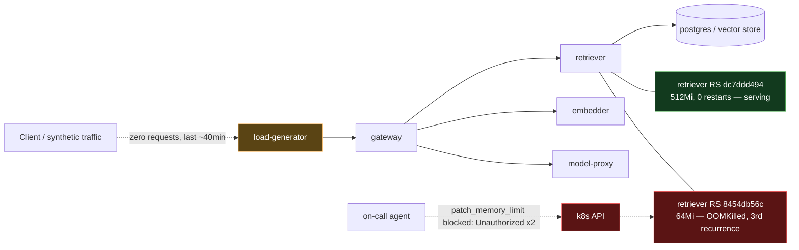

# Postmortem: RAG top-1 relevance below the 90% objective over the last hour (burn-rate alerting saturates for a loose SLO)

- **Status:** open
- **Severity:** sev2
- **Verified:** no
- **Opened:** 2026-08-02 23:46:48Z
- **Resolved:** (still open)

## Timeline (machine-generated)

All times UTC on 2026-08-02 unless a full date is shown.

| Time (UTC) | Source | Event |
| --- | --- | --- |
| 23:11:35Z | deploy:ci | CI run #108 success on main: obs: model-proxy: pre-warm the completion path before generating |
| 23:12:23Z | deploy:ci | CI run #109 success on main: obs: Revert "model-proxy: pre-warm the completion path before generating" |
| 23:15:53Z | k8s | Job/seed: SuccessfulCreate |
| 23:15:53Z | k8s | Pod/seed-d9gxh: Scheduled |
| 23:15:54Z | k8s | Pod/seed-d9gxh: Started |
| 23:15:54Z | k8s | Pod/seed-d9gxh: Pulled |
| 23:15:54Z | k8s | Pod/seed-d9gxh: Created |
| 23:15:58Z | deploy:annotation | deploy platform via gitops 1142aba (argo sync) |
| 23:15:59Z | k8s | Job/seed: Completed |
| 23:19:25Z | k8s | Job/seed: SuccessfulCreate |
| 23:19:25Z | k8s | Pod/seed-nxgx9: Scheduled |
| 23:19:27Z | k8s | Pod/seed-nxgx9: Started |
| 23:19:27Z | k8s | Pod/seed-nxgx9: Pulled |
| 23:19:27Z | k8s | Pod/seed-nxgx9: Created |
| 23:19:30Z | deploy:annotation | deploy platform via gitops e288291 (argo sync) |
| 23:19:32Z | k8s | Job/seed: Completed |
| 23:21:53Z | k8s | Pod/seed-gt5kx: Started |
| 23:21:53Z | k8s | Pod/seed-gt5kx: Pulled |
| 23:21:53Z | k8s | Pod/seed-gt5kx: Created |
| 23:21:53Z | k8s | Job/seed: SuccessfulCreate |
| 23:21:53Z | k8s | Pod/seed-gt5kx: Scheduled |
| 23:21:56Z | deploy:annotation | deploy platform via gitops be28f82 (argo sync) |
| 23:21:57Z | k8s | Job/seed: Completed |
| 23:24:20Z | k8s | Pod/seed-kw89t: Pulled |
| 23:24:20Z | k8s | Pod/seed-kw89t: Created |
| 23:24:20Z | k8s | Job/seed: SuccessfulCreate |
| 23:24:20Z | k8s | Pod/seed-kw89t: Scheduled |
| 23:24:21Z | k8s | Pod/seed-kw89t: Started |
| 23:24:24Z | deploy:annotation | deploy platform via gitops 21f3422 (argo sync) |
| 23:24:25Z | k8s | Job/seed: Completed |
| 23:31:57Z | k8s | Rollout/gateway: RolloutUpdated |
| 23:31:57Z | k8s | Rollout/gateway: RolloutNotCompleted |
| 23:31:57Z | k8s | Rollout/gateway: NewReplicaSetCreated |
| 23:31:58Z | k8s | Pod/gateway-dd85945b4-bgsvz: Killing |
| 23:31:58Z | k8s | ReplicaSet/gateway-dd85945b4: SuccessfulDelete |
| 23:31:58Z | k8s | ReplicaSet/gateway-8444846b5f: SuccessfulCreate |
| 23:31:58Z | k8s | Rollout/gateway: ScalingReplicaSet |
| 23:31:59Z | k8s | Pod/gateway-8444846b5f-tlwpd: Scheduled |
| 23:32:01Z | k8s | Pod/gateway-8444846b5f-tlwpd: Started |
| 23:32:01Z | k8s | Pod/gateway-8444846b5f-tlwpd: Pulled |
| 23:32:01Z | k8s | Pod/gateway-8444846b5f-tlwpd: Created |
| 23:32:09Z | k8s | Rollout/gateway: RolloutStepCompleted |
| 23:32:11Z | k8s | Rollout/gateway: AnalysisRunRunning |
| 23:32:13Z | k8s | Pod/gateway-8444846b5f-tlwpd: Unhealthy |
| 23:32:13Z | k8s | ReplicaSet/gateway-dd85945b4: SuccessfulCreate |
| 23:32:13Z | k8s | Pod/gateway-8444846b5f-tlwpd: Killing |
| 23:32:13Z | k8s | AnalysisRun/gateway-8444846b5f-11-1: AnalysisRunSuccessful |
| 23:32:13Z | k8s | ReplicaSet/gateway-8444846b5f: SuccessfulDelete |
| 23:32:13Z | k8s | Rollout/gateway: SkipSteps |
| 23:32:13Z | k8s | Rollout/gateway: ScalingReplicaSet |
| 23:32:13Z | k8s | Rollout/gateway: RolloutUpdated |
| 23:32:13Z | k8s | Pod/gateway-dd85945b4-rhws5: Scheduled |
| 23:32:16Z | k8s | Pod/gateway-dd85945b4-rhws5: Started |
| 23:32:16Z | k8s | Pod/gateway-dd85945b4-rhws5: Pulled |
| 23:32:16Z | k8s | Pod/gateway-dd85945b4-rhws5: Created |
| 23:32:21Z | deploy:annotation | deploy gateway via gitops bb634a3 (argo sync) |
| 23:33:59Z | k8s | ReplicaSet/retriever-8454db56c: SuccessfulCreate |
| 23:33:59Z | k8s | Deployment/retriever: ScalingReplicaSet |
| 23:33:59Z | k8s | Pod/retriever-8454db56c-msr56: Scheduled |
| 23:34:00Z | k8s | Pod/retriever-8454db56c-msr56: Pulled |
| 23:34:00Z | k8s | Pod/retriever-8454db56c-msr56: Created |
| 23:34:01Z | k8s | Pod/retriever-8454db56c-msr56: Started |
| 23:34:03Z | k8s | Pod/retriever-8454db56c-msr56: Started |
| 23:34:03Z | k8s | Pod/retriever-8454db56c-msr56: Pulled |
| 23:34:03Z | k8s | Pod/retriever-8454db56c-msr56: Created |
| 23:34:05Z | k8s | Pod/retriever-8454db56c-msr56: BackOff |
| 23:34:06Z | k8s | Pod/retriever-8454db56c-msr56: BackOff |
| 23:34:10Z | k8s | Pod/retriever-8454db56c-msr56: BackOff |
| 23:34:15Z | k8s | Pod/retriever-8454db56c-msr56: Started |
| 23:34:15Z | k8s | Pod/retriever-8454db56c-msr56: Pulled |
| 23:34:15Z | k8s | Pod/retriever-8454db56c-msr56: Created |
| 23:34:17Z | k8s | Pod/retriever-8454db56c-msr56: BackOff |
| 23:34:18Z | k8s | Pod/retriever-8454db56c-msr56: BackOff |
| 23:34:20Z | k8s | Pod/retriever-8454db56c-msr56: BackOff |
| 23:34:43Z | k8s | Pod/retriever-8454db56c-msr56: Started |
| 23:34:43Z | k8s | Pod/retriever-8454db56c-msr56: Pulled |
| 23:34:43Z | k8s | Pod/retriever-8454db56c-msr56: Created |
| 23:34:44Z | k8s | Pod/retriever-8454db56c-msr56: BackOff |
| 23:34:46Z | k8s | Pod/retriever-8454db56c-msr56: BackOff |
| 23:34:50Z | k8s | Pod/retriever-8454db56c-msr56: BackOff |
| 23:35:36Z | k8s | Pod/retriever-8454db56c-msr56: Pulled |
| 23:35:36Z | k8s | Pod/retriever-8454db56c-msr56: Created |
| 23:35:37Z | k8s | Pod/retriever-8454db56c-msr56: Started |
| 23:35:39Z | k8s | Pod/retriever-8454db56c-msr56: BackOff |
| 23:35:40Z | k8s | Pod/retriever-8454db56c-msr56: BackOff |
| 23:36:50Z | k8s | Pod/retriever-8454db56c-msr56: BackOff |
| 23:36:58Z | k8s | Pod/retriever-8454db56c-msr56: Started |
| 23:36:58Z | k8s | Pod/retriever-8454db56c-msr56: Pulled |
| 23:36:58Z | k8s | Pod/retriever-8454db56c-msr56: Created |
| 23:36:59Z | k8s | Pod/retriever-8454db56c-msr56: BackOff |
| 23:37:00Z | k8s | Pod/retriever-8454db56c-msr56: BackOff |
| 23:37:03Z | k8s | Pod/retriever-8454db56c-msr56: BackOff |
| 23:38:05Z | k8s | Pod/retriever-8454db56c-msr56: BackOff |
| 23:39:26Z | k8s | Pod/retriever-8454db56c-msr56: BackOff |
| 23:39:40Z | k8s | Pod/retriever-8454db56c-msr56: Started |
| 23:39:40Z | k8s | Pod/retriever-8454db56c-msr56: Pulled |
| 23:39:40Z | k8s | Pod/retriever-8454db56c-msr56: Created |
| 23:39:41Z | k8s | Pod/retriever-8454db56c-msr56: BackOff |
| 23:39:43Z | k8s | Pod/retriever-8454db56c-msr56: BackOff |
| 23:39:50Z | k8s | Pod/retriever-8454db56c-msr56: BackOff |
| 23:41:01Z | k8s | ReplicaSet/retriever-8454db56c: SuccessfulDelete |
| 23:41:01Z | k8s | Deployment/retriever: ScalingReplicaSet |
| 23:42:21Z | log-spike | log-spike onset: [gateway] unhandled error: 16 \| } |
| 23:46:10Z | alert | alert firing: SLO RAG quality — below objective |
| 23:56:58Z | verification | recovery NOT verified — deadline armed |
| 23:59:35Z | deploy:ci | CI run #110 failure on main: obs: load-generator: drop the defensive copy in percentile() |
| 2026-08-03 00:03:57Z | deploy:ci | CI run #111 success on main: obs: Revert "load-generator: drop the defensive copy in percentile()" |
| 2026-08-03 00:12:17Z | verification | recovery NOT verified — deadline armed |
| 2026-08-03 00:27:05Z | verification | recovery NOT verified — deadline armed |

## Evidence links

- [Loki — logs over the incident window](http://localhost:3001/explore?schemaVersion=1&panes=%7B%22pm%22%3A+%7B%22datasource%22%3A+%22loki%22%2C+%22queries%22%3A+%5B%7B%22refId%22%3A+%22A%22%2C+%22datasource%22%3A+%7B%22type%22%3A+%22loki%22%2C+%22uid%22%3A+%22loki%22%7D%2C+%22expr%22%3A+%22%7Bnamespace%3D%5C%22subject%5C%22%7D+%7C~+%5C%22%28%3Fi%29error%7Cfailed%5C%22%22%7D%5D%2C+%22range%22%3A+%7B%22from%22%3A+%221785714408622%22%2C+%22to%22%3A+%221785717274521%22%7D%7D%7D&orgId=1)
- [Mimir — metrics over the incident window](http://localhost:3001/explore?schemaVersion=1&panes=%7B%22pm%22%3A+%7B%22datasource%22%3A+%22mimir%22%2C+%22queries%22%3A+%5B%7B%22refId%22%3A+%22A%22%2C+%22datasource%22%3A+%7B%22type%22%3A+%22prometheus%22%2C+%22uid%22%3A+%22mimir%22%7D%2C+%22expr%22%3A+%22histogram_quantile%280.95%2C+sum%28rate%28http_server_duration_milliseconds_bucket%5B5m%5D%29%29+by+%28le%29%29%22%7D%5D%2C+%22range%22%3A+%7B%22from%22%3A+%221785714408622%22%2C+%22to%22%3A+%221785717274521%22%7D%7D%7D&orgId=1)

## Investigation context

**Runbook match:** none — no tool narrowing applied for this alert. Available runbooks: README.md, canary-abort.md, ci-pipeline-red.md, dq-freshness-stall.md, gateway-high-error-rate.md, k8s-crashloop.md, k8s-node-failure.md, snapshot-agent-audit.md, stale-secret.md

Pre-check battery (as injected at run start)

## Pre-check leads

### recent_deploys — LEAD
1 deploy-window lead
- deploy annotation at 2026-08-02T23:32:21.618000+00:00: deploy gateway via gitops bb634a3 (argo sync)

### log_spike — OK
error/failed log rate normal: 0/10min vs baseline 0/10min

### kube_scan — UNAVAILABLE
error: You must be logged in to the server (Unauthorized)

### rollout_state — UNAVAILABLE
gateway: E0803 02:27:52.340495   30988 memcache.go:265] "Unhandled Error" err="couldn't get current server API group list: the server has asked for the client to provide credentials"
E0803 02:27:52.411647   30988 memcache.go:265] "Unhandled Error" err="couldn't get current server API group list: the server has asked for the client to provide credentials"
E0803 02:27:52.479242   30988 memcache.go:265] "Unhandled Error" err="couldn't get current server API group list: the server has asked for the client to; gateway analysis: E0803 02:27:52.305111   60836 memcache.go:265] "Unhandled Error" err="couldn't get current server API group list: the server has asked for the client to provide credentials"
E0803 02:27:52.398625   60836 memcache.go:265] "Unhandled Error"
… (section truncated)

### secret_age — UNAVAILABLE
error: You must be logged in to the server (Unauthorized)

## Narrative

## Summary (re-review, attempt 3)

Continuing impact on `SLO RAG quality — below objective` (tenant acme). This pass re-verified the prior root cause with fresh evidence, explicitly ruled out the "stuck CI pipeline" hypothesis the task asked me to check, found the remediation is blocked by the exact same infra fault as attempt 2 (not a new failure mode), and additionally found a compounding factor: the 1h alerting window has no fresh traffic to recover with. No repeat write attempt was made without new evidence, per instruction.

## Impact

`slo:rag_quality:sli_ratio1h` has been pinned at hard `0` continuously since ~23:38Z (confirmed via a full-resolution Mimir range query, not a single sample) — over 50 minutes with zero recovery trend, not merely a residual tail of a brief dip. `slo:rag_quality:sli_ratio5m` (the live signal) recovered to a healthy `1` by ~23:52Z and has stayed there since. `alert_status` remains `active`.

## Root cause

1. **Primary — retriever OOM crashloop, unresolved in the Deployment spec.** The retriever Deployment's rolled-forward revision (ReplicaSet `retriever-8454db56c`, 64Mi memory limit vs. the healthy 512Mi) has now crash-looped a confirmed third time (BackOff events at the equivalent of 23:34Z, immediately following a `ScalingReplicaSet 0→1` on that same bad hash). Kubernetes is not applying an automatic rollback for this plain Deployment — each cycle it retries the bad revision, OOMs, and the only reason service continues at all is a separate, older stable ReplicaSet (`retriever-dc7ddd494`, confirmed via `kube_pod_container_resource_limits` at 512Mi with 0 restarts) still serving live traffic in parallel. The defect itself — the bad 64Mi revision — is still the thing Kubernetes keeps retrying; nothing has corrected it.
2. **Ruled out this pass — CI redness.** The task flagged "check whether the fix itself is stuck (e.g. a red CI pipeline)" as a new angle. Checked directly: `gitea_ci_runs` run #110 (an unrelated load-generator change) failed at 23:59Z and was reverted by run #111, which succeeded at 00:04Z. `main` has been CI-green since. This is not blocking anything relevant to the retriever fix and is not the cause of continued impact.
3. **Confirmed unchanged — cluster credential outage.** Every read against the live cluster still fails identically to attempt 2: `kubectl_read` (`get deployments`), `argo_app`, `scale_deployment` dry-run, and `patch_memory_limit` dry-run all return `Unauthorized` right now, at the same layer as before. This is the same systemic fault flagged in prechecks (`kube_scan`/`rollout_state`/`secret_age` all `UNAVAILABLE`/`Unauthorized`), re-confirmed with a fresh dry-run rather than assumed. There is no gitops-PR workaround available to this agent's fixed toolset (no file-edit capability here), so the only remediation path (`patch_memory_limit`) remains genuinely blocked, not merely untried.
4. **New this pass — compounding trailing-window stall.** `sum(rate(retrieval_relevance_score_count[5m]))` has been flat `0` for the last ~40 minutes: no RAG-path traffic is being generated at all right now (no `load-generator` logs or k8s events found in the same window). Even once the retriever stabilizes, `sli_ratio1h` cannot recover by dilution if no new samples are landing — it will most likely resolve to `NaN`/absent once the bad segment fully ages out of the 1h window (~00:48Z) rather than climbing back to a clean pass, unless traffic resumes.

## What fixed it

Nothing — this is an explicit failure-to-recover report, not a success. `patch_memory_limit(retriever, 512Mi)` was dry-run again this pass specifically to check for new evidence of restored cluster access; it failed with the identical `Unauthorized` error as attempt 2's real execution. Per instruction, a remediation that already failed is not repeated (request_approval + real execution) without a new hypothesis backed by new evidence — none was found; the blocker is unchanged. `alert_status` remains `active`; `slo:rag_quality:sli_ratio1h` remains `0` at time of writing.

## Lessons

- This needs a human (or a credential-refresh path outside this agent's tools) to restore cluster write/read access before `patch_memory_limit` can execute — the same ask as attempt 2, now confirmed a second time rather than assumed stale.
- The retriever Deployment has no automatic rollback on repeated crashloop (unlike the gateway, which is an Argo Rollout with analysis-gated auto-rollback, observed working correctly in this same window). Converting retriever to a Rollout with the same analysis gate would prevent this exact recurrence pattern.
- The RAG-quality SLO's 1h window has no protection against a "stall" (zero-traffic) failure mode — it can get stuck reflecting a single bad burst indefinitely if traffic doesn't resume, independent of whether the underlying service is healthy. Worth a `absent_over_time` guard or minimum-sample-count qualifier on the alert.
- Confirm load-generator's own health before the next on-call pass — no logs or k8s events for it were found in the last hour, and it's the only traffic source that can retire this alert's trailing window.

