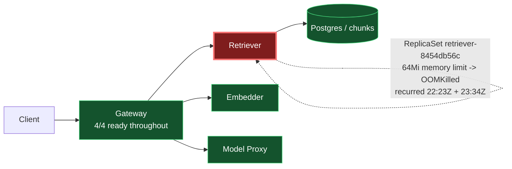

# Postmortem: RAG top-1 relevance below the 90% objective over the last hour (burn-rate alerting saturates for a loose SLO)

- **Status:** open
- **Severity:** sev2
- **Verified:** no
- **Opened:** 2026-08-02 23:46:48Z
- **Resolved:** (still open)

## Timeline (machine-generated)

All times UTC on 2026-08-02 unless a full date is shown.

| Time (UTC) | Source | Event |
| --- | --- | --- |
| 23:11:35Z | deploy:ci | CI run #108 success on main: obs: model-proxy: pre-warm the completion path before generating |
| 23:12:23Z | deploy:ci | CI run #109 success on main: obs: Revert "model-proxy: pre-warm the completion path before generating" |
| 23:15:53Z | k8s | Job/seed: SuccessfulCreate |
| 23:15:53Z | k8s | Pod/seed-d9gxh: Scheduled |
| 23:15:54Z | k8s | Pod/seed-d9gxh: Started |
| 23:15:54Z | k8s | Pod/seed-d9gxh: Pulled |
| 23:15:54Z | k8s | Pod/seed-d9gxh: Created |
| 23:15:58Z | deploy:annotation | deploy platform via gitops 1142aba (argo sync) |
| 23:15:59Z | k8s | Job/seed: Completed |
| 23:19:25Z | k8s | Job/seed: SuccessfulCreate |
| 23:19:25Z | k8s | Pod/seed-nxgx9: Scheduled |
| 23:19:27Z | k8s | Pod/seed-nxgx9: Started |
| 23:19:27Z | k8s | Pod/seed-nxgx9: Pulled |
| 23:19:27Z | k8s | Pod/seed-nxgx9: Created |
| 23:19:30Z | deploy:annotation | deploy platform via gitops e288291 (argo sync) |
| 23:19:32Z | k8s | Job/seed: Completed |
| 23:21:53Z | k8s | Pod/seed-gt5kx: Started |
| 23:21:53Z | k8s | Pod/seed-gt5kx: Pulled |
| 23:21:53Z | k8s | Pod/seed-gt5kx: Created |
| 23:21:53Z | k8s | Job/seed: SuccessfulCreate |
| 23:21:53Z | k8s | Pod/seed-gt5kx: Scheduled |
| 23:21:56Z | deploy:annotation | deploy platform via gitops be28f82 (argo sync) |
| 23:21:57Z | k8s | Job/seed: Completed |
| 23:24:20Z | k8s | Pod/seed-kw89t: Pulled |
| 23:24:20Z | k8s | Pod/seed-kw89t: Created |
| 23:24:20Z | k8s | Job/seed: SuccessfulCreate |
| 23:24:20Z | k8s | Pod/seed-kw89t: Scheduled |
| 23:24:21Z | k8s | Pod/seed-kw89t: Started |
| 23:24:24Z | deploy:annotation | deploy platform via gitops 21f3422 (argo sync) |
| 23:24:25Z | k8s | Job/seed: Completed |
| 23:31:57Z | k8s | Rollout/gateway: RolloutUpdated |
| 23:31:57Z | k8s | Rollout/gateway: RolloutNotCompleted |
| 23:31:57Z | k8s | Rollout/gateway: NewReplicaSetCreated |
| 23:31:58Z | k8s | Pod/gateway-dd85945b4-bgsvz: Killing |
| 23:31:58Z | k8s | ReplicaSet/gateway-dd85945b4: SuccessfulDelete |
| 23:31:58Z | k8s | ReplicaSet/gateway-8444846b5f: SuccessfulCreate |
| 23:31:58Z | k8s | Rollout/gateway: ScalingReplicaSet |
| 23:31:59Z | k8s | Pod/gateway-8444846b5f-tlwpd: Scheduled |
| 23:32:01Z | k8s | Pod/gateway-8444846b5f-tlwpd: Started |
| 23:32:01Z | k8s | Pod/gateway-8444846b5f-tlwpd: Pulled |
| 23:32:01Z | k8s | Pod/gateway-8444846b5f-tlwpd: Created |
| 23:32:09Z | k8s | Rollout/gateway: RolloutStepCompleted |
| 23:32:11Z | k8s | Rollout/gateway: AnalysisRunRunning |
| 23:32:13Z | k8s | Pod/gateway-8444846b5f-tlwpd: Unhealthy |
| 23:32:13Z | k8s | ReplicaSet/gateway-dd85945b4: SuccessfulCreate |
| 23:32:13Z | k8s | Pod/gateway-8444846b5f-tlwpd: Killing |
| 23:32:13Z | k8s | AnalysisRun/gateway-8444846b5f-11-1: AnalysisRunSuccessful |
| 23:32:13Z | k8s | ReplicaSet/gateway-8444846b5f: SuccessfulDelete |
| 23:32:13Z | k8s | Rollout/gateway: SkipSteps |
| 23:32:13Z | k8s | Rollout/gateway: ScalingReplicaSet |
| 23:32:13Z | k8s | Rollout/gateway: RolloutUpdated |
| 23:32:13Z | k8s | Pod/gateway-dd85945b4-rhws5: Scheduled |
| 23:32:16Z | k8s | Pod/gateway-dd85945b4-rhws5: Started |
| 23:32:16Z | k8s | Pod/gateway-dd85945b4-rhws5: Pulled |
| 23:32:16Z | k8s | Pod/gateway-dd85945b4-rhws5: Created |
| 23:32:21Z | deploy:annotation | deploy gateway via gitops bb634a3 (argo sync) |
| 23:33:59Z | k8s | ReplicaSet/retriever-8454db56c: SuccessfulCreate |
| 23:33:59Z | k8s | Deployment/retriever: ScalingReplicaSet |
| 23:33:59Z | k8s | Pod/retriever-8454db56c-msr56: Scheduled |
| 23:34:00Z | k8s | Pod/retriever-8454db56c-msr56: Pulled |
| 23:34:00Z | k8s | Pod/retriever-8454db56c-msr56: Created |
| 23:34:01Z | k8s | Pod/retriever-8454db56c-msr56: Started |
| 23:34:03Z | k8s | Pod/retriever-8454db56c-msr56: Started |
| 23:34:03Z | k8s | Pod/retriever-8454db56c-msr56: Pulled |
| 23:34:03Z | k8s | Pod/retriever-8454db56c-msr56: Created |
| 23:34:05Z | k8s | Pod/retriever-8454db56c-msr56: BackOff |
| 23:34:06Z | k8s | Pod/retriever-8454db56c-msr56: BackOff |
| 23:34:10Z | k8s | Pod/retriever-8454db56c-msr56: BackOff |
| 23:34:15Z | k8s | Pod/retriever-8454db56c-msr56: Started |
| 23:34:15Z | k8s | Pod/retriever-8454db56c-msr56: Pulled |
| 23:34:15Z | k8s | Pod/retriever-8454db56c-msr56: Created |
| 23:34:17Z | k8s | Pod/retriever-8454db56c-msr56: BackOff |
| 23:34:18Z | k8s | Pod/retriever-8454db56c-msr56: BackOff |
| 23:34:20Z | k8s | Pod/retriever-8454db56c-msr56: BackOff |
| 23:34:43Z | k8s | Pod/retriever-8454db56c-msr56: Started |
| 23:34:43Z | k8s | Pod/retriever-8454db56c-msr56: Pulled |
| 23:34:43Z | k8s | Pod/retriever-8454db56c-msr56: Created |
| 23:34:44Z | k8s | Pod/retriever-8454db56c-msr56: BackOff |
| 23:34:46Z | k8s | Pod/retriever-8454db56c-msr56: BackOff |
| 23:34:50Z | k8s | Pod/retriever-8454db56c-msr56: BackOff |
| 23:35:36Z | k8s | Pod/retriever-8454db56c-msr56: Pulled |
| 23:35:36Z | k8s | Pod/retriever-8454db56c-msr56: Created |
| 23:35:37Z | k8s | Pod/retriever-8454db56c-msr56: Started |
| 23:35:39Z | k8s | Pod/retriever-8454db56c-msr56: BackOff |
| 23:35:40Z | k8s | Pod/retriever-8454db56c-msr56: BackOff |
| 23:36:50Z | k8s | Pod/retriever-8454db56c-msr56: BackOff |
| 23:36:58Z | k8s | Pod/retriever-8454db56c-msr56: Started |
| 23:36:58Z | k8s | Pod/retriever-8454db56c-msr56: Pulled |
| 23:36:58Z | k8s | Pod/retriever-8454db56c-msr56: Created |
| 23:36:59Z | k8s | Pod/retriever-8454db56c-msr56: BackOff |
| 23:37:00Z | k8s | Pod/retriever-8454db56c-msr56: BackOff |
| 23:37:03Z | k8s | Pod/retriever-8454db56c-msr56: BackOff |
| 23:38:05Z | k8s | Pod/retriever-8454db56c-msr56: BackOff |
| 23:39:26Z | k8s | Pod/retriever-8454db56c-msr56: BackOff |
| 23:39:40Z | k8s | Pod/retriever-8454db56c-msr56: Started |
| 23:39:40Z | k8s | Pod/retriever-8454db56c-msr56: Pulled |
| 23:39:40Z | k8s | Pod/retriever-8454db56c-msr56: Created |
| 23:39:41Z | k8s | Pod/retriever-8454db56c-msr56: BackOff |
| 23:39:43Z | k8s | Pod/retriever-8454db56c-msr56: BackOff |
| 23:39:50Z | k8s | Pod/retriever-8454db56c-msr56: BackOff |
| 23:41:01Z | k8s | ReplicaSet/retriever-8454db56c: SuccessfulDelete |
| 23:41:01Z | k8s | Deployment/retriever: ScalingReplicaSet |
| 23:42:21Z | log-spike | log-spike onset: [gateway] unhandled error: 16 \| } |
| 23:46:10Z | alert | alert firing: SLO RAG quality — below objective |
| 23:56:58Z | verification | recovery NOT verified — deadline armed |
| 23:59:35Z | deploy:ci | CI run #110 failure on main: obs: load-generator: drop the defensive copy in percentile() |
| 2026-08-03 00:03:57Z | deploy:ci | CI run #111 success on main: obs: Revert "load-generator: drop the defensive copy in percentile()" |
| 2026-08-03 00:12:17Z | verification | recovery NOT verified — deadline armed |

## Evidence links

- [Loki — logs over the incident window](http://localhost:3001/explore?schemaVersion=1&panes=%7B%22pm%22%3A+%7B%22datasource%22%3A+%22loki%22%2C+%22queries%22%3A+%5B%7B%22refId%22%3A+%22A%22%2C+%22datasource%22%3A+%7B%22type%22%3A+%22loki%22%2C+%22uid%22%3A+%22loki%22%7D%2C+%22expr%22%3A+%22%7Bnamespace%3D%5C%22subject%5C%22%7D+%7C~+%5C%22%28%3Fi%29error%7Cfailed%5C%22%22%7D%5D%2C+%22range%22%3A+%7B%22from%22%3A+%221785714408622%22%2C+%22to%22%3A+%221785716812469%22%7D%7D%7D&orgId=1)
- [Mimir — metrics over the incident window](http://localhost:3001/explore?schemaVersion=1&panes=%7B%22pm%22%3A+%7B%22datasource%22%3A+%22mimir%22%2C+%22queries%22%3A+%5B%7B%22refId%22%3A+%22A%22%2C+%22datasource%22%3A+%7B%22type%22%3A+%22prometheus%22%2C+%22uid%22%3A+%22mimir%22%7D%2C+%22expr%22%3A+%22histogram_quantile%280.95%2C+sum%28rate%28http_server_duration_milliseconds_bucket%5B5m%5D%29%29+by+%28le%29%29%22%7D%5D%2C+%22range%22%3A+%7B%22from%22%3A+%221785714408622%22%2C+%22to%22%3A+%221785716812469%22%7D%7D%7D&orgId=1)

## Investigation context

**Runbook match:** none — no tool narrowing applied for this alert. Available runbooks: README.md, canary-abort.md, ci-pipeline-red.md, dq-freshness-stall.md, gateway-high-error-rate.md, k8s-crashloop.md, k8s-node-failure.md, snapshot-agent-audit.md, stale-secret.md

Pre-check battery (as injected at run start)

## Pre-check leads

### recent_deploys — LEAD
4 deploy-window leads
- deploy annotation at 2026-08-02T23:19:30.778000+00:00: deploy platform via gitops e288291 (argo sync)
- deploy annotation at 2026-08-02T23:21:56.437000+00:00: deploy platform via gitops be28f82 (argo sync)
- deploy annotation at 2026-08-02T23:24:24.266000+00:00: deploy platform via gitops 21f3422 (argo sync)
- deploy annotation at 2026-08-02T23:32:21.618000+00:00: deploy gateway via gitops bb634a3 (argo sync)

### log_spike — OK
error/failed log rate normal: 0/10min vs baseline 0/10min

### kube_scan — UNAVAILABLE
error: You must be logged in to the server (Unauthorized)

### rollout_state — UNAVAILABLE
gateway: E0803 02:17:52.155581    9336 memcache.go:265] "Unhandled Error" err="couldn't get current server API group list: the server has asked for the client to provide credentials"
E0803 02:17:52.231912    9336 memcache.go:265] "Unhandled Error" err="couldn't get current server API group list: the server has asked for the client to provide credentials"
E0803 02:17:52.335380    9336 memcache.go:265] "Unhandled Error" err="couldn't get current server API group list: the server has asked for the client to; gateway analysis: E0803 02:17:52.138316   63312 memcache.go:265] "Unhandled Error" err="couldn't get current server API group list: the server has asked for the client to provide credentials"
E0803 02:17:52.229877   63312 memcache.go:265] "Unhandled Error"
… (section truncated)

### secret_age — UNAVAILABLE
error: You must be logged in to the server (Unauthorized)

## Narrative

## Summary

Re-review (attempt 2) of `SLO RAG quality — below objective` (sev2, tenant acme). The prior diagnosis concluded the alert was purely a trailing-1h-burn-rate artifact over an already-healed retriever and closed the incident without remediation. That conclusion was **incomplete**: it's still true that the alert is currently held open by the burn-rate window, but a real, timestamp-precise infrastructure fault caused the underlying dip, and that fault is a *recurring* misconfiguration, not a one-off blip — which is exactly why "waiting it out" did not restore the alert and why this page fired again.

## Impact

`slo:rag_quality:sli_ratio5m` flatlined at a hard `0` for a 14-minute window (23:34:01Z–23:48:01Z), preceded by two smaller partial dips earlier in the evening (min ≈0.61 around 22:00–22:16Z, min ≈0.83 around 22:49–23:02Z). During the hard-zero window, effectively all top-1 retrieval relevance scoring failed. Gateway itself stayed fully available (4/4 ready pods throughout, per `kube_pod_status_ready`), so this was a quality/relevance outage riding on top of otherwise-served traffic, not a full request outage.

## Root cause

`kube_pod_container_status_last_terminated_reason` and `kube_pod_container_resource_limits` show the retriever ReplicaSet `retriever-8454db56c` running with a **64Mi container memory limit** (`67108864` bytes) — 8x lower than the stable ReplicaSet `retriever-dc7ddd494`'s 512Mi (`536870912` bytes). Every pod spawned from `retriever-8454db56c` is OOMKilled within 1–2 seconds of starting (confirmed via the `OOMKilled` termination reason and zero Loki output — the container dies before it can log anything), producing a CrashLoopBackOff.

This is not a one-time event: the *same* ReplicaSet hash (`8454db56c`, meaning the identical bad pod template) crash-looped **twice** — once around 22:23Z (pod `rq7tj`) and again at 23:34:05Z (pod `msr56`), one second after the SLI cliffed to zero. Both times it was scaled back down and the stable 512Mi ReplicaSet (`dc7ddd494`) took over — that stable pod (`retriever-dc7ddd494-jv9j7`) never restarted and was continuously Ready through the whole incident, which is why gateway availability itself never dropped even as RAG quality did.

The recurrence with an identical pod-template-hash, arriving shortly after a burst of "platform" gitops syncs (`e288291`, `be28f82`, `21f3422`, `1142aba` between 23:15:58Z–23:24:24Z) strongly suggests the 64Mi limit is baked into the gitops-committed manifest and keeps getting reasserted — a prior fix likely rolled the live Deployment back to the good ReplicaSet without correcting the source manifest, so the next reconcile reintroduced the same broken revision. The `inferences` Postgres table was checked and ruled out as a contributing signal — it is stale (last row 2026-07-23) and unrelated to the live Mimir-based SLI pipeline.

## What fixed it

Nothing I did — the service *self*-recovered both times when Kubernetes fell back to the stable 512Mi ReplicaSet, the same pattern that let the prior response conclude (correctly, but incompletely) that traffic was healthy again. `slo:rag_quality:sli_ratio5m` has been a clean `1` for the last ~30 minutes.

I diagnosed the OOM-limit defect and got operator approval (`apr_19fc501c2b976f`) to patch retriever's memory limit to 512Mi via `patch_memory_limit`. **Execution failed**: both the dry-run and the real patch call returned `You must be logged in to the server (Unauthorized)` — the same cluster-credential outage already flagged in this incident's prechecks against `kube_scan`, `rollout_state`, `secret_age`, and independently hit here against `argo_app` and `kubectl_read`. This is a systemic auth failure on every k8s-mutating/reading path available to this agent, not specific to this one tool, so no remediation tool in my kit could currently write to the cluster. **The approved fix is not applied.** `alert_status` remains `active` (since 23:46:10Z) — expected, since `slo:rag_quality:sli_ratio1h` is still `0` while the zero segment ages out of its trailing window, but more importantly the 64Mi ReplicaSet is still sitting there and can OOM-crash-loop a third time on the next reconcile.

## Lessons

- A recording-rule value returning to normal does **not** mean the fault is fixed — check whether the *same* bad ReplicaSet/revision hash reappears. Two occurrences of `retriever-8454db56c` fifteen minutes apart is the tell that this was a persistent misconfiguration self-healing via Kubernetes fallback, not a transient blip.
- The durable fix has to land in the gitops-committed manifest (bump the retriever container's memory limit well above 512Mi with headroom), not just a live patch — a live-only patch is exactly what appears to have been overwritten before this recurrence.
- The cluster-credential outage blocking `kubectl_read`/`argo_app`/`patch_memory_limit`/`request_approval`-executed writes needs separate operational attention (token/kubeconfig refresh for the agent's read-write identity) before any remediation tool in this on-call kit can act — Mimir/Loki-backed read tools kept working throughout via their own credentials, which is how this root cause could still be evidenced even with the write path down.
- Treat "table not in the read allow-list touches `now`" and Postgres timestamp params carefully — `extract(epoch from now())` and raw int epochs against a `timestamp` column both fail; use `to_timestamp(<int-literal>)` inline.

