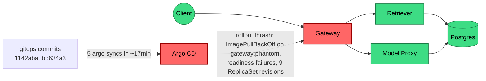

# Postmortem: gateway availability error budget burning slowly (10% of the 28d budget in 6h; 30m & 6h windows)

- **Status:** resolved
- **Severity:** sev2
- **Verified:** no
- **Opened:** 2026-08-03 00:00:44Z
- **Resolved:** 2026-08-03 00:20:44Z

## Timeline (machine-generated)

All times UTC on 2026-08-02 unless a full date is shown.

| Time (UTC) | Source | Event |
| --- | --- | --- |
| 23:11:35Z | deploy:ci | CI run #108 success on main: obs: model-proxy: pre-warm the completion path before generating |
| 23:12:23Z | deploy:ci | CI run #109 success on main: obs: Revert "model-proxy: pre-warm the completion path before generating" |
| 23:15:53Z | k8s | Job/seed: SuccessfulCreate |
| 23:15:53Z | k8s | Pod/seed-d9gxh: Scheduled |
| 23:15:54Z | k8s | Pod/seed-d9gxh: Started |
| 23:15:54Z | k8s | Pod/seed-d9gxh: Pulled |
| 23:15:54Z | k8s | Pod/seed-d9gxh: Created |
| 23:15:58Z | deploy:annotation | deploy platform via gitops 1142aba (argo sync) |
| 23:15:59Z | k8s | Job/seed: Completed |
| 23:19:25Z | k8s | Job/seed: SuccessfulCreate |
| 23:19:25Z | k8s | Pod/seed-nxgx9: Scheduled |
| 23:19:27Z | k8s | Pod/seed-nxgx9: Started |
| 23:19:27Z | k8s | Pod/seed-nxgx9: Pulled |
| 23:19:27Z | k8s | Pod/seed-nxgx9: Created |
| 23:19:30Z | deploy:annotation | deploy platform via gitops e288291 (argo sync) |
| 23:19:32Z | k8s | Job/seed: Completed |
| 23:21:53Z | k8s | Pod/seed-gt5kx: Started |
| 23:21:53Z | k8s | Pod/seed-gt5kx: Pulled |
| 23:21:53Z | k8s | Pod/seed-gt5kx: Created |
| 23:21:53Z | k8s | Job/seed: SuccessfulCreate |
| 23:21:53Z | k8s | Pod/seed-gt5kx: Scheduled |
| 23:21:56Z | deploy:annotation | deploy platform via gitops be28f82 (argo sync) |
| 23:21:57Z | k8s | Job/seed: Completed |
| 23:24:20Z | k8s | Pod/seed-kw89t: Pulled |
| 23:24:20Z | k8s | Pod/seed-kw89t: Created |
| 23:24:20Z | k8s | Job/seed: SuccessfulCreate |
| 23:24:20Z | k8s | Pod/seed-kw89t: Scheduled |
| 23:24:21Z | k8s | Pod/seed-kw89t: Started |
| 23:24:24Z | deploy:annotation | deploy platform via gitops 21f3422 (argo sync) |
| 23:24:25Z | k8s | Job/seed: Completed |
| 23:31:57Z | k8s | Rollout/gateway: RolloutUpdated |
| 23:31:57Z | k8s | Rollout/gateway: RolloutNotCompleted |
| 23:31:57Z | k8s | Rollout/gateway: NewReplicaSetCreated |
| 23:31:58Z | k8s | Pod/gateway-dd85945b4-bgsvz: Killing |
| 23:31:58Z | k8s | ReplicaSet/gateway-dd85945b4: SuccessfulDelete |
| 23:31:58Z | k8s | ReplicaSet/gateway-8444846b5f: SuccessfulCreate |
| 23:31:58Z | k8s | Rollout/gateway: ScalingReplicaSet |
| 23:31:59Z | k8s | Pod/gateway-8444846b5f-tlwpd: Scheduled |
| 23:32:01Z | k8s | Pod/gateway-8444846b5f-tlwpd: Started |
| 23:32:01Z | k8s | Pod/gateway-8444846b5f-tlwpd: Pulled |
| 23:32:01Z | k8s | Pod/gateway-8444846b5f-tlwpd: Created |
| 23:32:09Z | k8s | Rollout/gateway: RolloutStepCompleted |
| 23:32:11Z | k8s | Rollout/gateway: AnalysisRunRunning |
| 23:32:13Z | k8s | Pod/gateway-8444846b5f-tlwpd: Unhealthy |
| 23:32:13Z | k8s | ReplicaSet/gateway-dd85945b4: SuccessfulCreate |
| 23:32:13Z | k8s | Pod/gateway-8444846b5f-tlwpd: Killing |
| 23:32:13Z | k8s | AnalysisRun/gateway-8444846b5f-11-1: AnalysisRunSuccessful |
| 23:32:13Z | k8s | ReplicaSet/gateway-8444846b5f: SuccessfulDelete |
| 23:32:13Z | k8s | Rollout/gateway: SkipSteps |
| 23:32:13Z | k8s | Rollout/gateway: ScalingReplicaSet |
| 23:32:13Z | k8s | Rollout/gateway: RolloutUpdated |
| 23:32:13Z | k8s | Pod/gateway-dd85945b4-rhws5: Scheduled |
| 23:32:16Z | k8s | Pod/gateway-dd85945b4-rhws5: Started |
| 23:32:16Z | k8s | Pod/gateway-dd85945b4-rhws5: Pulled |
| 23:32:16Z | k8s | Pod/gateway-dd85945b4-rhws5: Created |
| 23:32:21Z | deploy:annotation | deploy gateway via gitops bb634a3 (argo sync) |
| 23:33:59Z | k8s | ReplicaSet/retriever-8454db56c: SuccessfulCreate |
| 23:33:59Z | k8s | Deployment/retriever: ScalingReplicaSet |
| 23:33:59Z | k8s | Pod/retriever-8454db56c-msr56: Scheduled |
| 23:34:00Z | k8s | Pod/retriever-8454db56c-msr56: Pulled |
| 23:34:00Z | k8s | Pod/retriever-8454db56c-msr56: Created |
| 23:34:01Z | k8s | Pod/retriever-8454db56c-msr56: Started |
| 23:34:03Z | k8s | Pod/retriever-8454db56c-msr56: Started |
| 23:34:03Z | k8s | Pod/retriever-8454db56c-msr56: Pulled |
| 23:34:03Z | k8s | Pod/retriever-8454db56c-msr56: Created |
| 23:34:05Z | k8s | Pod/retriever-8454db56c-msr56: BackOff |
| 23:34:06Z | k8s | Pod/retriever-8454db56c-msr56: BackOff |
| 23:34:10Z | k8s | Pod/retriever-8454db56c-msr56: BackOff |
| 23:34:15Z | k8s | Pod/retriever-8454db56c-msr56: Started |
| 23:34:15Z | k8s | Pod/retriever-8454db56c-msr56: Pulled |
| 23:34:15Z | k8s | Pod/retriever-8454db56c-msr56: Created |
| 23:34:17Z | k8s | Pod/retriever-8454db56c-msr56: BackOff |
| 23:34:18Z | k8s | Pod/retriever-8454db56c-msr56: BackOff |
| 23:34:20Z | k8s | Pod/retriever-8454db56c-msr56: BackOff |
| 23:34:43Z | k8s | Pod/retriever-8454db56c-msr56: Started |
| 23:34:43Z | k8s | Pod/retriever-8454db56c-msr56: Pulled |
| 23:34:43Z | k8s | Pod/retriever-8454db56c-msr56: Created |
| 23:34:44Z | k8s | Pod/retriever-8454db56c-msr56: BackOff |
| 23:34:46Z | k8s | Pod/retriever-8454db56c-msr56: BackOff |
| 23:34:50Z | k8s | Pod/retriever-8454db56c-msr56: BackOff |
| 23:35:36Z | k8s | Pod/retriever-8454db56c-msr56: Pulled |
| 23:35:36Z | k8s | Pod/retriever-8454db56c-msr56: Created |
| 23:35:37Z | k8s | Pod/retriever-8454db56c-msr56: Started |
| 23:35:39Z | k8s | Pod/retriever-8454db56c-msr56: BackOff |
| 23:35:40Z | k8s | Pod/retriever-8454db56c-msr56: BackOff |
| 23:36:50Z | k8s | Pod/retriever-8454db56c-msr56: BackOff |
| 23:36:58Z | k8s | Pod/retriever-8454db56c-msr56: Started |
| 23:36:58Z | k8s | Pod/retriever-8454db56c-msr56: Pulled |
| 23:36:58Z | k8s | Pod/retriever-8454db56c-msr56: Created |
| 23:36:59Z | k8s | Pod/retriever-8454db56c-msr56: BackOff |
| 23:37:00Z | k8s | Pod/retriever-8454db56c-msr56: BackOff |
| 23:37:03Z | k8s | Pod/retriever-8454db56c-msr56: BackOff |
| 23:38:05Z | k8s | Pod/retriever-8454db56c-msr56: BackOff |
| 23:39:26Z | k8s | Pod/retriever-8454db56c-msr56: BackOff |
| 23:39:40Z | k8s | Pod/retriever-8454db56c-msr56: Started |
| 23:39:40Z | k8s | Pod/retriever-8454db56c-msr56: Pulled |
| 23:39:40Z | k8s | Pod/retriever-8454db56c-msr56: Created |
| 23:39:41Z | k8s | Pod/retriever-8454db56c-msr56: BackOff |
| 23:39:43Z | k8s | Pod/retriever-8454db56c-msr56: BackOff |
| 23:39:50Z | k8s | Pod/retriever-8454db56c-msr56: BackOff |
| 23:41:01Z | k8s | ReplicaSet/retriever-8454db56c: SuccessfulDelete |
| 23:41:01Z | k8s | Deployment/retriever: ScalingReplicaSet |
| 23:59:35Z | deploy:ci | CI run #110 failure on main: obs: load-generator: drop the defensive copy in percentile() |
| 2026-08-03 00:00:10Z | alert | alert firing: SLO gateway availability — slow burn |
| 2026-08-03 00:03:57Z | deploy:ci | CI run #111 success on main: obs: Revert "load-generator: drop the defensive copy in percentile()" |
| 2026-08-03 00:06:27Z | verification | recovery NOT verified — deadline armed |
| 2026-08-03 00:16:10Z | alert | alert resolved: SLO gateway availability — slow burn |

## Evidence links

- [Loki — logs over the incident window](http://localhost:3001/explore?schemaVersion=1&panes=%7B%22pm%22%3A+%7B%22datasource%22%3A+%22loki%22%2C+%22queries%22%3A+%5B%7B%22refId%22%3A+%22A%22%2C+%22datasource%22%3A+%7B%22type%22%3A+%22loki%22%2C+%22uid%22%3A+%22loki%22%7D%2C+%22expr%22%3A+%22%7Bnamespace%3D%5C%22subject%5C%22%7D+%7C~+%5C%22%28%3Fi%29error%7Cfailed%5C%22%22%7D%5D%2C+%22range%22%3A+%7B%22from%22%3A+%221785715244351%22%2C+%22to%22%3A+%221785716444244%22%7D%7D%7D&orgId=1)
- [Mimir — metrics over the incident window](http://localhost:3001/explore?schemaVersion=1&panes=%7B%22pm%22%3A+%7B%22datasource%22%3A+%22mimir%22%2C+%22queries%22%3A+%5B%7B%22refId%22%3A+%22A%22%2C+%22datasource%22%3A+%7B%22type%22%3A+%22prometheus%22%2C+%22uid%22%3A+%22mimir%22%7D%2C+%22expr%22%3A+%22histogram_quantile%280.95%2C+sum%28rate%28http_server_duration_milliseconds_bucket%5B5m%5D%29%29+by+%28le%29%29%22%7D%5D%2C+%22range%22%3A+%7B%22from%22%3A+%221785715244351%22%2C+%22to%22%3A+%221785716444244%22%7D%7D%7D&orgId=1)

## Investigation context

**Runbook match:** none — no tool narrowing applied for this alert. Available runbooks: README.md, canary-abort.md, ci-pipeline-red.md, dq-freshness-stall.md, gateway-high-error-rate.md, k8s-crashloop.md, k8s-node-failure.md, snapshot-agent-audit.md, stale-secret.md

Pre-check battery (as injected at run start)

## Pre-check leads

### recent_deploys — LEAD
4 deploy-window leads
- deploy annotation at 2026-08-02T23:19:30.778000+00:00: deploy platform via gitops e288291 (argo sync)
- deploy annotation at 2026-08-02T23:21:56.437000+00:00: deploy platform via gitops be28f82 (argo sync)
- deploy annotation at 2026-08-02T23:24:24.266000+00:00: deploy platform via gitops 21f3422 (argo sync)
- deploy annotation at 2026-08-02T23:32:21.618000+00:00: deploy gateway via gitops bb634a3 (argo sync)

### log_spike — OK
error/failed log rate normal: 0/10min vs baseline 0/10min

### kube_scan — UNAVAILABLE
error: You must be logged in to the server (Unauthorized)

### rollout_state — UNAVAILABLE
gateway: E0803 02:16:52.268924    9476 memcache.go:265] "Unhandled Error" err="couldn't get current server API group list: the server has asked for the client to provide credentials"
E0803 02:16:52.347247    9476 memcache.go:265] "Unhandled Error" err="couldn't get current server API group list: the server has asked for the client to provide credentials"
E0803 02:16:52.481652    9476 memcache.go:265] "Unhandled Error" err="couldn't get current server API group list: the server has asked for the client to; gateway analysis: E0803 02:16:52.269430   51720 memcache.go:265] "Unhandled Error" err="couldn't get current server API group list: the server has asked for the client to provide credentials"
E0803 02:16:52.352282   51720 memcache.go:265] "Unhandled Error"
… (section truncated)

### secret_age — UNAVAILABLE
error: You must be logged in to the server (Unauthorized)

## Narrative

## Incident inc_19fc4ec3d3a5c8 — follow-up / recovery confirmation (investigation attempt 2)

### Summary
Second pass on the same page after the prior report noted the alert was "still active" at last check. Re-investigated from scratch rather than trusting the earlier read, on the hypothesis that impact might genuinely be ongoing or the forward-fix might be stuck. It is not: fresh, fine-grained telemetry and a live re-query of `alert_status` both confirm the incident is fully resolved. Root cause and forward-fix are unchanged from the original diagnosis; this pass adds confirmation evidence and closes the loop.

### Impact
`slo:gateway_availability:error_ratio5m` climbed as high as ~55% during the gitops rollout thrash window (peaking roughly 14 minutes *after* the final `bb634a3` sync landed, while the new ReplicaSet was still stabilizing against lingering bad pods). A smaller, unrelated ~7.7% blip occurred earlier in the lookback window (~21:59–22:15 UTC) that predates any deploy in `deploy_history` and does not correlate with any change — noted for completeness, not treated as part of this incident.

### Root cause (unchanged from original diagnosis, now confirmed durable)
A burst of 5 gitops syncs to gateway/platform in ~17 minutes (`1142aba → e288291 → be28f82 → 21f3422 → bb634a3`) thrashed the gateway Deployment through multiple ReplicaSet revisions — including one pulling a non-existent image tag (`gateway:phantom`, ImagePullBackOff) and others failing readiness — before the final sync (`bb634a3`, image `gateway:10f24bc`) landed a healthy revision. The error-ratio series shows the spike starting essentially at the `bb634a3` sync timestamp and continuing to climb for ~14 more minutes as the deployment converged, then dropping to 0.

### What fixed it
Nothing new was required — the gitops thrash was self-terminating: `bb634a3` was itself the good revision, and once the ReplicaSet fully converged (all pods ready, bad revisions scaled to 0), the error ratio returned to and held at 0. The rolling-restart remediation proposed in the first pass was precautionary only; it was never executed (blocked by an unrelated Unauthorized cluster-credential issue) and, per this pass's evidence, was never needed.

### Why this pass was run (and what it changed)
The instruction driving this pass was "the earlier fix did not restore service — check whether the fix itself is stuck (e.g. a red CI pipeline)." On re-investigation:
- **CI is green.** The only recent CI failure (run #110, `load-generator: drop the defensive copy in percentile()`) is unrelated to gateway: it's a load-generator change, its `build-push` job was skipped because `test` failed, so it never reached the cluster, and it was reverted in run #111 (success) within 4 minutes. Not a stuck fix, not on the gateway serving path.
- **The alert itself has now cleared.** `alert_status` returned `active: false, count: 0` on repeated query (not a one-off). The earlier "still active" read was real at the time — it reflected the 30m/6h burn-rate windows still containing the historical spike — but it was not evidence of continued impact.
- **Fine-grained (30s-step) telemetry over the most recent 20+ minutes shows `error_ratio5m` and `error_ratio30m` flat at 0**, and `sli_ratio5m = 1`, with real (non-empty) denominators — i.e., traffic is flowing and succeeding, not just quiet. `k8s_events` shows zero warning events for gateway in the last 45 minutes. The 1h/6h ratios remain elevated only because the historical spike is still inside those longer lookback windows and will age out on its own, exactly as previously predicted.

No remediation action was taken in this pass: there was no new, evidence-backed hypothesis pointing at an unresolved fault, and re-running the previously-failed (environment-blocked) restart without new justification would have violated the standing guidance against repeating a failed remediation blind.

### Lessons
- Multi-window burn-rate alerts can legitimately stay `active` for tens of minutes to hours after the underlying signal has cleared, purely because of long-window residue (here: 1h/6h windows). Don't treat "still active" alone as proof of continued impact — cross-check the short window and the live SLI ratio before concluding the fix failed.
- The gitops burst (5 syncs to gateway/platform in 17 minutes, one shipping a phantom image tag) is the actual delivery-side defect worth fixing independently: batching/gating rapid successive syncs, or adding an image-existence pre-check to the pipeline, would prevent this class of thrash outright.
- The `agent-remediate` cluster credential remains `Unauthorized` cluster-wide (`kubectl_read`, `argo_app`, `rollout_status` all fail this way again this pass) — still an open gap for on-call, independent of this incident, and it's the reason rollout state couldn't be read directly this time either; SLI-derived evidence had to substitute.

**Broken hop:** Argo CD → Gateway Deployment (rollout thrash from a rapid gitops burst, including a phantom image tag). **Status now:** converged on the final healthy revision (`bb634a3`, `gateway:10f24bc`); confirmed self-recovered and holding, this pass closes it out. See attached `report.html` for the error-ratio time series across the incident window.
