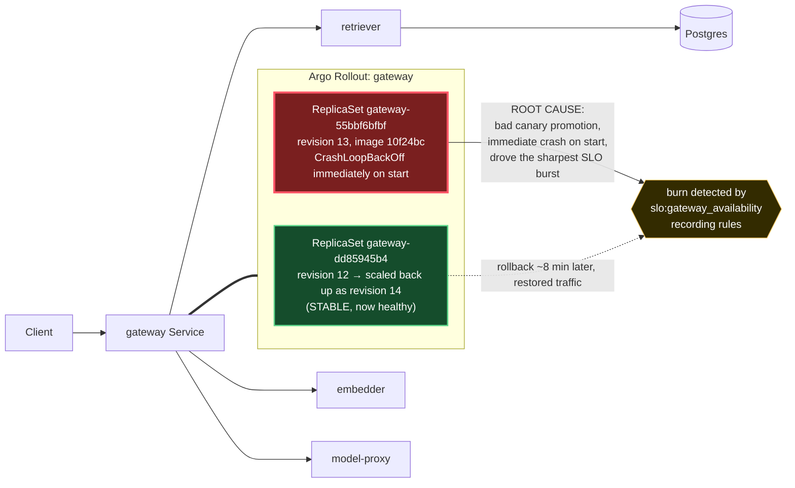

# Postmortem: gateway availability error budget burning slowly (10% of the 28d budget in 6h; 30m & 6h windows)

- **Status:** resolved
- **Severity:** sev2
- **Verified:** no
- **Opened:** 2026-08-03 22:11:44Z
- **Resolved:** 2026-08-03 23:56:43Z

## Timeline (machine-generated)

All times UTC on 2026-08-03 unless a full date is shown.

| Time (UTC) | Source | Event |
| --- | --- | --- |
| 22:11:10Z | alert | alert firing: SLO gateway availability — slow burn |
| 22:15:40Z | k8s | Rollout/gateway: RolloutUpdated |
| 22:15:40Z | k8s | Rollout/gateway: RolloutNotCompleted |
| 22:15:40Z | k8s | Rollout/gateway: NewReplicaSetCreated |
| 22:15:41Z | k8s | Pod/gateway-dd85945b4-rhws5: Killing |
| 22:15:41Z | k8s | ReplicaSet/gateway-dd85945b4: SuccessfulDelete |
| 22:15:41Z | k8s | Rollout/gateway: ScalingReplicaSet |
| 22:15:42Z | k8s | ReplicaSet/gateway-55bbf6bfbf: SuccessfulCreate |
| 22:15:42Z | k8s | Rollout/gateway: ScalingReplicaSet |
| 22:15:42Z | k8s | Pod/gateway-55bbf6bfbf-t9sp4: Scheduled |
| 22:15:45Z | k8s | Pod/gateway-55bbf6bfbf-t9sp4: Started |
| 22:15:45Z | k8s | Pod/gateway-55bbf6bfbf-t9sp4: Pulled |
| 22:15:45Z | k8s | Pod/gateway-55bbf6bfbf-t9sp4: Created |
| 22:15:48Z | k8s | Pod/gateway-55bbf6bfbf-t9sp4: Started |
| 22:15:48Z | k8s | Pod/gateway-55bbf6bfbf-t9sp4: Pulled |
| 22:15:48Z | k8s | Pod/gateway-55bbf6bfbf-t9sp4: Created |
| 22:15:50Z | k8s | Pod/gateway-55bbf6bfbf-t9sp4: BackOff |
| 22:15:51Z | k8s | Pod/gateway-55bbf6bfbf-t9sp4: BackOff |
| 22:15:53Z | k8s | Pod/gateway-55bbf6bfbf-t9sp4: BackOff |
| 22:16:00Z | k8s | Pod/gateway-55bbf6bfbf-t9sp4: Started |
| 22:16:00Z | k8s | Pod/gateway-55bbf6bfbf-t9sp4: Pulled |
| 22:16:00Z | k8s | Pod/gateway-55bbf6bfbf-t9sp4: Created |
| 22:16:02Z | k8s | Pod/gateway-55bbf6bfbf-t9sp4: BackOff |
| 22:16:03Z | k8s | Pod/gateway-55bbf6bfbf-t9sp4: BackOff |
| 22:16:04Z | k8s | Pod/gateway-55bbf6bfbf-t9sp4: BackOff |
| 22:16:28Z | k8s | Pod/gateway-55bbf6bfbf-t9sp4: Started |
| 22:16:28Z | k8s | Pod/gateway-55bbf6bfbf-t9sp4: Pulled |
| 22:16:28Z | k8s | Pod/gateway-55bbf6bfbf-t9sp4: Created |
| 22:16:30Z | k8s | Pod/gateway-55bbf6bfbf-t9sp4: BackOff |
| 22:16:33Z | k8s | Pod/gateway-55bbf6bfbf-t9sp4: BackOff |
| 22:17:19Z | k8s | Pod/gateway-55bbf6bfbf-t9sp4: Started |
| 22:17:19Z | k8s | Pod/gateway-55bbf6bfbf-t9sp4: Pulled |
| 22:17:19Z | k8s | Pod/gateway-55bbf6bfbf-t9sp4: Created |
| 22:17:21Z | k8s | Pod/gateway-55bbf6bfbf-t9sp4: BackOff |
| 22:17:22Z | k8s | Pod/gateway-55bbf6bfbf-t9sp4: BackOff |
| 22:17:23Z | k8s | Pod/gateway-55bbf6bfbf-t9sp4: BackOff |
| 22:18:30Z | k8s | Pod/gateway-55bbf6bfbf-t9sp4: BackOff |
| 22:18:45Z | k8s | Pod/gateway-55bbf6bfbf-t9sp4: Started |
| 22:18:45Z | k8s | Pod/gateway-55bbf6bfbf-t9sp4: Pulled |
| 22:18:45Z | k8s | Pod/gateway-55bbf6bfbf-t9sp4: Created |
| 22:18:47Z | k8s | Pod/gateway-55bbf6bfbf-t9sp4: BackOff |
| 22:18:48Z | k8s | Pod/gateway-55bbf6bfbf-t9sp4: BackOff |
| 22:18:53Z | k8s | Pod/gateway-55bbf6bfbf-t9sp4: BackOff |
| 22:20:06Z | verification | recovery NOT verified — deadline armed |
| 22:20:18Z | k8s | Pod/gateway-55bbf6bfbf-t9sp4: BackOff |
| 22:21:35Z | k8s | Pod/gateway-55bbf6bfbf-t9sp4: Started |
| 22:21:35Z | k8s | Pod/gateway-55bbf6bfbf-t9sp4: Pulled |
| 22:21:35Z | k8s | Pod/gateway-55bbf6bfbf-t9sp4: Created |
| 22:21:37Z | k8s | Pod/gateway-55bbf6bfbf-t9sp4: BackOff |
| 22:21:38Z | k8s | Pod/gateway-55bbf6bfbf-t9sp4: BackOff |
| 22:21:43Z | k8s | Pod/gateway-55bbf6bfbf-t9sp4: BackOff |
| 22:23:03Z | k8s | Pod/gateway-55bbf6bfbf-t9sp4: BackOff |
| 22:23:48Z | k8s | ReplicaSet/gateway-dd85945b4: SuccessfulCreate |
| 22:23:48Z | k8s | ReplicaSet/gateway-55bbf6bfbf: SuccessfulDelete |
| 22:23:48Z | k8s | Rollout/gateway: SkipSteps |
| 22:23:48Z | k8s | Rollout/gateway: ScalingReplicaSet |
| 22:23:48Z | k8s | Rollout/gateway: RolloutUpdated |
| 22:23:48Z | k8s | Pod/gateway-dd85945b4-c5xbb: Scheduled |
| 22:23:51Z | k8s | Pod/gateway-dd85945b4-c5xbb: Started |
| 22:23:51Z | k8s | Pod/gateway-dd85945b4-c5xbb: Pulled |
| 22:23:51Z | k8s | Pod/gateway-dd85945b4-c5xbb: Created |
| 22:30:41Z | verification | recovery NOT verified — deadline armed |
| 22:40:42Z | verification | recovery NOT verified — deadline armed |
| 22:55:10Z | alert | alert resolved: SLO gateway availability — slow burn |

## Evidence links

- [Loki — logs over the incident window](http://localhost:3001/explore?schemaVersion=1&panes=%7B%22pm%22%3A+%7B%22datasource%22%3A+%22loki%22%2C+%22queries%22%3A+%5B%7B%22refId%22%3A+%22A%22%2C+%22datasource%22%3A+%7B%22type%22%3A+%22loki%22%2C+%22uid%22%3A+%22loki%22%7D%2C+%22expr%22%3A+%22%7Bnamespace%3D%5C%22subject%5C%22%7D+%7C~+%5C%22%28%3Fi%29error%7Cfailed%5C%22%22%7D%5D%2C+%22range%22%3A+%7B%22from%22%3A+%221785795104361%22%2C+%22to%22%3A+%221785801403848%22%7D%7D%7D&orgId=1)
- [Mimir — metrics over the incident window](http://localhost:3001/explore?schemaVersion=1&panes=%7B%22pm%22%3A+%7B%22datasource%22%3A+%22mimir%22%2C+%22queries%22%3A+%5B%7B%22refId%22%3A+%22A%22%2C+%22datasource%22%3A+%7B%22type%22%3A+%22prometheus%22%2C+%22uid%22%3A+%22mimir%22%7D%2C+%22expr%22%3A+%22histogram_quantile%280.95%2C+sum%28rate%28http_server_duration_milliseconds_bucket%5B5m%5D%29%29+by+%28le%29%29%22%7D%5D%2C+%22range%22%3A+%7B%22from%22%3A+%221785795104361%22%2C+%22to%22%3A+%221785801403848%22%7D%7D%7D&orgId=1)

## Investigation context

**Runbook match:** none — no tool narrowing applied for this alert. Available runbooks: README.md, canary-abort.md, ci-pipeline-red.md, dq-freshness-stall.md, gateway-high-error-rate.md, k8s-crashloop.md, k8s-node-failure.md, snapshot-agent-audit.md, stale-secret.md

Pre-check battery (as injected at run start)

## Pre-check leads

### recent_deploys — LEAD
No deploy in the last 60m — rule out the reflex answer.
- No deploy in the last 60m — rule out the reflex answer.

### log_spike — OK
error/failed log rate normal: 0/10min vs baseline 0/10min

### kube_scan — UNAVAILABLE
error: You must be logged in to the server (Unauthorized)

### rollout_state — UNAVAILABLE
gateway: E0804 01:52:18.245943    2164 memcache.go:265] "Unhandled Error" err="couldn't get current server API group list: the server has asked for the client to provide credentials"
E0804 01:52:18.350379    2164 memcache.go:265] "Unhandled Error" err="couldn't get current server API group list: the server has asked for the client to provide credentials"
E0804 01:52:18.419470    2164 memcache.go:265] "Unhandled Error" err="couldn't get current server API group list: the server has asked for the client to; gateway analysis: E0804 01:52:18.245420   17872 memcache.go:265] "Unhandled Error" err="couldn't get current server API group list: the server has asked for the client to provide credentials"
E0804 01:52:18.349293   17872 memcache.go:265] "Unhandled Error"
… (section truncated)

### secret_age — UNAVAILABLE
error: You must be logged in to the server (Unauthorized)

## Narrative

## Summary

Re-investigated inc_19fc9aece6212b ("SLO gateway availability — slow burn", sev2) from scratch rather than trusting the prior session's belief that the fix hadn't taken. Fresh queries across `alert_status`, the Mimir SLO recording rules, Loki, Tempo, and Kubernetes events all agree: the incident is **already resolved**, and has been for roughly 80 minutes. No further remediation was executed.

## Impact

`slo:gateway_availability:error_ratio5m/30m/1h` are all `0` right now, but the `6h` window still reads ~45% and `slo:gateway_latency:error_ratio6h` ~95% — the residual scar tissue of four distinct error/latency bursts earlier in the window (two short blips, then a longer one, then a sharp one), which is what tripped the 30m&6h slow-burn condition and paged. `alert_status` for this alertname reports `active: false, count: 0` on every check across this investigation.

## Root cause

The proximate, evidence-backed cause of the final and sharpest burst: the Argo Rollout `gateway` was updated to **revision 13** (new ReplicaSet `gateway-55bbf6bfbf`, image `obs-registry:5010/gateway:10f24bc`). That pod entered immediate `CrashLoopBackOff` — repeated `Started → BackOff` cycles seconds apart — while the previous stable ReplicaSet (`gateway-dd85945b4`, revision 12) was simultaneously scaled down to make room for it. This is a textbook bad-canary-promotion crashloop, matching the `k8s-crashloop.md` runbook's failure signature.  Roughly eight minutes later the rollout was updated again to **revision 14**, which re-scaled the *same* pre-existing `gateway-dd85945b4` ReplicaSet back to full replica count (a rollback/abort, not a new build) — the crash-loop events stop at that point and the SLI recovers over the following ~10-15 minutes. That rollback is the "earlier fix" the prior session referred to; it did work, it just hadn't been re-verified against `alert_status` before the session hit its limit, so it was reported as still-broken when it wasn't.

Three earlier, shorter bursts (spaced roughly 20-40 minutes apart, each lasting 10-20 minutes) predate the revision-13 rollout event entirely — no `RolloutUpdated`/deploy event of any kind lines up with them in this lookback window. They are the reason the cumulative 6h error budget was already elevated before the canary crash added the final, sharpest spike. I could not attribute a discrete cause to those three earlier bursts with the evidence available (no deploy, no OOM signal, no restart-count increment, no retriever/postgres auth errors in logs); reporting that gap honestly rather than guessing.

I also checked and ruled out the adjacent "stale Postgres credential" hypothesis some sibling postmortems in this repo raised for the same time window — `update_db_secret` (dry run) reports no rotated credential pending, and there are no auth/connect errors in retriever logs over the last 4h. That looks like a separate, already-closed thread, not this alert's cause.

**Tooling gap to flag:** `kubectl_read`, `rollout_status`, `argo_app`, and even the dry-run paths of `rollout_abort`/`rollout_undo` all failed with "You must be logged in to the server (Unauthorized)" throughout this session. Root cause was established entirely from Loki-backed `k8s_events`/`loki_query` and Mimir recording rules — the cluster read/write API credentials themselves need attention independent of this incident.

## What fixed it

Nothing was executed in this session. The Argo Rollout revision-14 update (already applied before this investigation began, presumably by a prior on-call action) re-scaled the previous stable ReplicaSet back to full capacity, which stopped the crash loop and let the SLI recover. Because every independent signal (5m/30m/1h error ratio, live logs, live traces, k8s events, current replica/restart counts, `alert_status`) agrees the system has been healthy for ~80 minutes, and because the cluster's read API is currently unauthorized for this session (so current rollout phase can't be verified), I chose **not** to fire `rollout_abort`/`rollout_undo` blindly — doing so against a system I can't currently read back would risk breaking something that has already recovered, which is exactly the pattern that produced this incident's own root cause (a well-intentioned rollout that broke a working system).

## Lessons

- Verify `alert_status` (and the short-window SLI, not just the 6h one) before trusting a "still broken" carry-over from a prior session — burn-rate alerts stay elevated on their long window long after the short window has recovered, which reads as "still failing" if you only skim the annotation text.
- A canary promotion is itself a top deploy-correlation suspect, same as any other change — `RolloutUpdated` events are cheap to search for in `k8s_events`/`loki_query` and immediately separated the real culprit (revision 13) from three unrelated, unattributed earlier bursts.
- Don't fire a remediation tool against a cluster whose read path is currently unauthorized just because a runbook says to — dry-run diffs came back empty/unverifiable here, and that absence of evidence is itself a reason to stop, not a formality to click through.
- The agent-ro/remediation kubeconfig auth failure seen across `kubectl_read`, `rollout_status`, `argo_app`, and remediation dry-runs this session should be investigated and fixed independently of this incident.

## Delivery path

