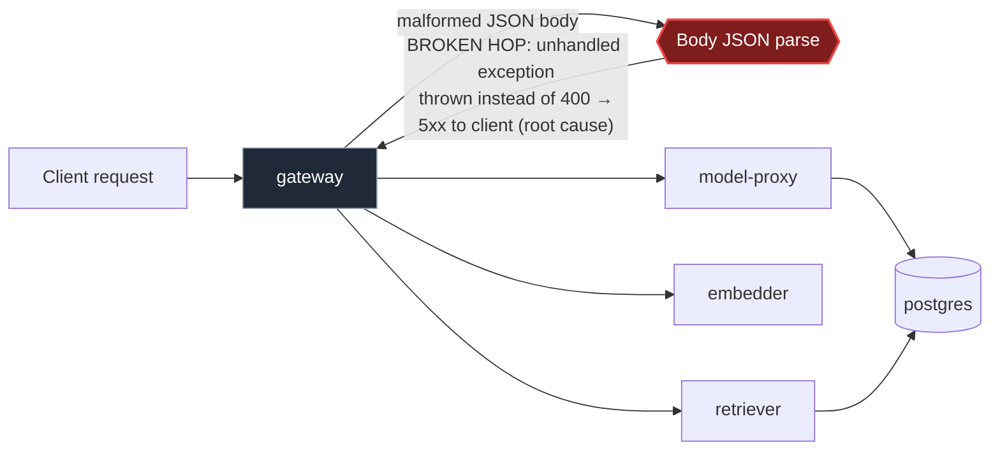

# Postmortem: gateway availability error budget burning slowly (10% of the 28d budget in 6h; 30m & 6h windows)

- **Status:** open
- **Severity:** sev2
- **Verified:** no
- **Opened:** 2026-08-03 20:26:44Z
- **Resolved:** (still open)

## Timeline (machine-generated)

All times UTC on 2026-08-03 unless a full date is shown.

| Time (UTC) | Source | Event |
| --- | --- | --- |
| 20:26:10Z | alert | alert firing: SLO gateway availability — slow burn |

## Evidence links

- [Loki — logs over the incident window](http://localhost:3001/explore?schemaVersion=1&panes=%7B%22pm%22%3A+%7B%22datasource%22%3A+%22loki%22%2C+%22queries%22%3A+%5B%7B%22refId%22%3A+%22A%22%2C+%22datasource%22%3A+%7B%22type%22%3A+%22loki%22%2C+%22uid%22%3A+%22loki%22%7D%2C+%22expr%22%3A+%22%7Bnamespace%3D%5C%22subject%5C%22%7D+%7C~+%5C%22%28%3Fi%29error%7Cfailed%5C%22%22%7D%5D%2C+%22range%22%3A+%7B%22from%22%3A+%221785788804787%22%2C+%22to%22%3A+%221785789126367%22%7D%7D%7D&orgId=1)
- [Mimir — metrics over the incident window](http://localhost:3001/explore?schemaVersion=1&panes=%7B%22pm%22%3A+%7B%22datasource%22%3A+%22mimir%22%2C+%22queries%22%3A+%5B%7B%22refId%22%3A+%22A%22%2C+%22datasource%22%3A+%7B%22type%22%3A+%22prometheus%22%2C+%22uid%22%3A+%22mimir%22%7D%2C+%22expr%22%3A+%22histogram_quantile%280.95%2C+sum%28rate%28http_server_duration_milliseconds_bucket%5B5m%5D%29%29+by+%28le%29%29%22%7D%5D%2C+%22range%22%3A+%7B%22from%22%3A+%221785788804787%22%2C+%22to%22%3A+%221785789126367%22%7D%7D%7D&orgId=1)

## Investigation context

**Runbook match:** none — no tool narrowing applied for this alert. Available runbooks: README.md, canary-abort.md, ci-pipeline-red.md, dq-freshness-stall.md, gateway-high-error-rate.md, k8s-crashloop.md, k8s-node-failure.md, snapshot-agent-audit.md, stale-secret.md

Pre-check battery (as injected at run start)

## Pre-check leads

### recent_deploys — LEAD
No deploy in the last 60m — rule out the reflex answer.
- No deploy in the last 60m — rule out the reflex answer.

### log_spike — OK
error/failed log rate normal: 0/10min vs baseline 0/10min

### kube_scan — UNAVAILABLE
error: You must be logged in to the server (Unauthorized)

### rollout_state — UNAVAILABLE
gateway: E0803 22:26:59.660128    2440 memcache.go:265] "Unhandled Error" err="couldn't get current server API group list: the server has asked for the client to provide credentials"
E0803 22:27:00.148145    2440 memcache.go:265] "Unhandled Error" err="couldn't get current server API group list: the server has asked for the client to provide credentials"
E0803 22:27:00.423003    2440 memcache.go:265] "Unhandled Error" err="couldn't get current server API group list: the server has asked for the client to; gateway analysis: E0803 22:26:59.529562    5952 memcache.go:265] "Unhandled Error" err="couldn't get current server API group list: the server has asked for the client to provide credentials"
E0803 22:27:00.146937    5952 memcache.go:265] "Unhandled Error"
… (section truncated)

### secret_age — UNAVAILABLE
error: You must be logged in to the server (Unauthorized)

## Narrative

## Summary

A sev2 "slow burn" alert fired on the gateway availability SLO (30m & 6h burn windows). Investigation traced it to a short, self-resolved burst of 5xx errors caused by an unhandled exception in the gateway's request-body JSON parsing path. No remediation action was executed: telemetry confirms the acute condition had already cleared before investigation began, and none of the available infrastructure remediation tools can retroactively affect an already-recorded rolling-window burn metric.

## Impact

`slo:gateway_availability:sli_ratio5m` fell from a steady 1.0 to as low as ~0.021 (≈98% error rate) for roughly 11–12 minutes, then recovered to 1.0 on its own and has held there since (confirmed clean for 15+ minutes of continued traffic, ~137 calls/15m, zero error-level log lines). Because the burn-rate alert integrates over 30m and 6h windows, `slo:gateway_availability:error_ratio30m` (≈0.82) and `error_ratio6h` (≈0.15) remain elevated and the alert stays active until the bad period rolls out of those windows — this is expected lag, not an unresolved incident.

## Root cause

Gateway's JSON body-parsing does not catch parse failures gracefully. Loki logs show, in lockstep across all three gateway replicas (`gateway-dd85945b4-{rhws5,bnt4c,lvg8w,f9rwq}`), paired lines `error: Malformed JSON in request body` immediately followed by `[gateway] unhandled error: 16 |         }` — an uncaught exception surfacing from the request-validation code, turning malformed client input into a 5xx instead of a clean 400. A burst of malformed-body requests during the window drove this exception path hard enough to blow through the availability SLO.

Ruled out:
- **Bad deploy**: `gitea_ci_runs` shows no gateway-touching commits anywhere near the incident window (most recent activity was unrelated `model-proxy`/`load-generator` changes from hours earlier, both already reverted); `deploy_history` found zero entries in the preceding 8h.
- **OOM/crash/restart**: `k8s_events` for the gateway object returned zero entries; only chronic, unrelated `FreeDiskSpaceFailed` warnings on cluster nodes, present continuously before, during, and after the incident — not correlated with onset or recovery.
- **Downstream failure**: no correlated retriever/embedder/model-proxy errors found; the exception originates inside gateway's own body-parsing code.

## What fixed it

Nothing — it self-resolved. The malformed-request burst stopped on its own; no pods crashed or were restarted (k8s events confirm no restarts), so there was no infrastructure state to remediate. A restart/rollback/scale action was considered and rejected: none of them can rewrite the Mimir time series already backing the 30m/6h burn calculation, so executing one would add risk without shortening recovery. The alert will clear naturally once the bad ~12-minute segment ages out of the 30m window (6h window clears later on the same basis).

## Lessons

- The real fix is a code change: wrap the request-body JSON parse/validation in gateway with a try/catch that returns a clean 400 on malformed input instead of throwing — track as a follow-up PR.
- No runbook matched this alertname; recommend authoring `gateway-slo-slow-burn.md` covering: check `slo:gateway_availability:sli_ratio5m` for a resolved-vs-ongoing distinction before reaching for remediation tools, since multi-window burn alerts lag real recovery by design.
- Grep for the unhandled-error/malformed-JSON log pair as a fast signature for this exact failure mode in future pages.

