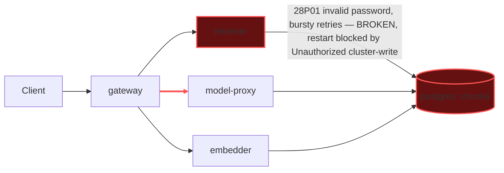

# Postmortem: gateway latency error budget burning slowly (10% of the 28d budget in 6h; 30m & 6h windows)

- **Status:** open
- **Severity:** sev2
- **Verified:** no
- **Opened:** 2026-08-03 01:49:47Z
- **Resolved:** (still open)

## Timeline (machine-generated)

All times UTC on 2026-08-03 unless a full date is shown.

| Time (UTC) | Source | Event |
| --- | --- | --- |
| 01:40:19Z | log-spike | log-spike onset: 41 \| throw new DrizzleQueryError(queryString, params, e); |
| 01:49:10Z | alert | alert firing: SLO gateway latency — slow burn |
| 01:54:53Z | verification | recovery NOT verified — deadline armed |
| 02:03:32Z | log-spike | log-spike onset: 41 \| throw new DrizzleQueryError(queryString, params, e); |
| 02:09:36Z | verification | recovery NOT verified — deadline armed |
| 02:23:27Z | verification | recovery NOT verified — deadline armed |

## Evidence links

- [Loki — logs over the incident window](http://localhost:3001/explore?schemaVersion=1&panes=%7B%22pm%22%3A+%7B%22datasource%22%3A+%22loki%22%2C+%22queries%22%3A+%5B%7B%22refId%22%3A+%22A%22%2C+%22datasource%22%3A+%7B%22type%22%3A+%22loki%22%2C+%22uid%22%3A+%22loki%22%7D%2C+%22expr%22%3A+%22%7Bnamespace%3D%5C%22subject%5C%22%7D+%7C~+%5C%22%28%3Fi%29error%7Cfailed%5C%22%22%7D%5D%2C+%22range%22%3A+%7B%22from%22%3A+%221785721787208%22%2C+%22to%22%3A+%221785724277600%22%7D%7D%7D&orgId=1)
- [Mimir — metrics over the incident window](http://localhost:3001/explore?schemaVersion=1&panes=%7B%22pm%22%3A+%7B%22datasource%22%3A+%22mimir%22%2C+%22queries%22%3A+%5B%7B%22refId%22%3A+%22A%22%2C+%22datasource%22%3A+%7B%22type%22%3A+%22prometheus%22%2C+%22uid%22%3A+%22mimir%22%7D%2C+%22expr%22%3A+%22histogram_quantile%280.95%2C+sum%28rate%28http_server_duration_milliseconds_bucket%5B5m%5D%29%29+by+%28le%29%29%22%7D%5D%2C+%22range%22%3A+%7B%22from%22%3A+%221785721787208%22%2C+%22to%22%3A+%221785724277600%22%7D%7D%7D&orgId=1)

## Investigation context

**Runbook match:** none — no tool narrowing applied for this alert. Available runbooks: README.md, canary-abort.md, ci-pipeline-red.md, dq-freshness-stall.md, gateway-high-error-rate.md, k8s-crashloop.md, k8s-node-failure.md, snapshot-agent-audit.md, stale-secret.md

Pre-check battery (as injected at run start)

## Pre-check leads

### recent_deploys — LEAD
No deploy in the last 60m — rule out the reflex answer.
- No deploy in the last 60m — rule out the reflex answer.

### log_spike — OK
error/failed log rate normal: 200/10min vs baseline 500/10min

### kube_scan — UNAVAILABLE
error: You must be logged in to the server (Unauthorized)

### rollout_state — UNAVAILABLE
gateway: E0803 04:25:14.039866   55392 memcache.go:265] "Unhandled Error" err="couldn't get current server API group list: the server has asked for the client to provide credentials"
E0803 04:25:14.246307   55392 memcache.go:265] "Unhandled Error" err="couldn't get current server API group list: the server has asked for the client to provide credentials"
E0803 04:25:14.444377   55392 memcache.go:265] "Unhandled Error" err="couldn't get current server API group list: the server has asked for the client to; gateway analysis: E0803 04:25:13.530171   65404 memcache.go:265] "Unhandled Error" err="couldn't get current server API group list: the server has asked for the client to provide credentials"
E0803 04:25:14.020627   65404 memcache.go:265] "Unhandled Error"
… (section truncated)

### secret_age — UNAVAILABLE
error: You must be logged in to the server (Unauthorized)

## Narrative

## Summary (inc_19fc5501345212)

**Still not resolved — 4th consecutive page blocked by the same broken remediation credential.** The "SLO gateway latency — slow burn" alert has been accumulating error-budget burn across a series of short, sharp latency collapses (SLI ratio dropping from ~1.0 to ~0.04–0.06 for 2–3 samples at a time), recurring intermittently for hours and **still actively happening at the moment this report was written** — the most recent 5-minute sample is still bad.

## Impact

Gateway p95 latency breaches recur in bursts roughly every 20–40 minutes, each lasting 10–15 minutes, driving sustained 30m/6h burn-rate alerting even though the service looks "normal" between bursts (which is why the `log_spike` pre-check read as OK — the error volume in any fixed 10-minute sampling window is diluted by the healthy gaps).

## Root cause

Live Loki evidence pulled during this exact page shows `retriever` pod `retriever-dc7ddd494-jv9j7` repeatedly failing its Postgres connection with `FATAL`, `code: "28P01"` (invalid password) in tight retry bursts (~20 attempts inside a few seconds) — directly on the vector-search query path (`select ... from chunks order by embedding <=> ...`). This is the exact same pod/failure signature identified two pages ago; it was never actually restarted because every attempt to execute a cluster-write remediation has failed with `Unauthorized`, while `update_db_secret` confirms there is **no pending vault rotation** to sync — so this is not the tracked stale-secret-rotation scenario, it's a stuck pod holding a bad credential/connection state that only a restart clears.

`deploy_history` shows no deploy to `gateway` or `retriever` in the window that correlates with the auth-failure bursts (the one gateway gitops deploy at the start of the evening precedes the *first* dip but every subsequent recurrence — including the one live right now — happens with no accompanying deploy), ruling out a fresh bad deploy as the trigger for the ongoing bursts. `kubectl_read`, `argo_app`, and `rollout_status` are all `Unauthorized` (agent-ro credential), confirming the cluster-read outage flagged by this page's own pre-checks (`kube_scan`, `secret_age` both `UNAVAILABLE`) is still in effect.

## What fixed it

**Nothing yet.** `restart_workload(retriever)` was dry-run (succeeded, returned a valid diff/action_id via the separate agent-remediate RBAC path), approved by the operator, then executed for real — and failed with the identical `Unauthorized` that has now blocked cluster-write remediation across four straight incidents. `alert_status` was re-queried immediately after and is still `active` (firing since the same timestamp as before this page started). No further blind retries were made since no new evidence suggests a different outcome from the same credential.

## Lessons

- This is the fourth consecutive page where diagnosis was clean and fast but remediation execution was blocked by the same cluster-credential outage — the on-call agent's write path (and the read path used by `kubectl_read`/`argo_app`) needs a human to fix the credential; this is now the single highest-leverage action available.
- The underlying retriever pod (`retriever-dc7ddd494-jv9j7`) has been failing intermittently for over one hour without being replaced — it should be considered "stuck bad" until an actual restart lands, and any dashboard/runbook for this alert should call out that the 30m/6h burn windows will keep re-triggering off old bursts even during apparently-healthy stretches.
- Recommend a new/updated runbook entry distinguishing this "stuck pod with bad live credential, no pending vault rotation" signature from the existing `stale-secret.md` scenario (which assumes a rotation the pod hasn't picked up yet) — the diagnostic step of dry-running `update_db_secret` to check for "nothing to sync" is the fast way to tell them apart.

