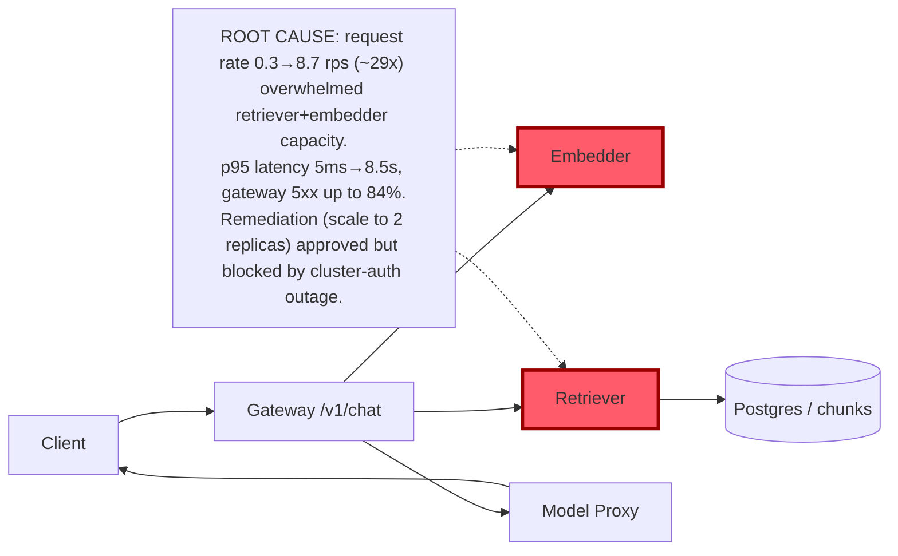

# Postmortem: gateway latency error budget burning slowly (10% of the 28d budget in 6h; 30m & 6h windows)

- **Status:** open
- **Severity:** sev2
- **Verified:** no
- **Opened:** 2026-08-03 01:49:47Z
- **Resolved:** (still open)

## Timeline (machine-generated)

All times UTC on 2026-08-03 unless a full date is shown.

| Time (UTC) | Source | Event |
| --- | --- | --- |
| 01:40:19Z | log-spike | log-spike onset: 41 \| throw new DrizzleQueryError(queryString, params, e); |
| 01:49:10Z | alert | alert firing: SLO gateway latency — slow burn |

## Evidence links

- [Loki — logs over the incident window](http://localhost:3001/explore?schemaVersion=1&panes=%7B%22pm%22%3A+%7B%22datasource%22%3A+%22loki%22%2C+%22queries%22%3A+%5B%7B%22refId%22%3A+%22A%22%2C+%22datasource%22%3A+%7B%22type%22%3A+%22loki%22%2C+%22uid%22%3A+%22loki%22%7D%2C+%22expr%22%3A+%22%7Bnamespace%3D%5C%22subject%5C%22%7D+%7C~+%5C%22%28%3Fi%29error%7Cfailed%5C%22%22%7D%5D%2C+%22range%22%3A+%7B%22from%22%3A+%221785721787208%22%2C+%22to%22%3A+%221785722083624%22%7D%7D%7D&orgId=1)
- [Mimir — metrics over the incident window](http://localhost:3001/explore?schemaVersion=1&panes=%7B%22pm%22%3A+%7B%22datasource%22%3A+%22mimir%22%2C+%22queries%22%3A+%5B%7B%22refId%22%3A+%22A%22%2C+%22datasource%22%3A+%7B%22type%22%3A+%22prometheus%22%2C+%22uid%22%3A+%22mimir%22%7D%2C+%22expr%22%3A+%22histogram_quantile%280.95%2C+sum%28rate%28http_server_duration_milliseconds_bucket%5B5m%5D%29%29+by+%28le%29%29%22%7D%5D%2C+%22range%22%3A+%7B%22from%22%3A+%221785721787208%22%2C+%22to%22%3A+%221785722083624%22%7D%7D%7D&orgId=1)

## Investigation context

**Runbook match:** none — no tool narrowing applied for this alert. Available runbooks: README.md, canary-abort.md, ci-pipeline-red.md, dq-freshness-stall.md, gateway-high-error-rate.md, k8s-crashloop.md, k8s-node-failure.md, snapshot-agent-audit.md, stale-secret.md

Pre-check battery (as injected at run start)

## Pre-check leads

### recent_deploys — LEAD
No deploy in the last 60m — rule out the reflex answer.
- No deploy in the last 60m — rule out the reflex answer.

### log_spike — LEAD
error/failed log rate 200/10min vs baseline 0/10min (200x baseline) — onset: 41 |         throw new DrizzleQueryError(queryString, params, e); at 2026-08-03T01:40:19.759175+00:00
- error/failed log rate 200/10min vs baseline 0/10min (200x baseline) — onset: 41 |         throw new DrizzleQueryError(queryString, params, e); at 2026-08-03T01:40:19.759175+00:00

### kube_scan — UNAVAILABLE
error: You must be logged in to the server (Unauthorized)

### rollout_state — UNAVAILABLE
gateway: E0803 03:49:49.013865   37776 memcache.go:265] "Unhandled Error" err="couldn't get current server API group list: the server has asked for the client to provide credentials"
E0803 03:49:49.108078   37776 memcache.go:265] "Unhandled Error" err="couldn't get current server API group list: the server has asked for the client to provide credentials"
E0803 03:49:49.241854   37776 memcache.go:265] "Unhandled Error" err="couldn't get current server API group list: the server has asked for the client to; gateway analysis: E0803 03:49:49.016389   50144 memcache.go:265] "Unhandled Error" err="couldn't get current server API group list: the server has asked for the client to provide credentials"
E0803 03:49:49.109691   50144 memcache.go:265] "Unhandled Error"
… (section truncated)

### secret_age — UNAVAILABLE
error: You must be logged in to the server (Unauthorized)

## Narrative

## Summary
The `SLO gateway latency — slow burn` alert (sev2, tenant acme) fired on a 30m/6h error-budget burn for the gateway's `/v1/chat` route. Root cause: a traffic burst against the retriever and embedder services (request rate rose ~29x, 0.3 rps → 8.7 rps, in lockstep on both services) exceeded their available capacity, driving p95 latency from a 5ms baseline to 4–8.5s and pushing gateway 5xx error rate as high as 84% during the peak. No deploy, crash, OOM, or DB error underlies this — it is a capacity/demand mismatch on the retrieval hop.

## Impact
`/v1/chat` requests for tenant acme (and general traffic through gateway) saw multi-second latency and a majority-error response rate for roughly a half-hour window. Traces during the window show gateway spans with `errorCount` alongside single-span `retriever` errors, consistent with downstream timeouts cascading into gateway failures. By the time of investigation, request volume to retriever/embedder had already returned to the ~0.3 rps baseline and p95 latency was back to ~5ms; the alert remained active only because the 30m burn-rate window still spans the spike.

## Root cause
- `deploy_history` showed no deploy in the 60 minutes before the alert, ruling out a bad rollout as the trigger (the most recent gitops deploy, gateway@bb634a3, landed ~23:32 UTC, over 2h before the sustained spike and briefly perturbed latency on its own but was not the cause of this burn).
- `mimir_query` on `request_duration_seconds_bucket`/`_count` for `service=~"retriever|embedder"` showed both services' request rate jump from ~0.3 rps to 4.7–8.7 rps simultaneously, with p95 latency rising from 5ms to 4.6–8.5s over the same interval.
- The same jump appears on `service="gateway", http_route="/v1/chat"` request rate and on the gateway 5xx-fraction query (peaking at ~84%), confirming the burst propagated end-to-end.
- `tempo_query` traces >3s in the window show `gateway` spans with `errorCount:4` of 5 and a `retriever` span with `errorCount:1`, consistent with retriever/embedder saturation causing timeouts.
- No corroborating evidence of a code-level fault: `loki_query` against `service=retriever`, `service=embedder`, and `service=gateway` for error/fail/timeout/Drizzle text returned zero lines throughout the window (the pre-check's `DrizzleQueryError` log-spike lead did not reproduce under any label combination tried and could not be tied to this alert's window), and `k8s_events` for retriever/embedder returned nothing (no OOM, no restarts, no probe failures).
- Postgres itself was uninvolved: `pg_select` against `inferences` showed no rows written in the incident window at all (last row 2026-07-23), and `chunks` is a static table — the DB was not on the hot path for this burst.

## What fixed it
Proposed remediation: scale `retriever` and `embedder` to 2 replicas each for headroom against bursty demand. Both dry-runs were approved by the operator. However, **both scale executions failed** with `Unauthorized` from the cluster API — the same agent-ro kubeconfig credential failure that made `kubectl_read`, `argo_app`, and `rollout_status` unavailable throughout this investigation (a pre-existing environment issue, not caused by this incident). The remediation could not be applied.
Independently, the triggering traffic burst had already subsided by the time of investigation — retriever/embedder request rate and latency were back at baseline for several minutes before the alert even fired, since burn-rate alerts lag the underlying signal. `alert_status` was re-queried after the failed remediation and still reported active (fired at 01:49:10, window still spans the 01:16–01:44 spike). Recovery was **not confirmed** by this session; the alert should self-clear once the 30m window rolls past the spike, assuming no recurrence, but that was not verified live.

## Lessons
- The retriever/embedder tier has no observed autoscaling and folded under a ~29x demand spike with no errors or crashes logged anywhere — it degraded silently via latency/timeouts rather than raising any alarm of its own. Add capacity (replicas, and ideally an HPA keyed on request rate or in-flight requests) to this tier so a burst doesn't cascade into gateway 5xx.
- The cluster-auth outage on the agent-ro kubeconfig blocked every read *and* every write remediation this session. That needs to be fixed operationally before it silently defeats the next on-call response — recommend a credential/token-refresh check as a standing action item, independent of this incident.
- The pre-check's `DrizzleQueryError` log-spike lead did not corroborate under any Loki label combination tried; treat pre-check leads as a starting hypothesis, not a conclusion — the actual evidence pointed to a plain capacity/demand mismatch, not a DB query fault.

