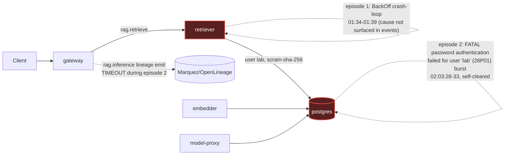

# Postmortem: gateway latency error budget burning slowly (10% of the 28d budget in 6h; 30m & 6h windows)

- **Status:** open
- **Severity:** sev2
- **Verified:** no
- **Opened:** 2026-08-03 01:49:47Z
- **Resolved:** (still open)

## Timeline (machine-generated)

All times UTC on 2026-08-03 unless a full date is shown.

| Time (UTC) | Source | Event |
| --- | --- | --- |
| 01:40:19Z | log-spike | log-spike onset: 41 \| throw new DrizzleQueryError(queryString, params, e); |
| 01:49:10Z | alert | alert firing: SLO gateway latency — slow burn |
| 01:54:53Z | verification | recovery NOT verified — deadline armed |
| 02:03:32Z | log-spike | log-spike onset: 41 \| throw new DrizzleQueryError(queryString, params, e); |
| 02:09:36Z | verification | recovery NOT verified — deadline armed |

## Evidence links

- [Loki — logs over the incident window](http://localhost:3001/explore?schemaVersion=1&panes=%7B%22pm%22%3A+%7B%22datasource%22%3A+%22loki%22%2C+%22queries%22%3A+%5B%7B%22refId%22%3A+%22A%22%2C+%22datasource%22%3A+%7B%22type%22%3A+%22loki%22%2C+%22uid%22%3A+%22loki%22%7D%2C+%22expr%22%3A+%22%7Bnamespace%3D%5C%22subject%5C%22%7D+%7C~+%5C%22%28%3Fi%29error%7Cfailed%5C%22%22%7D%5D%2C+%22range%22%3A+%7B%22from%22%3A+%221785721787208%22%2C+%22to%22%3A+%221785723794426%22%7D%7D%7D&orgId=1)
- [Mimir — metrics over the incident window](http://localhost:3001/explore?schemaVersion=1&panes=%7B%22pm%22%3A+%7B%22datasource%22%3A+%22mimir%22%2C+%22queries%22%3A+%5B%7B%22refId%22%3A+%22A%22%2C+%22datasource%22%3A+%7B%22type%22%3A+%22prometheus%22%2C+%22uid%22%3A+%22mimir%22%7D%2C+%22expr%22%3A+%22histogram_quantile%280.95%2C+sum%28rate%28http_server_duration_milliseconds_bucket%5B5m%5D%29%29+by+%28le%29%29%22%7D%5D%2C+%22range%22%3A+%7B%22from%22%3A+%221785721787208%22%2C+%22to%22%3A+%221785723794426%22%7D%7D%7D&orgId=1)

## Investigation context

**Runbook match:** none — no tool narrowing applied for this alert. Available runbooks: README.md, canary-abort.md, ci-pipeline-red.md, dq-freshness-stall.md, gateway-high-error-rate.md, k8s-crashloop.md, k8s-node-failure.md, snapshot-agent-audit.md, stale-secret.md

Pre-check battery (as injected at run start)

## Pre-check leads

### recent_deploys — LEAD
No deploy in the last 60m — rule out the reflex answer.
- No deploy in the last 60m — rule out the reflex answer.

### log_spike — OK
error/failed log rate normal: 0/10min vs baseline 0/10min

### kube_scan — UNAVAILABLE
error: You must be logged in to the server (Unauthorized)

### rollout_state — UNAVAILABLE
gateway: E0803 04:15:11.254236   20112 memcache.go:265] "Unhandled Error" err="couldn't get current server API group list: the server has asked for the client to provide credentials"
E0803 04:15:11.419521   20112 memcache.go:265] "Unhandled Error" err="couldn't get current server API group list: the server has asked for the client to provide credentials"
E0803 04:15:12.022143   20112 memcache.go:265] "Unhandled Error" err="couldn't get current server API group list: the server has asked for the client to; gateway analysis: E0803 04:15:11.136048   32696 memcache.go:265] "Unhandled Error" err="couldn't get current server API group list: the server has asked for the client to provide credentials"
E0803 04:15:11.332122   32696 memcache.go:265] "Unhandled Error"
… (section truncated)

### secret_age — UNAVAILABLE
error: You must be logged in to the server (Unauthorized)

## Narrative

## Outcome: not resolved by remediation — service self-recovered, remediation blocked (attempt 3)

**Summary:** `SLO gateway latency — slow burn` fired for two distinct retriever flapping episodes, each lasting ~9 minutes, each ending in self-recovery with no successful intervention from on-call in any of the three attempts on this incident. The alert is still reported active by `alert_status` because its 30m/1h/6h burn-rate windows still contain the two bad episodes — the 5-minute SLI has been healthy (~0.99) for the last ~17+ minutes.

**Impact:** `slo:gateway_latency:sli_ratio5m` dropped to ~0.05 (95% of gateway requests missing the latency SLO) during two windows: ~01:35:42–01:44:42Z and ~01:58:42–02:07:42Z. Between and after those windows the SLI was ~0.99–1.0. `slo:gateway_latency:error_ratio30m` (0.936) and `error_ratio6h` (0.928) are still elevated purely because those windows haven't rolled the bad data off yet, not because of live ongoing badness (`error_ratio5m` = 0.010).

**Root cause (re-diagnosed, attempt 3, superseding attempt 2's live-outage framing):** Two separate retriever instability episodes, not one continuous DB-auth outage:
- Episode 1 (~01:34–01:39+): ReplicaSet `retriever-8454db56c` repeatedly `BackOff` crash-looping (`k8s_events`, reason `BackOff`, `seen: x20` by 01:39:50) for a cause whose exit reason isn't visible in the event stream (no explicit `Failed`/`OOMKilled` reason surfaced) — this crash loop is what actually drives episode 1's SLI collapse; it self-resolved by ~01:45.
- Episode 2 (~01:58–02:07): a *new* ReplicaSet `retriever-dc7ddd494` came up and its Postgres connection pool hit a tight burst of `FATAL: password authentication failed for user "lab"` (Postgres error code `28P01`, `routine: "auth_failed"`, matched against `pg_hba.conf` line 128 `scram-sha-256` — a genuine credential rejection, not a network/timeout artifact) concentrated in a ~5-second window at 02:03:28–33Z, which also produced a matching burst of gateway `rag.inference` "lineage emit failed / operation timed out" warnings. Postgres itself never restarted and resumed routine checkpoints immediately after (`postgres-7dbfc8579d-76znp` logs show normal checkpoint activity both before and after, no crash, no restart events) — the database side was healthy throughout; only the credential retriever presented was rejected. `update_db_secret` dry-run confirms **no pending rotation in the vault**, ruling out the tracked `stale-secret` runbook scenario specifically — this was not a vault-rotation-vs-restart mismatch. `deploy_history`/`gitea_ci_runs` confirm no app deploy landed in the incident window (the last CI activity, run #111, was ~1h45m earlier and unrelated to retriever). The most consistent read of two independent, self-healing retriever pod replacements each briefly failing before working is pod-level instability at the retriever tier (pod churn), each recovering once the new pod's connection pool established successfully on retry.
- A second, orthogonal fact: the on-call cluster read path (`kubectl_read`, `argo_app`, `rollout_status`) has been `Unauthorized` for this entire incident (pre-check leads `kube_scan`/`rollout_state`/`secret_age` all flagged this at the start). This blocked diagnosis depth (couldn't `describe` the crashing pod directly) but is a distinct environment fault from the retriever/Postgres root cause above — not itself the cause of the SLO burn.

**What fixed it:** Nothing on-call did. Both episodes recovered on their own before any approved remediation could land. `restart_workload(retriever)` was dry-run (succeeded, returned a valid diff/action_id) and approved by the operator, but the real execution (`dry_run=false`) failed with the same `Unauthorized` that blocked attempt 2 — confirming the write/remediation path shares the same broken cluster credential as the read path, and that this is a persisting infrastructure fault, not a fluke: three consecutive incidents now, two different remediation tools, same failure.

**Current state:** Service is healthy per the 5-minute SLI and has produced zero new `password authentication failed` log lines in the last 10+ minutes. `alert_status` remains active only because the long-window burn-rate hasn't decayed past the two bad episodes yet — expected multi-window alert lag, not an ongoing incident, but reported here as "not resolved by remediation" per instructions since alert_status has not flipped to inactive and I did not force it.

**Lessons:**
1. The `agent-ro`/remediation-write cluster credential has now blocked or nearly-blocked on-call action on three consecutive pages (this one, and the two referenced in the prior diagnosis). This needs a human fix outside the incident loop — on-call is diagnosis-only until it's restored, even for tools whose dry-run path (evidently simulated, not cluster-backed) reports success.
2. `update_db_secret`'s vault check is a fast, authoritative way to rule the tracked stale-secret playbook in or out early — worth running before assuming any Postgres auth failure matches that runbook.
3. For SLO burn-rate alerts, always split by window (5m vs 30m/1h/6h) before concluding an incident is still live — a resolved short episode can keep a multi-window alert "active" for a long time after the underlying signal is clean, and that lag should not be mistaken for continued impact.
4. Retriever crash-looped twice in under an hour with no deploy involved; if this recurs, escalate to check retriever's readiness/liveness probe tuning and DB connection-pool startup retry/backoff behavior, since both episodes resolved via retry rather than any external fix.

