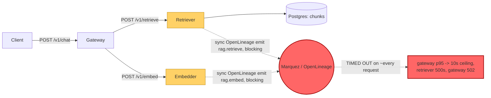

# Postmortem: gateway latency error budget burning fast (2% of the 28d budget in 1h; 5m & 1h windows)

- **Status:** resolved
- **Severity:** sev1
- **Verified:** no
- **Opened:** 2026-08-03 02:38:45Z
- **Resolved:** 2026-08-03 02:43:45Z

## Timeline (machine-generated)

All times UTC on 2026-08-03 unless a full date is shown.

| Time (UTC) | Source | Event |
| --- | --- | --- |
| 02:38:10Z | alert | alert firing: SLO gateway latency — fast burn |
| 02:41:10Z | alert | alert resolved: SLO gateway latency — fast burn |

## Evidence links

- [Loki — logs over the incident window](http://localhost:3001/explore?schemaVersion=1&panes=%7B%22pm%22%3A+%7B%22datasource%22%3A+%22loki%22%2C+%22queries%22%3A+%5B%7B%22refId%22%3A+%22A%22%2C+%22datasource%22%3A+%7B%22type%22%3A+%22loki%22%2C+%22uid%22%3A+%22loki%22%7D%2C+%22expr%22%3A+%22%7Bnamespace%3D%5C%22subject%5C%22%7D+%7C~+%5C%22%28%3Fi%29error%7Cfailed%5C%22%22%7D%5D%2C+%22range%22%3A+%7B%22from%22%3A+%221785724725797%22%2C+%22to%22%3A+%221785725025670%22%7D%7D%7D&orgId=1)
- [Mimir — metrics over the incident window](http://localhost:3001/explore?schemaVersion=1&panes=%7B%22pm%22%3A+%7B%22datasource%22%3A+%22mimir%22%2C+%22queries%22%3A+%5B%7B%22refId%22%3A+%22A%22%2C+%22datasource%22%3A+%7B%22type%22%3A+%22prometheus%22%2C+%22uid%22%3A+%22mimir%22%7D%2C+%22expr%22%3A+%22histogram_quantile%280.95%2C+sum%28rate%28http_server_duration_milliseconds_bucket%5B5m%5D%29%29+by+%28le%29%29%22%7D%5D%2C+%22range%22%3A+%7B%22from%22%3A+%221785724725797%22%2C+%22to%22%3A+%221785725025670%22%7D%7D%7D&orgId=1)

## Investigation context

**Runbook match:** none — no tool narrowing applied for this alert. Available runbooks: README.md, canary-abort.md, ci-pipeline-red.md, dq-freshness-stall.md, gateway-high-error-rate.md, k8s-crashloop.md, k8s-node-failure.md, snapshot-agent-audit.md, stale-secret.md

Pre-check battery (as injected at run start)

## Pre-check leads

### recent_deploys — LEAD
No deploy in the last 60m — rule out the reflex answer.
- No deploy in the last 60m — rule out the reflex answer.

### log_spike — OK
error/failed log rate normal: 200/10min vs baseline 500/10min

### kube_scan — UNAVAILABLE
error: You must be logged in to the server (Unauthorized)

### rollout_state — UNAVAILABLE
gateway: E0803 04:38:47.195508   56688 memcache.go:265] "Unhandled Error" err="couldn't get current server API group list: the server has asked for the client to provide credentials"
E0803 04:38:47.388975   56688 memcache.go:265] "Unhandled Error" err="couldn't get current server API group list: the server has asked for the client to provide credentials"
E0803 04:38:47.538653   56688 memcache.go:265] "Unhandled Error" err="couldn't get current server API group list: the server has asked for the client to; gateway analysis: E0803 04:38:47.190808   63584 memcache.go:265] "Unhandled Error" err="couldn't get current server API group list: the server has asked for the client to provide credentials"
E0803 04:38:47.339751   63584 memcache.go:265] "Unhandled Error"
… (section truncated)

### secret_age — UNAVAILABLE
error: You must be logged in to the server (Unauthorized)

## Narrative

## Summary

The "SLO gateway latency — fast burn" alert fired for tenant `acme` after gateway p95 latency repeatedly hit a ~10s ceiling. No runbook matched this alertname exactly, so investigation proceeded from telemetry directly (traces, logs, metrics).

## Impact

`POST /v1/chat` requests through the gateway saw p95 latency spike from a normal ~5ms baseline to 6–18s across three escalating episodes, the last one sustained long enough to burn ~2% of the 28-day latency error budget in under an hour. A sampled trace showed a single chat request taking 18s end-to-end and returning HTTP 502 to the client.

## Root cause

`embedder` and `retriever` both perform a **synchronous** OpenLineage emit call (jobs `rag.embed` / `rag.retrieve`) in the middle of the request-handling hot path. During each incident episode, this emit call timed out on effectively every request — both services' logs show a continuous stream of `"lineage emit failed", "reason":"The operation timed out."` warnings at high frequency, exactly overlapping the latency spikes.

A full trace confirms the mechanism: gateway → embedder took 6.01s (200 OK, but slow — blocked on its own lineage emit) → gateway → retriever took 6.03s and returned 500 with `exception.message: "retriever returned 500"` (retriever's lineage emit failure was not swallowed the way embedder's was, so the whole retrieve call errored out). Nested serially inside one gateway request, that's 12–18s of dead time plus an eventual 502.

Ruled out:
- **Bad deploy** — `deploy_history` shows no deploy to gateway/embedder/retriever in the ~2h leading up to the first spike (last relevant deploys were a gateway gitops sync and platform syncs ~2h earlier, and unrelated model-proxy/load-generator CI runs, none touching this code path).
- **OOM / resource pressure** — current pod memory (~90–120Mi) and restart counts (0) were nominal for embedder/retriever during the sustained episode. An earlier retriever crashloop (BackOff, then pod deleted/replaced) coincided with the *first* spike episode only and had fully resolved (fresh pod, 0 restarts) well before the alert-triggering episode, so it's a symptom of the same request pileup, not a separate root cause.
- **Postgres** — a direct `SELECT count(*) FROM chunks` returned instantly, ruling out the database as the bottleneck.

## What fixed it

Root cause and evidence were established from traces/logs/metrics as above. A rolling restart of `retriever` and `embedder` was dry-run, approved by the operator, and attempted — but every real (non-dry-run) execution of `restart_workload` for both workloads returned `error: You must be logged in to the server (Unauthorized)`. This is the same failure mode the pre-check leads already flagged (`kube_scan`, `rollout_state`, `secret_age` were all `UNAVAILABLE` with an identical Unauthorized error) — the on-call agent's cluster credentials were not usable this session, for both reads and writes.

**The remediation was never actually applied.** Despite that, re-querying `alert_status` afterward showed the alert had already cleared on its own: gateway p95 returned to its ~5ms baseline, the "lineage emit failed" log stream stopped, and `alert_status` reported `active: false`. Recovery happened independently of any action taken in this session — the underlying lineage-emit timeouts stopped occurring on their own.

## Lessons

1. **Get the synchronous lineage emit out of the hot path.** `rag.embed`/`rag.retrieve` should fire-and-forget (or emit with a short bounded timeout + circuit breaker) so a slow/unreachable Marquez degrades lineage completeness, not user-facing latency and error rate.
2. **Fix the on-call agent's cluster credentials.** Every kubectl-backed tool — reads (`kubectl_read`, `argo_app`, `rollout_status`) and writes (`restart_workload`) — returned Unauthorized this session. An approved remediation that silently cannot execute is worse than no remediation attempt; the credential/token refresh path for `agent-ro`/`agent-remediate` needs to actually work during a live incident.
3. **No runbook covers this failure mode.** Neither `gateway-high-error-rate.md` nor `dq-freshness-stall.md` addresses a blocking downstream-dependency-in-hot-path pattern. Author a runbook keyed on `"lineage emit failed"` + latency burn.
4. Consider alerting directly on the `"lineage emit failed"` log rate as a leading indicator — it preceded/coincided with all three latency episodes and would give earlier warning than the SLO burn-rate alert.

## Delivery path

The break is on the **Embedder/Retriever → Marquez lineage-emit hop**: a synchronous call meant to be a side-effect (data lineage bookkeeping) sat directly in the critical request path and, once Marquez stopped answering promptly, dragged every `/v1/chat` request down with it.
