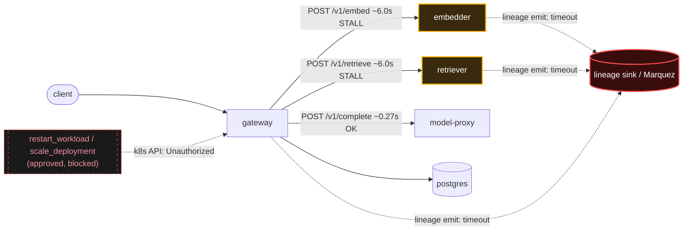

# Postmortem: gateway availability error budget burning slowly (10% of the 28d budget in 6h; 30m & 6h windows)

- **Status:** open
- **Severity:** sev2
- **Verified:** no
- **Opened:** 2026-08-03 20:26:44Z
- **Resolved:** (still open)

## Timeline (machine-generated)

All times UTC on 2026-08-03 unless a full date is shown.

| Time (UTC) | Source | Event |
| --- | --- | --- |
| 20:26:10Z | alert | alert firing: SLO gateway availability — slow burn |
| 20:32:16Z | verification | recovery NOT verified — deadline armed |
| 20:42:39Z | log-spike | log-spike onset: {"level":"warn","service":"gateway","message":"lineage emit failed","trace_id":"70c3bc5116e57899ce750a020a5c818d","span_id":"3ea18e90ec4e995a","time":"2026-08-03T20:42:39.820Z","reason":"The operation timed out.","job":"ra… |

## Evidence links

- [Loki — logs over the incident window](http://localhost:3001/explore?schemaVersion=1&panes=%7B%22pm%22%3A+%7B%22datasource%22%3A+%22loki%22%2C+%22queries%22%3A+%5B%7B%22refId%22%3A+%22A%22%2C+%22datasource%22%3A+%7B%22type%22%3A+%22loki%22%2C+%22uid%22%3A+%22loki%22%7D%2C+%22expr%22%3A+%22%7Bnamespace%3D%5C%22subject%5C%22%7D+%7C~+%5C%22%28%3Fi%29error%7Cfailed%5C%22%22%7D%5D%2C+%22range%22%3A+%7B%22from%22%3A+%221785788804787%22%2C+%22to%22%3A+%221785790460899%22%7D%7D%7D&orgId=1)
- [Mimir — metrics over the incident window](http://localhost:3001/explore?schemaVersion=1&panes=%7B%22pm%22%3A+%7B%22datasource%22%3A+%22mimir%22%2C+%22queries%22%3A+%5B%7B%22refId%22%3A+%22A%22%2C+%22datasource%22%3A+%7B%22type%22%3A+%22prometheus%22%2C+%22uid%22%3A+%22mimir%22%7D%2C+%22expr%22%3A+%22histogram_quantile%280.95%2C+sum%28rate%28http_server_duration_milliseconds_bucket%5B5m%5D%29%29+by+%28le%29%29%22%7D%5D%2C+%22range%22%3A+%7B%22from%22%3A+%221785788804787%22%2C+%22to%22%3A+%221785790460899%22%7D%7D%7D&orgId=1)

## Investigation context

**Runbook match:** none — no tool narrowing applied for this alert. Available runbooks: README.md, canary-abort.md, ci-pipeline-red.md, dq-freshness-stall.md, gateway-high-error-rate.md, k8s-crashloop.md, k8s-node-failure.md, snapshot-agent-audit.md, stale-secret.md

Pre-check battery (as injected at run start)

## Pre-check leads

### recent_deploys — LEAD
No deploy in the last 60m — rule out the reflex answer.
- No deploy in the last 60m — rule out the reflex answer.

### log_spike — LEAD
error/failed log rate 200/10min vs baseline 0/10min (200x baseline) — onset: {"level":"warn","service":"gateway","message":"lineage emit failed","trace_id":"70c3bc5116e57899ce750a020a5c818d","span_id":"3ea18e90ec4e995a","time":"2026-08-03T20:42:39.820Z","reason":"The operation timed out.","job":"rag.inference","eventType":"FAIL"} at 2026-08-03T20:42:39.820905+00:00
- error/failed log rate 200/10min vs baseline 0/10min (200x baseline) — onset: {"level":"warn","service":"gateway","message":"lineage emit failed","trace_id":"70c3bc5116e57899ce750a020a5c81… (truncated)

### kube_scan — UNAVAILABLE
error: You must be logged in to the server (Unauthorized)

### rollout_state — UNAVAILABLE
gateway: E0803 22:42:48.561758   13516 memcache.go:265] "Unhandled Error" err="couldn't get current server API group list: the server has asked for the client to provide credentials"
E0803 22:42:48.728961   13516 memcache.go:265] "Unhandled Error" err="couldn't get current server API group list: the server has asked for the client to provide credentials"
E0803 22:42:48.853938   13516 memcache.go:265] "Unhandled Error" err="couldn't get current server API group list: the server has asked for the client to; gateway analysis: E0803 22:42:48.634722   59132 memcache.go:265] "Unhandled Error" err="couldn't get current server API group list: the server has asked for the client to provide credentials"
E0803 22:42:48.786264   59132 memcache.go:265] "Unhandled Error"
… (section truncated)

### secret_age — UNAVAILABLE
error: You must be logged in to the server (Unauthorized)

## Narrative

## Incident re-opened — prior "self-resolved" diagnosis did not hold; new, distinct root cause found; remediation blocked by broken cluster credentials

**Summary:** The same alert (`SLO gateway availability — slow burn`) is firing on a *second, distinct* degradation that started after the first (already-postmortemed, self-resolved) malformed-JSON burst had fully recovered. `slo:gateway_availability:sli_ratio5m` climbed back to 1.0, held there for roughly 15 minutes, then dropped again and has been flat at ~0.67–0.69 ever since — not recovering like the first dip did. This is ongoing impact, not a stale alert window.

**Root cause:** OpenLineage lineage-emission calls made by `gateway`, `embedder`, and `retriever` on the request path are blocking synchronously and timing out against an unresponsive lineage sink. Evidence:
- A full trace pull (`637b70fd66337ed6853ded80a8fc0bf1`) shows the gateway's client span `POST embedder` taking ~6.008s and `POST retriever` taking ~6.027s, versus `POST model-proxy` completing in ~0.266s in the same request — a fixed ~6s stall isolated to exactly the two hops whose services log `"lineage emit failed"` / `"reason":"The operation timed out"`.
- `"lineage emit failed"` warnings (jobs `rag.embed` / `rag.inference`) are firing at a rate of several thousand per 5-minute window across gateway, embedder, and retriever combined — i.e. on very close to every request, not an intermittent blip.
- `slo:gateway_latency:sli_ratio5m` sits at ≈0.05 (95% of requests now blow the latency threshold) at the same time `slo:gateway_availability:error_ratio5m` sits at ≈0.33, confirming the same stalled-call mechanism is driving both the latency and availability SLOs — the ~12s of stacked embed+retrieve stalls per request is enough to push roughly a third of requests past the point where they fail outright, not just run slow.
- No log line, metric series, or k8s event for the lineage sink itself could be found (`service_name="marquez"` returns nothing in Loki, no matching metrics, no k8s events) — consistent with it being unreachable rather than merely slow-but-logging.

**Ruled out:**
- No deploy in the last 6 hours (`deploy_history` empty for the window; the only recent CI activity on `main` was an unrelated `load-generator` percentile-copy revert from the day before, and `gitea_ci_runs` shows nothing touching gateway/embedder/retriever).
- No OOM/crash/restart k8s events for `retriever` or `embedder` — rules out a resource-exhaustion explanation for the stalls; the pods themselves are healthy, only their outbound call to the lineage sink is hanging.
- Node `FreeDiskSpaceFailed` warnings are present but chronic and unchanged in rate across the whole window (same count trajectory before, during, and after both dips) — background noise already ruled out in the prior postmortem, not the trigger here either.
- The gateway's own "status: 400" malformed-body errors (the prior incident's cause) are still present but only at ~2.4% of request volume — far too small to explain the current ~33% error ratio, confirming this is a genuinely different failure mode, not a recurrence of the first one.

**What fixed it: nothing — remediation could not be executed.** Root-caused to the lineage-emit stall, I dry-ran and got operator approval for a rolling restart of `retriever` and `embedder` (hypothesis: recycle pods to drop any connections wedged against the lineage sink). Both approved restarts failed to execute with `"You must be logged in to the server (Unauthorized)"`. I confirmed this wasn't transient by also dry-running `scale_deployment`, which failed identically trying to read current replica state. Every cluster-touching tool (`restart_workload`, `scale_deployment`, `rollout_status`, `argo_app`, `kubectl_read`) is hitting the same auth failure already flagged as UNAVAILABLE for `kube_scan`/`rollout_state`/`secret_age` in the pre-check leads — the credentials the remediation tooling relies on are themselves broken right now, independent of the gateway incident. No remediation was applied. Re-querying `alert_status` and the SLI afterward confirms no change: the alert is still active and the SLI is still ~0.688, essentially unchanged from before the (failed) restart attempt.

**Lessons:**
1. The lineage-emission call in `gateway`/`embedder`/`retriever` is on the synchronous request-serving path with a timeout long enough (~6s, stacked twice per request) to take down two SLOs at once. It needs to be fire-and-forget (or backed by a circuit breaker with a sub-second timeout) so a lineage-sink outage can never cascade into serving availability.
2. The cluster credentials backing this on-call tooling need their own health check and alerting — right now a credential outage silently prevents *any* remediation from landing, and the only signal was pre-check leads marked "UNAVAILABLE" that could easily be skimmed past.
3. Burn-rate alerts on the same alertname can span two unrelated incidents back to back; don't assume a still-active alert is just a stale window from an old, already-fixed problem — re-pull the SLI time series before closing.

Artifacts: `report.html` (SVG of the SLI dip/recovery/second-dip, `art_19fc96774df307`).
