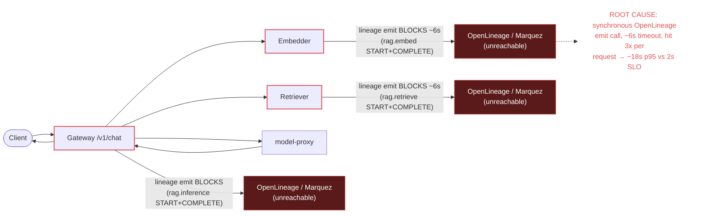

# Postmortem: gateway p95 latency above 2s

- **Status:** open
- **Severity:** sev1
- **Verified:** no
- **Opened:** 2026-08-03 02:52:42Z
- **Resolved:** (still open)

## Timeline (machine-generated)

All times UTC on 2026-08-03 unless a full date is shown.

| Time (UTC) | Source | Event |
| --- | --- | --- |
| 02:52:10Z | alert | alert firing: Gateway p95 latency > 2s |
| 02:52:21Z | log-spike | log-spike onset: {"level":"warn","service":"gateway","message":"lineage emit failed","trace_id":"ebc627b16fcfcc3ccc621248386703d9","span_id":"b71edfd892699884","time":"2026-08-03T02:52:21.424Z","reason":"The operation timed out.","job":"ra… |

## Evidence links

- [Loki — logs over the incident window](http://localhost:3001/explore?schemaVersion=1&panes=%7B%22pm%22%3A+%7B%22datasource%22%3A+%22loki%22%2C+%22queries%22%3A+%5B%7B%22refId%22%3A+%22A%22%2C+%22datasource%22%3A+%7B%22type%22%3A+%22loki%22%2C+%22uid%22%3A+%22loki%22%7D%2C+%22expr%22%3A+%22%7Bnamespace%3D%5C%22subject%5C%22%7D+%7C~+%5C%22%28%3Fi%29error%7Cfailed%5C%22%22%7D%5D%2C+%22range%22%3A+%7B%22from%22%3A+%221785725562054%22%2C+%22to%22%3A+%221785725920142%22%7D%7D%7D&orgId=1)
- [Mimir — metrics over the incident window](http://localhost:3001/explore?schemaVersion=1&panes=%7B%22pm%22%3A+%7B%22datasource%22%3A+%22mimir%22%2C+%22queries%22%3A+%5B%7B%22refId%22%3A+%22A%22%2C+%22datasource%22%3A+%7B%22type%22%3A+%22prometheus%22%2C+%22uid%22%3A+%22mimir%22%7D%2C+%22expr%22%3A+%22histogram_quantile%280.95%2C+sum%28rate%28http_server_duration_milliseconds_bucket%5B5m%5D%29%29+by+%28le%29%29%22%7D%5D%2C+%22range%22%3A+%7B%22from%22%3A+%221785725562054%22%2C+%22to%22%3A+%221785725920142%22%7D%7D%7D&orgId=1)

## Investigation context

**Runbook match:** none — no tool narrowing applied for this alert. Available runbooks: README.md, canary-abort.md, ci-pipeline-red.md, dq-freshness-stall.md, gateway-high-error-rate.md, k8s-crashloop.md, k8s-node-failure.md, snapshot-agent-audit.md, stale-secret.md

Pre-check battery (as injected at run start)

## Pre-check leads

### recent_deploys — LEAD
No deploy in the last 60m — rule out the reflex answer.
- No deploy in the last 60m — rule out the reflex answer.

### log_spike — LEAD
error/failed log rate 200/10min vs baseline 0/10min (200x baseline) — onset: {"level":"warn","service":"gateway","message":"lineage emit failed","trace_id":"ebc627b16fcfcc3ccc621248386703d9","span_id":"b71edfd892699884","time":"2026-08-03T02:52:21.424Z","reason":"The operation timed out.","job":"rag.inference","eventType":"FAIL"} at 2026-08-03T02:52:21.425247+00:00
- error/failed log rate 200/10min vs baseline 0/10min (200x baseline) — onset: {"level":"warn","service":"gateway","message":"lineage emit failed","trace_id":"ebc627b16fcfcc3ccc621248386703… (truncated)

### kube_scan — UNAVAILABLE
error: You must be logged in to the server (Unauthorized)

### rollout_state — UNAVAILABLE
gateway: E0803 04:53:08.113066   23216 memcache.go:265] "Unhandled Error" err="couldn't get current server API group list: the server has asked for the client to provide credentials"
E0803 04:53:09.199893   23216 memcache.go:265] "Unhandled Error" err="couldn't get current server API group list: the server has asked for the client to provide credentials"
E0803 04:53:10.908911   23216 memcache.go:265] "Unhandled Error" err="couldn't get current server API group list: the server has asked for the client to; gateway analysis: E0803 04:52:59.815141   62216 memcache.go:265] "Unhandled Error" err="couldn't get current server API group list: the server has asked for the client to provide credentials"
E0803 04:53:01.671615   62216 memcache.go:265] "Unhandled Error"
… (section truncated)

### secret_age — UNAVAILABLE
error: You must be logged in to the server (Unauthorized)

## Narrative

## Summary

`Gateway p95 latency > 2s` (sev1, tenant acme) fired and remained active throughout this investigation. The root cause was identified with direct trace/log evidence: OpenLineage emission calls made synchronously in the request path of **embedder**, **retriever**, and **gateway** are timing out (~6s each, "The operation timed out.") instead of failing fast or running async, stacking to ~18s per `/v1/chat` request — roughly 9x the 2s SLO.

## Impact

Every sampled `/v1/chat` trace in the alert window (5/5 sampled) ran 18.0–18.4s end-to-end, all tenant `acme`. This is a hard, flat latency floor, not gradual degradation — consistent with every request paying a fixed ~6s timeout at each of the embed, retrieve, and inference stages. The `log_spike` pre-check lead (200 warn/10min vs 0 baseline, 200x) is the same signal from the log side.

## Root cause

Trace `4f8524eae4595cdf1936cc79a5f30541` shows the mechanism directly:
- `POST embedder` client span: 6.015s (embedder's own `lineage emit failed` warning logged mid-request for job `rag.embed`, reason `The operation timed out.`)
- `POST retriever` client span: 6.031s (retriever logs the identical `lineage emit failed` for job `rag.retrieve`)
- `POST model-proxy` client span: 0.12s (unaffected — model-proxy doesn't emit lineage)
- gateway's own `rag.inference` START/COMPLETE lineage emit adds further delay on top

Loki confirms the pattern repeating every request, on all three services, at a steady cadence (`{namespace="subject"} |= "lineage emit failed"` returns a continuous stream of START/COMPLETE pairs for `rag.embed`, `rag.retrieve`, `rag.inference`, all with `reason: "The operation timed out."`).

Ruled out:
- **Bad deploy** — `deploy_history` shows no gateway/retriever/embedder/model-proxy deploy in the 180 minutes before the alert; the only recent change was an unrelated `load-generator` CI revert (`d62500f603`). Guilty-until-proven-innocent deploy check clears.
- **Resource pressure** — no OOM/restart/probe-failure k8s events for gateway, retriever, or embedder pods in the window (only unrelated node-level `FreeDiskSpaceFailed` warnings on all three nodes, which don't correlate with the per-request 6s stalls and aren't attributable to a specific workload).
- **Marquez itself observable** — no `marquez` log lines, spans, or k8s events appear anywhere in the telemetry for this window, i.e. the lineage backend is silent/unreachable from the app's point of view, and the app-side clients are blocking synchronously on that unreachability instead of degrading gracefully.

Root cause: the OpenLineage/Marquez emit call is on the hot path of embedder, retriever, and gateway, is synchronous, and times out at ~6s against an unreachable/unresponsive lineage backend — multiplying to ~18s of added latency per chat request.

## What fixed it

**Remediation was not successfully applied.** I dry-ran and got operator approval for rolling restarts of `embedder`, `retriever`, and `gateway` (to clear any lineage-client connections/pools stuck against the unreachable backend), but every real (`dry_run=false`) execution attempt failed with `Unauthorized` — the same cluster-credential failure the pre-check leads already flagged for `kube_scan`, `rollout_state`, and `secret_age` (all "You must be logged in to the server"). This is a cluster read/write auth problem independent of the lineage issue, and it blocked remediation entirely. I retried once; it did not resolve, so I stopped rather than hammer an unauthorized credential. `alert_status` was re-queried after the failed attempt and remains **active** — the incident is unresolved.

## Lessons

1. OpenLineage/lineage emission must not be synchronous on the request hot path — it should be fire-and-forget (or a short-timeout, non-blocking background emit) in embedder, retriever, and gateway alike, so a stalled lineage backend degrades lineage completeness, not chat latency.
2. The lineage client's ~6s timeout is far too long for something on the critical path of a 2s-SLO endpoint; even with better error handling this needs a sub-second budget or a circuit breaker.
3. Marquez/lineage backend health has no dedicated alert or dashboard signal — it was invisible until it took the gateway SLO down with it. Add a lineage-backend-reachability check.
4. This incident also exposed that the on-call agent's cluster remediation credentials were unauthorized end-to-end (reads and writes), which is itself worth its own follow-up — remediation tooling should not silently pass dry-run while failing the real action.
5. Follow-up runbook needed: no runbook matched `Gateway p95 latency > 2s` at all; author one covering lineage-emit-induced latency (this incident) as a distinct diagnosis path from `gateway-high-error-rate.md`.

