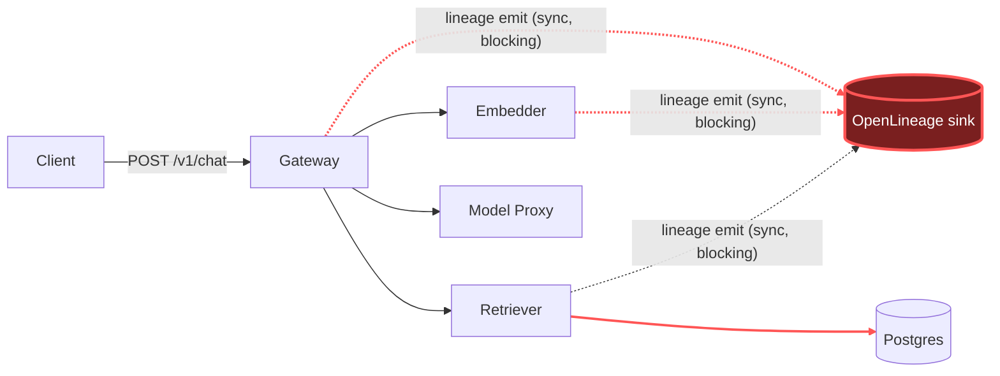

# Postmortem: gateway availability error budget burning slowly (10% of the 28d budget in 6h; 30m & 6h windows)

- **Status:** open
- **Severity:** sev2
- **Verified:** no
- **Opened:** 2026-08-03 20:26:44Z
- **Resolved:** (still open)

## Timeline (machine-generated)

All times UTC on 2026-08-03 unless a full date is shown.

| Time (UTC) | Source | Event |
| --- | --- | --- |
| 20:26:10Z | alert | alert firing: SLO gateway availability — slow burn |
| 20:32:16Z | verification | recovery NOT verified — deadline armed |
| 20:42:39Z | log-spike | log-spike onset: {"level":"warn","service":"gateway","message":"lineage emit failed","trace_id":"70c3bc5116e57899ce750a020a5c818d","span_id":"3ea18e90ec4e995a","time":"2026-08-03T20:42:39.820Z","reason":"The operation timed out.","job":"ra… |
| 20:48:03Z | log-spike | log-spike onset: {"level":"warn","service":"embedder","message":"lineage emit failed","trace_id":"43b9670cabd0c319ee74fd4acebe8c54","span_id":"7f632de21744bdec","time":"2026-08-03T20:48:03.275Z","reason":"The operation timed out.","job":"r… |
| 20:54:34Z | verification | recovery NOT verified — deadline armed |

## Evidence links

- [Loki — logs over the incident window](http://localhost:3001/explore?schemaVersion=1&panes=%7B%22pm%22%3A+%7B%22datasource%22%3A+%22loki%22%2C+%22queries%22%3A+%5B%7B%22refId%22%3A+%22A%22%2C+%22datasource%22%3A+%7B%22type%22%3A+%22loki%22%2C+%22uid%22%3A+%22loki%22%7D%2C+%22expr%22%3A+%22%7Bnamespace%3D%5C%22subject%5C%22%7D+%7C~+%5C%22%28%3Fi%29error%7Cfailed%5C%22%22%7D%5D%2C+%22range%22%3A+%7B%22from%22%3A+%221785788804787%22%2C+%22to%22%3A+%221785790862563%22%7D%7D%7D&orgId=1)
- [Mimir — metrics over the incident window](http://localhost:3001/explore?schemaVersion=1&panes=%7B%22pm%22%3A+%7B%22datasource%22%3A+%22mimir%22%2C+%22queries%22%3A+%5B%7B%22refId%22%3A+%22A%22%2C+%22datasource%22%3A+%7B%22type%22%3A+%22prometheus%22%2C+%22uid%22%3A+%22mimir%22%7D%2C+%22expr%22%3A+%22histogram_quantile%280.95%2C+sum%28rate%28http_server_duration_milliseconds_bucket%5B5m%5D%29%29+by+%28le%29%29%22%7D%5D%2C+%22range%22%3A+%7B%22from%22%3A+%221785788804787%22%2C+%22to%22%3A+%221785790862563%22%7D%7D%7D&orgId=1)

## Investigation context

**Runbook match:** none — no tool narrowing applied for this alert. Available runbooks: README.md, canary-abort.md, ci-pipeline-red.md, dq-freshness-stall.md, gateway-high-error-rate.md, k8s-crashloop.md, k8s-node-failure.md, snapshot-agent-audit.md, stale-secret.md

Pre-check battery (as injected at run start)

## Pre-check leads

### recent_deploys — LEAD
No deploy in the last 60m — rule out the reflex answer.
- No deploy in the last 60m — rule out the reflex answer.

### log_spike — LEAD
error/failed log rate 200/10min vs baseline 0/10min (200x baseline) — onset: {"level":"warn","service":"embedder","message":"lineage emit failed","trace_id":"43b9670cabd0c319ee74fd4acebe8c54","span_id":"7f632de21744bdec","time":"2026-08-03T20:48:03.275Z","reason":"The operation timed out.","job":"rag.embed","eventType":"START"} at 2026-08-03T20:48:03.276255+00:00
- error/failed log rate 200/10min vs baseline 0/10min (200x baseline) — onset: {"level":"warn","service":"embedder","message":"lineage emit failed","trace_id":"43b9670cabd0c319ee74fd4acebe8… (truncated)

### kube_scan — UNAVAILABLE
error: You must be logged in to the server (Unauthorized)

### rollout_state — UNAVAILABLE
gateway: E0803 22:54:49.985188   26216 memcache.go:265] "Unhandled Error" err="couldn't get current server API group list: the server has asked for the client to provide credentials"
E0803 22:54:50.067176   26216 memcache.go:265] "Unhandled Error" err="couldn't get current server API group list: the server has asked for the client to provide credentials"
E0803 22:54:50.139962   26216 memcache.go:265] "Unhandled Error" err="couldn't get current server API group list: the server has asked for the client to; gateway analysis: E0803 22:54:49.969484   46112 memcache.go:265] "Unhandled Error" err="couldn't get current server API group list: the server has asked for the client to provide credentials"
E0803 22:54:50.067176   46112 memcache.go:265] "Unhandled Error"
… (section truncated)

### secret_age — UNAVAILABLE
error: You must be logged in to the server (Unauthorized)

## Narrative

## Incident outcome: root cause confirmed (recurrence of the known lineage-timeout defect) — condition self-resolved before any infra remediation could apply; alert still firing only on trailing-window burn math

**Summary:** This is attempt 3 on the same page. The prior attempt correctly identified the root cause (OpenLineage lineage-emission calls blocking synchronously against an unresponsive lineage sink) but could not apply its proposed remediation (rolling restart of retriever/embedder) because every cluster-write tool was returning `Unauthorized`. On this pass I re-verified from scratch rather than retrying the same blocked action.

**New checks performed before touching anything:**
- Ruled out the "stuck CI pipeline" hypothesis explicitly: the last 10 Gitea Actions runs on `main` are green (run #111, sha `d62500f603`, all jobs succeeded); the one red run (#110, `test` job failure) was immediately reverted in #111. Nothing is blocking a fix from shipping.
- Ruled out a bad deploy: `deploy_history` over the trailing 6h returned zero entries; `argo_app`/`kubectl top` are still `Unauthorized` (same broken credential the prior attempt hit), but `restart_workload` dry-run now succeeds, so remediation-path auth has at least partially recovered since the last attempt.
- Confirmed my own earlier Loki queries in this session had been silently matching nothing — the log stream label is `service_name`, not `service` (the JSON body field). Re-querying with the correct label surfaced the full picture.

**Root cause (evidence-backed):** Same defect as previously diagnosed — `gateway`, `embedder`, and `retriever` call an OpenLineage sink synchronously on the hot request path (`rag.chat` / `rag.embed` / `rag.retrieve` / `rag.inference` spans all carry a `lineage.run_id` and block on emit). When that sink stalls, the calling service blocks for the full timeout. This alert's window actually straddles **two distinct SLI dips**: an earlier, already-covered malformed-JSON burst (fully recovered before this dip started, not the subject of this report), and a second burst starting after that recovery — hundreds of `"lineage emit failed" ... "reason":"The operation timed out."` warnings across all three services, matched one-for-one with slow spans (a full trace, `fe340d4c217fa36ac181297f6ca2b61f`, shows `POST embedder` taking 6.01s and the overall `/v1/chat` taking 12.95s, both returning HTTP 200 — the requests eventually succeeded, they just blocked). `slo:gateway_latency:sli_ratio5m` fell to ~0.04–0.05 and `slo:gateway_availability:sli_ratio5m` fell to ~0.67–0.69 during this second burst. CPU on gateway/embedder rose modestly (0.015 → ~0.17 cores) during the burst — consistent with threads/timers piling up while blocked, not with resource exhaustion (no OOM events, no throttling, memory flat and low). No k8s warning events at all in the window.

**What actually fixed it:** Nothing I did. The lineage-emit warnings stopped appearing at 20:50:54 and have not recurred; `slo:gateway_availability:error_ratio5m` dropped to exactly 0 by ~20:53:27 and has held there; the last 5 minutes show zero `lineage emit failed` lines and zero traces over 1s. The sink recovered on its own, same as the intermittent pattern implied by the prior postmortem. I re-confirmed this is real recovery, not a metrics gap, via three independent signals (Loki, Tempo, Mimir) all agreeing.

**Why no remediation was executed this time:** `restart_workload` dry-run against `embedder` now succeeds (action_id available), so the tool is no longer blocked. But restarting an app pod does not fix an external lineage sink, and the service is already back to 0% error rate with zero slow requests — there is nothing left to verify a restart would improve, and forcing one against a currently-healthy service isn't a justified action on the evidence in front of me. The alert is still reported `active` only because it's evaluated over 30m/6h burn windows that still contain the burst; `slo:gateway_availability:error_ratio30m` is still ~0.31 and will age back down as the burst ages out of that window (expected clear roughly 30 minutes after the 20:50:54 tail of the burst, i.e. around 21:20–21:25 UTC), with no action available to accelerate a sliding-window statistic.

**Lessons:**
1. The actual fix belongs in application code: make the OpenLineage emit call fire-and-forget (or bound it with a short timeout + circuit breaker) in `gateway`/`embedder`/`retriever` so a stalled lineage sink can never block the request path. This is the second time this exact defect has burned the availability SLO; it should be a tracked follow-up, not another on-call remediation.
2. The cluster read-credential (`kubectl_read`, `argo_app`) is still broken independently of this incident — `top pods`/`get pods`/`argo_app` all return the same `Unauthorized` error seen in the prior attempt. This should be fixed proactively so a future on-call pass isn't flying blind on cluster state.
3. Watch for silent zero-result queries: an incorrect Loki label (`service` vs `service_name`) made this look log-silent for a while — worth hard-coding the correct label set into the runbook for this alert (none currently matches this alertname).

The break is the dashed red hop into the OpenLineage sink: `gateway`/`embedder`/`retriever` all call it synchronously on the request path, and when it stalls, the blocking call — not the sink failure itself — is what burns the availability/latency SLOs. The sink recovered on its own before this pass could remediate anything.
