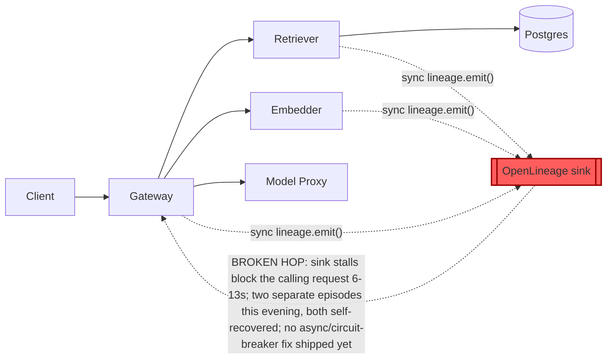

# Postmortem: gateway availability error budget burning slowly (10% of the 28d budget in 6h; 30m & 6h windows)

- **Status:** open
- **Severity:** sev2
- **Verified:** no
- **Opened:** 2026-08-03 20:26:44Z
- **Resolved:** (still open)

## Timeline (machine-generated)

All times UTC on 2026-08-03 unless a full date is shown.

| Time (UTC) | Source | Event |
| --- | --- | --- |
| 20:26:10Z | alert | alert firing: SLO gateway availability — slow burn |
| 20:32:16Z | verification | recovery NOT verified — deadline armed |
| 20:42:39Z | log-spike | log-spike onset: {"level":"warn","service":"gateway","message":"lineage emit failed","trace_id":"70c3bc5116e57899ce750a020a5c818d","span_id":"3ea18e90ec4e995a","time":"2026-08-03T20:42:39.820Z","reason":"The operation timed out.","job":"ra… |
| 20:48:03Z | log-spike | log-spike onset: {"level":"warn","service":"embedder","message":"lineage emit failed","trace_id":"43b9670cabd0c319ee74fd4acebe8c54","span_id":"7f632de21744bdec","time":"2026-08-03T20:48:03.275Z","reason":"The operation timed out.","job":"r… |
| 20:54:34Z | verification | recovery NOT verified — deadline armed |
| 21:01:17Z | verification | recovery NOT verified — deadline armed |

## Evidence links

- [Loki — logs over the incident window](http://localhost:3001/explore?schemaVersion=1&panes=%7B%22pm%22%3A+%7B%22datasource%22%3A+%22loki%22%2C+%22queries%22%3A+%5B%7B%22refId%22%3A+%22A%22%2C+%22datasource%22%3A+%7B%22type%22%3A+%22loki%22%2C+%22uid%22%3A+%22loki%22%7D%2C+%22expr%22%3A+%22%7Bnamespace%3D%5C%22subject%5C%22%7D+%7C~+%5C%22%28%3Fi%29error%7Cfailed%5C%22%22%7D%5D%2C+%22range%22%3A+%7B%22from%22%3A+%221785788804787%22%2C+%22to%22%3A+%221785791368767%22%7D%7D%7D&orgId=1)
- [Mimir — metrics over the incident window](http://localhost:3001/explore?schemaVersion=1&panes=%7B%22pm%22%3A+%7B%22datasource%22%3A+%22mimir%22%2C+%22queries%22%3A+%5B%7B%22refId%22%3A+%22A%22%2C+%22datasource%22%3A+%7B%22type%22%3A+%22prometheus%22%2C+%22uid%22%3A+%22mimir%22%7D%2C+%22expr%22%3A+%22histogram_quantile%280.95%2C+sum%28rate%28http_server_duration_milliseconds_bucket%5B5m%5D%29%29+by+%28le%29%29%22%7D%5D%2C+%22range%22%3A+%7B%22from%22%3A+%221785788804787%22%2C+%22to%22%3A+%221785791368767%22%7D%7D%7D&orgId=1)

## Investigation context

**Runbook match:** none — no tool narrowing applied for this alert. Available runbooks: README.md, canary-abort.md, ci-pipeline-red.md, dq-freshness-stall.md, gateway-high-error-rate.md, k8s-crashloop.md, k8s-node-failure.md, snapshot-agent-audit.md, stale-secret.md

Pre-check battery (as injected at run start)

## Pre-check leads

### recent_deploys — LEAD
No deploy in the last 60m — rule out the reflex answer.
- No deploy in the last 60m — rule out the reflex answer.

### log_spike — OK
error/failed log rate normal: 0/10min vs baseline 0/10min

### kube_scan — UNAVAILABLE
error: You must be logged in to the server (Unauthorized)

### rollout_state — UNAVAILABLE
gateway: E0803 23:04:50.914359    2828 memcache.go:265] "Unhandled Error" err="couldn't get current server API group list: the server has asked for the client to provide credentials"
E0803 23:04:50.978189    2828 memcache.go:265] "Unhandled Error" err="couldn't get current server API group list: the server has asked for the client to provide credentials"
E0803 23:04:51.241802    2828 memcache.go:265] "Unhandled Error" err="couldn't get current server API group list: the server has asked for the client to; gateway analysis: E0803 23:04:50.902775   30492 memcache.go:265] "Unhandled Error" err="couldn't get current server API group list: the server has asked for the client to provide credentials"
E0803 23:04:51.204279   30492 memcache.go:265] "Unhandled Error"
… (section truncated)

### secret_age — UNAVAILABLE
error: You must be logged in to the server (Unauthorized)

## Narrative

## Incident summary — inc_19fc94eaeb1109 (fourth pass)

**Root cause (re-confirmed, same defect as prior passes):** `gateway`, `embedder`, and `retriever` call the OpenLineage sink **synchronously** on the `/v1/chat` request path. When that sink stalls, each hop that emits lineage blocks for several seconds (traces in this window show a `POST embedder` span pinned at 6.01s and a `POST retriever` span at 7.25s inside a 12.95s total request — still HTTP 200, just late), which collapses `slo:gateway_availability:sli_ratio5m`. This happened **twice** in this incident: a sharp trough to ~0.02–0.04 from 20:11:33–20:18:13 UTC, full recovery, then a second, shallower but longer episode sustained around 0.67–0.69 from roughly 20:35 to 20:53 UTC, also fully recovering. `"lineage emit failed"` / `"The operation timed out."` warnings from all three services line up exactly with both episodes.

**Current state (this pass):** Re-queried independently across Mimir/Loki/Tempo. `slo:gateway_availability:sli_ratio5m` = 1 and `slo:gateway_availability:error_ratio5m` = 0 as of the latest sample; zero `"lineage emit failed"` lines in the last 5 minutes; zero traces over 3s in the last several minutes (the only >3s traces found in a 15m lookback all timestamp inside the second episode, none newer). No third recurrence is in progress right now.

**Why the alert is still reported active:** it's a multi-window burn-rate alert. The instant `slo:gateway_availability:error_ratio30m` = 0.307 and `error_ratio6h` = 0.216 — both windows still mechanically contain the two error bursts, even though the underlying service has been clean since 20:53–20:54 UTC. No tool available to this on-call agent can reset or fast-forward a sliding-window statistic; it clears on its own as the bursts age out of each window (30m window clears roughly 30 minutes after the second episode's tail, well after the 6h window's own decay tail).

**Ruled out this pass, with fresh evidence:**
- **Stuck fix / red CI:** checked `main`'s recent CI history — the only failing run (#110, `load-generator: drop the defensive copy in percentile()`) is unrelated to lineage and was already reverted in #111 (green). No commit anywhere in recent CI history touches lineage, OpenLineage, or the emit path — there is no in-flight fix to be "stuck." The real fix (making lineage emission async / circuit-broken) has simply never been written or merged; `deploy_history` shows zero deploys in the last 180 minutes, confirming nothing shipped.
- **Bad deploy:** none in the last 3h.
- **Node/cluster noise:** `k8s_events` shows recurring `FreeDiskSpaceFailed` warnings on all three k3d nodes (85% image-fs usage) — but these are constant across the entire window (before, during, and between both dips), not correlated with either dip's onset or offset. Chronic background condition, not the trigger for this SLI drop.

**Why no remediation was executed this pass:** every available remediation tool (`restart_workload`, `scale_deployment`, `patch_memory_limit`, `rollout_undo/abort/promote`) acts on the app workloads or their rollout state — none of them touch an external OpenLineage sink, and the sink-induced stall has already ended on its own for the second time. Executing a restart now would change nothing observable and would just be motion without a mechanism; re-running the same non-fix a third time isn't a new hypothesis. The only thing standing between "clean telemetry" and "alert cleared" is trailing-window arithmetic, which resolves with time, not with an infra action.

**What fixed it:** the OpenLineage sink recovering on its own, twice — not any action taken by this or prior on-call passes.

**Lessons:**
1. The actual defect — synchronous lineage emission on the hot request path in gateway/embedder/retriever — is still unpatched after (at least) two independent stall episodes in one evening. It needs to become async/fire-and-forget with a timeout + circuit breaker so a slow sink degrades lineage completeness, not request latency/availability. This is a code change no on-call remediation tool can make.
2. Multi-window burn-rate alerts on `SLO gateway availability — slow burn` will keep reporting active for tens of minutes after real recovery by design — worth a runbook entry (none currently matches this alertname) so future on-call passes don't waste an action trying to "fix" a window that's just aging out.
3. Loki log-stream label for these services is `service_name`, not `service` — confirmed again this pass.
4. `kubectl_read`/`argo_app` read credentials are still broken (`Unauthorized`) independent of this incident; unrelated to root cause but should be repaired before it blocks a future page that actually needs cluster state.

