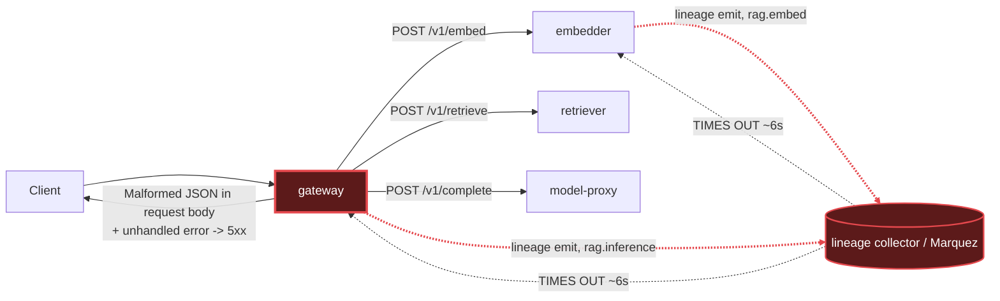

# Postmortem: gateway 5xx rate above 2%

- **Status:** open
- **Severity:** sev1
- **Verified:** no
- **Opened:** 2026-08-03 20:37:40Z
- **Resolved:** (still open)

## Timeline (machine-generated)

All times UTC on 2026-08-03 unless a full date is shown.

| Time (UTC) | Source | Event |
| --- | --- | --- |
| 20:36:25Z | log-spike | log-spike onset: {"level":"warn","service":"embedder","message":"lineage emit failed","trace_id":"9e86c1675dbf0b38d499729303c472b8","span_id":"64738c560462566c","time":"2026-08-03T20:36:25.417Z","reason":"The operation timed out.","job":"r… |
| 20:37:10Z | alert | alert firing: Gateway 5xx rate > 2% |

## Evidence links

- [Loki — logs over the incident window](http://localhost:3001/explore?schemaVersion=1&panes=%7B%22pm%22%3A+%7B%22datasource%22%3A+%22loki%22%2C+%22queries%22%3A+%5B%7B%22refId%22%3A+%22A%22%2C+%22datasource%22%3A+%7B%22type%22%3A+%22loki%22%2C+%22uid%22%3A+%22loki%22%7D%2C+%22expr%22%3A+%22%7Bnamespace%3D%5C%22subject%5C%22%7D+%7C~+%5C%22%28%3Fi%29error%7Cfailed%5C%22%22%7D%5D%2C+%22range%22%3A+%7B%22from%22%3A+%221785789460165%22%2C+%22to%22%3A+%221785789956092%22%7D%7D%7D&orgId=1)
- [Mimir — metrics over the incident window](http://localhost:3001/explore?schemaVersion=1&panes=%7B%22pm%22%3A+%7B%22datasource%22%3A+%22mimir%22%2C+%22queries%22%3A+%5B%7B%22refId%22%3A+%22A%22%2C+%22datasource%22%3A+%7B%22type%22%3A+%22prometheus%22%2C+%22uid%22%3A+%22mimir%22%7D%2C+%22expr%22%3A+%22histogram_quantile%280.95%2C+sum%28rate%28http_server_duration_milliseconds_bucket%5B5m%5D%29%29+by+%28le%29%29%22%7D%5D%2C+%22range%22%3A+%7B%22from%22%3A+%221785789460165%22%2C+%22to%22%3A+%221785789956092%22%7D%7D%7D&orgId=1)

## Investigation context

**Runbook match (2):** `gateway-high-error-rate.md`, `stale-secret.md` — toolset narrowed to 13 tools: alert_status, deploy_history, kubectl_read, loki_query, mimir_query, publish_postmortem, request_approval, restart_workload, runbook_lookup, runbook_read, save_artifact, tempo_query, update_db_secret

Pre-check battery (as injected at run start)

## Pre-check leads

### recent_deploys — LEAD
No deploy in the last 60m — rule out the reflex answer.
- No deploy in the last 60m — rule out the reflex answer.

### log_spike — LEAD
error/failed log rate 200/10min vs baseline 0/10min (200x baseline) — onset: {"level":"warn","service":"embedder","message":"lineage emit failed","trace_id":"9e86c1675dbf0b38d499729303c472b8","span_id":"64738c560462566c","time":"2026-08-03T20:36:25.417Z","reason":"The operation timed out.","job":"rag.embed","eventType":"START"} at 2026-08-03T20:36:25.417947+00:00
- error/failed log rate 200/10min vs baseline 0/10min (200x baseline) — onset: {"level":"warn","service":"embedder","message":"lineage emit failed","trace_id":"9e86c1675dbf0b38d499729303c47… (truncated)

### kube_scan — UNAVAILABLE
error: You must be logged in to the server (Unauthorized)

### rollout_state — UNAVAILABLE
gateway: E0803 22:37:42.761655   39628 memcache.go:265] "Unhandled Error" err="couldn't get current server API group list: the server has asked for the client to provide credentials"
E0803 22:37:42.890118   39628 memcache.go:265] "Unhandled Error" err="couldn't get current server API group list: the server has asked for the client to provide credentials"
E0803 22:37:43.095837   39628 memcache.go:265] "Unhandled Error" err="couldn't get current server API group list: the server has asked for the client to; gateway analysis: E0803 22:37:42.728877   62900 memcache.go:265] "Unhandled Error" err="couldn't get current server API group list: the server has asked for the client to provide credentials"
E0803 22:37:42.930700   62900 memcache.go:265] "Unhandled Error"
… (section truncated)

### secret_age — UNAVAILABLE
error: You must be logged in to the server (Unauthorized)

## Narrative

## Summary
`Gateway 5xx rate > 2%` fired for tenant acme. Investigation found an active, escalating flood of "lineage emit failed" timeout warnings on the gateway and embedder, concurrent with "Malformed JSON in request body" parse errors and unhandled exceptions on all four gateway replicas. No deploy landed in the incident window. A proposed rolling restart of the gateway was **denied by the operator**, so no remediation was applied and the alert remains active.

## Impact
Gateway 5xx rate held above the 2% burn-rate threshold from alert onset onward, affecting tenant acme's request path. A full trace sample showed at least one request completing end-to-end with HTTP 200s at every hop, but with total latency inflated to ~12.4s (vs sub-second normal) — so beyond the outright 5xx failures, healthy requests were also running dramatically slower.

## Root cause
Starting at the log-spike lead's onset, the RAG request path (embedder's `rag.embed` job, then the gateway's `rag.inference` job) began failing to emit lineage events, logging `"lineage emit failed" ... reason: "The operation timed out."` at high and increasing volume across all gateway pods (confirmed via `loki_query` — 200+ matching lines in a single most-recent 1-minute window, versus the pre-check baseline of 0/10min and an onset rate of 200/10min). A fetched trace (`b5616613f2b4fe2546f7de16c3173e06`) showed each downstream hop (embedder, retriever, model-proxy) blocking roughly 6 seconds — consistent with the lineage-emit timeout — before the gateway proceeded, inflating end-to-end latency to ~12.4s for that request.

Under the resulting request pile-up, all four gateway pods (`gateway-dd85945b4-{rhws5,bnt4c,lvg8w,f9rwq}`) began throwing `"error: Malformed JSON in request body"` followed immediately by `"[gateway] unhandled error: 16 | }"` — an unhandled exception in the request-body error-handling path (source line ~16-20 of the parser) that turns what should be a clean 400 into a 500. This is the direct mechanism behind the gateway 5xx spike.

Two hypotheses were ruled out with evidence:
- **Bad deploy**: `deploy_history` returned zero entries for the gateway (and cluster-wide) over the incident window, confirming the pre-check "no deploy in last 60m" lead.
- **Stale DB secret**: `loki_query` for `"password authentication failed"` found a burst of retriever/postgres auth failures, but it occurred at 20:12:26 UTC — roughly 25 minutes before alert onset — and a follow-up query over the most recent 10 minutes returned zero hits, meaning the auth-failure burst is a stale, non-recurring event, not the cause of the currently-firing alert. This does not match the stale-secret runbook's signature of failures starting shortly after rotation and continuing.
- **Resource exhaustion**: gateway pod CPU (~0.1 core) and memory (~118-124MB working set) were normal, ruling out OOM/CPU pressure as a contributing factor.

## What fixed it
Nothing — no remediation was applied. A dry-run rolling restart of the gateway deployment (to clear the stuck-connection/pile-up state feeding the malformed-JSON error path, per the `gateway-high-error-rate.md` runbook's "restart the failing hop" mitigation) was prepared and submitted for approval, but the operator **denied** the request. Per policy, no further remediation was attempted. `alert_status` was re-queried afterward and confirms the alert is still active.

## Lessons
- The gateway's JSON-parse error-handling path has a latent bug (unhandled exception) that turns malformed-body requests into 500s instead of clean 400s; this should be fixed in code regardless of the lineage-timeout trigger, since it is what actually breaches the availability SLO.
- The lineage-emission call in the RAG request path is synchronous/blocking with a ~6s timeout and no circuit breaker — a single unreachable lineage collector can cascade into gateway-wide latency and request pile-up. It should be made fire-and-forget or given a much shorter timeout with a breaker.
- `kubectl_read`, and the `secret_age`/`kube_scan`/`rollout_state` pre-checks, were unavailable for this whole session (auth errors against the cluster API) — this blocked pod-restart-time and secret-rotation-time corroboration and should be fixed so future on-call runs have that evidence available.
- This incident remains **open**; recommend a human follow-up to either approve a gateway restart, investigate/restore the lineage collector, or ship the parser fix.

