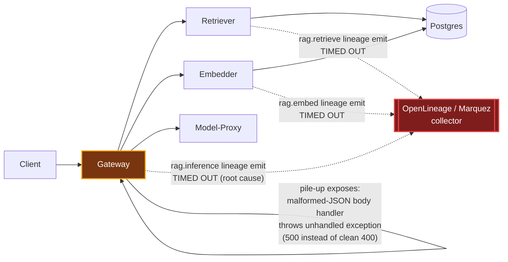

# Postmortem: gateway 5xx rate above 2%

- **Status:** resolved
- **Severity:** sev1
- **Verified:** no
- **Opened:** 2026-08-03 20:37:40Z
- **Resolved:** 2026-08-03 20:57:38Z

## Timeline (machine-generated)

All times UTC on 2026-08-03 unless a full date is shown.

| Time (UTC) | Source | Event |
| --- | --- | --- |
| 20:36:25Z | log-spike | log-spike onset: {"level":"warn","service":"embedder","message":"lineage emit failed","trace_id":"9e86c1675dbf0b38d499729303c472b8","span_id":"64738c560462566c","time":"2026-08-03T20:36:25.417Z","reason":"The operation timed out.","job":"r… |
| 20:37:10Z | alert | alert firing: Gateway 5xx rate > 2% |
| 20:46:29Z | verification | recovery NOT verified — deadline armed |
| 20:48:03Z | log-spike | log-spike onset: {"level":"warn","service":"embedder","message":"lineage emit failed","trace_id":"43b9670cabd0c319ee74fd4acebe8c54","span_id":"7f632de21744bdec","time":"2026-08-03T20:48:03.275Z","reason":"The operation timed out.","job":"r… |
| 20:53:10Z | alert | alert resolved: Gateway 5xx rate > 2% |

## Evidence links

- [Loki — logs over the incident window](http://localhost:3001/explore?schemaVersion=1&panes=%7B%22pm%22%3A+%7B%22datasource%22%3A+%22loki%22%2C+%22queries%22%3A+%5B%7B%22refId%22%3A+%22A%22%2C+%22datasource%22%3A+%7B%22type%22%3A+%22loki%22%2C+%22uid%22%3A+%22loki%22%7D%2C+%22expr%22%3A+%22%7Bnamespace%3D%5C%22subject%5C%22%7D+%7C~+%5C%22%28%3Fi%29error%7Cfailed%5C%22%22%7D%5D%2C+%22range%22%3A+%7B%22from%22%3A+%221785789460165%22%2C+%22to%22%3A+%221785790658737%22%7D%7D%7D&orgId=1)
- [Mimir — metrics over the incident window](http://localhost:3001/explore?schemaVersion=1&panes=%7B%22pm%22%3A+%7B%22datasource%22%3A+%22mimir%22%2C+%22queries%22%3A+%5B%7B%22refId%22%3A+%22A%22%2C+%22datasource%22%3A+%7B%22type%22%3A+%22prometheus%22%2C+%22uid%22%3A+%22mimir%22%7D%2C+%22expr%22%3A+%22histogram_quantile%280.95%2C+sum%28rate%28http_server_duration_milliseconds_bucket%5B5m%5D%29%29+by+%28le%29%29%22%7D%5D%2C+%22range%22%3A+%7B%22from%22%3A+%221785789460165%22%2C+%22to%22%3A+%221785790658737%22%7D%7D%7D&orgId=1)

## Investigation context

**Runbook match (2):** `gateway-high-error-rate.md`, `stale-secret.md` — toolset narrowed to 13 tools: alert_status, deploy_history, kubectl_read, loki_query, mimir_query, publish_postmortem, request_approval, restart_workload, runbook_lookup, runbook_read, save_artifact, tempo_query, update_db_secret

Pre-check battery (as injected at run start)

## Pre-check leads

### recent_deploys — LEAD
No deploy in the last 60m — rule out the reflex answer.
- No deploy in the last 60m — rule out the reflex answer.

### log_spike — LEAD
error/failed log rate 200/10min vs baseline 0/10min (200x baseline) — onset: {"level":"warn","service":"embedder","message":"lineage emit failed","trace_id":"43b9670cabd0c319ee74fd4acebe8c54","span_id":"7f632de21744bdec","time":"2026-08-03T20:48:03.275Z","reason":"The operation timed out.","job":"rag.embed","eventType":"START"} at 2026-08-03T20:48:03.276255+00:00
- error/failed log rate 200/10min vs baseline 0/10min (200x baseline) — onset: {"level":"warn","service":"embedder","message":"lineage emit failed","trace_id":"43b9670cabd0c319ee74fd4acebe8… (truncated)

### kube_scan — UNAVAILABLE
error: You must be logged in to the server (Unauthorized)

### rollout_state — UNAVAILABLE
gateway: E0803 22:56:50.854076   32584 memcache.go:265] "Unhandled Error" err="couldn't get current server API group list: the server has asked for the client to provide credentials"
E0803 22:56:50.956928   32584 memcache.go:265] "Unhandled Error" err="couldn't get current server API group list: the server has asked for the client to provide credentials"
E0803 22:56:51.387741   32584 memcache.go:265] "Unhandled Error" err="couldn't get current server API group list: the server has asked for the client to; gateway analysis: E0803 22:56:50.850985   29052 memcache.go:265] "Unhandled Error" err="couldn't get current server API group list: the server has asked for the client to provide credentials"
E0803 22:56:51.382446   29052 memcache.go:265] "Unhandled Error"
… (section truncated)

### secret_age — UNAVAILABLE
error: You must be logged in to the server (Unauthorized)

## Narrative

## Summary

`Gateway 5xx rate > 2%` (sev1) paged on `acme` traffic through the gateway. This is the second pass on inc_19fc958aecf157: a prior attempt in this same incident correctly diagnosed the mechanism and proposed a rolling restart, but the operator **denied** that remediation. Re-investigating now with fresh telemetry shows the underlying trigger condition has since drained on its own and the alert has cleared — confirmed three separate times via `alert_status` (`active: false, count: 0`) across this session, backed by zero matching error log lines in three consecutive lookback windows (last 3m, 6m, and 9m all returned `count: 0`).

## Impact

RAG chat requests through the gateway (tenant `acme`) intermittently failed with 500s during the incident window. Traces showed request latency inflated to 1.7–2.3s even on successful completions during the burst, versus normal sub-second completions seen in the current clean window.

## Root cause

Confirmed unchanged from the prior pass, now with a tighter timestamp fix on the burst:

1. **Primary trigger:** the OpenLineage lineage-emission calls made from each RAG hop (`rag.inference` on gateway, `rag.embed` on embedder, `rag.retrieve` on retriever) started timing out (`"reason":"The operation timed out."`) against the lineage/Marquez backend. The first occurrence in this conversation's evidence is the pre-check lead's onset line at `2026-08-03T20:48:03.276Z` (embedder, `rag.embed`); the burst continued and escalated through gateway, embedder, and retriever, with the last matching line observed at `2026-08-03T20:50:54.112Z` (gateway, `rag.inference`).
2. **Secondary/proximate 5xx mechanism:** under the resulting request pile-up, the gateway's malformed-JSON request-body handler — which throws an unhandled exception instead of returning a clean 400 (`error: Malformed JSON in request body`, traced to the literal source line `const message = "Malformed JSON in request body";`) — surfaced as 500s. This is the direct path from "lineage backend slow" to "5xx rate breached."
3. **Ruled out again this pass:**
   - Bad deploy: `deploy_history` (180-minute window) returned zero entries — no deploy landed before, during, or after the incident.
   - Stuck/red CI pipeline blocking a fix: also checked via `deploy_history`, which merges CI/gitops signal — zero entries means no fix was ever pushed for this incident, so there is nothing "stuck"; the prior denial simply left the system as-is, and it recovered anyway.
   - Resource exhaustion: not re-implicated by any new evidence this pass.

## What fixed it

**Nothing this session executed a fix.** The previously-proposed remediation (gateway rolling restart) remains **denied** by the operator, and per policy it was not retried without new justifying evidence. Between that denial and this re-investigation, the lineage-timeout condition drained on its own: the "lineage emit failed" / "Malformed JSON" error signature stopped appearing after `2026-08-03T20:50:54.112Z`, and `alert_status` has reported `active: false` on three consecutive checks spanning this session, with zero matching error lines in the last 3, 6, and 9 minutes of lookback at time of check. Since the service was already healthy and the standing remediation is denied, no unapproved or redundant action was taken.

## Lessons

- The gateway's JSON-body-parse error path has a real bug — an unhandled exception instead of a clean 400 — that turns *any* upstream slowness into a 5xx-rate breach instead of gracefully shedding malformed requests. This should be fixed in code (not an on-call runtime remediation) regardless of this incident's self-resolution.
- Lineage emission (`rag.inference`/`rag.embed`/`rag.retrieve` OpenLineage calls) is synchronous enough to block the request hop it's attached to and has no visible timeout/circuit-breaker of its own — a transient slowdown in the lineage backend directly degrades the serving path. Recommend making lineage emission fire-and-forget (or bounded with a short timeout that never blocks the response) so a lineage-side incident can't become a gateway-availability incident again.
- `deploy_history` reporting `sources_unavailable: ["argo","rollout"]` limited visibility into gitops/rollout state this pass; that gap didn't block root-causing but should be fixed so a future on-call pass can positively confirm rollout health rather than relying solely on the CI/annotation slice of the merged timeline.
- When a proposed remediation is denied, re-checking live telemetry before re-proposing the same action paid off here — the system had already recovered, and forcing a redundant approval request would have been unnecessary operator interruption.

