# Postmortem: gateway p95 latency above 2s

- **Status:** open
- **Severity:** sev1
- **Verified:** no
- **Opened:** 2026-08-03 20:40:42Z
- **Resolved:** (still open)

## Timeline (machine-generated)

All times UTC on 2026-08-03 unless a full date is shown.

| Time (UTC) | Source | Event |
| --- | --- | --- |
| 20:40:10Z | alert | alert firing: Gateway p95 latency > 2s |
| 20:40:31Z | log-spike | log-spike onset: {"level":"warn","service":"embedder","message":"lineage emit failed","trace_id":"6e41b1aa118a1e586d649baa0b2ddfc8","span_id":"ffe24ac508e1ffd4","time":"2026-08-03T20:40:31.894Z","reason":"The operation timed out.","job":"r… |

## Evidence links

- [Loki — logs over the incident window](http://localhost:3001/explore?schemaVersion=1&panes=%7B%22pm%22%3A+%7B%22datasource%22%3A+%22loki%22%2C+%22queries%22%3A+%5B%7B%22refId%22%3A+%22A%22%2C+%22datasource%22%3A+%7B%22type%22%3A+%22loki%22%2C+%22uid%22%3A+%22loki%22%7D%2C+%22expr%22%3A+%22%7Bnamespace%3D%5C%22subject%5C%22%7D+%7C~+%5C%22%28%3Fi%29error%7Cfailed%5C%22%22%7D%5D%2C+%22range%22%3A+%7B%22from%22%3A+%221785789642694%22%2C+%22to%22%3A+%221785790177807%22%7D%7D%7D&orgId=1)
- [Mimir — metrics over the incident window](http://localhost:3001/explore?schemaVersion=1&panes=%7B%22pm%22%3A+%7B%22datasource%22%3A+%22mimir%22%2C+%22queries%22%3A+%5B%7B%22refId%22%3A+%22A%22%2C+%22datasource%22%3A+%7B%22type%22%3A+%22prometheus%22%2C+%22uid%22%3A+%22mimir%22%7D%2C+%22expr%22%3A+%22histogram_quantile%280.95%2C+sum%28rate%28http_server_duration_milliseconds_bucket%5B5m%5D%29%29+by+%28le%29%29%22%7D%5D%2C+%22range%22%3A+%7B%22from%22%3A+%221785789642694%22%2C+%22to%22%3A+%221785790177807%22%7D%7D%7D&orgId=1)

## Investigation context

**Runbook match:** none — no tool narrowing applied for this alert. Available runbooks: README.md, canary-abort.md, ci-pipeline-red.md, dq-freshness-stall.md, gateway-high-error-rate.md, k8s-crashloop.md, k8s-node-failure.md, snapshot-agent-audit.md, stale-secret.md

Pre-check battery (as injected at run start)

## Pre-check leads

### recent_deploys — LEAD
No deploy in the last 60m — rule out the reflex answer.
- No deploy in the last 60m — rule out the reflex answer.

### log_spike — LEAD
error/failed log rate 200/10min vs baseline 0/10min (200x baseline) — onset: {"level":"warn","service":"embedder","message":"lineage emit failed","trace_id":"6e41b1aa118a1e586d649baa0b2ddfc8","span_id":"ffe24ac508e1ffd4","time":"2026-08-03T20:40:31.894Z","reason":"The operation timed out.","job":"rag.embed","eventType":"COMPLETE"} at 2026-08-03T20:40:31.895809+00:00
- error/failed log rate 200/10min vs baseline 0/10min (200x baseline) — onset: {"level":"warn","service":"embedder","message":"lineage emit failed","trace_id":"6e41b1aa118a1e586d649baa0b2dd… (truncated)

### kube_scan — UNAVAILABLE
error: You must be logged in to the server (Unauthorized)

### rollout_state — UNAVAILABLE
gateway: E0803 22:40:50.150060   39628 memcache.go:265] "Unhandled Error" err="couldn't get current server API group list: the server has asked for the client to provide credentials"
E0803 22:40:50.343402   39628 memcache.go:265] "Unhandled Error" err="couldn't get current server API group list: the server has asked for the client to provide credentials"
E0803 22:40:51.127014   39628 memcache.go:265] "Unhandled Error" err="couldn't get current server API group list: the server has asked for the client to; gateway analysis: E0803 22:40:50.205854   64612 memcache.go:265] "Unhandled Error" err="couldn't get current server API group list: the server has asked for the client to provide credentials"
E0803 22:40:51.556196   64612 memcache.go:265] "Unhandled Error"
… (section truncated)

### secret_age — UNAVAILABLE
error: You must be logged in to the server (Unauthorized)

## Narrative

## Summary
Gateway p95 latency alert (sev1, tenant acme) fired after gateway request latency climbed from a ~1.9ms baseline to a sustained saturation pegged at the observed histogram's top bucket (16.384s). No runbook matched this alertname, so investigation proceeded from the pre-check leads (log spike, no recent deploy) plus direct telemetry.

## Impact
Every `/v1/chat` request through the gateway was affected once saturation set in — traces sampled during the incident window show individual requests taking 2.8s–6.5s end to end (well over the 2s SLO), with the retrieval and embedding stages each contributing roughly 2 seconds apiece inside the critical path. `dq_violations` also shows repeated `freshness` violations on the `inferences` dataset for tenants acme/bravo/abuser through the incident window, a downstream symptom of the same stall.

## Root cause
Every RAG stage (`rag.embed`, `rag.retrieve`, `rag.inference`) emits an OpenLineage event synchronously in the request path. Starting well before the alert, and escalating from ~20:35Z, gateway, embedder, and retriever logs fill with `"lineage emit failed", reason: "The operation timed out."` for each stage. Tempo traces confirm the embedder call (`POST embedder`) and retriever call (`POST retriever`) each individually took ~2s inside a single request — consistent with each stage blocking on its lineage emission until timeout, back-to-back, in the serial critical path of a single chat request.

This was compounded by a capacity mismatch: kube-state-metrics (via Mimir) showed only **one** pod each for `retriever` and `embedder` (vs. four for `gateway` and `model-proxy`). With each request holding its single worker for ~2s per blocked lineage call, the two undersized services became a serialization point — incoming request rate outpaced the drain rate, and the queue backed up until p95 saturated the metric's top bucket. CPU and memory on gateway/embedder/retriever all sat comfortably under their limits throughout (e.g. embedder ~105MB/512MB limit, retriever ~142MB/512MB limit, both <15% CPU), ruling out OOM or CPU throttling as the driver. No deploy landed in the 180 minutes before the alert (`deploy_history` returned zero entries) and the most recent CI run on `main` was ~20 hours prior — ruling out a bad release as the trigger.

Net root cause: a synchronous, blocking OpenLineage emission call to the lineage backend that started timing out, hitting every stage of every RAG request, whose blast radius was amplified by retriever/embedder running at a single replica each, producing a queueing collapse that breached the gateway p95 SLO.

## What fixed it
Proposed remediation: scale `retriever` and `embedder` from 1 → 4 replicas each, to add concurrency headroom and drain the backlog while the underlying lineage-emit timeout issue is addressed separately (no tool in this on-call kit can reach the lineage backend itself, and no bad deploy existed to roll back). Both scale actions were dry-run, summarized, and **approved** by the operator.

Execution failed on both `scale_deployment` calls (and a retry) with a cluster-wide `Unauthorized` error from the Kubernetes API. This matches the pre-check leads' `kube_scan` and `rollout_state` sections, which were already `UNAVAILABLE` with the identical "must be logged in to the server (Unauthorized)" error before any remediation was attempted — i.e. the on-call agent's cluster read/write credentials were already broken at page time, not broken by this action. **The remediation could not be applied.** Re-querying `alert_status` afterward shows the alert still active. The incident is NOT resolved.

## Lessons
- Fix the `agent-remediate` / cluster-read credentials for this on-call identity — every kubectl-backed tool (kubectl_read, scale_deployment, rollout_status) is currently unauthorized, which leaves this on-call agent unable to execute any real remediation against the cluster.
- Make OpenLineage/lineage emission in the RAG path asynchronous (fire-and-forget with a short bounded timeout, or queue it) so a slow/unreachable lineage backend cannot add latency to user-facing requests at all, let alone stack across three stages per request.
- Retriever and embedder should not run as single-replica deployments in front of user-facing traffic — a HorizontalPodAutoscaler or a higher baseline replica count would have limited the queueing blast radius even with the lineage timeouts present.
- No runbook currently matches `Gateway p95 latency > 2s` — author one covering: check deploy_history first (ruled out here), check span durations per RAG stage via Tempo, check for `lineage emit failed` timeout warnings across services, and check replica counts on retriever/embedder as a queueing risk factor.

```mermaid
flowchart LR
  client[Client] --> gateway["gateway (x4 pods)"]
  gateway --> embedder["embedder (x1 pod) ⚠ bottleneck"]
  gateway --> retriever["retriever (x1 pod) ⚠ bottleneck"]
  retriever --> pg[(Postgres: chunks)]
  gateway --> modelproxy["model-proxy (x4 pods)"]
  modelproxy --> gateway
  embedder -. "lineage emit BLOCKS ~2s, timeout" .-> marquez[["OpenLineage / Marquez sink"]]
  retriever -. "lineage emit BLOCKS ~2s, timeout" .-> marquez
  gateway -. "lineage emit BLOCKS, timeout" .-> marquez
  gateway --> clientResp[Client response, p95 saturated]

  style embedder stroke:#ff4d4d,stroke-width:3px
  style retriever stroke:#ff4d4d,stroke-width:3px
  style marquez stroke:#ff4d4d,stroke-width:3px,fill:#3a1414
  linkStyle 5 stroke:#ff4d4d,stroke-width:2px
  linkStyle 6 stroke:#ff4d4d,stroke-width:2px
  linkStyle 7 stroke:#ff4d4d,stroke-width:2px
```

Broken hop: the embedder→lineage and retriever→lineage emission calls (blocking, timing out at ~2s each) inside single-replica pods, serialized in the critical path of every `/v1/chat` request.

## Remediation status
Attempted (approved) but **not executed** — blocked by a pre-existing cluster authentication failure affecting all Kubernetes-backed on-call tools. Alert `Gateway p95 latency > 2s` remains **active** as of the last check.
