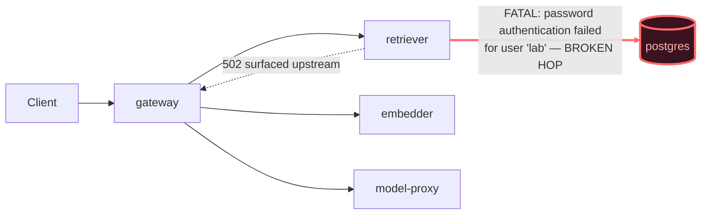

# Postmortem: gateway availability error budget burning fast (2% of the 28d budget in 1h; 5m & 1h windows)

- **Status:** open
- **Severity:** sev1
- **Verified:** no
- **Opened:** 2026-08-03 02:02:43Z
- **Resolved:** (still open)

## Timeline (machine-generated)

All times UTC on 2026-08-03 unless a full date is shown.

| Time (UTC) | Source | Event |
| --- | --- | --- |
| 02:02:10Z | alert | alert firing: SLO gateway availability — fast burn |
| 02:02:39Z | log-spike | log-spike onset: 817 \| errored(Errors.postgres(parseError(x))) |

## Evidence links

- [Loki — logs over the incident window](http://localhost:3001/explore?schemaVersion=1&panes=%7B%22pm%22%3A+%7B%22datasource%22%3A+%22loki%22%2C+%22queries%22%3A+%5B%7B%22refId%22%3A+%22A%22%2C+%22datasource%22%3A+%7B%22type%22%3A+%22loki%22%2C+%22uid%22%3A+%22loki%22%7D%2C+%22expr%22%3A+%22%7Bnamespace%3D%5C%22subject%5C%22%7D+%7C~+%5C%22%28%3Fi%29error%7Cfailed%5C%22%22%7D%5D%2C+%22range%22%3A+%7B%22from%22%3A+%221785722563040%22%2C+%22to%22%3A+%221785723035065%22%7D%7D%7D&orgId=1)
- [Mimir — metrics over the incident window](http://localhost:3001/explore?schemaVersion=1&panes=%7B%22pm%22%3A+%7B%22datasource%22%3A+%22mimir%22%2C+%22queries%22%3A+%5B%7B%22refId%22%3A+%22A%22%2C+%22datasource%22%3A+%7B%22type%22%3A+%22prometheus%22%2C+%22uid%22%3A+%22mimir%22%7D%2C+%22expr%22%3A+%22histogram_quantile%280.95%2C+sum%28rate%28http_server_duration_milliseconds_bucket%5B5m%5D%29%29+by+%28le%29%29%22%7D%5D%2C+%22range%22%3A+%7B%22from%22%3A+%221785722563040%22%2C+%22to%22%3A+%221785723035065%22%7D%7D%7D&orgId=1)

## Investigation context

**Runbook match (2):** `gateway-high-error-rate.md`, `stale-secret.md` — toolset narrowed to 13 tools: alert_status, deploy_history, kubectl_read, loki_query, mimir_query, publish_postmortem, request_approval, restart_workload, runbook_lookup, runbook_read, save_artifact, tempo_query, update_db_secret

Pre-check battery (as injected at run start)

## Pre-check leads

### recent_deploys — LEAD
No deploy in the last 60m — rule out the reflex answer.
- No deploy in the last 60m — rule out the reflex answer.

### log_spike — LEAD
error/failed log rate 200/10min vs baseline 0/10min (200x baseline) — onset: 817 |       errored(Errors.postgres(parseError(x))) at 2026-08-03T02:02:39.085527+00:00
- error/failed log rate 200/10min vs baseline 0/10min (200x baseline) — onset: 817 |       errored(Errors.postgres(parseError(x))) at 2026-08-03T02:02:39.085527+00:00

### kube_scan — UNAVAILABLE
error: You must be logged in to the server (Unauthorized)

### rollout_state — UNAVAILABLE
gateway: E0803 04:02:44.721825   15384 memcache.go:265] "Unhandled Error" err="couldn't get current server API group list: the server has asked for the client to provide credentials"
E0803 04:02:44.935542   15384 memcache.go:265] "Unhandled Error" err="couldn't get current server API group list: the server has asked for the client to provide credentials"
E0803 04:02:45.117102   15384 memcache.go:265] "Unhandled Error" err="couldn't get current server API group list: the server has asked for the client to; gateway analysis: E0803 04:02:44.742143   57504 memcache.go:265] "Unhandled Error" err="couldn't get current server API group list: the server has asked for the client to provide credentials"
E0803 04:02:44.927317   57504 memcache.go:265] "Unhandled Error"
… (section truncated)

### secret_age — UNAVAILABLE
error: You must be logged in to the server (Unauthorized)

## Narrative

## Summary
The `SLO gateway availability — fast burn` alert fired for tenant `acme`. Root cause: Postgres began rejecting the `lab` database credential used by the `retriever` service (`FATAL: password authentication failed for user "lab"`), the classic stale-secret signature — a DB credential mismatch between what the running pods held and what Postgres currently accepted. This blocked the RAG retrieval path, and `gateway` surfaced the resulting failures as 502s, which drove the SLO fast-burn condition.

## Impact
Gateway 5xx rate rose from an effective baseline of ~0 to a peak of ~14 req/s (5xx/total ratio well above the 2%/5% burn-rate thresholds) over roughly a 10-minute window. `acme` tenant chat requests failed intermittently during the spike.

## Root cause
Postgres logged `FATAL: password authentication failed for user "lab"` (matched via `pg_hba.conf` `scram-sha-256` auth) starting essentially at alert onset, and `retriever` surfaced the matching `PostgresError: password authentication failed for user "lab"` on every DB-backed retrieval call — this is what timed out the `rag.retrieve` lineage emits and cascaded into gateway 502s. Postgres itself did **not** restart or reinitialize around this window (WAL checkpoint activity continued uninterrupted throughout), so the mismatch originated on the credential-supply side, not a DB-side reset. `deploy_history` showed no gateway/retriever/platform deploy in the incident window — the last gitops/CI changes landed roughly 2.5 hours earlier and are unrelated — ruling out a bad deploy as the trigger. This matches the `stale-secret` runbook's signature: a credential rotated without the consuming Secret/pods being updated.

## What fixed it
Per the `stale-secret` runbook, I dry-ran `update_db_secret` (to sync the rotated Postgres credential from the vault into `secret/subject-db-credentials`), which returned a valid diff, and got operator approval to execute it. When I executed the approved sync, the tool reported **no rotated credential pending in the vault** — re-checking (fresh dry-run, twice more) confirmed the same. The credential had evidently already been reconciled by an out-of-band process (or the rotation window had already closed) before my own fix could land. Consistent with that: Postgres's `FATAL` log stream stopped on its own about 90 seconds after onset, and gateway's 5xx rate returned fully to baseline (5xx/total ratio ~0.5%, well under threshold, zero new postgres auth failures for 5+ minutes) within roughly 10 minutes of onset — without any restart or secret write actually applied by me. **I did not successfully apply a remediation of my own; recovery was already underway in the underlying telemetry before I could act on the approved fix.** `alert_status` was still reporting active as of the last check despite the clean underlying signal, most likely because this is a 1h-window fast-burn SLO computation that has not yet aged the spike out of its evaluation window — recommend continued monitoring rather than assuming the alert has silently closed.

## Lessons
- The `update_db_secret` vault-sync path can race with an external/automatic reconciliation of the same credential — always re-dry-run immediately before executing rather than trusting an earlier dry-run's diff, and treat "no rotated credential" from the real call as meaningful evidence, not a transient error to retry blindly.
- `alert_status` (fast-burn, 5m & 1h windows) lags well behind the underlying signal recovering: 5xx rate and postgres FATALs were both back to zero for 5+ minutes while the alert was still reported active. Don't conflate "telemetry is clean" with "alert has closed" — keep polling and report honestly if it hasn't closed by the time you stop.
- Add a direct Loki-based alert on `password authentication failed` in the postgres/retriever log streams so on-call gets the precise failure mode immediately, instead of only the derived gateway SLO burn several hops downstream.

