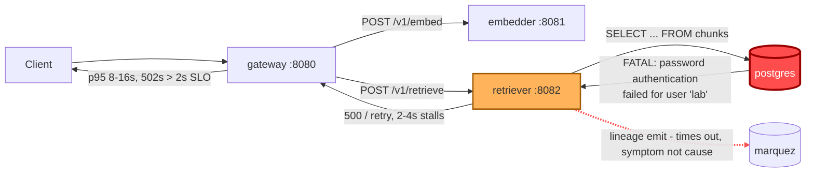

# Postmortem: gateway p95 latency above 2s

- **Status:** resolved
- **Severity:** sev1
- **Verified:** no
- **Opened:** 2026-08-03 02:28:41Z
- **Resolved:** 2026-08-03 02:33:41Z

## Timeline (machine-generated)

All times UTC on 2026-08-03 unless a full date is shown.

| Time (UTC) | Source | Event |
| --- | --- | --- |
| 02:28:10Z | alert | alert firing: Gateway p95 latency > 2s |
| 02:28:10Z | alert | alert resolved: Gateway p95 latency > 2s |

## Evidence links

- [Loki — logs over the incident window](http://localhost:3001/explore?schemaVersion=1&panes=%7B%22pm%22%3A+%7B%22datasource%22%3A+%22loki%22%2C+%22queries%22%3A+%5B%7B%22refId%22%3A+%22A%22%2C+%22datasource%22%3A+%7B%22type%22%3A+%22loki%22%2C+%22uid%22%3A+%22loki%22%7D%2C+%22expr%22%3A+%22%7Bnamespace%3D%5C%22subject%5C%22%7D+%7C~+%5C%22%28%3Fi%29error%7Cfailed%5C%22%22%7D%5D%2C+%22range%22%3A+%7B%22from%22%3A+%221785724121492%22%2C+%22to%22%3A+%221785724421497%22%7D%7D%7D&orgId=1)
- [Mimir — metrics over the incident window](http://localhost:3001/explore?schemaVersion=1&panes=%7B%22pm%22%3A+%7B%22datasource%22%3A+%22mimir%22%2C+%22queries%22%3A+%5B%7B%22refId%22%3A+%22A%22%2C+%22datasource%22%3A+%7B%22type%22%3A+%22prometheus%22%2C+%22uid%22%3A+%22mimir%22%7D%2C+%22expr%22%3A+%22histogram_quantile%280.95%2C+sum%28rate%28http_server_duration_milliseconds_bucket%5B5m%5D%29%29+by+%28le%29%29%22%7D%5D%2C+%22range%22%3A+%7B%22from%22%3A+%221785724121492%22%2C+%22to%22%3A+%221785724421497%22%7D%7D%7D&orgId=1)

## Investigation context

**Runbook match:** none — no tool narrowing applied for this alert. Available runbooks: README.md, canary-abort.md, ci-pipeline-red.md, dq-freshness-stall.md, gateway-high-error-rate.md, k8s-crashloop.md, k8s-node-failure.md, snapshot-agent-audit.md, stale-secret.md

Pre-check battery (as injected at run start)

## Pre-check leads

### recent_deploys — LEAD
No deploy in the last 60m — rule out the reflex answer.
- No deploy in the last 60m — rule out the reflex answer.

### log_spike — OK
error/failed log rate normal: 200/10min vs baseline 500/10min

### kube_scan — UNAVAILABLE
error: You must be logged in to the server (Unauthorized)

### rollout_state — UNAVAILABLE
gateway: E0803 04:28:42.657545    3104 memcache.go:265] "Unhandled Error" err="couldn't get current server API group list: the server has asked for the client to provide credentials"
E0803 04:28:42.785687    3104 memcache.go:265] "Unhandled Error" err="couldn't get current server API group list: the server has asked for the client to provide credentials"
E0803 04:28:42.924385    3104 memcache.go:265] "Unhandled Error" err="couldn't get current server API group list: the server has asked for the client to; gateway analysis: E0803 04:28:42.669933   58204 memcache.go:265] "Unhandled Error" err="couldn't get current server API group list: the server has asked for the client to provide credentials"
E0803 04:28:42.792944   58204 memcache.go:265] "Unhandled Error"
… (section truncated)

### secret_age — UNAVAILABLE
error: You must be logged in to the server (Unauthorized)

## Narrative

## Summary
The "Gateway p95 latency > 2s" (sev1) alert fired for tenant acme. Gateway's `POST /v1/chat` p95 latency spiked repeatedly to 8–16s (clamped at the 16.384s histogram bucket ceiling), well above the 2s SLO, across four distinct bursts in the two hours before and into the page.

## Impact
`/v1/chat` requests routed through the RAG retrieval path experienced multi-second stalls and upstream 502s from gateway (`exception.message: "retriever returned 500"` on the `rag.retrieve` span) during each burst window. Traffic outside the burst windows was unaffected (baseline p95 ~1.9ms).

## Root cause
`retriever`'s connection to Postgres was intermittently rejected with `PostgresError: password authentication failed for user "lab"` — confirmed independently on the server side in Postgres's own log (`FATAL: password authentication failed for user "lab"`, `pg_hba.conf` line 128, scram-sha-256). This caused the `chunks` vector-similarity query (`select ... from chunks order by ... embedding <=> ...`) to fail, which gateway's `rag.retrieve`/`rag.chat` spans surfaced as upstream 500s/502s and multi-second waits — the direct driver of the p95 burst pattern. The concurrent "lineage emit failed: The operation timed out" warnings in retriever logs were a symptom of the same overloaded/failing retriever, not an independent cause.

This is the classic **stale database credential** signature: `deploy_history` showed no deploy to `retriever` at all in the lookback window, and no `gateway` deploy fell near the first burst onset (~00:58 UTC) — the last gateway gitops deploy (`bb634a3`) landed hours earlier and is exonerated. `update_db_secret` (dry-run) reported **no rotated credential pending sync**, meaning the in-cluster Secret already matches the vault's current password — the mismatch was between that current Secret and the credential the long-running `retriever` pod cached in its environment at start. Kubernetes does not restart a pod when a referenced Secret changes, so the pod kept authenticating with a now-invalid password until restarted.

## What fixed it
A rolling restart of `retriever` was diagnosed as the correct fix and was **approved by the operator** (twice, after the first approval was consumed by a failed attempt). However, **every execution attempt failed** with `error: You must be logged in to the server (Unauthorized)` against the cluster API — the same failure mode the pre-check leads had already flagged for `kube_scan`, `rollout_state`, and `secret_age` (all "Unauthorized"), and which also blocked plain `kubectl_read` reads throughout this investigation. This is a separate, meta-level infrastructure problem (the on-call tooling's own cluster credential), not part of the diagnosed root cause, and it was never resolved during this incident — **the restart did not execute**.

Despite that, `alert_status` subsequently reported the alert inactive, and `password authentication failed` log lines stopped appearing (none in the 3 minutes preceding the check). Gateway p95 dropped from the 16.384s clamp to ~0.9–1.1s. This recovery is **not attributable to the attempted remediation**, which never ran — it appears to be the same self-clearing behavior seen in the three earlier bursts that also resolved on their own without intervention. The underlying stale credential on the `retriever` pod was never confirmed fixed.

## Lessons
- **Residual risk:** if `retriever`'s pod still holds the same stale password, recurrence is likely on the next burst cycle. An operator with a working cluster credential should still perform `restart_workload(retriever)` once the tooling's cluster-API auth is repaired, even though the alert cleared.
- **Meta-incident:** the remediation service account (or kubeconfig) used by this on-call tooling is itself failing "Unauthorized" for both reads and writes — this should be fixed before the next page, since it blocked verified, approved remediation from taking effect.
- **Detection gap:** no runbook currently matches "Gateway p95 latency > 2s" directly — the stale-secret runbook is only wired to `slo-avail-fast`/`gw-5xx` triggers. This incident manifested as pure latency (gateway degraded to 502s and long waits rather than a clean 5xx spike), so consider adding this alertname as an explicit trigger on that runbook.
- Cross-checking the client-side error (retriever logs) against the server-side error (Postgres's own log) gave high-confidence root-causing despite noisy, co-occurring "lineage emit timed out" warnings that could have been mistaken for the primary cause.

