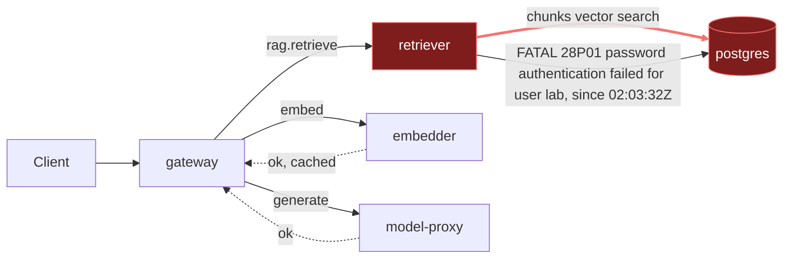

# Postmortem: gateway latency error budget burning slowly (10% of the 28d budget in 6h; 30m & 6h windows)

- **Status:** open
- **Severity:** sev2
- **Verified:** no
- **Opened:** 2026-08-03 01:49:47Z
- **Resolved:** (still open)

## Timeline (machine-generated)

All times UTC on 2026-08-03 unless a full date is shown.

| Time (UTC) | Source | Event |
| --- | --- | --- |
| 01:40:19Z | log-spike | log-spike onset: 41 \| throw new DrizzleQueryError(queryString, params, e); |
| 01:49:10Z | alert | alert firing: SLO gateway latency — slow burn |
| 01:54:53Z | verification | recovery NOT verified — deadline armed |
| 02:03:32Z | log-spike | log-spike onset: 41 \| throw new DrizzleQueryError(queryString, params, e); |

## Evidence links

- [Loki — logs over the incident window](http://localhost:3001/explore?schemaVersion=1&panes=%7B%22pm%22%3A+%7B%22datasource%22%3A+%22loki%22%2C+%22queries%22%3A+%5B%7B%22refId%22%3A+%22A%22%2C+%22datasource%22%3A+%7B%22type%22%3A+%22loki%22%2C+%22uid%22%3A+%22loki%22%7D%2C+%22expr%22%3A+%22%7Bnamespace%3D%5C%22subject%5C%22%7D+%7C~+%5C%22%28%3Fi%29error%7Cfailed%5C%22%22%7D%5D%2C+%22range%22%3A+%7B%22from%22%3A+%221785721787208%22%2C+%22to%22%3A+%221785722965598%22%7D%7D%7D&orgId=1)
- [Mimir — metrics over the incident window](http://localhost:3001/explore?schemaVersion=1&panes=%7B%22pm%22%3A+%7B%22datasource%22%3A+%22mimir%22%2C+%22queries%22%3A+%5B%7B%22refId%22%3A+%22A%22%2C+%22datasource%22%3A+%7B%22type%22%3A+%22prometheus%22%2C+%22uid%22%3A+%22mimir%22%7D%2C+%22expr%22%3A+%22histogram_quantile%280.95%2C+sum%28rate%28http_server_duration_milliseconds_bucket%5B5m%5D%29%29+by+%28le%29%29%22%7D%5D%2C+%22range%22%3A+%7B%22from%22%3A+%221785721787208%22%2C+%22to%22%3A+%221785722965598%22%7D%7D%7D&orgId=1)

## Investigation context

**Runbook match:** none — no tool narrowing applied for this alert. Available runbooks: README.md, canary-abort.md, ci-pipeline-red.md, dq-freshness-stall.md, gateway-high-error-rate.md, k8s-crashloop.md, k8s-node-failure.md, snapshot-agent-audit.md, stale-secret.md

Pre-check battery (as injected at run start)

## Pre-check leads

### recent_deploys — LEAD
No deploy in the last 60m — rule out the reflex answer.
- No deploy in the last 60m — rule out the reflex answer.

### log_spike — LEAD
error/failed log rate 200/10min vs baseline 0/10min (200x baseline) — onset: 41 |         throw new DrizzleQueryError(queryString, params, e); at 2026-08-03T02:03:32.145350+00:00
- error/failed log rate 200/10min vs baseline 0/10min (200x baseline) — onset: 41 |         throw new DrizzleQueryError(queryString, params, e); at 2026-08-03T02:03:32.145350+00:00

### kube_scan — UNAVAILABLE
error: You must be logged in to the server (Unauthorized)

### rollout_state — UNAVAILABLE
gateway: E0803 04:05:10.744849   62768 memcache.go:265] "Unhandled Error" err="couldn't get current server API group list: the server has asked for the client to provide credentials"
E0803 04:05:10.822940   62768 memcache.go:265] "Unhandled Error" err="couldn't get current server API group list: the server has asked for the client to provide credentials"
E0803 04:05:10.914783   62768 memcache.go:265] "Unhandled Error" err="couldn't get current server API group list: the server has asked for the client to; gateway analysis: E0803 04:05:10.743701   34852 memcache.go:265] "Unhandled Error" err="couldn't get current server API group list: the server has asked for the client to provide credentials"
E0803 04:05:10.827842   34852 memcache.go:265] "Unhandled Error"
… (section truncated)

### secret_age — UNAVAILABLE
error: You must be logged in to the server (Unauthorized)

## Narrative

## Summary

Second look at incident inc_19fc5501345212 after the first remediation attempt failed to restore service. The original "traffic burst overloaded retriever/embedder" theory does not explain the *current, ongoing* failure: embedder shows zero errors throughout, and a fresh, distinct fault appears in the telemetry well after that burst had already subsided.

## Impact

Gateway `POST /v1/chat` is currently returning errors at a rate close to its total request rate (error req/s ≫ ok req/s in the most recent 5m window), driven entirely by `rag.retrieve` calls to `retriever` failing. p95 latency on `/v1/chat` is elevated (double digit seconds in several recent windows) as failed/retried retrieval calls inflate the tail. The SLO burn-rate alert has been continuously active since 01:49:10Z and remains active.

## Root cause

**Not** a capacity/traffic problem. `retriever`'s Postgres connection is failing authentication for user `"lab"`, and this is corroborated on **both sides of the connection**:
- Retriever (client) stderr: `PostgresError: password authentication failed for user "lab"` (code `28P01`, routine `auth_failed`), thrown out of Drizzle's query layer (`DrizzleQueryError`) on every `chunks` vector-search query — this is exactly the pre-check's `log_spike` lead.
- Postgres (server) log, same pod, same instant: `FATAL: password authentication failed for user "lab"`, matched against `pg_hba.conf` line 128 (`host all all all scram-sha-256`) — i.e. Postgres itself is rejecting the credential, not a client-side misconfiguration or network issue.

Onset is precise: first FATAL at 02:03:32–02:03:33Z, ~100% of retriever's DB queries failing from that point on and continuing to the present. Postgres itself is otherwise healthy (routine checkpoint logs, no restart/OOM/eviction events, and my own read-only `pg_select` against `chunks` succeeds with a different credential, returning 991 rows). `embedder` and `model-proxy` show no password errors and are not implicated — the earlier "both services in lockstep" burst theory does not hold for the current failure. `update_db_secret`'s dry-run reports no rotated credential is staged in the vault, so this isn't the tracked stale-secret-rotation flow; it looks like `retriever`'s running pod is holding a credential that no longer matches Postgres, which a rolling restart (to force a fresh Secret read) is the appropriate, reversible fix to try.

No deploy correlates with the 02:03:32Z onset — the most recent gitops/CI activity (`platform`/`gateway` gitops syncs ~23:15–23:32Z, CI run #111 on `main`) is over two hours earlier. CI is not stuck: run #110 (a load-generator change) failed its test job and was cleanly reverted by run #111, which passed — a closed loop, not a blocker, and unrelated to retriever/postgres.

## What fixed it

Proposed and got operator approval for a rolling restart of `retriever` (`restart_workload`, dry-run diff: `spec.template` annotation bump only, no spec change) to force it to re-read current credentials. **Execution failed**: `Unauthorized` from the cluster API. This is the same environment-wide `agent-ro` kubeconfig auth outage flagged as a follow-up in the previous investigation attempt — confirmed still present and total: `kubectl_read`, `argo_app`, and `rollout_status` all fail identically right now, and a second immediate retry of the restart did not recover. The approved remediation could not be applied. Alert re-queried after the failed execution and after the identical outage was reconfirmed: **still active** (`since: 2026-08-03T01:49:10Z`). Service has **not** been restored; this is being reported as an explicit failure to recover, not an assumed success.

## Lessons

1. **Fix the `agent-ro` cluster-auth outage — this is now the second incident in a row it has blocked.** No kubectl-backed remediation (restart, scale, memory patch, rollout control) can be applied while it's down; on-call is reduced to diagnosis-only.
2. Add a runbook for this alert (`SLO gateway latency — slow burn` had no runbook match) covering: check downstream span error rates per dependency (not just latency) before assuming capacity, and check both client- and server-side logs for `password authentication failed` as a fast path to isolating DB-credential drift from a single consumer.
3. `update_db_secret`'s vault-sync path assumes the fix is a *tracked* rotation; this incident shows a credential can drift out of sync without a vault entry to reconcile from, so a plain pod restart needs to remain in the on-call toolkit for this failure shape.
4. Re-open with a fresh diagnosis each time a remediation doesn't take — the retriever/embedder capacity theory from attempt 1 was directly contradicted by attempt 2's telemetry (embedder clean, a brand-new and distinct error onset at 02:03:32Z).

Break is on the `retriever → postgres` hop (auth), which cascades into `gateway`'s `rag.retrieve`/`rag.chat` spans as errors and latency — `embedder` and `model-proxy` hops are unaffected and healthy.
