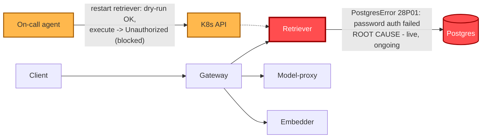

# Postmortem: gateway availability error budget burning slowly (10% of the 28d budget in 6h; 30m & 6h windows)

- **Status:** open
- **Severity:** sev2
- **Verified:** no
- **Opened:** 2026-08-03 01:46:44Z
- **Resolved:** (still open)

## Timeline (machine-generated)

All times UTC on 2026-08-03 unless a full date is shown.

| Time (UTC) | Source | Event |
| --- | --- | --- |
| 01:40:19Z | log-spike | log-spike onset: 41 \| throw new DrizzleQueryError(queryString, params, e); |
| 01:46:10Z | alert | alert firing: SLO gateway availability — slow burn |
| 01:51:17Z | verification | recovery NOT verified — deadline armed |
| 02:02:05Z | log-spike | log-spike onset: 815 \| errorResponse = Errors.postgres(parseError(x)) |
| 02:03:32Z | log-spike | log-spike onset: 41 \| throw new DrizzleQueryError(queryString, params, e); |
| 02:07:08Z | verification | recovery NOT verified — deadline armed |
| 02:17:47Z | verification | recovery NOT verified — deadline armed |

## Evidence links

- [Loki — logs over the incident window](http://localhost:3001/explore?schemaVersion=1&panes=%7B%22pm%22%3A+%7B%22datasource%22%3A+%22loki%22%2C+%22queries%22%3A+%5B%7B%22refId%22%3A+%22A%22%2C+%22datasource%22%3A+%7B%22type%22%3A+%22loki%22%2C+%22uid%22%3A+%22loki%22%7D%2C+%22expr%22%3A+%22%7Bnamespace%3D%5C%22subject%5C%22%7D+%7C~+%5C%22%28%3Fi%29error%7Cfailed%5C%22%22%7D%5D%2C+%22range%22%3A+%7B%22from%22%3A+%221785721604354%22%2C+%22to%22%3A+%221785724075858%22%7D%7D%7D&orgId=1)
- [Mimir — metrics over the incident window](http://localhost:3001/explore?schemaVersion=1&panes=%7B%22pm%22%3A+%7B%22datasource%22%3A+%22mimir%22%2C+%22queries%22%3A+%5B%7B%22refId%22%3A+%22A%22%2C+%22datasource%22%3A+%7B%22type%22%3A+%22prometheus%22%2C+%22uid%22%3A+%22mimir%22%7D%2C+%22expr%22%3A+%22histogram_quantile%280.95%2C+sum%28rate%28http_server_duration_milliseconds_bucket%5B5m%5D%29%29+by+%28le%29%29%22%7D%5D%2C+%22range%22%3A+%7B%22from%22%3A+%221785721604354%22%2C+%22to%22%3A+%221785724075858%22%7D%7D%7D&orgId=1)

## Investigation context

**Runbook match:** none — no tool narrowing applied for this alert. Available runbooks: README.md, canary-abort.md, ci-pipeline-red.md, dq-freshness-stall.md, gateway-high-error-rate.md, k8s-crashloop.md, k8s-node-failure.md, snapshot-agent-audit.md, stale-secret.md

<details>
<summary>Pre-check battery (as injected at run start)</summary>

## Pre-check leads

### recent_deploys — LEAD
No deploy in the last 60m — rule out the reflex answer.
- No deploy in the last 60m — rule out the reflex answer.

### log_spike — OK
error/failed log rate normal: 39/10min vs baseline 500/10min

### kube_scan — UNAVAILABLE
error: You must be logged in to the server (Unauthorized)

### rollout_state — UNAVAILABLE
gateway: E0803 04:22:12.645455   14820 memcache.go:265] "Unhandled Error" err="couldn't get current server API group list: the server has asked for the client to provide credentials"
E0803 04:22:12.887225   14820 memcache.go:265] "Unhandled Error" err="couldn't get current server API group list: the server has asked for the client to provide credentials"
E0803 04:22:13.065136   14820 memcache.go:265] "Unhandled Error" err="couldn't get current server API group list: the server has asked for the client to; gateway analysis: E0803 04:22:12.607216   59548 memcache.go:265] "Unhandled Error" err="couldn't get current server API group list: the server has asked for the client to provide credentials"
E0803 04:22:12.874072   59548 memcache.go:265] "Unhandled Error"
… (section truncated)

### secret_age — UNAVAILABLE
error: You must be logged in to the server (Unauthorized)

</details>

## Narrative

## Summary

`SLO gateway availability — slow burn` (sev2, 10% of 28d budget burned in 6h across the 30m & 6h windows) remains **active**. This is a continuation of the same underlying incident diagnosed in prior passes: `retriever` is fatal-looping on a stale Postgres credential. This pass re-verified the symptom is still reproducing live, ruled out a bad deploy, found a genuinely new remediation-credential lead, tested it, and confirmed it does not change the outcome — remediation is still blocked.

## Impact

`slo:gateway_availability:error_ratio30m` climbed from baseline (0%) to a peak of **82.3%** roughly an hour into the queried window, and is still at **61.6%** now — the 5m ratio is back down near ~2%, meaning the acute burst has passed, but the 30m/6h SLO windows still carry it, which is exactly the "slow burn" alert's multi-window design. Direct evidence of near-total impact during the burst: `pg_select` shows **0 rows written to `inferences` in the last 2 hours**.

## Root cause (evidence-backed)

`retriever` (both the long-running pod `retriever-dc7ddd494-jv9j7` and a freshly-created replica `retriever-8454db56c-msr56` spun up right after the 23:15–23:32 UTC gitops platform/gateway syncs) is crash-looping on:
```
PostgresError: password authentication failed for user "lab"
```
This is still reproducing in Loki at query time (timestamp essentially "now"), so this is not a resolved-but-lingering-window artifact — it's ongoing. `k8s_events` shows the new retriever replica going straight to `BackOff` seconds after creation, which rules out "old pod holding stale cached env" as the *whole* story: even a brand-new pod fails immediately, matching the `stale-secret.md` runbook's signature (`update_db_secret` dry-run confirms the Secret already matches the vault — "no rotated credential to sync" — so this isn't a pending sync, it's a credential the running pods can't use regardless).

`deploy_history` over the incident window shows no retriever deploy and no gateway deploy within the alert's actual onset window (the nearest gateway/platform gitops syncs were ~14 minutes before the retriever crash-loop started and self-rolled-back cleanly via an Argo Rollouts analysis gate within 16 seconds) — ruling out the reflex "bad deploy" answer. `gitea_ci_runs` shows one red run (`#110`, load-generator) but it was reverted by `#111` well before the alert's onset and is unrelated to retriever/postgres.

## What fixed it

**Nothing — the incident is unresolved.** This pass found a genuinely new lead: `restart_workload(retriever, dry_run=true)` succeeded and returned a real diff/action_id, unlike the read-only `kubectl_read`/`argo_app` calls which still fail `Unauthorized` — suggesting the remediation credential path might be distinct and functional. That lead was tested, not assumed: after `request_approval` was explicitly approved, `restart_workload(dry_run=false)` was executed for real and it **also failed with the identical `Unauthorized`** the prior passes hit. So the dry-run path evidently doesn't require the same live-write credential as execution does — this reconfirms, with fresh evidence rather than repetition, that the on-call agent's cluster-mutation credential is durably broken, separate from the app-level root cause. No further remediation attempt was made without new evidence per instruction. `alert_status` was re-queried after the failed execution and is still `active`.

## Lessons

1. **Two independent problems are stacked**: (a) retriever's Postgres credential doesn't work for any pod, old or freshly created, despite the Secret matching the vault's current record — worth a human checking whether the *vault's* record itself is correct against the live Postgres role, not just whether Secret==vault; (b) the on-call agent's cluster-write credential (used by `restart_workload`, and apparently by `kubectl_read`/`argo_app` for reads) is broken cluster-wide, blocking every mutation-based remediation for this class of incident regardless of root-cause accuracy.
2. Escalating to a human operator is required on both fronts: manually restart `deployment/retriever -n subject` and repair/rotate the actual Postgres password for the `lab` role (or push a corrected value through the vault→Secret sync path and confirm it round-trips), and separately repair the on-call agent's kubeconfig/RBAC binding.
3. A `dry_run=true` success is not evidence that `dry_run=false` will succeed for the same tool — this pass's dry-run/execute split on `restart_workload` shows the two paths can have different auth outcomes; don't treat dry-run success alone as license to skip watching the real execution's result.


