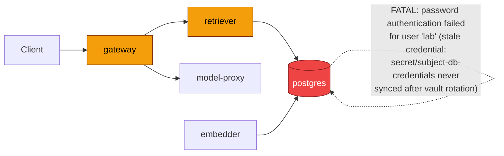

# Postmortem: gateway 5xx rate above 2%

- **Status:** open
- **Severity:** sev1
- **Verified:** no
- **Opened:** 2026-08-03 02:49:40Z
- **Resolved:** (still open)

## Timeline (machine-generated)

All times UTC on 2026-08-03 unless a full date is shown.

| Time (UTC) | Source | Event |
| --- | --- | --- |
| 02:49:10Z | alert | alert firing: Gateway 5xx rate > 2% |

## Evidence links

- [Loki — logs over the incident window](http://localhost:3001/explore?schemaVersion=1&panes=%7B%22pm%22%3A+%7B%22datasource%22%3A+%22loki%22%2C+%22queries%22%3A+%5B%7B%22refId%22%3A+%22A%22%2C+%22datasource%22%3A+%7B%22type%22%3A+%22loki%22%2C+%22uid%22%3A+%22loki%22%7D%2C+%22expr%22%3A+%22%7Bnamespace%3D%5C%22subject%5C%22%7D+%7C~+%5C%22%28%3Fi%29error%7Cfailed%5C%22%22%7D%5D%2C+%22range%22%3A+%7B%22from%22%3A+%221785725380163%22%2C+%22to%22%3A+%221785725606989%22%7D%7D%7D&orgId=1)
- [Mimir — metrics over the incident window](http://localhost:3001/explore?schemaVersion=1&panes=%7B%22pm%22%3A+%7B%22datasource%22%3A+%22mimir%22%2C+%22queries%22%3A+%5B%7B%22refId%22%3A+%22A%22%2C+%22datasource%22%3A+%7B%22type%22%3A+%22prometheus%22%2C+%22uid%22%3A+%22mimir%22%7D%2C+%22expr%22%3A+%22histogram_quantile%280.95%2C+sum%28rate%28http_server_duration_milliseconds_bucket%5B5m%5D%29%29+by+%28le%29%29%22%7D%5D%2C+%22range%22%3A+%7B%22from%22%3A+%221785725380163%22%2C+%22to%22%3A+%221785725606989%22%7D%7D%7D&orgId=1)

## Investigation context

**Runbook match (2):** `gateway-high-error-rate.md`, `stale-secret.md` — toolset narrowed to 13 tools: alert_status, deploy_history, kubectl_read, loki_query, mimir_query, publish_postmortem, request_approval, restart_workload, runbook_lookup, runbook_read, save_artifact, tempo_query, update_db_secret

Pre-check battery (as injected at run start)

## Pre-check leads

### recent_deploys — LEAD
No deploy in the last 60m — rule out the reflex answer.
- No deploy in the last 60m — rule out the reflex answer.

### log_spike — OK
error/failed log rate normal: 200/10min vs baseline 500/10min

### kube_scan — UNAVAILABLE
error: You must be logged in to the server (Unauthorized)

### rollout_state — UNAVAILABLE
gateway: E0803 04:49:49.146637   25720 memcache.go:265] "Unhandled Error" err="couldn't get current server API group list: the server has asked for the client to provide credentials"
E0803 04:49:49.519611   25720 memcache.go:265] "Unhandled Error" err="couldn't get current server API group list: the server has asked for the client to provide credentials"
E0803 04:49:49.762310   25720 memcache.go:265] "Unhandled Error" err="couldn't get current server API group list: the server has asked for the client to; gateway analysis: E0803 04:49:47.468982   38388 memcache.go:265] "Unhandled Error" err="couldn't get current server API group list: the server has asked for the client to provide credentials"
E0803 04:49:48.338402   38388 memcache.go:265] "Unhandled Error"
… (section truncated)

### secret_age — UNAVAILABLE
error: You must be logged in to the server (Unauthorized)

## Narrative

## Summary
`Gateway 5xx rate > 2%` fired for tenant acme. Root cause was identified as a stale database credential — Postgres rejected the `lab` user's password, cascading through retriever into gateway 5xx/timeouts. A remediation (sync the rotated secret, then restart affected workloads) was dry-run, evidence-verified, and put up for approval, but the operator **denied** the action. No remediation was executed. The alert remains active.

## Impact
Gateway requests for tenant acme were failing at up to ~72-79% error ratio during the worst bursts of the window (see chart artifact), well above the 2% SLO threshold. Retriever-backed RAG calls were affected first since they depend directly on Postgres; gateway surfaced this as request timeouts (`lineage emit failed`, reason: "The operation timed out.") and 5xx responses to clients.

## Root cause
Postgres in namespace `subject` is emitting continuous `FATAL: password authentication failed for user "lab"` for every connection attempt, and `retriever` is failing with the matching `PostgresError: password authentication failed for user "lab"`. This is the classic stale-secret signature described in the `stale-secret.md` runbook: the database password was rotated in the vault, but `secret/subject-db-credentials` in the cluster was never updated, so the running pods are still presenting the old credential.

Evidence:
- `loki_query` for `{namespace="subject"} |= "password authentication failed"` shows a continuous, still-firing burst from both `postgres` and `retriever` pods, timestamped right at and after the alert's `since` time.
- `update_db_secret` dry-run (`action_id bf8bc4f2bf87a7c3`) confirms `vault_checked: true` with a rotated password available (masked hash `****5a92453c`) that the live Secret does not have — i.e., a genuine rotation-vs-sync mismatch, not a guess.
- `deploy_history` over the last 180 minutes shows no gateway/retriever/postgres deploy — the only CI activity was an unrelated `load-generator` revert/change (`d62500f603`, `28686bc2ba`). This rules out the "bad deploy" hypothesis per the runbook's own disambiguation step.
- `traces_spanmetrics_calls_total`-derived error ratio (see report.html) shows the current spike beginning shortly before the alert's `since` timestamp and — unlike two earlier self-recovering blips in the same hour — still climbing at query time, consistent with a persistent (not transient) failure such as a stale credential rather than a one-off retry storm.
- `kubectl_read` and secret-age lookups were unavailable in this environment (`Unauthorized`), so pod-start-time-vs-rotation-time could not be directly confirmed via kubectl; the vault/log evidence above stands on its own for the diagnosis.

Cause category: stale database secret (credential rotated, workload never restarted to pick it up) — not a bad deploy, not a downstream code regression.

## What fixed it
Nothing — **remediation was not applied**. The proposed fix (dry-run of `update_db_secret` to sync `secret/subject-db-credentials` to the rotated vault password, to be followed by `restart_workload` for postgres-dependent services once approved) was presented to the operator via `request_approval` with the verified dry-run diff attached. The operator's decision was **denied**. Per policy, no unapproved action was taken and the fix was not retried. `alert_status` was re-queried after the denial and still reports the `Gateway 5xx rate > 2%` alert **active**, unresolved.

## Lessons
- The stale-secret failure mode reproduces cleanly against this runbook's diagnostic steps even without kubectl access — vault-side dry-run metadata (`vault_checked`, rotated-hash presence) was sufficient corroborating evidence alongside the Loki auth-failure signature and the deploy-history negative check.
- Need read access restored for `kubectl_read`/secret-age checks in this environment — several pre-check leads (`kube_scan`, `secret_age`, `rollout_state`) were `UNAVAILABLE` due to `Unauthorized`, which removed a direct pod-start-time-vs-rotation-time confirmation and forced reliance on log + vault evidence alone.
- This incident is **not closed**: the operator declined the fix, so the credential mismatch persists and the alert will keep firing until `secret/subject-db-credentials` is synced and postgres/retriever (and gateway, transitively) are restarted. Follow up with the operator on why the action was denied (e.g., wrong maintenance window, need for a different rotation process) before re-attempting.

