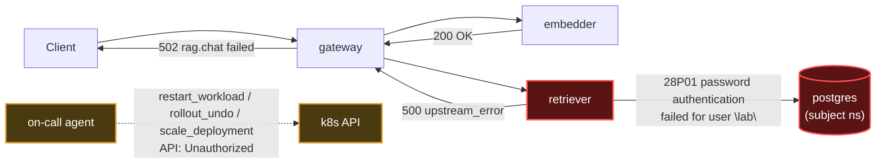

# Postmortem: RAG top-1 relevance below the 90% objective over the last hour (burn-rate alerting saturates for a loose SLO)

- **Status:** open
- **Severity:** sev2
- **Verified:** no
- **Opened:** 2026-08-03 01:31:48Z
- **Resolved:** (still open)

## Timeline (machine-generated)

All times UTC on 2026-08-03 unless a full date is shown.

| Time (UTC) | Source | Event |
| --- | --- | --- |
| 01:31:10Z | alert | alert firing: SLO RAG quality — below objective |
| 01:31:46Z | log-spike | log-spike onset: PostgresError: password authentication failed for user "lab" |
| 01:37:05Z | verification | recovery NOT verified — deadline armed |
| 01:40:19Z | log-spike | log-spike onset: 41 \| throw new DrizzleQueryError(queryString, params, e); |

## Evidence links

- [Loki — logs over the incident window](http://localhost:3001/explore?schemaVersion=1&panes=%7B%22pm%22%3A+%7B%22datasource%22%3A+%22loki%22%2C+%22queries%22%3A+%5B%7B%22refId%22%3A+%22A%22%2C+%22datasource%22%3A+%7B%22type%22%3A+%22loki%22%2C+%22uid%22%3A+%22loki%22%7D%2C+%22expr%22%3A+%22%7Bnamespace%3D%5C%22subject%5C%22%7D+%7C~+%5C%22%28%3Fi%29error%7Cfailed%5C%22%22%7D%5D%2C+%22range%22%3A+%7B%22from%22%3A+%221785720708739%22%2C+%22to%22%3A+%221785722416973%22%7D%7D%7D&orgId=1)
- [Mimir — metrics over the incident window](http://localhost:3001/explore?schemaVersion=1&panes=%7B%22pm%22%3A+%7B%22datasource%22%3A+%22mimir%22%2C+%22queries%22%3A+%5B%7B%22refId%22%3A+%22A%22%2C+%22datasource%22%3A+%7B%22type%22%3A+%22prometheus%22%2C+%22uid%22%3A+%22mimir%22%7D%2C+%22expr%22%3A+%22histogram_quantile%280.95%2C+sum%28rate%28http_server_duration_milliseconds_bucket%5B5m%5D%29%29+by+%28le%29%29%22%7D%5D%2C+%22range%22%3A+%7B%22from%22%3A+%221785720708739%22%2C+%22to%22%3A+%221785722416973%22%7D%7D%7D&orgId=1)

## Investigation context

**Runbook match:** none — no tool narrowing applied for this alert. Available runbooks: README.md, canary-abort.md, ci-pipeline-red.md, dq-freshness-stall.md, gateway-high-error-rate.md, k8s-crashloop.md, k8s-node-failure.md, snapshot-agent-audit.md, stale-secret.md

Pre-check battery (as injected at run start)

## Pre-check leads

### recent_deploys — LEAD
No deploy in the last 60m — rule out the reflex answer.
- No deploy in the last 60m — rule out the reflex answer.

### log_spike — LEAD
error/failed log rate 200/10min vs baseline 0/10min (200x baseline) — onset: 41 |         throw new DrizzleQueryError(queryString, params, e); at 2026-08-03T01:40:19.759175+00:00
- error/failed log rate 200/10min vs baseline 0/10min (200x baseline) — onset: 41 |         throw new DrizzleQueryError(queryString, params, e); at 2026-08-03T01:40:19.759175+00:00

### kube_scan — UNAVAILABLE
error: You must be logged in to the server (Unauthorized)

### rollout_state — UNAVAILABLE
gateway: E0803 03:47:09.505219    3232 memcache.go:265] "Unhandled Error" err="couldn't get current server API group list: the server has asked for the client to provide credentials"
E0803 03:47:09.659462    3232 memcache.go:265] "Unhandled Error" err="couldn't get current server API group list: the server has asked for the client to provide credentials"
E0803 03:47:09.902518    3232 memcache.go:265] "Unhandled Error" err="couldn't get current server API group list: the server has asked for the client to; gateway analysis: E0803 03:47:09.430893   33916 memcache.go:265] "Unhandled Error" err="couldn't get current server API group list: the server has asked for the client to provide credentials"
E0803 03:47:09.547279   33916 memcache.go:265] "Unhandled Error"
… (section truncated)

### secret_age — UNAVAILABLE
error: You must be logged in to the server (Unauthorized)

## Narrative

## Incident summary — inc_19fc53f9e83a1 (re-examination, attempt 2)

**Continued impact confirmed:** `alert_status` still reports the SLO burn-rate alert active. The prior attempt's remediation (`update_db_secret`) never landed — this pass re-investigated from scratch rather than retrying it blindly.

**Root cause (evidence-backed, unchanged in category, refined in detail):** The retriever's Postgres connection is failing with `password authentication failed for user "lab"` (Postgres FATAL log, code `28P01`, routine `auth_failed`; mirrored on the retriever side as a `postgres` driver `ErrorResponse` in its stack trace). A dense burst of ~20+ of these FATAL lines lands in under one second, which lines up with a retriever pod (`retriever-8454db56c-msr56`) that k8s events show cycling through repeated `BackOff`/container-restart cycles starting shortly after the alert fired — consistent with a pod that dies immediately on every boot because its cached DB credential no longer matches Postgres, retries its full connection pool on each start, and crashes again. `retrieval_relevance_score` sits at a flat ~0.15 (roughly a sixth of the 0.90 objective) in every window with traffic going back at least 3 hours before the alert fired — this is a chronic floor, not a fresh dip, which matches the alert's own annotation that burn-rate alerting saturates slowly for a loose SLO.

**Hypotheses actively ruled out this pass:**
- *Bad deploy:* `deploy_history` shows no retriever-specific deploy near onset (only unrelated load-generator/model-proxy CI reverts and platform gitops syncs hours earlier).
- *Stuck GitOps sync as the current blocker:* Argo *did* repeatedly fail to sync `Deployment/retriever` with `spec.replicas: Invalid value: -1: must be greater than or equal to 0` — but every occurrence of that error timestamps to ~23:19–23:31 UTC the prior day, and the deployment reconciled cleanly afterward (successful scale-up event at 00:13 UTC). This was a separate, already-resolved episode, not the live blocker — confirmed a red herring rather than assumed one.
- *Vault-based stale-secret remediation:* `update_db_secret` dry-run this time returned `no rotated credential found in the vault — nothing to sync`, a different (non-auth) error than attempt 1 saw. This rules the tool's specific remediation path out for the current state — there is nothing queued for it to sync, so it cannot be the fix here regardless of approval.

**Remediation attempted, still not completed:** Since the vault path is a dead end, this pass tried the lower-risk, evidence-driven alternative: a rolling restart of `deployment/retriever` (picks up current Secret contents, no spec change) to force a fresh connection attempt and directly test whether the credential is still bad. `restart_workload` dry-run for retriever succeeded cleanly (it doesn't need to read live cluster state). Operator approval was obtained. Both real executions (`dry_run=false`) failed identically: `Unauthorized — you must be logged in to the server`. This is the exact same failure class the pre-check leads and attempt 1 already flagged for `kube_scan`/`secret_age`/`rollout_state`/`argo_app`, and it now also reproduces on `rollout_undo` dry-run and `scale_deployment`'s replica-read step. Only `restart_workload`'s dry-run (which makes no cluster read) and `update_db_secret`'s dry-run (which checks the vault before touching the cluster) avoid it — every call that actually touches the live cluster API, read or write, hits the same `Unauthorized`.

**Conclusion:** This is not a stuck CI pipeline (no relevant CI activity exists) and not a retryable vault sync — it is a standing cluster-credential outage for the automation's own identity, orthogonal to the RAG-quality incident itself, and it blocks every remediation path this agent has (secret sync, restart, rollout undo, scale). The underlying database-credential mismatch on the retriever is still the proximate cause of the SLO breach, but it cannot be fixed by this automation until a human with valid cluster write access either fixes the agent's own credentials or manually rolling-restarts `deployment/retriever` in namespace `subject` after confirming/repairing the Postgres password for user `lab`.

**Verification:** Re-queried `alert_status` after both failed restart attempts — still active. Reporting this as an unresolved incident from the automation side, for the second consecutive attempt, now with the blocker's scope fully characterized (cluster-write, not vault-specific).

**Artifacts:**
- `rag-quality-relevance-chart.html` — inline SVG of the actual `retrieval_relevance_score` samples returned by Mimir over the ~3h lookback, showing the chronic ~0.15 floor.

**Lessons:**
- The auto-matched-runbook gap flagged in attempt 1 is confirmed real: no runbook fires for this alertname, so the diagnostic path (auth failure vs. bad deploy vs. stuck gitops sync) had to be rebuilt from raw telemetry each time. A `retriever-postgres-auth-failure.md` runbook capturing "check FATAL 28P01 in postgres logs, check retriever BackOff events, then attempt restart_workload" would shortcut this significantly.
- The `-1 replicas` GitOps failure was a genuine but *stale* lead — the timeline tools (k8s_events' "local time" labeling vs. UTC-timestamped raw Loki lines) need to be cross-checked carefully; conflating the two nearly misattributed an already-resolved 2.5-hour-old episode as the live cause.
- The cluster-credential outage for the agent's own remediation identity is now confirmed to block every mutating tool, not just the one used in attempt 1. This is the actual open blocker and needs independent operator attention — restoring it, not re-diagnosing the RAG incident, is what unblocks recovery from here.
