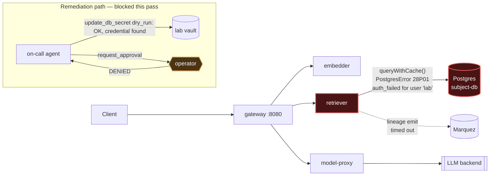

# Postmortem: RAG top-1 relevance below the 90% objective over the last hour (burn-rate alerting saturates for a loose SLO)

- **Status:** open
- **Severity:** sev2
- **Verified:** no
- **Opened:** 2026-08-03 01:31:48Z
- **Resolved:** (still open)

## Timeline (machine-generated)

All times UTC on 2026-08-03 unless a full date is shown.

| Time (UTC) | Source | Event |
| --- | --- | --- |
| 01:31:10Z | alert | alert firing: SLO RAG quality — below objective |
| 01:31:46Z | log-spike | log-spike onset: PostgresError: password authentication failed for user "lab" |
| 01:37:05Z | verification | recovery NOT verified — deadline armed |
| 01:40:19Z | log-spike | log-spike onset: 41 \| throw new DrizzleQueryError(queryString, params, e); |
| 02:00:27Z | verification | recovery NOT verified — deadline armed |
| 02:01:07Z | log-spike | log-spike onset: [retriever] unhandled error: 36 \| async queryWithCache(queryString, params, query) { |

## Evidence links

- [Loki — logs over the incident window](http://localhost:3001/explore?schemaVersion=1&panes=%7B%22pm%22%3A+%7B%22datasource%22%3A+%22loki%22%2C+%22queries%22%3A+%5B%7B%22refId%22%3A+%22A%22%2C+%22datasource%22%3A+%7B%22type%22%3A+%22loki%22%2C+%22uid%22%3A+%22loki%22%7D%2C+%22expr%22%3A+%22%7Bnamespace%3D%5C%22subject%5C%22%7D+%7C~+%5C%22%28%3Fi%29error%7Cfailed%5C%22%22%7D%5D%2C+%22range%22%3A+%7B%22from%22%3A+%221785720708739%22%2C+%22to%22%3A+%221785722657150%22%7D%7D%7D&orgId=1)
- [Mimir — metrics over the incident window](http://localhost:3001/explore?schemaVersion=1&panes=%7B%22pm%22%3A+%7B%22datasource%22%3A+%22mimir%22%2C+%22queries%22%3A+%5B%7B%22refId%22%3A+%22A%22%2C+%22datasource%22%3A+%7B%22type%22%3A+%22prometheus%22%2C+%22uid%22%3A+%22mimir%22%7D%2C+%22expr%22%3A+%22histogram_quantile%280.95%2C+sum%28rate%28http_server_duration_milliseconds_bucket%5B5m%5D%29%29+by+%28le%29%29%22%7D%5D%2C+%22range%22%3A+%7B%22from%22%3A+%221785720708739%22%2C+%22to%22%3A+%221785722657150%22%7D%7D%7D&orgId=1)

## Investigation context

**Runbook match:** none — no tool narrowing applied for this alert. Available runbooks: README.md, canary-abort.md, ci-pipeline-red.md, dq-freshness-stall.md, gateway-high-error-rate.md, k8s-crashloop.md, k8s-node-failure.md, snapshot-agent-audit.md, stale-secret.md

Pre-check battery (as injected at run start)

## Pre-check leads

### recent_deploys — LEAD
No deploy in the last 60m — rule out the reflex answer.
- No deploy in the last 60m — rule out the reflex answer.

### log_spike — LEAD
error/failed log rate 200/10min vs baseline 0/10min (200x baseline) — onset: [retriever] unhandled error: 36 |   async queryWithCache(queryString, params, query) { at 2026-08-03T02:01:07.331206+00:00
- error/failed log rate 200/10min vs baseline 0/10min (200x baseline) — onset: [retriever] unhandled error: 36 |   async queryWithCache(queryString, params, query) { at 2026-08-03T02:01:07.331206+00:00

### kube_scan — UNAVAILABLE
error: You must be logged in to the server (Unauthorized)

### rollout_state — UNAVAILABLE
gateway: E0803 04:01:10.310581   61304 memcache.go:265] "Unhandled Error" err="couldn't get current server API group list: the server has asked for the client to provide credentials"
E0803 04:01:10.504121   61304 memcache.go:265] "Unhandled Error" err="couldn't get current server API group list: the server has asked for the client to provide credentials"
E0803 04:01:10.628944   61304 memcache.go:265] "Unhandled Error" err="couldn't get current server API group list: the server has asked for the client to; gateway analysis: E0803 04:01:10.429146   25664 memcache.go:265] "Unhandled Error" err="couldn't get current server API group list: the server has asked for the client to provide credentials"
E0803 04:01:10.536374   25664 memcache.go:265] "Unhandled Error"
… (section truncated)

### secret_age — UNAVAILABLE
error: You must be logged in to the server (Unauthorized)

## Narrative

## Summary
Re-examination of an already-open incident (attempt 3). The SLO alert "RAG quality — below objective" (tenant acme) is still firing. `retrieval_relevance_score` remains pinned at ~0.15 against the 0.90 objective — a chronic floor, not a fresh dip. Root cause is unchanged and reconfirmed on fresh evidence: the retriever cannot authenticate to Postgres. A remediation with new supporting evidence was proposed, dry-run, and presented for approval — the operator explicitly **denied** it, so no write was executed this pass.

## Impact
Every RAG query still routes through a retriever that cannot query Postgres. Traces show `gateway POST /v1/chat` spans blocked for 3-7s waiting on failing `retriever` spans before falling through, and the retrieval-quality SLO has been below objective continuously since alert onset. `inferences` table shows zero rows in the last hour — end-to-end query traffic through the RAG path is not completing successfully during this window.

## Root cause
Confirmed again, on a brand-new retriever pod (`retriever-dc7ddd494-jv9j7`, distinct from the pod seen in the prior attempts): `queryWithCache` throws `PostgresError: password authentication failed for user "lab"` — Postgres error code `28P01`, routine `auth_failed` — on every retrieval attempt. This is the classic "stale secret" pattern: the in-cluster Postgres password was rotated at some point without `secret/subject-db-credentials` being updated to match, so every retriever connection attempt is rejected at auth. Retriever pods enter BackOff/crash-restart cycles as a result (confirmed via k8s events), and even when a pod is briefly Running it still fails every query with the same credential error, so restarting alone cannot fix it.

Ruled out again this pass:
- No deploy/CI event near onset explains this — the only CI activity on `main` in the window (`run #110` red, `run #111` green revert) is an unrelated `load-generator` percentile-helper change; no retriever-path commit landed. Not a stuck/red pipeline blocking a code fix — there's no code fix pending; this is a live credential mismatch.
- Cluster read access (`kubectl_read`) is still `Unauthorized` for the agent's read-only identity, same as in the prior attempts — an unrelated, standing platform issue that does not itself explain the retriever failures (evidenced directly via Loki/Tempo, not via kubectl).

## What's new this pass
Unlike attempt 1 (vault reported nothing to sync — dead end) and attempt 2 (every remediation tool's real execution failed with `Unauthorized`, a suspected standing cluster-write-credential outage), this pass's `update_db_secret` dry-run reported a genuine rotated credential now available in the vault (`POSTGRES_PASSWORD → ****96d9af02`) with `vault_checked: true`. That is materially new evidence that the earlier dead-end had changed, so a sync was proposed again rather than blindly repeating a failed action.

## What fixed it
Nothing — the proposed fix was **not applied**. `request_approval` was called with the dry-run's `action_id` and a one-sentence summary; the operator's decision was `denied`. Per standing instructions, no unapproved retry was attempted (including the already-once-failed `restart_workload`/`rollout_undo`/`scale_deployment` paths from attempt 2). `alert_status` was re-queried immediately after and is still `active`.

## Lessons
- This is now three consecutive passes on the same underlying stale-secret root cause with three different blockers: no path (vault empty) → cluster-write outage (Unauthorized on every real execution) → operator denial. The diagnosis itself has been stable and evidence-backed across all three; what's varied is only the remediation's ability to land.
- A human with vault/secret authority needs to either approve and re-run the `update_db_secret` sync, or manually rotate `secret/subject-db-credentials` to match Postgres, before this SLO can recover — this is outside further automated remediation attempts for now.
- Worth a follow-up runbook entry: no runbook currently matches `SLO RAG quality — below objective` by alertname; the underlying mechanism (stale DB secret after a Postgres password rotation) is the same one already documented for gateway-side DB alerts and should be cross-linked here so on-call doesn't have to re-derive it from raw logs every time.

