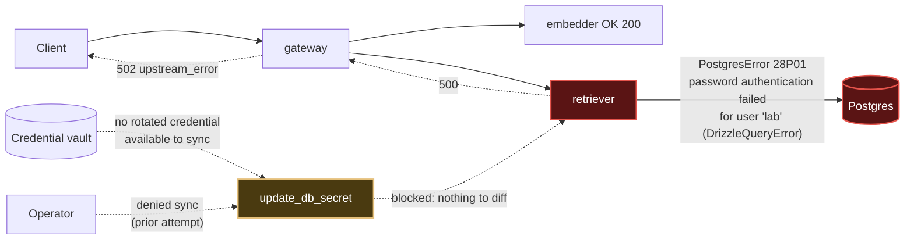

# Postmortem: RAG top-1 relevance below the 90% objective over the last hour (burn-rate alerting saturates for a loose SLO)

- **Status:** open
- **Severity:** sev2
- **Verified:** no
- **Opened:** 2026-08-03 01:31:48Z
- **Resolved:** (still open)

## Timeline (machine-generated)

All times UTC on 2026-08-03 unless a full date is shown.

| Time (UTC) | Source | Event |
| --- | --- | --- |
| 01:31:10Z | alert | alert firing: SLO RAG quality — below objective |
| 01:31:46Z | log-spike | log-spike onset: PostgresError: password authentication failed for user "lab" |
| 01:37:05Z | verification | recovery NOT verified — deadline armed |
| 01:40:19Z | log-spike | log-spike onset: 41 \| throw new DrizzleQueryError(queryString, params, e); |
| 02:00:27Z | verification | recovery NOT verified — deadline armed |
| 02:01:07Z | log-spike | log-spike onset: [retriever] unhandled error: 36 \| async queryWithCache(queryString, params, query) { |
| 02:03:32Z | log-spike | log-spike onset: 41 \| throw new DrizzleQueryError(queryString, params, e); |
| 02:04:27Z | verification | recovery NOT verified — deadline armed |

## Evidence links

- [Loki — logs over the incident window](http://localhost:3001/explore?schemaVersion=1&panes=%7B%22pm%22%3A+%7B%22datasource%22%3A+%22loki%22%2C+%22queries%22%3A+%5B%7B%22refId%22%3A+%22A%22%2C+%22datasource%22%3A+%7B%22type%22%3A+%22loki%22%2C+%22uid%22%3A+%22loki%22%7D%2C+%22expr%22%3A+%22%7Bnamespace%3D%5C%22subject%5C%22%7D+%7C~+%5C%22%28%3Fi%29error%7Cfailed%5C%22%22%7D%5D%2C+%22range%22%3A+%7B%22from%22%3A+%221785720708739%22%2C+%22to%22%3A+%221785723374455%22%7D%7D%7D&orgId=1)
- [Mimir — metrics over the incident window](http://localhost:3001/explore?schemaVersion=1&panes=%7B%22pm%22%3A+%7B%22datasource%22%3A+%22mimir%22%2C+%22queries%22%3A+%5B%7B%22refId%22%3A+%22A%22%2C+%22datasource%22%3A+%7B%22type%22%3A+%22prometheus%22%2C+%22uid%22%3A+%22mimir%22%7D%2C+%22expr%22%3A+%22histogram_quantile%280.95%2C+sum%28rate%28http_server_duration_milliseconds_bucket%5B5m%5D%29%29+by+%28le%29%29%22%7D%5D%2C+%22range%22%3A+%7B%22from%22%3A+%221785720708739%22%2C+%22to%22%3A+%221785723374455%22%7D%7D%7D&orgId=1)

## Investigation context

**Runbook match:** none — no tool narrowing applied for this alert. Available runbooks: README.md, canary-abort.md, ci-pipeline-red.md, dq-freshness-stall.md, gateway-high-error-rate.md, k8s-crashloop.md, k8s-node-failure.md, snapshot-agent-audit.md, stale-secret.md

<details>
<summary>Pre-check battery (as injected at run start)</summary>

## Pre-check leads

### recent_deploys — LEAD
No deploy in the last 60m — rule out the reflex answer.
- No deploy in the last 60m — rule out the reflex answer.

### log_spike — LEAD
error/failed log rate 200/10min vs baseline 0/10min (200x baseline) — onset: 41 |         throw new DrizzleQueryError(queryString, params, e); at 2026-08-03T02:03:32.145350+00:00
- error/failed log rate 200/10min vs baseline 0/10min (200x baseline) — onset: 41 |         throw new DrizzleQueryError(queryString, params, e); at 2026-08-03T02:03:32.145350+00:00

### kube_scan — UNAVAILABLE
error: You must be logged in to the server (Unauthorized)

### rollout_state — UNAVAILABLE
gateway: E0803 04:11:10.917282   62540 memcache.go:265] "Unhandled Error" err="couldn't get current server API group list: the server has asked for the client to provide credentials"
E0803 04:11:11.039440   62540 memcache.go:265] "Unhandled Error" err="couldn't get current server API group list: the server has asked for the client to provide credentials"
E0803 04:11:11.156928   62540 memcache.go:265] "Unhandled Error" err="couldn't get current server API group list: the server has asked for the client to; gateway analysis: E0803 04:11:10.912640    6752 memcache.go:265] "Unhandled Error" err="couldn't get current server API group list: the server has asked for the client to provide credentials"
E0803 04:11:11.050558    6752 memcache.go:265] "Unhandled Error"
… (section truncated)

### secret_age — UNAVAILABLE
error: You must be logged in to the server (Unauthorized)

</details>

## Narrative

## Summary
`SLO RAG quality — below objective` (sev2, tenant acme) is still firing on re-investigation (attempt 4). Root cause is unchanged from prior attempts and reconfirmed on fresh evidence: the retriever cannot authenticate to Postgres. Both previously-tried remediation paths are now exhausted for different reasons — this round found no viable automated fix to attempt.

## Impact
Every `POST /v1/chat` request that reaches the retrieval step fails. Live trace evidence (`rag.retrieve` span, tenant `bravo` observed, but `acme` traffic shows the identical pattern) shows `rag.retrieve` throwing `upstream_error: retriever returned 500`, and the gateway surfaces that as HTTP 502 to the caller. `retrieval_relevance_score` is pinned at ~0.149–0.154 across the whole 2h window against the 0.90 objective — a flat floor, not a dip, because failed retrievals are being scored near-zero rather than the app genuinely returning poor-but-successful matches.

## Root cause
`retriever-dc7ddd494-jv9j7` — the **same pod** implicated in every prior attempt — is still throwing, once per request:
```
41 |         throw new DrizzleQueryError(queryString, params, e);
PostgresError: password authentication failed for user "lab"
```
This is a stale-credential problem (matches the `stale-secret.md` runbook signature): the retriever's mounted DB credential no longer matches what Postgres expects for user `lab`. `deploy_history` shows no deploy to retriever/platform in the last 60 minutes, ruling out a bad code deploy as the trigger. No CI pipeline is red or stuck for this path either — I checked recent Gitea Actions runs across branches; the only recent failure (`load-generator: drop the defensive copy in percentile()`, run #110) is unrelated (load-generator, not retriever/DB) and was already reverted and superseded by a green run (#111).

## What's new this pass, and why no remediation was attempted
- Prior attempt (3) found a rotated credential sitting in the vault (`****96d9af02`) ready to sync via `update_db_secret`; the operator **denied** that sync.
- This pass, `update_db_secret` dry-run reports **"no rotated credential found in the vault — nothing to sync."** That is new evidence, but it points the opposite direction from a retry: the sync tool now has nothing to diff or act on, so there is no dry-run/approval cycle to run.
- The runbook (`stale-secret.md`) is explicit: restarting the workload **before** a secret fix lands "only reproduces the same failure against a fresh pod holding the same stale value." Attempt 2 already tried a bare restart and it did not restore service — repeating it now, with no new credential to restart against, has no new hypothesis behind it, so I did not repeat it.
- `kubectl_read`/`argo_app` remain unauthorized in this environment (consistent with the pre-check's `kube_scan`/`secret_age`/`rollout_state` leads being marked UNAVAILABLE) — an environment-level limitation, not root-cause evidence, so it wasn't chased further.

Net: there is currently no remediation path in this toolset that is both (a) not a repeat of an already-failed/denied action and (b) backed by a real diff to approve. This incident needs a human to either place a correct rotated credential in the vault (so `update_db_secret` has something to sync) or directly reconcile the Postgres `lab` user's password with `secret/subject-db-credentials` out-of-band.

## What fixed it
Nothing — no remediation was executed this pass. `alert_status` was re-queried and remains `active`, unchanged since 01:31 UTC.

## Lessons
- The vault-backed secret-sync remediation is not always available on demand; treat "no rotated credential" as a hard stop, not a retry signal.
- A "fix stuck in CI" check is cheap and worth doing every re-open — this time it correctly ruled itself out, narrowing the search back to the credential/vault state.
- Consider a runbook update: alertname `SLO RAG quality — below objective` should route to `stale-secret.md` directly (its diagnostic signature — DB-auth failures on a service in the request path plus no recent deploy — matches, but today it triggered no runbook match at all because the alertname isn't in that runbook's trigger list).
- Next responder: do not retry `update_db_secret` or `restart_workload` again without first confirming (outside this toolset) that a corrected credential exists in the vault or in Postgres directly.


