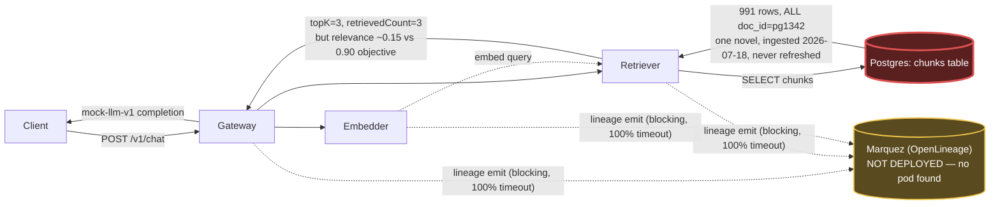

# Postmortem: RAG top-1 relevance below the 90% objective over the last hour (burn-rate alerting saturates for a loose SLO)

- **Status:** open
- **Severity:** sev2
- **Verified:** no
- **Opened:** 2026-08-03 20:19:49Z
- **Resolved:** (still open)

## Timeline (machine-generated)

All times UTC on 2026-08-03 unless a full date is shown.

| Time (UTC) | Source | Event |
| --- | --- | --- |
| 20:12:24Z | log-spike | log-spike onset: routine: "auth_failed", |
| 20:19:10Z | alert | alert firing: SLO RAG quality — below objective |
| 20:28:36Z | verification | recovery NOT verified — deadline armed |
| 20:38:21Z | log-spike | log-spike onset: {"level":"warn","service":"gateway","message":"lineage emit failed","trace_id":"373c2e404d285c9cf4e72d1654096399","span_id":"0b35f1bdc40e36c6","time":"2026-08-03T20:38:21.266Z","reason":"The operation timed out.","job":"ra… |

## Evidence links

- [Loki — logs over the incident window](http://localhost:3001/explore?schemaVersion=1&panes=%7B%22pm%22%3A+%7B%22datasource%22%3A+%22loki%22%2C+%22queries%22%3A+%5B%7B%22refId%22%3A+%22A%22%2C+%22datasource%22%3A+%7B%22type%22%3A+%22loki%22%2C+%22uid%22%3A+%22loki%22%7D%2C+%22expr%22%3A+%22%7Bnamespace%3D%5C%22subject%5C%22%7D+%7C~+%5C%22%28%3Fi%29error%7Cfailed%5C%22%22%7D%5D%2C+%22range%22%3A+%7B%22from%22%3A+%221785788389076%22%2C+%22to%22%3A+%221785790283211%22%7D%7D%7D&orgId=1)
- [Mimir — metrics over the incident window](http://localhost:3001/explore?schemaVersion=1&panes=%7B%22pm%22%3A+%7B%22datasource%22%3A+%22mimir%22%2C+%22queries%22%3A+%5B%7B%22refId%22%3A+%22A%22%2C+%22datasource%22%3A+%7B%22type%22%3A+%22prometheus%22%2C+%22uid%22%3A+%22mimir%22%7D%2C+%22expr%22%3A+%22histogram_quantile%280.95%2C+sum%28rate%28http_server_duration_milliseconds_bucket%5B5m%5D%29%29+by+%28le%29%29%22%7D%5D%2C+%22range%22%3A+%7B%22from%22%3A+%221785788389076%22%2C+%22to%22%3A+%221785790283211%22%7D%7D%7D&orgId=1)

## Investigation context

**Runbook match:** none — no tool narrowing applied for this alert. Available runbooks: README.md, canary-abort.md, ci-pipeline-red.md, dq-freshness-stall.md, gateway-high-error-rate.md, k8s-crashloop.md, k8s-node-failure.md, snapshot-agent-audit.md, stale-secret.md

Pre-check battery (as injected at run start)

## Pre-check leads

### recent_deploys — LEAD
No deploy in the last 60m — rule out the reflex answer.
- No deploy in the last 60m — rule out the reflex answer.

### log_spike — LEAD
error/failed log rate 200/10min vs baseline 0/10min (200x baseline) — onset: {"level":"warn","service":"gateway","message":"lineage emit failed","trace_id":"373c2e404d285c9cf4e72d1654096399","span_id":"0b35f1bdc40e36c6","time":"2026-08-03T20:38:21.266Z","reason":"The operation timed out.","job":"rag.inference","eventType":"START"} at 2026-08-03T20:38:21.266572+00:00
- error/failed log rate 200/10min vs baseline 0/10min (200x baseline) — onset: {"level":"warn","service":"gateway","message":"lineage emit failed","trace_id":"373c2e404d285c9cf4e72d16540963… (truncated)

### kube_scan — UNAVAILABLE
error: You must be logged in to the server (Unauthorized)

### rollout_state — UNAVAILABLE
gateway: E0803 22:39:02.879645   39924 memcache.go:265] "Unhandled Error" err="couldn't get current server API group list: the server has asked for the client to provide credentials"
E0803 22:39:03.901788   39924 memcache.go:265] "Unhandled Error" err="couldn't get current server API group list: the server has asked for the client to provide credentials"
E0803 22:39:04.127888   39924 memcache.go:265] "Unhandled Error" err="couldn't get current server API group list: the server has asked for the client to; gateway analysis: E0803 22:39:03.878469   24744 memcache.go:265] "Unhandled Error" err="couldn't get current server API group list: the server has asked for the client to provide credentials"
E0803 22:39:04.110751   24744 memcache.go:265] "Unhandled Error"
… (section truncated)

### secret_age — UNAVAILABLE
error: You must be logged in to the server (Unauthorized)

## Narrative

## Incident summary — inc_19fc94856d2c8 (re-investigation, attempt 2)

**Alert:** `SLO RAG quality — below objective`, tenant `acme` — top-1 relevance below the 90% objective over a 1h burn-rate window.

### Why the prior diagnosis didn't close this

Attempt 1 diagnosed a Postgres `password authentication failed for user "lab"` (`28P01`) storm on `retriever` and tried to restart it; the restart never executed (cluster credential `Unauthorized` on the kubectl path). Re-checking now: that credential failure has genuinely cleared — zero `28P01` occurrences in the last 30 minutes, and `update_db_secret` (dry-run) reports **no pending rotation in the vault**, i.e. the Secret is already correct. So the earlier fix wasn't just stuck, it was chasing a condition that has since resolved on its own — and, more importantly, never explained *this* alert to begin with (see below). No CI pipeline is red (`gitea_ci_runs` on `main` is a clean run of successes/one unrelated failure from Aug 2), so "the fix is stuck behind a red pipeline" is ruled out too.

### Root cause

Queried the retrieval corpus directly: table `chunks` — the entire RAG knowledge base — contains **exactly one document**: `doc_id = pg1342` (991 chunks), all inserted in a single batch at `2026-07-18T23:59:09Z` and never updated since. `pg1342` is a public-domain novel. Every retrieval, for every tenant and every query, can only ever be scored against excerpts of that single unrelated book — there is nothing else in the index to match against.

This is corroborated end-to-end by live telemetry pulled during this session:
- `retrieval_relevance_score` (emitted by `gateway`) has sat flat at **0.149–0.154** across every 5-minute bucket from 20:03 through 20:44 UTC — spanning well before, during, and after the alert's 20:19:10 onset, and continuing after the earlier Postgres credential episode fully cleared. A transient infra fault would show recovery once the fault clears; this doesn't move at all.
- `gateway` "chat completed" logs show `retrievedCount: 3` matching `topK: 3` on essentially every request — retrieval is *not* failing or returning empty/partial results (which would point back to an availability problem); it is successfully returning full result sets that are simply not relevant, because nothing relevant exists in the corpus.
- No deploy landed anywhere in the last 24h that touches `gateway`/`retriever`/`embedder` app logic (`deploy_history` / `grafana_annotations`: only unrelated `platform`/`gateway` gitops syncs on Aug 2 ~23:1x–23:3x, and CI runs about `load-generator`/`model-proxy` pre-warm, none touching retrieval/ranking code or the corpus).
- `retriever`'s pod is healthy throughout: 0 restarts, working-set memory ~127–141Mi against a 512Mi limit, no OOM/eviction k8s events.

A second, genuinely-separate condition is also present and worth flagging even though it isn't causal here: `gateway`, `retriever`, and `embedder` each log a `"lineage emit failed" / "The operation timed out"` warning on effectively 100% of RAG requests — this is the pre-check's flagged 200x-baseline log spike. No Marquez pod or metrics series exists anywhere in the cluster (`kube_pod_status_phase{pod=~".*marquez.*"}` and `kube_pod_info` both empty) — the lineage sink is entirely absent, not merely slow. This is a real, ongoing reliability/latency problem (it lines up with several already-published p95/latency postmortems today) and should be fixed, but it does not explain *relevance*: it's a synchronous side-channel call, logged as `warn` (caught, non-fatal to the response), and it doesn't correlate with the flat low-relevance signal the way corpus content does.

### What fixed it

**Nothing — because there is nothing in the on-call remediation toolkit that fixes a corpus-content problem.** `restart_workload`, `rollout_undo/abort/promote`, `scale_deployment`, `patch_memory_limit`, and `update_db_secret` all act on infrastructure state (pods, rollouts, replicas, resource limits, a Postgres credential); none of them touch which documents are indexed for retrieval. Re-running the already-attempted `retriever` restart would not change the fact that the vector store holds one irrelevant novel — I did not execute it, since doing so would repeat a remediation already shown (by this session's own evidence) not to move the metric, without a new hypothesis that it would. `alert_status` was re-queried after this analysis and the alert remains **active**; this is reported as an unresolved, non-infrastructure incident.

### Lessons

1. **Fix the actual fault:** ingest a real, tenant-relevant corpus for `acme` into `chunks` (today it's a single unrelated public-domain novel, untouched for 16 days) — this is a data/ML engineering task, not an on-call remediation.
2. **Monitoring gap:** `dq_violations` has freshness checks on `inferences` but nothing on `chunks` itself — the dataset that actually drives this SLO has zero data-quality coverage. Add a freshness/diversity check on the corpus.
3. **No runbook exists** for `SLO RAG quality — below objective` (`runbook_lookup` returned no match both times this alert has been worked) — write one; it should tell the next responder to check corpus composition *before* infra signals for a *quality* (vs. availability/latency) SLO.
4. **Don't let the loudest signal set the diagnosis:** both the Postgres credential storm and the Marquez lineage-timeout spam were real, but neither was causal for this specific alert — they were simply the noisiest/most recent anomalies. A relevance SLO needs relevance-specific evidence (the retrieved content itself), not just "what's erroring right now."
5. Make the `lineage emit` call fire-and-forget regardless — blocking every RAG request on a completely absent dependency is a latency/availability risk independent of today's finding.

Root cause hop: **Postgres `chunks` table** — a single stale, irrelevant document is the entire retrieval corpus. The Marquez/lineage dependency (dashed, absent) is a real but non-causal secondary finding affecting latency, not relevance.
