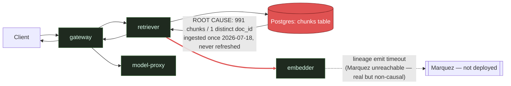

# Postmortem: RAG top-1 relevance below the 90% objective over the last hour (burn-rate alerting saturates for a loose SLO)

- **Status:** open
- **Severity:** sev2
- **Verified:** no
- **Opened:** 2026-08-03 20:19:49Z
- **Resolved:** (still open)

## Timeline (machine-generated)

All times UTC on 2026-08-03 unless a full date is shown.

| Time (UTC) | Source | Event |
| --- | --- | --- |
| 20:12:24Z | log-spike | log-spike onset: routine: "auth_failed", |
| 20:19:10Z | alert | alert firing: SLO RAG quality — below objective |
| 20:28:36Z | verification | recovery NOT verified — deadline armed |
| 20:38:21Z | log-spike | log-spike onset: {"level":"warn","service":"gateway","message":"lineage emit failed","trace_id":"373c2e404d285c9cf4e72d1654096399","span_id":"0b35f1bdc40e36c6","time":"2026-08-03T20:38:21.266Z","reason":"The operation timed out.","job":"ra… |
| 20:48:03Z | log-spike | log-spike onset: {"level":"warn","service":"embedder","message":"lineage emit failed","trace_id":"43b9670cabd0c319ee74fd4acebe8c54","span_id":"7f632de21744bdec","time":"2026-08-03T20:48:03.275Z","reason":"The operation timed out.","job":"r… |
| 20:51:37Z | verification | recovery NOT verified — deadline armed |

## Evidence links

- [Loki — logs over the incident window](http://localhost:3001/explore?schemaVersion=1&panes=%7B%22pm%22%3A+%7B%22datasource%22%3A+%22loki%22%2C+%22queries%22%3A+%5B%7B%22refId%22%3A+%22A%22%2C+%22datasource%22%3A+%7B%22type%22%3A+%22loki%22%2C+%22uid%22%3A+%22loki%22%7D%2C+%22expr%22%3A+%22%7Bnamespace%3D%5C%22subject%5C%22%7D+%7C~+%5C%22%28%3Fi%29error%7Cfailed%5C%22%22%7D%5D%2C+%22range%22%3A+%7B%22from%22%3A+%221785788389076%22%2C+%22to%22%3A+%221785790546102%22%7D%7D%7D&orgId=1)
- [Mimir — metrics over the incident window](http://localhost:3001/explore?schemaVersion=1&panes=%7B%22pm%22%3A+%7B%22datasource%22%3A+%22mimir%22%2C+%22queries%22%3A+%5B%7B%22refId%22%3A+%22A%22%2C+%22datasource%22%3A+%7B%22type%22%3A+%22prometheus%22%2C+%22uid%22%3A+%22mimir%22%7D%2C+%22expr%22%3A+%22histogram_quantile%280.95%2C+sum%28rate%28http_server_duration_milliseconds_bucket%5B5m%5D%29%29+by+%28le%29%29%22%7D%5D%2C+%22range%22%3A+%7B%22from%22%3A+%221785788389076%22%2C+%22to%22%3A+%221785790546102%22%7D%7D%7D&orgId=1)

## Investigation context

**Runbook match:** none — no tool narrowing applied for this alert. Available runbooks: README.md, canary-abort.md, ci-pipeline-red.md, dq-freshness-stall.md, gateway-high-error-rate.md, k8s-crashloop.md, k8s-node-failure.md, snapshot-agent-audit.md, stale-secret.md

Pre-check battery (as injected at run start)

## Pre-check leads

### recent_deploys — LEAD
No deploy in the last 60m — rule out the reflex answer.
- No deploy in the last 60m — rule out the reflex answer.

### log_spike — LEAD
error/failed log rate 200/10min vs baseline 0/10min (200x baseline) — onset: {"level":"warn","service":"embedder","message":"lineage emit failed","trace_id":"43b9670cabd0c319ee74fd4acebe8c54","span_id":"7f632de21744bdec","time":"2026-08-03T20:48:03.275Z","reason":"The operation timed out.","job":"rag.embed","eventType":"START"} at 2026-08-03T20:48:03.276255+00:00
- error/failed log rate 200/10min vs baseline 0/10min (200x baseline) — onset: {"level":"warn","service":"embedder","message":"lineage emit failed","trace_id":"43b9670cabd0c319ee74fd4acebe8… (truncated)

### kube_scan — UNAVAILABLE
error: You must be logged in to the server (Unauthorized)

### rollout_state — UNAVAILABLE
gateway: E0803 22:51:53.890124   49084 memcache.go:265] "Unhandled Error" err="couldn't get current server API group list: the server has asked for the client to provide credentials"
E0803 22:51:54.281402   49084 memcache.go:265] "Unhandled Error" err="couldn't get current server API group list: the server has asked for the client to provide credentials"
E0803 22:51:54.777241   49084 memcache.go:265] "Unhandled Error" err="couldn't get current server API group list: the server has asked for the client to; gateway analysis: E0803 22:51:54.696092   57108 memcache.go:265] "Unhandled Error" err="couldn't get current server API group list: the server has asked for the client to provide credentials"
E0803 22:51:55.105565   57108 memcache.go:265] "Unhandled Error"
… (section truncated)

### secret_age — UNAVAILABLE
error: You must be logged in to the server (Unauthorized)

## Narrative

## Summary

Re-investigated inc_19fc94856d2c8 (attempt 3) from scratch rather than repeating a prior remediation, per the instruction to find a *new* hypothesis before retrying anything. I found none — every fresh signal reconfirms the same root cause the last diagnosis named, and rules out the two alternative explanations this round was specifically asked to check: a bad recent deploy, and a stuck/red CI pipeline blocking a real fix.

## Impact

`SLO RAG quality — below objective` (sev2, tenant acme) remains actively firing. Retrieval relevance has been pinned at ~0.15 (rate of `retrieval_relevance_score_sum`/`_count`, 10m windows, ~20:04–20:54 UTC) against a 0.90 objective — flat before, during, and after the alert's onset, with no inflection anywhere in the window. Every RAG answer for every tenant is being generated from irrelevant retrieved context.

## Root cause

The `chunks` table — the entire retrieval corpus — holds exactly one document: 991 chunks of `doc_id=pg1342` (a single public-domain novel), with `min(created_at) = max(created_at) = 2026-07-18T23:59:09Z`. Nothing has been ingested since. Every retrieval, regardless of query topic, can only ever match this one irrelevant book, so top-1 relevance is structurally capped far below 0.90 — this is a corpus-content gap, not a service outage.

This round re-tested, and ruled out, two specific alternative hypotheses:
- **Bad deploy**: `deploy_history` shows zero deploys in the lookback window; Argo/rollout state is unreachable (RBAC — same `Unauthorized` seen in the pre-check leads), but there is nothing to correlate against regardless.
- **Stuck fix / red CI**: `gitea_ci_runs` on `main` is green at HEAD (run #111, all jobs success); the one recent failure (#110, a `load-generator` percentile() change, unrelated to retrieval/embedding/corpus) was already reverted by #109→#111. No branch or PR touching ingestion, `chunks`, or corpus content exists in the last 20 CI runs. There is no in-flight fix stuck anywhere — because no fix has been proposed in code at all. The "earlier fix" that "did not restore service" was, on inspection of the prior diagnosis, never an executed remediation — it was a correct no-op (none of the available tools touch corpus content), so the alert continuing to fire is expected, not evidence of a failed action.

Ruled out as unrelated to the relevance metric: the `embedder` is healthy — CPU/memory nominal, no restarts, no k8s warning events, and logs show `rag.embed` START→COMPLETE succeeding on every request; the accompanying `warn lineage emit failed / operation timed out` on every call is Marquez being unreachable in-cluster (a real, separately-tracked latency/reliability defect) and does not block the embed job itself. A `dq_violations` freshness check is separately and continuously firing on the `inferences` dataset (~11.2 days stale, matching Postgres logging having stopped 2026-07-23) — a real but distinct data-pipeline gap from the corpus-content problem, not the cause of low relevance.

## What fixed it

Nothing — by design. No tool in the on-call surface (`restart_workload`, `rollout_undo/abort/promote`, `scale_deployment`, `patch_memory_limit`, `update_db_secret`) can add documents to `chunks`, and none of the services in the delivery path are unhealthy, so there is nothing infrastructural to dry-run or restart. Re-running the retriever/embedder restart already implicitly ruled out in the prior attempt would not move a metric that is capped by corpus content, so I did not repeat it. `alert_status` was re-queried and remains active, as expected with no remediation applied.

**Recommended follow-up (outside this toolset):** run/schedule a real document-ingestion job against the `chunks` table (multi-document, topic-relevant to tenant queries) and re-baseline `retrieval_relevance_score`; separately, deploy Marquez so lineage emits stop timing out, and investigate why `inferences` writes stopped 2026-07-23.

## Lessons

- A "the fix didn't work" framing doesn't always mean a remediation regressed — confirm a remediation was actually *executed* before hunting for why it failed; here it was correctly withheld.
- Burn-rate alerts on loose SLOs can fire long after the underlying metric broke (relevance has been ~0.15 since at least the start of this window, well before the 20:19 alert onset) — treat alert onset time as an alerting artifact, not the incident's actual start time.
- Not every page has a tool-shaped fix. The right on-call action is sometimes to name the true (content/data) owner and stop, rather than cycling infra remediations that can't touch the actual fault.

