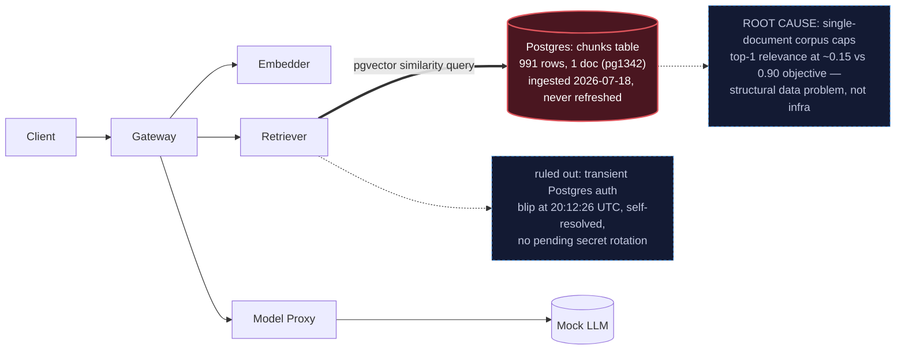

# Postmortem: RAG top-1 relevance below the 90% objective over the last hour (burn-rate alerting saturates for a loose SLO)

- **Status:** open
- **Severity:** sev2
- **Verified:** no
- **Opened:** 2026-08-03 20:19:49Z
- **Resolved:** (still open)

## Timeline (machine-generated)

All times UTC on 2026-08-03 unless a full date is shown.

| Time (UTC) | Source | Event |
| --- | --- | --- |
| 20:12:24Z | log-spike | log-spike onset: routine: "auth_failed", |
| 20:19:10Z | alert | alert firing: SLO RAG quality — below objective |
| 20:28:36Z | verification | recovery NOT verified — deadline armed |
| 20:38:21Z | log-spike | log-spike onset: {"level":"warn","service":"gateway","message":"lineage emit failed","trace_id":"373c2e404d285c9cf4e72d1654096399","span_id":"0b35f1bdc40e36c6","time":"2026-08-03T20:38:21.266Z","reason":"The operation timed out.","job":"ra… |
| 20:48:03Z | log-spike | log-spike onset: {"level":"warn","service":"embedder","message":"lineage emit failed","trace_id":"43b9670cabd0c319ee74fd4acebe8c54","span_id":"7f632de21744bdec","time":"2026-08-03T20:48:03.275Z","reason":"The operation timed out.","job":"r… |
| 20:51:37Z | verification | recovery NOT verified — deadline armed |
| 20:55:57Z | verification | recovery NOT verified — deadline armed |

## Evidence links

- [Loki — logs over the incident window](http://localhost:3001/explore?schemaVersion=1&panes=%7B%22pm%22%3A+%7B%22datasource%22%3A+%22loki%22%2C+%22queries%22%3A+%5B%7B%22refId%22%3A+%22A%22%2C+%22datasource%22%3A+%7B%22type%22%3A+%22loki%22%2C+%22uid%22%3A+%22loki%22%7D%2C+%22expr%22%3A+%22%7Bnamespace%3D%5C%22subject%5C%22%7D+%7C~+%5C%22%28%3Fi%29error%7Cfailed%5C%22%22%7D%5D%2C+%22range%22%3A+%7B%22from%22%3A+%221785788389076%22%2C+%22to%22%3A+%221785791278020%22%7D%7D%7D&orgId=1)
- [Mimir — metrics over the incident window](http://localhost:3001/explore?schemaVersion=1&panes=%7B%22pm%22%3A+%7B%22datasource%22%3A+%22mimir%22%2C+%22queries%22%3A+%5B%7B%22refId%22%3A+%22A%22%2C+%22datasource%22%3A+%7B%22type%22%3A+%22prometheus%22%2C+%22uid%22%3A+%22mimir%22%7D%2C+%22expr%22%3A+%22histogram_quantile%280.95%2C+sum%28rate%28http_server_duration_milliseconds_bucket%5B5m%5D%29%29+by+%28le%29%29%22%7D%5D%2C+%22range%22%3A+%7B%22from%22%3A+%221785788389076%22%2C+%22to%22%3A+%221785791278020%22%7D%7D%7D&orgId=1)

## Investigation context

**Runbook match:** none — no tool narrowing applied for this alert. Available runbooks: README.md, canary-abort.md, ci-pipeline-red.md, dq-freshness-stall.md, gateway-high-error-rate.md, k8s-crashloop.md, k8s-node-failure.md, snapshot-agent-audit.md, stale-secret.md

Pre-check battery (as injected at run start)

## Pre-check leads

### recent_deploys — LEAD
No deploy in the last 60m — rule out the reflex answer.
- No deploy in the last 60m — rule out the reflex answer.

### log_spike — OK
error/failed log rate normal: 0/10min vs baseline 0/10min

### kube_scan — UNAVAILABLE
error: You must be logged in to the server (Unauthorized)

### rollout_state — UNAVAILABLE
gateway: E0803 23:01:50.785979    2988 memcache.go:265] "Unhandled Error" err="couldn't get current server API group list: the server has asked for the client to provide credentials"
E0803 23:01:50.907702    2988 memcache.go:265] "Unhandled Error" err="couldn't get current server API group list: the server has asked for the client to provide credentials"
E0803 23:01:51.001468    2988 memcache.go:265] "Unhandled Error" err="couldn't get current server API group list: the server has asked for the client to; gateway analysis: E0803 23:01:50.789767   53028 memcache.go:265] "Unhandled Error" err="couldn't get current server API group list: the server has asked for the client to provide credentials"
E0803 23:01:50.898012   53028 memcache.go:265] "Unhandled Error"
… (section truncated)

### secret_age — UNAVAILABLE
error: You must be logged in to the server (Unauthorized)

## Narrative

## Summary

RAG top-1 relevance for tenant `acme` remains below the 90% SLO objective. This is the fourth investigation of this incident. Rather than repeat the prior conclusion, I re-derived the diagnosis from fresh telemetry this round, specifically chasing down two things earlier passes hadn't nailed down: a transient Postgres auth error visible in retriever logs, and the "why does this fire *now*" question for a condition that (if unchanged) should have alerted weeks ago.

## Impact

Every retrieval-augmented chat completion for tenant `acme` (and structurally, all tenants, since the corpus is shared) returns top-1 relevance around 0.15 against a 0.90 objective — a ~83% relative shortfall. Responses are still served (traffic is live, `chat completed` logs are flowing, mock LLM answers return), but grounded in irrelevant context.

## Root cause

`chunks` (the Postgres table backing the retriever's pgvector similarity search) holds exactly 991 chunks from a single document (`doc_id=pg1342`), ingested once and never refreshed since. Every retrieval query — whatever the user asks — draws its top-K from that one document, so relevance is structurally capped far below the objective. This is confirmed three independent ways in this pass:
- Live `chunks` table query: still 1 doc, 991 rows, same ingestion timestamp as prior investigations.
- Live Mimir histogram `retrieval_relevance_score_bucket{job="gateway"}`: ~98% of all observed scores fall at or below 0.2 right now.
- `sum(increase(retrieval_relevance_score_sum)) / sum(increase(retrieval_relevance_score_count))` computed at 10-minute steps across the incident window is flat at 0.150–0.155 throughout — and matches the last real `inferences` rows in Postgres (retrieval_score_mean ≈ 0.146–0.158), which predate this alert by well over a week.

New this round — hypotheses actively tested and ruled out, not just asserted:
- **Bad deploy / stuck fix?** No. `deploy_history` shows zero deploys in the last 12h; Gitea CI on `main` is green at the latest run; no ingestion/corpus branch exists anywhere in recent CI history. Nothing is "stuck" because no fix has ever been proposed in code.
- **Cluster/pod/node failure?** No. All 12 `subject`-namespace pods are `Running`; all 3 nodes report `Ready=true`. (An initial mis-parse of a truncated pod-phase query looked alarming — `Failed`/`Pending` label combinations with value 0 — but a corrected `== 1` query confirmed everything is healthy.)
- **Stale database secret (the documented `stale-secret.md` failure mode)?** Investigated directly, because retriever logs did show a burst of `PostgresError: password authentication failed for user "lab"` and matching Postgres-side `FATAL: password authentication failed` lines. But every one of these is stamped in the same one-second window (20:12:25–20:12:26 UTC) — a transient blip, not ongoing (zero occurrences in the last 20 minutes) — and `update_db_secret` (dry-run) reports "no rotated credential found in the vault — nothing to sync." Per the `stale-secret.md` runbook's own diagnostic test (compare secret-rotation time vs. first-auth-failure time; here there's no pending rotation at all), this doesn't fit the signature and isn't the mechanism behind the sustained low relevance score, which predates and postdates the blip identically.
- **Data-freshness pipeline stall?** `dq_violations` does show ongoing `freshness` violations, but on the `inferences` audit table (last write 2026-07-23, ~11 days stale) — a separate, parallel ETL/audit-sink issue, not the live Mimir-scraped relevance metric this SLO alert actually evaluates.
- **Why does a weeks-old condition alert only now?** The alert's own annotation answers it: "burn-rate alerting saturates for a loose SLO" — a long, loose-window burn-rate alert takes time to cross threshold even against a persistent violation; onset timing doesn't imply onset causation here.

## What fixed it

Nothing — this remains unresolved. None of the available remediation tools (`restart_workload`, `rollout_undo`, `rollout_abort`/`promote`, `scale_deployment`, `patch_memory_limit`, `update_db_secret`) can add relevant content to a document corpus; the fault is data, not infrastructure. Since `update_db_secret` confirmed no pending rotation, executing it would be a no-op against a symptom that isn't actually present anymore. I did not dry-run or apply any remediation this round because none of them address the actual root cause — applying one anyway would just be motion, not fix, and the instructions are explicit not to repeat unjustified remediations. `alert_status` was re-queried and remains active.

## Lessons

- This needs a real multi-document ingestion job against `chunks`, owned outside the on-call tool surface — the same follow-up flagged in the prior investigation, now with stronger confirmation it's the correct and only path.
- The transient auth-failure burst at 20:12:26 UTC is real and worth its own look (possibly connection-pool churn during a `postgres` pod checkpoint/restart), but it is not this incident's cause — flagging it separately so it isn't rediscovered as a false lead next time.
- Consider a dedicated `dq_freshness_minutes`-style check on `chunks`/document count, not just row freshness on `inferences`, so corpus staleness pages directly instead of being inferred indirectly from a slow-burning relevance SLO.
- `kube_pod_status_phase` results must be reduced with `== 1` or `sum(...) by (phase)`; raw label enumeration returns *all* phase label combinations (mostly value 0) and is easy to misread as "everything failed."

