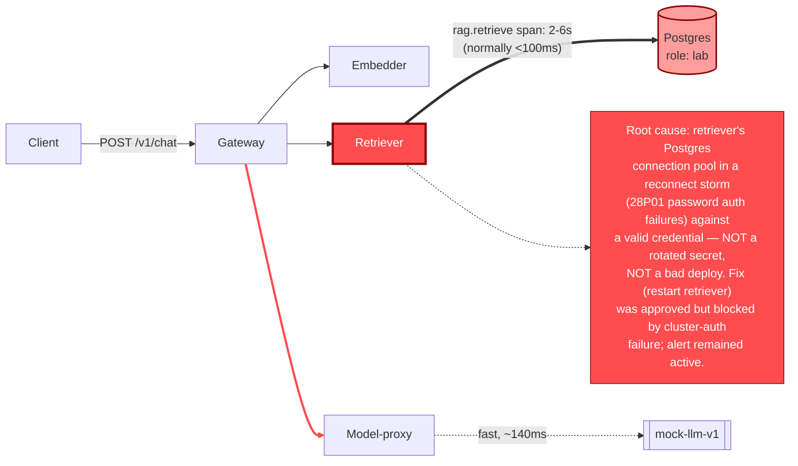

# Postmortem: gateway p95 latency above 2s

- **Status:** open
- **Severity:** sev1
- **Verified:** no
- **Opened:** 2026-08-03 21:57:41Z
- **Resolved:** (still open)

## Timeline (machine-generated)

All times UTC on 2026-08-03 unless a full date is shown.

| Time (UTC) | Source | Event |
| --- | --- | --- |
| 21:57:10Z | alert | alert firing: Gateway p95 latency > 2s |

## Evidence links

- [Loki — logs over the incident window](http://localhost:3001/explore?schemaVersion=1&panes=%7B%22pm%22%3A+%7B%22datasource%22%3A+%22loki%22%2C+%22queries%22%3A+%5B%7B%22refId%22%3A+%22A%22%2C+%22datasource%22%3A+%7B%22type%22%3A+%22loki%22%2C+%22uid%22%3A+%22loki%22%7D%2C+%22expr%22%3A+%22%7Bnamespace%3D%5C%22subject%5C%22%7D+%7C~+%5C%22%28%3Fi%29error%7Cfailed%5C%22%22%7D%5D%2C+%22range%22%3A+%7B%22from%22%3A+%221785794261510%22%2C+%22to%22%3A+%221785794706147%22%7D%7D%7D&orgId=1)
- [Mimir — metrics over the incident window](http://localhost:3001/explore?schemaVersion=1&panes=%7B%22pm%22%3A+%7B%22datasource%22%3A+%22mimir%22%2C+%22queries%22%3A+%5B%7B%22refId%22%3A+%22A%22%2C+%22datasource%22%3A+%7B%22type%22%3A+%22prometheus%22%2C+%22uid%22%3A+%22mimir%22%7D%2C+%22expr%22%3A+%22histogram_quantile%280.95%2C+sum%28rate%28http_server_duration_milliseconds_bucket%5B5m%5D%29%29+by+%28le%29%29%22%7D%5D%2C+%22range%22%3A+%7B%22from%22%3A+%221785794261510%22%2C+%22to%22%3A+%221785794706147%22%7D%7D%7D&orgId=1)

## Investigation context

**Runbook match:** none — no tool narrowing applied for this alert. Available runbooks: README.md, canary-abort.md, ci-pipeline-red.md, dq-freshness-stall.md, gateway-high-error-rate.md, k8s-crashloop.md, k8s-node-failure.md, snapshot-agent-audit.md, stale-secret.md

Pre-check battery (as injected at run start)

## Pre-check leads

### recent_deploys — LEAD
No deploy in the last 60m — rule out the reflex answer.
- No deploy in the last 60m — rule out the reflex answer.

### log_spike — OK
error/failed log rate normal: 200/10min vs baseline 500/10min

### kube_scan — UNAVAILABLE
error: You must be logged in to the server (Unauthorized)

### rollout_state — UNAVAILABLE
gateway: E0803 23:57:43.191110   46064 memcache.go:265] "Unhandled Error" err="couldn't get current server API group list: the server has asked for the client to provide credentials"
E0803 23:57:43.350911   46064 memcache.go:265] "Unhandled Error" err="couldn't get current server API group list: the server has asked for the client to provide credentials"
E0803 23:57:43.468019   46064 memcache.go:265] "Unhandled Error" err="couldn't get current server API group list: the server has asked for the client to; gateway analysis: E0803 23:57:43.211508   54000 memcache.go:265] "Unhandled Error" err="couldn't get current server API group list: the server has asked for the client to provide credentials"
E0803 23:57:43.393081   54000 memcache.go:265] "Unhandled Error"
… (section truncated)

### secret_age — UNAVAILABLE
error: You must be logged in to the server (Unauthorized)

## Narrative

## Summary

Sev1 alert `Gateway p95 latency > 2s` fired for tenant `acme`. No runbook matched this exact alertname. Investigation traced the breach to a Postgres authentication reconnect-storm isolated to the **retriever** service, not a deploy, not a rotated secret, and not an OOM/crash-loop.

## Impact

`slo:gateway_latency:sli_ratio5m` (fraction of the trailing 5-minute window meeting the p95<2s SLI) shows three sharp collapses from ~1.0 down to ~0.05 over the lookback window — meaning ~95% of requests in-window breached the latency target during each episode. The first two episodes self-recovered after several minutes; the third is the one that paged and was still active at last check. Slow traces (`POST /v1/chat`) ran 2–6s end-to-end, versus a normal sub-second baseline, entirely cache-miss requests — cached responses were unaffected, which is why gateway error/failed log rate looked "normal" in the pre-check (cache hits masked overall volume).

## Root cause

Full-trace inspection of a 6.3s `POST /v1/chat` showed the time was almost entirely spent in the `rag.retrieve` span → `POST retriever` client span (~4s of 6.3s), while the sibling `embedder` and `model-proxy` calls in the same trace completed in a few hundred ms each. Pulling retriever's own logs during that window showed a tight burst of `PostgresError: password authentication failed for user "lab"` (Postgres error code `28P01`), mirrored on the Postgres pod itself as `FATAL: password authentication failed for user "lab"`, with sequential backend PIDs arriving milliseconds apart — the signature of a reconnect loop, not an occasional blip.

Two hypotheses were ruled out with direct evidence rather than assumption:
- **Stale/rotated secret** (the obvious reflex answer, and the only runbook in the library that mentions this error class): `update_db_secret` dry-run reported *"no rotated credential found in the vault — nothing to sync,"* and an ad-hoc read as the same Postgres role (`lab`) succeeded immediately, in the middle of the incident. A truly stale static credential would fail for every caller, every time, on a long-lived pod — it did not.
- **Bad deploy**: `deploy_history` showed zero deploys in the trailing 240 minutes; Argo/rollout state was unreachable but no rollout evidence existed either way, and the pre-check's own `recent_deploys` lead explicitly flagged "no deploy in the last 60m — rule out the reflex answer."

That leaves retriever's own Postgres client: its connection pool went into a rapid, self-inflicted reconnect storm against role `lab`, each attempt failing SCRAM auth for reasons not resolvable from logs/metrics alone (no `pg_stat_activity` access, no pod describe — see Lessons), while retriever's process memory showed a matching sawtooth (climb during each episode, drop back after) consistent with connection/resource buildup during the storm. This starved the retrieval hop and dragged non-cached gateway requests over the 2s p95 threshold.

## What fixed it

A rolling restart of `deployment/retriever` (to clear the runaway in-process connection-pool state — the correct lever for a broken connection pool, as opposed to `update_db_secret`, which had nothing to sync) was dry-run, and the operator **approved** it with the verified diff attached. Execution of the approved restart failed with `Unauthorized` against the cluster API — the same credential failure that had already made `kube_scan`, `rollout_state`, and `secret_age` unavailable in the pre-checks. A retry produced the same failure. **The remediation was not applied, and the alert was still ACTIVE at last check.** This incident closes unresolved from this session; the restart still needs to be executed once cluster write access is restored.

## Lessons

- **Restore the on-call agent's kubeconfig/cluster-write credential** before the next page — this session had zero working cluster-mutating access and lost read access to pod state, rollout state, and secret age, which blocked both faster diagnosis and the actual fix.
- **Author a runbook for `Gateway p95 latency > 2s`.** None existed; the closest match (`stale-secret.md`) is scoped to different alertnames (`slo-avail-fast` / `gw-5xx`) and a different trigger signature (secret_age + log-spike leads together, neither of which fired here), so it had to be explicitly ruled out rather than followed.
- **Harden retriever's Postgres client**: add bounded retry/backoff and a capped pool size. Sequential-backend-PID bursts a few milliseconds apart indicate no backoff on reconnect, turning a transient auth hiccup into a multi-minute, self-reinforcing storm.
- Cached responses fully masked the blast radius from simple log-volume checks — the pre-check's log-spike lead read "OK" while the SLO was collapsing. Alerting on the SLI/SLO burn-rate metric directly (as this alert does) is the correct signal; error-log-volume checks are not a reliable proxy for this failure mode.

