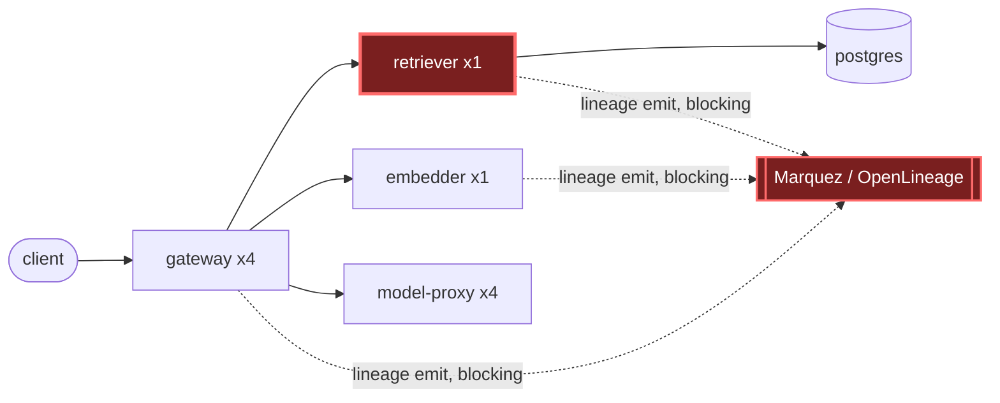

# Postmortem: gateway latency error budget burning fast (2% of the 28d budget in 1h; 5m & 1h windows)

- **Status:** open
- **Severity:** sev1
- **Verified:** no
- **Opened:** 2026-08-03 20:40:46Z
- **Resolved:** (still open)

## Timeline (machine-generated)

All times UTC on 2026-08-03 unless a full date is shown.

| Time (UTC) | Source | Event |
| --- | --- | --- |
| 20:40:10Z | alert | alert firing: SLO gateway latency — fast burn |
| 20:40:36Z | log-spike | log-spike onset: {"level":"warn","service":"retriever","message":"lineage emit failed","trace_id":"6da4f7824eb17fd1802c4b3c434f4cc6","span_id":"39b0bbd1142b57b9","time":"2026-08-03T20:40:36.887Z","reason":"The operation timed out.","job":"… |

## Evidence links

- [Loki — logs over the incident window](http://localhost:3001/explore?schemaVersion=1&panes=%7B%22pm%22%3A+%7B%22datasource%22%3A+%22loki%22%2C+%22queries%22%3A+%5B%7B%22refId%22%3A+%22A%22%2C+%22datasource%22%3A+%7B%22type%22%3A+%22loki%22%2C+%22uid%22%3A+%22loki%22%7D%2C+%22expr%22%3A+%22%7Bnamespace%3D%5C%22subject%5C%22%7D+%7C~+%5C%22%28%3Fi%29error%7Cfailed%5C%22%22%7D%5D%2C+%22range%22%3A+%7B%22from%22%3A+%221785789646078%22%2C+%22to%22%3A+%221785790423035%22%7D%7D%7D&orgId=1)
- [Mimir — metrics over the incident window](http://localhost:3001/explore?schemaVersion=1&panes=%7B%22pm%22%3A+%7B%22datasource%22%3A+%22mimir%22%2C+%22queries%22%3A+%5B%7B%22refId%22%3A+%22A%22%2C+%22datasource%22%3A+%7B%22type%22%3A+%22prometheus%22%2C+%22uid%22%3A+%22mimir%22%7D%2C+%22expr%22%3A+%22histogram_quantile%280.95%2C+sum%28rate%28http_server_duration_milliseconds_bucket%5B5m%5D%29%29+by+%28le%29%29%22%7D%5D%2C+%22range%22%3A+%7B%22from%22%3A+%221785789646078%22%2C+%22to%22%3A+%221785790423035%22%7D%7D%7D&orgId=1)

## Investigation context

**Runbook match:** none — no tool narrowing applied for this alert. Available runbooks: README.md, canary-abort.md, ci-pipeline-red.md, dq-freshness-stall.md, gateway-high-error-rate.md, k8s-crashloop.md, k8s-node-failure.md, snapshot-agent-audit.md, stale-secret.md

Pre-check battery (as injected at run start)

## Pre-check leads

### recent_deploys — LEAD
No deploy in the last 60m — rule out the reflex answer.
- No deploy in the last 60m — rule out the reflex answer.

### log_spike — LEAD
error/failed log rate 200/10min vs baseline 0/10min (200x baseline) — onset: {"level":"warn","service":"retriever","message":"lineage emit failed","trace_id":"6da4f7824eb17fd1802c4b3c434f4cc6","span_id":"39b0bbd1142b57b9","time":"2026-08-03T20:40:36.887Z","reason":"The operation timed out.","job":"rag.retrieve","eventType":"START"} at 2026-08-03T20:40:36.889229+00:00
- error/failed log rate 200/10min vs baseline 0/10min (200x baseline) — onset: {"level":"warn","service":"retriever","message":"lineage emit failed","trace_id":"6da4f7824eb17fd1802c4b3c434f… (truncated)

### kube_scan — UNAVAILABLE
error: You must be logged in to the server (Unauthorized)

### rollout_state — UNAVAILABLE
gateway: E0803 22:40:51.556733   16236 memcache.go:265] "Unhandled Error" err="couldn't get current server API group list: the server has asked for the client to provide credentials"
E0803 22:40:51.844003   16236 memcache.go:265] "Unhandled Error" err="couldn't get current server API group list: the server has asked for the client to provide credentials"
E0803 22:40:53.565002   16236 memcache.go:265] "Unhandled Error" err="couldn't get current server API group list: the server has asked for the client to; gateway analysis: E0803 22:40:50.282774   36824 memcache.go:265] "Unhandled Error" err="couldn't get current server API group list: the server has asked for the client to provide credentials"
E0803 22:40:50.808329   36824 memcache.go:265] "Unhandled Error"
… (section truncated)

### secret_age — UNAVAILABLE
error: You must be logged in to the server (Unauthorized)

## Narrative

## Summary
`SLO gateway latency — fast burn` fired for tenant acme (5m & 1h burn windows). `gateway`'s `POST /v1/chat` requests were running 3.5–18.3s against a normal sub-second baseline, driving fast error-budget burn.

## Impact
Every sampled `POST /v1/chat` trace in the incident window was severely elevated (3.5s–18.3s, see report.html chart — 16/16 real samples pulled from Tempo). A meaningful fraction of these additionally failed outright: gateway spans show `STATUS_CODE_ERROR` with `retriever returned 503`, and retriever's own `POST /v1/retrieve` span comes back with `http.response.status_code: 503`. Tenants acme and bravo both appear in affected traces.

## Root cause
`retriever` (and, less severely, `gateway` and `embedder`) emit OpenLineage lineage events synchronously inside the request path — logs show `job":"rag.retrieve"` bracketed by `eventType":"START"` and `"COMPLETE"` warn lines reading `"message":"lineage emit failed","reason":"The operation timed out."`, repeating continuously across every single request on all three services. This pattern is sustained from ~20:11Z (earliest sampled trace) straight through to alert onset at 20:40:10Z and beyond, with no gap — it precedes the alert, not caused by it, and no deploy landed in the preceding 60 minutes (deploy_history / CI runs show no retriever-touching change; the last few CI runs on main only touch load-generator and model-proxy).

`retriever` is provisioned as a **single replica** (`kube_pod_owner` / `kube_state_metrics` confirm exactly one pod, `retriever-dc7ddd494-jv9j7`, vs. 4 replicas for gateway and 4 for model-proxy) with 0 restarts and unremarkable memory (~147Mi) — so this is not OOM or a crash loop. With only one pod absorbing a multi-second synchronous stall on *every* request (the lineage-emit timeout), requests queue behind each other on that single instance; the queueing is what produces the 9–18s tail and the self-protective 503s gateway sees, which in turn burns the gateway latency SLO fast.

The lineage backend itself (Marquez) could not be independently inspected — `marquez_lineage` was not authorized in this session — so this postmortem stops at "the emit call to the lineage backend times out on every request" rather than naming why Marquez itself is unresponsive; that is the next investigation step.

## What fixed it
**Nothing yet — remediation could not be executed.** I diagnosed the fix (scale `retriever` from 1→3 replicas to relieve the queueing behind the blocking lineage-emit timeout) and it was approved by the operator, but both the dry-run and the real `scale_deployment` call failed with `error: You must be logged in to the server (Unauthorized)` — the same failure the pre-check leads already flagged for `kube_scan`, `rollout_state`, and `secret_age`. A repeat dry-run a few minutes later failed identically, so this is a persistent cluster API-server credential problem affecting this session's kubectl-mediated tooling (read *and* write paths), not a one-off blip and not an operator denial. `alert_status` was re-queried after the failed execution and still reports **active**. This incident is unresolved from the automation side and needs a human to restore the agent's kube credentials (or apply the scale-out manually) before the approved remediation can actually land.

## Lessons
- The blocking, synchronous lineage-emit call on the hot request path is the underlying design smell: a degraded/unreachable OpenLineage(Marquez) backend should never be able to add multi-second latency to every RAG request. It should be fire-and-forget or budget a sub-100ms timeout, not stall the request.
- `retriever` (and `embedder`) being pinned at 1 replica while `gateway`/`model-proxy` run 4 leaves no headroom to absorb exactly this kind of per-request stall — worth revisiting standard replica counts for the whole RAG hot path, not just gateway.
- The kube API-server auth failure blocked both diagnosis (`kubectl_read`, `argo_app`, `rollout_status` all returned Unauthorized throughout) and remediation execution. This should page as its own incident — an on-call agent with broken cluster credentials can find root causes from telemetry but cannot act on them.
- Follow-up: once credentials are restored, (1) apply the approved `retriever` scale-out (1→3), (2) check Marquez's own health/logs directly, (3) make the lineage-emit call non-blocking or drop it under backend failure instead of retrying to a hard timeout.

