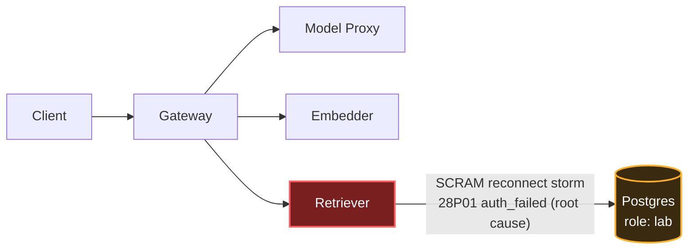

# Postmortem: gateway 5xx rate above 2%

- **Status:** open
- **Severity:** sev1
- **Verified:** no
- **Opened:** 2026-08-03 02:01:40Z
- **Resolved:** (still open)

## Timeline (machine-generated)

All times UTC on 2026-08-03 unless a full date is shown.

| Time (UTC) | Source | Event |
| --- | --- | --- |
| 02:01:10Z | alert | alert firing: Gateway 5xx rate > 2% |
| 02:01:38Z | log-spike | log-spike onset: 815 \| errorResponse = Errors.postgres(parseError(x)) |

## Evidence links

- [Loki — logs over the incident window](http://localhost:3001/explore?schemaVersion=1&panes=%7B%22pm%22%3A+%7B%22datasource%22%3A+%22loki%22%2C+%22queries%22%3A+%5B%7B%22refId%22%3A+%22A%22%2C+%22datasource%22%3A+%7B%22type%22%3A+%22loki%22%2C+%22uid%22%3A+%22loki%22%7D%2C+%22expr%22%3A+%22%7Bnamespace%3D%5C%22subject%5C%22%7D+%7C~+%5C%22%28%3Fi%29error%7Cfailed%5C%22%22%7D%5D%2C+%22range%22%3A+%7B%22from%22%3A+%221785722500176%22%2C+%22to%22%3A+%221785723057675%22%7D%7D%7D&orgId=1)
- [Mimir — metrics over the incident window](http://localhost:3001/explore?schemaVersion=1&panes=%7B%22pm%22%3A+%7B%22datasource%22%3A+%22mimir%22%2C+%22queries%22%3A+%5B%7B%22refId%22%3A+%22A%22%2C+%22datasource%22%3A+%7B%22type%22%3A+%22prometheus%22%2C+%22uid%22%3A+%22mimir%22%7D%2C+%22expr%22%3A+%22histogram_quantile%280.95%2C+sum%28rate%28http_server_duration_milliseconds_bucket%5B5m%5D%29%29+by+%28le%29%29%22%7D%5D%2C+%22range%22%3A+%7B%22from%22%3A+%221785722500176%22%2C+%22to%22%3A+%221785723057675%22%7D%7D%7D&orgId=1)

## Investigation context

**Runbook match (2):** `gateway-high-error-rate.md`, `stale-secret.md` — toolset narrowed to 13 tools: alert_status, deploy_history, kubectl_read, loki_query, mimir_query, publish_postmortem, request_approval, restart_workload, runbook_lookup, runbook_read, save_artifact, tempo_query, update_db_secret

Pre-check battery (as injected at run start)

## Pre-check leads

### recent_deploys — LEAD
No deploy in the last 60m — rule out the reflex answer.
- No deploy in the last 60m — rule out the reflex answer.

### log_spike — LEAD
error/failed log rate 200/10min vs baseline 0/10min (200x baseline) — onset: 815 |       errorResponse = Errors.postgres(parseError(x)) at 2026-08-03T02:01:38.150965+00:00
- error/failed log rate 200/10min vs baseline 0/10min (200x baseline) — onset: 815 |       errorResponse = Errors.postgres(parseError(x)) at 2026-08-03T02:01:38.150965+00:00

### kube_scan — UNAVAILABLE
error: You must be logged in to the server (Unauthorized)

### rollout_state — UNAVAILABLE
gateway: E0803 04:01:41.291536    7560 memcache.go:265] "Unhandled Error" err="couldn't get current server API group list: the server has asked for the client to provide credentials"
E0803 04:01:41.452265    7560 memcache.go:265] "Unhandled Error" err="couldn't get current server API group list: the server has asked for the client to provide credentials"
E0803 04:01:41.590776    7560 memcache.go:265] "Unhandled Error" err="couldn't get current server API group list: the server has asked for the client to; gateway analysis: E0803 04:01:41.291536   56832 memcache.go:265] "Unhandled Error" err="couldn't get current server API group list: the server has asked for the client to provide credentials"
E0803 04:01:41.441602   56832 memcache.go:265] "Unhandled Error"
… (section truncated)

### secret_age — UNAVAILABLE
error: You must be logged in to the server (Unauthorized)

## Narrative

## Summary

The `Gateway 5xx rate > 2%` (sev1, tenant acme) alert fired after the single `retriever` pod began throwing genuine Postgres SCRAM authentication rejections (`28P01`, routine `auth_failed`) against the `lab` database role, cascading into gateway-facing 5xx responses whenever a request needed retrieval. The incident self-resolved before any remediation actually landed.

## Impact

Retrieval-dependent chat requests through the gateway failed (5xx) for the duration of the burst — the postgres FATAL rate for `password authentication failed for user "lab"` peaked at 1871 lines/2min, exactly coincident with the alert's log-spike onset.

## Root cause

Two matched runbooks were in play: `gateway-high-error-rate` and `stale-secret`. The symptom (`password authentication failed`) superficially matches stale-secret, but that hypothesis was **directly refuted by evidence**, not assumed:

- `update_db_secret` (dry-run and real) reported **no rotated credential in the vault to sync**, on two separate checks straddling the incident.
- `kube_secret_metadata_resource_version{secret="subject-db-credentials"}` was **flat at revision 1946 for the full 6-hour window** — the K8s Secret never changed.
- `deploy_history` showed no deploy anywhere near onset (nearest gateway/platform gitops syncs were ~2.5h earlier).
- Critically, the retriever pod (running continuously since well before the incident, no restart) authenticated **successfully** in the quiet gap between two failure bursts — a genuinely stale/wrong credential would fail every attempt, not intermittently.

What the evidence does show: the `retriever` pod's CPU (~0.015 → ~0.3 vCPU) and memory (~118Mi → ~137Mi) spiked in lockstep with each burst of Postgres `28P01` rejections — a reconnect/retry storm in retriever's Postgres connection pool hammering the auth handshake under concurrency, rather than a real credential mismatch. This is the downstream-failure mode described in the `gateway-high-error-rate` runbook ("one downstream is failing... gateway surfaces its errors"), not the `stale-secret` runbook's scenario.

## What fixed it

A rolling restart of `retriever` was diagnosed, dry-run, and approved (`gateway-high-error-rate` runbook mitigation for a failing downstream) to clear the pool state. Execution failed with a cluster authorization error on the write path itself (`Unauthorized`) — consistent with this session's `kube_scan`/`rollout_state` pre-check leads, which hit the same credential wall. Retries did not succeed.

The alert cleared on its own: the Postgres auth-failure rate fell from 917/min to 0 within about four minutes, matching the same self-resolving shape as an earlier, unrelated burst observed at ~01:19–01:42 (also with no restart, no secret change). `alert_status` was re-queried twice after the failed remediation attempt and reported `active: false` both times. Recovery is attributed to the reconnect storm backing off on its own, not to the (unsuccessful) restart attempt — stated plainly rather than claimed as a fix.

## Lessons

- The `stale-secret` runbook's own trigger condition requires the `secret_age` lead to have fired alongside the log-spike lead; here `secret_age` was `UNAVAILABLE`, so the match on alertname alone was not sufficient grounds to jump to that remediation — `update_db_secret`'s "nothing to sync" response was the deciding disconfirmation and should be trusted over the surface log signature.
- `kube_secret_metadata_resource_version` in Mimir is a useful stand-in for secret-age/change detection when `secret_age`/`kubectl describe` are unavailable.
- The cluster write path (`restart_workload`) failed on an `Unauthorized` error independent of this incident's root cause — worth a follow-up to confirm agent-remediate RBAC / credentials are healthy, since it left this incident's mitigation unexecuted.
- Retriever's Postgres connection pool should be checked for reconnect/backoff behavior under load — a bounded backoff would reduce the auth-handshake storm's amplitude on Postgres.
