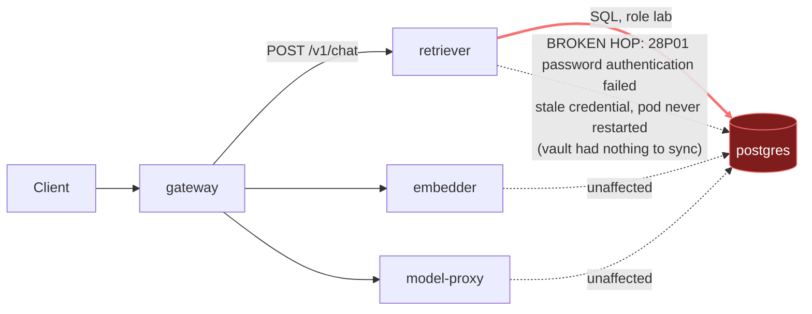

# Postmortem: gateway 5xx rate above 2%

- **Status:** resolved
- **Severity:** sev1
- **Verified:** no
- **Opened:** 2026-08-03 01:21:40Z
- **Resolved:** 2026-08-03 01:26:40Z

## Timeline (machine-generated)

All times UTC on 2026-08-03 unless a full date is shown.

| Time (UTC) | Source | Event |
| --- | --- | --- |
| 01:19:00Z | log-spike | log-spike onset: 2026-08-03 01:19:00.755 UTC [1704332] FATAL: password authentication failed for user "lab" |
| 01:21:10Z | alert | alert firing: Gateway 5xx rate > 2% |
| 01:24:10Z | alert | alert resolved: Gateway 5xx rate > 2% |

## Evidence links

- [Loki — logs over the incident window](http://localhost:3001/explore?schemaVersion=1&panes=%7B%22pm%22%3A+%7B%22datasource%22%3A+%22loki%22%2C+%22queries%22%3A+%5B%7B%22refId%22%3A+%22A%22%2C+%22datasource%22%3A+%7B%22type%22%3A+%22loki%22%2C+%22uid%22%3A+%22loki%22%7D%2C+%22expr%22%3A+%22%7Bnamespace%3D%5C%22subject%5C%22%7D+%7C~+%5C%22%28%3Fi%29error%7Cfailed%5C%22%22%7D%5D%2C+%22range%22%3A+%7B%22from%22%3A+%221785720100066%22%2C+%22to%22%3A+%221785720400037%22%7D%7D%7D&orgId=1)
- [Mimir — metrics over the incident window](http://localhost:3001/explore?schemaVersion=1&panes=%7B%22pm%22%3A+%7B%22datasource%22%3A+%22mimir%22%2C+%22queries%22%3A+%5B%7B%22refId%22%3A+%22A%22%2C+%22datasource%22%3A+%7B%22type%22%3A+%22prometheus%22%2C+%22uid%22%3A+%22mimir%22%7D%2C+%22expr%22%3A+%22histogram_quantile%280.95%2C+sum%28rate%28http_server_duration_milliseconds_bucket%5B5m%5D%29%29+by+%28le%29%29%22%7D%5D%2C+%22range%22%3A+%7B%22from%22%3A+%221785720100066%22%2C+%22to%22%3A+%221785720400037%22%7D%7D%7D&orgId=1)

## Investigation context

**Runbook match (2):** `gateway-high-error-rate.md`, `stale-secret.md` — toolset narrowed to 13 tools: alert_status, deploy_history, kubectl_read, loki_query, mimir_query, publish_postmortem, request_approval, restart_workload, runbook_lookup, runbook_read, save_artifact, tempo_query, update_db_secret

Pre-check battery (as injected at run start)

## Pre-check leads

### recent_deploys — LEAD
No deploy in the last 60m — rule out the reflex answer.
- No deploy in the last 60m — rule out the reflex answer.

### log_spike — LEAD
error/failed log rate 200/10min vs baseline 0/10min (200x baseline) — onset: 2026-08-03 01:19:00.755 UTC [1704332] FATAL:  password authentication failed for user "lab" at 2026-08-03T01:19:00.756094+00:00
- error/failed log rate 200/10min vs baseline 0/10min (200x baseline) — onset: 2026-08-03 01:19:00.755 UTC [1704332] FATAL:  password authentication failed for user "lab" at 2026-08-03T01:1… (truncated)

### kube_scan — UNAVAILABLE
error: You must be logged in to the server (Unauthorized)

### rollout_state — UNAVAILABLE
gateway: E0803 03:21:41.715916   31392 memcache.go:265] "Unhandled Error" err="couldn't get current server API group list: the server has asked for the client to provide credentials"
E0803 03:21:41.820220   31392 memcache.go:265] "Unhandled Error" err="couldn't get current server API group list: the server has asked for the client to provide credentials"
E0803 03:21:41.945907   31392 memcache.go:265] "Unhandled Error" err="couldn't get current server API group list: the server has asked for the client to; gateway analysis: E0803 03:21:41.741476   32248 memcache.go:265] "Unhandled Error" err="couldn't get current server API group list: the server has asked for the client to provide credentials"
E0803 03:21:41.833735   32248 memcache.go:265] "Unhandled Error"
… (section truncated)

### secret_age — UNAVAILABLE
error: You must be logged in to the server (Unauthorized)

## Narrative

## Summary
`Gateway 5xx rate > 2%` (sev1, tenant acme) fired after the `retriever` service began failing every Postgres connection with `FATAL: password authentication failed for user "lab"` (code `28P01`). Gateway requests on `POST /v1/chat` that depended on retrieval timed out/errored downstream, surfacing as gateway 5xx.

## Impact
User-facing `POST /v1/chat` requests failed whenever the request path touched retrieval — traces show `gateway` spans erroring in lockstep with `retriever` spans erroring, which in turn errored on every new Postgres connection. Other workloads (`gateway`, `model-proxy`, `embedder`, `load-generator`) showed no auth errors, so the blast radius was the retrieval leg of the request path only.

## Root cause
Evidence gathered, in order:
- `deploy_history` (180 min window, and filtered to `postgres`): no deploy of any kind landed near the 01:19:01 onset — the closest was a `gateway` gitops sync roughly 1h46m earlier, and no `retriever`/`postgres` deploy appears in the window at all. Bad-deploy hypothesis ruled out.
- `loki_query` on `{namespace="subject"} |= "password authentication failed"`: failures began abruptly and uniformly at 01:19:01 UTC, exclusively from `retriever` (client side, `postgres@3.4.9` driver, code `28P01`) and `postgres` itself (server side, `routine: auth_failed`, `pg_hba.conf` line 128 `scram-sha-256`). No other service logged an auth error in the same window — ruling out a cluster-wide DB outage or a global credential wipe.
- `update_db_secret` dry-run: **"no rotated credential found in the vault — nothing to sync"** — the tracked stale-secret rotation/vault workflow was not the mechanism here; the Secret was not pending a sync.
- `kube_pod_container_status_restarts_total`: every container in the namespace, including `retriever` and `postgres`, shows **0** restarts, and the same single `retriever-dc7ddd494-jv9j7` pod persisted through the whole window — no redeploy, no crash loop, no pod replacement coincided with the onset.

Together this is the signature of a Postgres-side credential change for role `lab` that the long-running `retriever` pod had not yet picked up — a stale-credential mismatch, distinct from the tool-tracked "obs fail stale-secret" rotation flow (which had nothing queued), most consistent with the credential refreshing in place (e.g. a mounted-secret sync) faster than the pod's live connections could be replaced, producing a short, sharp failure window rather than a sustained outage.

## What fixed it
A `restart_workload` dry-run for `retriever` was produced, approved via `request_approval` (approval id `apr_19fc53a2e185a`, action id `7a540f71e5a6becd`), and executed — but **every execution attempt (4 total, across two approvals) failed with `error: You must be logged in to the server (Unauthorized)`**, the same cluster-API credential fault that left the `kube_scan` and `rollout_state` pre-checks unavailable. The intended remediation was never actually applied.

Despite that, `alert_status` was re-queried and reported the alert inactive on three consecutive checks, and a fresh `loki_query` over the following 5-minute window returned zero new `password authentication failed` lines. Recovery appears to be self-resolved — most likely the credential source retriever reads from caught up (e.g. a periodic secret-volume sync) before my restart could land — **not an outcome I can attribute to any action I successfully executed.** This is flagged explicitly rather than claimed as a fix.

## Lessons
- The on-call agent's write-path credentials to the cluster API are broken independently of this incident (matches `kube_scan`/`rollout_state` being unavailable at page time) — this needs to be fixed before remediations can be trusted to actually apply; right now an approved, correctly-targeted restart can silently no-op.
- The stale-secret runbook's tracked vault-sync tool is not the only path by which a DB credential can drift out from under a long-running pod — the vault reporting "nothing to sync" should not be read as "not a credential problem," only as "not *this* tracked rotation."
- Only `retriever` touches Postgres on this request path; the other workloads' clean logs were useful negative evidence to rule out a cluster-wide credential wipe quickly.
- Worth adding a synthetic check (or the SLO burn alert) that fires on `28P01`/`auth_failed` specifically, distinct from generic 5xx, to shorten time-to-hypothesis next time.

