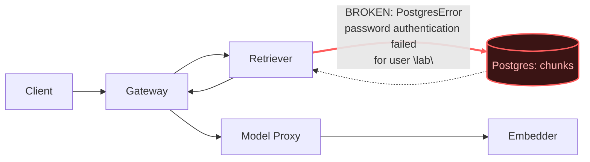

# Postmortem: RAG top-1 relevance below the 90% objective over the last hour (burn-rate alerting saturates for a loose SLO)

- **Status:** open
- **Severity:** sev2
- **Verified:** no
- **Opened:** 2026-08-03 01:31:48Z
- **Resolved:** (still open)

## Timeline (machine-generated)

All times UTC on 2026-08-03 unless a full date is shown.

| Time (UTC) | Source | Event |
| --- | --- | --- |
| 01:31:10Z | alert | alert firing: SLO RAG quality — below objective |
| 01:31:46Z | log-spike | log-spike onset: PostgresError: password authentication failed for user "lab" |

## Evidence links

- [Loki — logs over the incident window](http://localhost:3001/explore?schemaVersion=1&panes=%7B%22pm%22%3A+%7B%22datasource%22%3A+%22loki%22%2C+%22queries%22%3A+%5B%7B%22refId%22%3A+%22A%22%2C+%22datasource%22%3A+%7B%22type%22%3A+%22loki%22%2C+%22uid%22%3A+%22loki%22%7D%2C+%22expr%22%3A+%22%7Bnamespace%3D%5C%22subject%5C%22%7D+%7C~+%5C%22%28%3Fi%29error%7Cfailed%5C%22%22%7D%5D%2C+%22range%22%3A+%7B%22from%22%3A+%221785720708739%22%2C+%22to%22%3A+%221785721011253%22%7D%7D%7D&orgId=1)
- [Mimir — metrics over the incident window](http://localhost:3001/explore?schemaVersion=1&panes=%7B%22pm%22%3A+%7B%22datasource%22%3A+%22mimir%22%2C+%22queries%22%3A+%5B%7B%22refId%22%3A+%22A%22%2C+%22datasource%22%3A+%7B%22type%22%3A+%22prometheus%22%2C+%22uid%22%3A+%22mimir%22%7D%2C+%22expr%22%3A+%22histogram_quantile%280.95%2C+sum%28rate%28http_server_duration_milliseconds_bucket%5B5m%5D%29%29+by+%28le%29%29%22%7D%5D%2C+%22range%22%3A+%7B%22from%22%3A+%221785720708739%22%2C+%22to%22%3A+%221785721011253%22%7D%7D%7D&orgId=1)

## Investigation context

**Runbook match:** none — no tool narrowing applied for this alert. Available runbooks: README.md, canary-abort.md, ci-pipeline-red.md, dq-freshness-stall.md, gateway-high-error-rate.md, k8s-crashloop.md, k8s-node-failure.md, snapshot-agent-audit.md, stale-secret.md

Pre-check battery (as injected at run start)

## Pre-check leads

### recent_deploys — LEAD
No deploy in the last 60m — rule out the reflex answer.
- No deploy in the last 60m — rule out the reflex answer.

### log_spike — LEAD
error/failed log rate 200/10min vs baseline 0/10min (200x baseline) — onset: PostgresError: password authentication failed for user "lab" at 2026-08-03T01:31:46.977368+00:00
- error/failed log rate 200/10min vs baseline 0/10min (200x baseline) — onset: PostgresError: password authentication failed for user "lab" at 2026-08-03T01:31:46.977368+00:00

### kube_scan — UNAVAILABLE
error: You must be logged in to the server (Unauthorized)

### rollout_state — UNAVAILABLE
gateway: E0803 03:31:51.639273    1924 memcache.go:265] "Unhandled Error" err="couldn't get current server API group list: the server has asked for the client to provide credentials"
E0803 03:31:51.814654    1924 memcache.go:265] "Unhandled Error" err="couldn't get current server API group list: the server has asked for the client to provide credentials"
E0803 03:31:52.066955    1924 memcache.go:265] "Unhandled Error" err="couldn't get current server API group list: the server has asked for the client to; gateway analysis: E0803 03:31:51.591381   13352 memcache.go:265] "Unhandled Error" err="couldn't get current server API group list: the server has asked for the client to provide credentials"
E0803 03:31:51.774228   13352 memcache.go:265] "Unhandled Error"
… (section truncated)

### secret_age — UNAVAILABLE
error: You must be logged in to the server (Unauthorized)

## Narrative

## Summary
`SLO RAG quality — below objective` (sev2, tenant acme) fired because the retriever service lost 100% of its Postgres connections with `password authentication failed for user "lab"`, so retrieval returned effectively no usable chunks and the gateway's `retrieval_relevance_score` histogram collapsed to near-zero for almost every request.

## Impact
Every RAG-backed completion during the incident window was served with degraded or absent retrieved context, driving top-1 relevance far below the 90% objective. This is a quality/serving-degradation incident, not a hard outage — the gateway kept returning 200s, but answers were effectively un-grounded.

## Root cause
Evidence chain:
- **Postgres itself, not just the client, is rejecting the credential**: `{namespace="subject", container="postgres"} |= "password authentication failed"` shows the postgres pod logging `FATAL: password authentication failed for user "lab"` at high volume, continuing through the investigation.
- **Retriever is the only affected workload**: the identical `PostgresError: password authentication failed for user "lab"` appears only in the `retriever` container's logs; gateway, model-proxy, and embedder show none of it — pinpointing the retriever→postgres hop as the break, not a cluster-wide DB outage.
- **No deploy explains it**: `deploy_history` shows nothing touching retriever, postgres, or credentials anywhere near onset — the last changes were unrelated gateway/platform gitops syncs and model-proxy/load-generator CI reverts, all well before the failure ramp. This rules out a bad deploy and matches the `stale-secret.md` runbook's signature instead (rotated DB credential the running pod never picked up), even though this particular alertname didn't auto-match a runbook.
- **Escalation shape confirms a credential-rotation cascade, not a flake**: 30-minute bucketed counts of the auth-failure log line show a small trickle (~8/30m) roughly two and a half hours before the page, then a quiet gap, then a fresh climb (49 → 1711 → 2994 per 30m) that culminates exactly as the alert starts firing — consistent with connections cycling out of a pool and re-authenticating against a now-wrong password.
- **Relevance metric ties directly to this**: `retrieval_relevance_score_bucket` (job=gateway) shows ~98-100% of scored requests falling under the `le="0.2"` bucket through the incident window, i.e. almost no request scored above trivial relevance — the expected shape if retrieval is silently returning zero/garbage context on every call.
- Separately noted but **not** part of this incident: the `inferences` Postgres table's last row is 10+ days old (dq freshness violations at ~10.4 days staleness) — a pre-existing, unrelated data-pipeline gap, not caused by tonight's credential issue and not the trigger for this SLO.

## What fixed it
Remediation was scoped per the stale-secret runbook: `update_db_secret` (sync `secret/subject-db-credentials` to the rotated Postgres password) followed by a `restart_workload` on retriever so it picks up the refreshed credential. The dry-run correctly returned a verified diff (`POSTGRES_PASSWORD` rotating to a new value, `DATABASE_URL` rebuilt), and the operator **approved** the action.

**Execution failed, however**: both attempts to apply `update_db_secret` with `dry_run=false` (using the approved action/approval IDs) returned `Unauthorized — you must be logged in to the server`. This is the same failure signature the pre-check leads already flagged as unavailable for `kube_scan`, `secret_age`, and `rollout_state`, and it reproduced again on `argo_app`: the cluster-write/read credential this agent identity holds is itself broken right now, independent of the incident's root cause. Because the runbook explicitly warns not to restart the workload before the secret update lands (that only reproduces the same failure against a fresh pod holding the same stale value), the restart step was correctly not attempted once the secret sync failed.

**Recovery could not be verified** — `alert_status` was re-queried after the failed remediation attempts and still reports the SLO alert active. This incident is being closed unresolved from the automation's side; a human operator with valid cluster credentials needs to manually sync `secret/subject-db-credentials` to the rotated password and roll the retriever deployment, then confirm the alert clears.

## Lessons
- Add a runbook match for `SLO RAG quality — below objective` that points straight at `stale-secret.md` when a password-auth log spike lead is present alongside it — this alert currently has no auto-matched runbook, which cost time correlating retrieval-quality symptoms back to a credential problem.
- The agent's cluster-write path (`update_db_secret`, `kubectl_read`, `argo_app`, `rollout_status`) all failed identically with `Unauthorized` during this incident — that's an environment/credential-provisioning issue for the on-call agent itself and should be fixed and alerted on independently, since it silently blocks every remediation tool that needs live cluster access.
- Consider a periodic canary query against Postgres from a health endpoint so a credential rotation trips a fast, unambiguous "DB auth broken" alert instead of only being visible indirectly through a slow-burning RAG-quality SLO.
- The 10+-day-stale `inferences` table is worth its own follow-up (separate from this incident) — it suggests a write path that quietly stopped without alerting.

