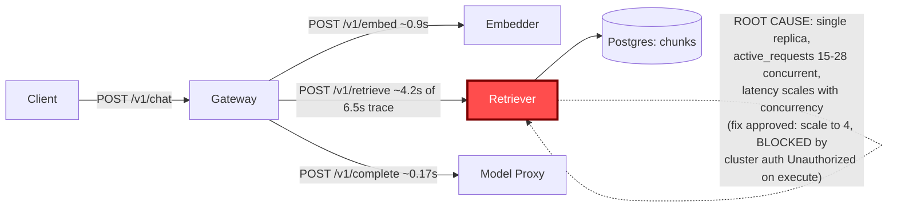

# Postmortem: gateway latency error budget burning fast (2% of the 28d budget in 1h; 5m & 1h windows)

- **Status:** open
- **Severity:** sev1
- **Verified:** no
- **Opened:** 2026-08-03 02:27:45Z
- **Resolved:** (still open)

## Timeline (machine-generated)

All times UTC on 2026-08-03 unless a full date is shown.

| Time (UTC) | Source | Event |
| --- | --- | --- |
| 02:27:10Z | alert | alert firing: SLO gateway latency — fast burn |

## Evidence links

- [Loki — logs over the incident window](http://localhost:3001/explore?schemaVersion=1&panes=%7B%22pm%22%3A+%7B%22datasource%22%3A+%22loki%22%2C+%22queries%22%3A+%5B%7B%22refId%22%3A+%22A%22%2C+%22datasource%22%3A+%7B%22type%22%3A+%22loki%22%2C+%22uid%22%3A+%22loki%22%7D%2C+%22expr%22%3A+%22%7Bnamespace%3D%5C%22subject%5C%22%7D+%7C~+%5C%22%28%3Fi%29error%7Cfailed%5C%22%22%7D%5D%2C+%22range%22%3A+%7B%22from%22%3A+%221785724065768%22%2C+%22to%22%3A+%221785724345713%22%7D%7D%7D&orgId=1)
- [Mimir — metrics over the incident window](http://localhost:3001/explore?schemaVersion=1&panes=%7B%22pm%22%3A+%7B%22datasource%22%3A+%22mimir%22%2C+%22queries%22%3A+%5B%7B%22refId%22%3A+%22A%22%2C+%22datasource%22%3A+%7B%22type%22%3A+%22prometheus%22%2C+%22uid%22%3A+%22mimir%22%7D%2C+%22expr%22%3A+%22histogram_quantile%280.95%2C+sum%28rate%28http_server_duration_milliseconds_bucket%5B5m%5D%29%29+by+%28le%29%29%22%7D%5D%2C+%22range%22%3A+%7B%22from%22%3A+%221785724065768%22%2C+%22to%22%3A+%221785724345713%22%7D%7D%7D&orgId=1)

## Investigation context

**Runbook match:** none — no tool narrowing applied for this alert. Available runbooks: README.md, canary-abort.md, ci-pipeline-red.md, dq-freshness-stall.md, gateway-high-error-rate.md, k8s-crashloop.md, k8s-node-failure.md, snapshot-agent-audit.md, stale-secret.md

Pre-check battery (as injected at run start)

## Pre-check leads

### recent_deploys — LEAD
No deploy in the last 60m — rule out the reflex answer.
- No deploy in the last 60m — rule out the reflex answer.

### log_spike — OK
error/failed log rate normal: 200/10min vs baseline 500/10min

### kube_scan — UNAVAILABLE
error: You must be logged in to the server (Unauthorized)

### rollout_state — UNAVAILABLE
gateway: E0803 04:27:47.110741   30616 memcache.go:265] "Unhandled Error" err="couldn't get current server API group list: the server has asked for the client to provide credentials"
E0803 04:27:47.245386   30616 memcache.go:265] "Unhandled Error" err="couldn't get current server API group list: the server has asked for the client to provide credentials"
E0803 04:27:47.404545   30616 memcache.go:265] "Unhandled Error" err="couldn't get current server API group list: the server has asked for the client to; gateway analysis: E0803 04:27:47.104438   26944 memcache.go:265] "Unhandled Error" err="couldn't get current server API group list: the server has asked for the client to provide credentials"
E0803 04:27:47.212033   26944 memcache.go:265] "Unhandled Error"
… (section truncated)

### secret_age — UNAVAILABLE
error: You must be logged in to the server (Unauthorized)

## Narrative

## Summary
`SLO gateway latency — fast burn` fired for tenant acme (2% of 28d error budget burned in 1h across 5m & 1h windows). Investigation traced the burn to the `retriever` service, which runs a single replica and serializes/queues under concurrent load, repeatedly pushing gateway `/v1/chat` p95 to its 10s ceiling during traffic bursts.

## Impact
`POST /v1/chat` p95 latency repeatedly pegged at the gateway's ~10s timeout ceiling during three distinct burst windows in the incident period (observed peaks ~8.5s, ~9s, ~9.2s on `retriever`'s own `/v1/retrieve` p95). Between bursts latency returned to normal (sub-second to low single-digit-second). This intermittent, recurring pattern is what produced a fast SLO burn rather than a flat outage.

## Root cause
`retriever` is deployed as a single pod (`count(instance)` = 1 in Mimir throughout the window). Its own `active_requests` gauge jumps to 15–28 concurrent in-flight requests exactly during each latency burst, and is 0 during the quiet periods in between — request latency tracks concurrency, not a step-change in code or config. A full trace pulled from Tempo during a burst (`POST /v1/chat`, 6.48s total) showed the `POST retriever` client span alone consuming ~4.2s of the 6.5s, while `embedder` (~0.9s) and `model-proxy` (~0.17s) were comparatively fast — the retriever hop is where the time goes.

Ruled out:
- **Bad deploy**: `deploy_history` shows the last `gateway` deploy (gitops `bb634a3`) at 23:32 UTC, ~1h46m before the first observed latency burst, and no `retriever` deploy at all in the window. Onset does not line up with any deploy.
- **Log/error spike**: pre-check showed error/failed log rate at 200/10min vs a 500/10min baseline — normal, this is a latency-only degradation, not a failure cascade.
- **OOM/resource exhaustion**: no OOM or restart events were found for `retriever` (though `k8s_events`/`kubectl_read` access was itself degraded — see Lessons).

Net: `retriever` has no headroom to absorb concurrent request bursts — a capacity/scaling gap, not a code regression.

## What fixed it
Root cause was confirmed and a fix was proposed and **approved**: scale `retriever` from its current replica count to 4 to spread concurrent load. However, executing the change (`scale_deployment`, dry_run=false) failed twice with `Unauthorized` from the cluster API — the same failure mode seen throughout this investigation on `kubectl_read`, `argo_app`, and the pre-check's `kube_scan`/`rollout_state`/`secret_age` leads. This looks like a cluster write/read credential problem for this on-call identity, separate from the incident's root cause, but it fully blocked remediation. **The fix was not applied.** Re-querying `alert_status` afterward confirms the alert is still active — recovery was not achieved this run.

## Lessons
- `retriever` needs either a minimum replica count > 1 (e.g. HPA floor) or a queueing/backpressure strategy so single-pod concurrency can't directly translate into gateway-visible latency.
- No runbook currently matches `SLO gateway latency — fast burn` by exact alertname — this incident should seed a new runbook: check per-hop trace spans first, then `active_requests`/replica count for the slow hop, before assuming a deploy regression.
- Cluster API credentials for this on-call identity were broken for reads (`kubectl_read`, `argo_app`, rollout/secret/kube-scan pre-checks) and for the approved write (`scale_deployment`) alike. This needs to be fixed operationally before the next page — an approved, correctly-targeted remediation should not be blocked by agent credentials.

