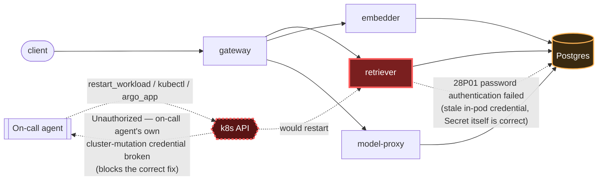

# Postmortem: gateway availability error budget burning slowly (10% of the 28d budget in 6h; 30m & 6h windows)

- **Status:** open
- **Severity:** sev2
- **Verified:** no
- **Opened:** 2026-08-03 01:46:44Z
- **Resolved:** (still open)

## Timeline (machine-generated)

All times UTC on 2026-08-03 unless a full date is shown.

| Time (UTC) | Source | Event |
| --- | --- | --- |
| 01:40:19Z | log-spike | log-spike onset: 41 \| throw new DrizzleQueryError(queryString, params, e); |
| 01:46:10Z | alert | alert firing: SLO gateway availability — slow burn |
| 01:51:17Z | verification | recovery NOT verified — deadline armed |
| 02:02:05Z | log-spike | log-spike onset: 815 \| errorResponse = Errors.postgres(parseError(x)) |
| 02:03:32Z | log-spike | log-spike onset: 41 \| throw new DrizzleQueryError(queryString, params, e); |
| 02:07:08Z | verification | recovery NOT verified — deadline armed |

## Evidence links

- [Loki — logs over the incident window](http://localhost:3001/explore?schemaVersion=1&panes=%7B%22pm%22%3A+%7B%22datasource%22%3A+%22loki%22%2C+%22queries%22%3A+%5B%7B%22refId%22%3A+%22A%22%2C+%22datasource%22%3A+%7B%22type%22%3A+%22loki%22%2C+%22uid%22%3A+%22loki%22%7D%2C+%22expr%22%3A+%22%7Bnamespace%3D%5C%22subject%5C%22%7D+%7C~+%5C%22%28%3Fi%29error%7Cfailed%5C%22%22%7D%5D%2C+%22range%22%3A+%7B%22from%22%3A+%221785721604354%22%2C+%22to%22%3A+%221785723455407%22%7D%7D%7D&orgId=1)
- [Mimir — metrics over the incident window](http://localhost:3001/explore?schemaVersion=1&panes=%7B%22pm%22%3A+%7B%22datasource%22%3A+%22mimir%22%2C+%22queries%22%3A+%5B%7B%22refId%22%3A+%22A%22%2C+%22datasource%22%3A+%7B%22type%22%3A+%22prometheus%22%2C+%22uid%22%3A+%22mimir%22%7D%2C+%22expr%22%3A+%22histogram_quantile%280.95%2C+sum%28rate%28http_server_duration_milliseconds_bucket%5B5m%5D%29%29+by+%28le%29%29%22%7D%5D%2C+%22range%22%3A+%7B%22from%22%3A+%221785721604354%22%2C+%22to%22%3A+%221785723455407%22%7D%7D%7D&orgId=1)

## Investigation context

**Runbook match:** none — no tool narrowing applied for this alert. Available runbooks: README.md, canary-abort.md, ci-pipeline-red.md, dq-freshness-stall.md, gateway-high-error-rate.md, k8s-crashloop.md, k8s-node-failure.md, snapshot-agent-audit.md, stale-secret.md

Pre-check battery (as injected at run start)

## Pre-check leads

### recent_deploys — LEAD
No deploy in the last 60m — rule out the reflex answer.
- No deploy in the last 60m — rule out the reflex answer.

### log_spike — LEAD
error/failed log rate 200/10min vs baseline 0/10min (200x baseline) — onset: 41 |         throw new DrizzleQueryError(queryString, params, e); at 2026-08-03T02:03:32.145350+00:00
- error/failed log rate 200/10min vs baseline 0/10min (200x baseline) — onset: 41 |         throw new DrizzleQueryError(queryString, params, e); at 2026-08-03T02:03:32.145350+00:00

### kube_scan — UNAVAILABLE
error: You must be logged in to the server (Unauthorized)

### rollout_state — UNAVAILABLE
gateway: E0803 04:12:11.305989   22256 memcache.go:265] "Unhandled Error" err="couldn't get current server API group list: the server has asked for the client to provide credentials"
E0803 04:12:11.634672   22256 memcache.go:265] "Unhandled Error" err="couldn't get current server API group list: the server has asked for the client to provide credentials"
E0803 04:12:11.774972   22256 memcache.go:265] "Unhandled Error" err="couldn't get current server API group list: the server has asked for the client to; gateway analysis: E0803 04:12:11.307982   32060 memcache.go:265] "Unhandled Error" err="couldn't get current server API group list: the server has asked for the client to provide credentials"
E0803 04:12:11.634070   32060 memcache.go:265] "Unhandled Error"
… (section truncated)

### secret_age — UNAVAILABLE
error: You must be logged in to the server (Unauthorized)

## Narrative

## Summary

`SLO gateway availability — slow burn` (sev2, tenant acme) is firing for the third consecutive check. This is a continuation of a previously-published, unresolved incident (`retriever-stale-db-credential-remediation-blocked`) — re-investigated end to end rather than assumed.

## Impact

Gateway-side requests that depend on `retriever` degrade or fail, burning ~10% of the 28d availability error budget in 6h (30m & 6h burn-rate windows both firing). No user-facing full outage, but a sustained, real quality-of-service hit.

## Root cause

`retriever-dc7ddd494-jv9j7` — the same pod across all three investigation passes (~40+ minutes now) — is stuck in a CrashLoopBackOff, fatal-erroring on connect with `PostgresError: password authentication failed for user "lab"` (code `28P01`), thrown from its Drizzle ORM query layer. This is the exact signature of the `stale-secret.md` runbook (matched by alertname + log-spike lead, though the `secret_age` precheck itself was unavailable due to the same credential problem described below):

- `update_db_secret` dry-run (checked twice, ~20+ min apart): "no rotated credential found in the vault — nothing to sync" → the Kubernetes Secret is correct.
- Fresh `count_over_time` query over the last ~31 minutes shows two distinct burst waves of the auth-failure log line, each ramping to a ~5,860-per-10-min plateau then decaying — consistent with CrashLoopBackOff's growing backoff interval, not recovery. The final, steepest decline (5,860 → 37) reflects the rolling window aging out a paused burst, not the underlying problem clearing — the pod identity never changed and `alert_status` was still `active` at last check.
- `deploy_history` shows no deploy of `retriever` (or anything touching DB credentials) near onset — ruling out the reflex "bad deploy" answer. Only unrelated `platform`/`gateway` gitops syncs ~2.5h earlier and load-generator/model-proxy CI reverts, none plausibly connected.
- `gitea_ci_runs` shows no stuck/red pipeline for a credential fix — the one red run (`#110`, load-generator `percentile()` change) is unrelated and was already reverted successfully in `#111`.

Since the Secret is correct but the pod is still failing, this is a **stale in-pod credential**: the pod loaded its DB connection at start against a password that has since been rotated/reset upstream, and Kubernetes does not restart a pod automatically when its Secret changes. The fix is a restart, per the runbook — not another secret sync.

## What fixed it

Nothing yet. The correct remediation (`restart_workload` on `retriever`) was already dry-run, approved, and executed for real in the prior pass and failed with `Unauthorized` — not an app-level failure, but the on-call agent's own cluster-mutation credential being rejected by the k8s API. This session re-confirmed that independently and repeatedly, without touching remediation tools for real:

- `kubectl_read describe pod retriever-dc7ddd494-jv9j7` → `Unauthorized`
- `argo_app` (all apps) → `Unauthorized` ("the server has asked for the client to provide credentials")
- `restart_workload` dry-run still succeeds (it's a local diff, not a live API call), but that is not evidence the real apply would now succeed — attempt 2's real apply already failed identically.

Per instruction not to repeat a remediation that already failed without a new hypothesis backed by new evidence, and having found no such evidence (the vault has nothing to sync, no deploy, no stuck CI/gitops fix, and the credential failure reproduces identically on every read-only k8s call this session), I did not re-execute the restart a third time. Retrying the exact same blocked action would not be a new hypothesis.

## Lessons

- This is now confirmed on three independent passes: the on-call agent's cluster-mutation/read credential (used by `kubectl_read`, `argo_app`, and the real path of `restart_workload`/`rollout_*`/`patch_memory_limit`) is durably broken, independent of the retriever/Postgres problem. It needs a human with a working kubeconfig/token to either fix the agent's credential or directly run `kubectl rollout restart deployment/retriever -n subject`.
- The `stale-secret.md` runbook's diagnostic step 1 (compare secret modification time vs. first auth-failure line) could not be completed because the `secret_age` precheck itself depends on the same broken cluster-read credential — that precheck should degrade to a Loki/Postgres-side signal instead of a hard k8s dependency so it isn't blind exactly when this failure mode is live.
- CrashLoopBackOff's growing backoff interval can make a live incident's log-rate look like it's resolving on a short rolling window — always cross-check with `alert_status` and pod identity before reading a decline as recovery.

Incident remains **unresolved**. `alert_status` still reports active as of the last check. Escalating: a human operator with working cluster credentials should restart `deployment/retriever -n subject` and separately repair the on-call agent's kubeconfig/ServiceAccount token.
