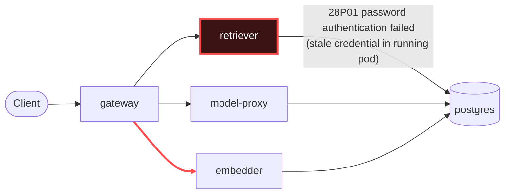

# Postmortem: gateway availability error budget burning slowly (10% of the 28d budget in 6h; 30m & 6h windows)

- **Status:** open
- **Severity:** sev2
- **Verified:** no
- **Opened:** 2026-08-03 01:46:44Z
- **Resolved:** (still open)

## Timeline (machine-generated)

All times UTC on 2026-08-03 unless a full date is shown.

| Time (UTC) | Source | Event |
| --- | --- | --- |
| 01:40:19Z | log-spike | log-spike onset: 41 \| throw new DrizzleQueryError(queryString, params, e); |
| 01:46:10Z | alert | alert firing: SLO gateway availability — slow burn |

## Evidence links

- [Loki — logs over the incident window](http://localhost:3001/explore?schemaVersion=1&panes=%7B%22pm%22%3A+%7B%22datasource%22%3A+%22loki%22%2C+%22queries%22%3A+%5B%7B%22refId%22%3A+%22A%22%2C+%22datasource%22%3A+%7B%22type%22%3A+%22loki%22%2C+%22uid%22%3A+%22loki%22%7D%2C+%22expr%22%3A+%22%7Bnamespace%3D%5C%22subject%5C%22%7D+%7C~+%5C%22%28%3Fi%29error%7Cfailed%5C%22%22%7D%5D%2C+%22range%22%3A+%7B%22from%22%3A+%221785721604354%22%2C+%22to%22%3A+%221785721867483%22%7D%7D%7D&orgId=1)
- [Mimir — metrics over the incident window](http://localhost:3001/explore?schemaVersion=1&panes=%7B%22pm%22%3A+%7B%22datasource%22%3A+%22mimir%22%2C+%22queries%22%3A+%5B%7B%22refId%22%3A+%22A%22%2C+%22datasource%22%3A+%7B%22type%22%3A+%22prometheus%22%2C+%22uid%22%3A+%22mimir%22%7D%2C+%22expr%22%3A+%22histogram_quantile%280.95%2C+sum%28rate%28http_server_duration_milliseconds_bucket%5B5m%5D%29%29+by+%28le%29%29%22%7D%5D%2C+%22range%22%3A+%7B%22from%22%3A+%221785721604354%22%2C+%22to%22%3A+%221785721867483%22%7D%7D%7D&orgId=1)

## Investigation context

**Runbook match:** none — no tool narrowing applied for this alert. Available runbooks: README.md, canary-abort.md, ci-pipeline-red.md, dq-freshness-stall.md, gateway-high-error-rate.md, k8s-crashloop.md, k8s-node-failure.md, snapshot-agent-audit.md, stale-secret.md

Pre-check battery (as injected at run start)

## Pre-check leads

### recent_deploys — LEAD
No deploy in the last 60m — rule out the reflex answer.
- No deploy in the last 60m — rule out the reflex answer.

### log_spike — LEAD
error/failed log rate 200/10min vs baseline 0/10min (200x baseline) — onset: 41 |         throw new DrizzleQueryError(queryString, params, e); at 2026-08-03T01:40:19.759175+00:00
- error/failed log rate 200/10min vs baseline 0/10min (200x baseline) — onset: 41 |         throw new DrizzleQueryError(queryString, params, e); at 2026-08-03T01:40:19.759175+00:00

### kube_scan — UNAVAILABLE
error: You must be logged in to the server (Unauthorized)

### rollout_state — UNAVAILABLE
gateway: E0803 03:46:45.591446   47804 memcache.go:265] "Unhandled Error" err="couldn't get current server API group list: the server has asked for the client to provide credentials"
E0803 03:46:45.696125   47804 memcache.go:265] "Unhandled Error" err="couldn't get current server API group list: the server has asked for the client to provide credentials"
E0803 03:46:45.859138   47804 memcache.go:265] "Unhandled Error" err="couldn't get current server API group list: the server has asked for the client to; gateway analysis: E0803 03:46:45.591446   15556 memcache.go:265] "Unhandled Error" err="couldn't get current server API group list: the server has asked for the client to provide credentials"
E0803 03:46:45.695617   15556 memcache.go:265] "Unhandled Error"
… (section truncated)

### secret_age — UNAVAILABLE
error: You must be logged in to the server (Unauthorized)

## Narrative

## Summary
Gateway's availability error budget began burning slowly (10% of the 28d budget in 6h) because every RAG query touching `retriever` failed. `retriever` could not authenticate to Postgres.

## Impact
- `gateway → retriever` failed-request count (Tempo service graph) climbed from a baseline of ~37 to 5164+ within ~15 minutes, and `user → gateway` failed requests rose in lockstep from ~80 to 5421+ (see report.html).
- Every retriever query in this window failed and threw `DrizzleQueryError` → `PostgresError: password authentication failed for user "lab"` (SQLSTATE `28P01`), so retrieval (and therefore chat completions that depend on retrieved context) degraded across all tenants hitting the RAG path.
- Postgres itself logged matching `FATAL: password authentication failed for user "lab"` entries for every connection attempt from retriever, confirming the failure is server-side auth rejection, not a client-side bug.

## Root cause
`retriever`'s Postgres connections started failing authentication for user `lab` (SQLSTATE 28P01) at 01:40:20 UTC, with zero prior occurrences in the preceding lookback — a clean, sudden onset with no gradual error creep.

Evidence ruling out the reflex explanations:
- **Not a bad deploy**: `deploy_history` over the preceding 6h shows no deploy to `retriever` or `postgres` anywhere near onset — the nearest entries are unrelated `gateway`/`platform` gitops syncs and CI runs on `model-proxy`/`load-generator`, all 15+ minutes to 2+ hours before the failures started and touching different workloads.
- **Not a live secret rotation**: the remediation tool that syncs a rotated vault credential into the cluster Secret reported *no rotated credential pending* — the Secret backing `retriever`'s Postgres connection is already at its current, correct value.
- That combination — Secret already correct, but the running pod rejected on every attempt — is the signature of a **stale in-pod credential**: `retriever`'s single running pod (`retriever-dc7ddd494-jv9j7`) had not been restarted since before the credential it's using stopped being valid, so its live connections/env still carried the old value while Postgres now enforces the current one. Only a pod restart re-reads the Secret at container start; Kubernetes does not push Secret changes into a running process.
- Only `retriever` showed `28P01` errors anywhere in the namespace's logs in the incident window — `gateway`, `model-proxy`, and `embedder` were clean of Postgres auth errors, isolating the fault to the one workload with the stale credential.

## What fixed it
Diagnosis and remediation plan: dry-run a rolling restart of `retriever` (`restart_workload`, dry_run=true → diff: rolling-restart annotation bump, no spec change) so the pod re-reads the current, already-correct Secret on startup. This was presented for approval and **approved** by the operator.

**However, execution failed**: the real (`dry_run=false`) call to `restart_workload`, and independent confirmation via `kubectl_read get pods`, both returned `Unauthorized — You must be logged in to the server`. This matches the same auth failure already seen on the pre-check battery's `kube_scan`, `rollout_state`, and `secret_age` leads — the cluster-write/read credentials available to this on-call session are broken cluster-wide, not just for this one action. Retrying the same call would not help; I did not keep hammering it.

**The remediation was NOT applied. The alert is still active** — re-queried `alert_status` after the failed execution and it continues to report `active: true`. This incident is being closed unresolved from the automation's side; a human with working cluster credentials needs to run the equivalent of `kubectl rollout restart deployment/retriever -n subject` (or fix the agent's kubeconfig/token and re-run the approved action) to actually clear it.

## Lessons
- Add a pre-flight credential health check (e.g. a cheap `kubectl_read get ns` probe) at the top of the on-call flow so a cluster-auth outage is surfaced as its own incident immediately, instead of silently degrading every remediation attempt down the line.
- `update_db_secret`'s "nothing to sync" response is a useful negative signal — it should be documented in the stale-secret runbook as the discriminator between "vault rotated, sync it" vs. "Secret's fine, just the pod is stale, go straight to restart."
- Consider a periodic canary restart or shorter max pod age for stateful-credential consumers like `retriever` so a credential cutover elsewhere in the stack can't silently strand a long-lived pod on an old value for hours before anyone notices.

