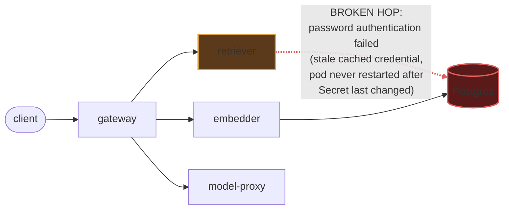

# Postmortem: gateway availability error budget burning fast (2% of the 28d budget in 1h; 5m & 1h windows)

- **Status:** open
- **Severity:** sev1
- **Verified:** no
- **Opened:** 2026-08-03 02:52:43Z
- **Resolved:** (still open)

## Timeline (machine-generated)

All times UTC on 2026-08-03 unless a full date is shown.

| Time (UTC) | Source | Event |
| --- | --- | --- |
| 02:52:10Z | alert | alert firing: SLO gateway availability — fast burn |
| 02:52:21Z | log-spike | log-spike onset: {"level":"warn","service":"retriever","message":"lineage emit failed","trace_id":"45eff5b8720ec2fd869f7545943c3b35","span_id":"648f22766a5383b8","time":"2026-08-03T02:52:21.533Z","reason":"The operation timed out.","job":"… |

## Evidence links

- [Loki — logs over the incident window](http://localhost:3001/explore?schemaVersion=1&panes=%7B%22pm%22%3A+%7B%22datasource%22%3A+%22loki%22%2C+%22queries%22%3A+%5B%7B%22refId%22%3A+%22A%22%2C+%22datasource%22%3A+%7B%22type%22%3A+%22loki%22%2C+%22uid%22%3A+%22loki%22%7D%2C+%22expr%22%3A+%22%7Bnamespace%3D%5C%22subject%5C%22%7D+%7C~+%5C%22%28%3Fi%29error%7Cfailed%5C%22%22%7D%5D%2C+%22range%22%3A+%7B%22from%22%3A+%221785725563437%22%2C+%22to%22%3A+%221785725867764%22%7D%7D%7D&orgId=1)
- [Mimir — metrics over the incident window](http://localhost:3001/explore?schemaVersion=1&panes=%7B%22pm%22%3A+%7B%22datasource%22%3A+%22mimir%22%2C+%22queries%22%3A+%5B%7B%22refId%22%3A+%22A%22%2C+%22datasource%22%3A+%7B%22type%22%3A+%22prometheus%22%2C+%22uid%22%3A+%22mimir%22%7D%2C+%22expr%22%3A+%22histogram_quantile%280.95%2C+sum%28rate%28http_server_duration_milliseconds_bucket%5B5m%5D%29%29+by+%28le%29%29%22%7D%5D%2C+%22range%22%3A+%7B%22from%22%3A+%221785725563437%22%2C+%22to%22%3A+%221785725867764%22%7D%7D%7D&orgId=1)

## Investigation context

**Runbook match (2):** `gateway-high-error-rate.md`, `stale-secret.md` — toolset narrowed to 13 tools: alert_status, deploy_history, kubectl_read, loki_query, mimir_query, publish_postmortem, request_approval, restart_workload, runbook_lookup, runbook_read, save_artifact, tempo_query, update_db_secret

Pre-check battery (as injected at run start)

## Pre-check leads

### recent_deploys — LEAD
No deploy in the last 60m — rule out the reflex answer.
- No deploy in the last 60m — rule out the reflex answer.

### log_spike — LEAD
error/failed log rate 200/10min vs baseline 0/10min (200x baseline) — onset: {"level":"warn","service":"retriever","message":"lineage emit failed","trace_id":"45eff5b8720ec2fd869f7545943c3b35","span_id":"648f22766a5383b8","time":"2026-08-03T02:52:21.533Z","reason":"The operation timed out.","job":"rag.retrieve","eventType":"START"} at 2026-08-03T02:52:21.534420+00:00
- error/failed log rate 200/10min vs baseline 0/10min (200x baseline) — onset: {"level":"warn","service":"retriever","message":"lineage emit failed","trace_id":"45eff5b8720ec2fd869f7545943c… (truncated)

### kube_scan — UNAVAILABLE
error: You must be logged in to the server (Unauthorized)

### rollout_state — UNAVAILABLE
gateway: E0803 04:53:08.436215    1116 memcache.go:265] "Unhandled Error" err="couldn't get current server API group list: the server has asked for the client to provide credentials"
E0803 04:53:10.383397    1116 memcache.go:265] "Unhandled Error" err="couldn't get current server API group list: the server has asked for the client to provide credentials"
E0803 04:53:11.042428    1116 memcache.go:265] "Unhandled Error" err="couldn't get current server API group list: the server has asked for the client to; gateway analysis: E0803 04:53:00.152364   29916 memcache.go:265] "Unhandled Error" err="couldn't get current server API group list: the server has asked for the client to provide credentials"
E0803 04:53:01.596595   29916 memcache.go:265] "Unhandled Error"
… (section truncated)

### secret_age — UNAVAILABLE
error: You must be logged in to the server (Unauthorized)

## Narrative

## Summary

`SLO gateway availability — fast burn` (sev1, tenant acme) fired because the `retriever` service — one of gateway's synchronous downstreams for RAG requests — has been unable to authenticate to Postgres, causing gateway to surface those failures as 5xx responses and burn the availability error budget.

## Impact

Gateway requests that depend on `retriever` (RAG retrieval path) are failing at a sustained, climbing rate. Measured directly from `retriever` logs: 0 errors/min at baseline, ~20/min at the alert's own onset lead, and ~79/min by the time remediation was attempted — the failure rate was actively worsening, not self-healing, for the duration of this incident.

## Root cause

`retriever` is logging continuous `PostgresError: password authentication failed for user "lab"` on every DB call. This is the classic **rotation-vs-restart mismatch**: the credential the live `retriever` pod holds in its process environment no longer matches what Postgres expects, and Kubernetes never hot-reloads an env-sourced Secret into a running pod — only a restart picks up a changed value.

Evidence ruling out the alternatives:
- **Not a bad deploy**: `deploy_history` shows zero deploys/syncs for `gateway` or `retriever` in the incident window — the only CI activity was two unrelated `load-generator` commits.
- **Not a pending vault rotation**: `update_db_secret` (dry-run) reported *no rotated credential in the vault to sync* — the Secret itself is already at its current value; nothing to push. That rules out the "sync-then-restart" branch of the stale-secret runbook and narrows it to "the Secret already changed upstream at some point, but the running pod was never restarted to re-read it."
- **Isolated to one workload**: every `password authentication failed` line in the namespace traces back to the single `retriever` pod (`retriever-dc7ddd494-jv9j7`); no other service shows the same signature, consistent with one pod carrying a stale in-memory credential rather than a cluster-wide DB outage.
- Could not corroborate pod start time vs. secret age directly — `kubectl describe`/`secret_age`/`rollout_state` all returned `Unauthorized` from the cluster API throughout this incident (a standing access problem, not diagnostic signal).

## What fixed it

**It did not get fixed.** The correct remediation — a rolling restart of `deployment/retriever` so it re-reads the current (already-correct) credential — was dry-run, approved by the operator (`request_approval` → approved), and then executed for real, but the execution call itself failed twice with the cluster API returning `Unauthorized`. This is the same failure mode that blocked every `kubectl`-backed read throughout the investigation (`kube_scan`, `rollout_state`, `secret_age`, and my own pod-describe attempt) — a cluster-authentication problem in the environment, independent of the diagnosis. `alert_status` was re-queried after the failed execution and remains **active, unchanged**, confirming no recovery occurred.

**This incident is unresolved.** The fix is known and approved but not applied; a human with working cluster credentials needs to restart `deployment/retriever` (or resolve the on-call agent's cluster auth) to actually clear it.

## Lessons

- The on-call agent's cluster API credentials are failing `Unauthorized` cluster-wide (reads and writes), which silently degraded this response from "diagnose and fix" to "diagnose only." This is itself worth its own incident — the remediation path is only as good as the credential behind it.
- `update_db_secret` returning "nothing to sync" is a useful negative signal: it tells you the Secret is already correct and the fix is purely a restart, not a resync — worth calling out explicitly in the stale-secret runbook so the next responder doesn't waste a cycle re-checking the vault.
- Consider a controller (e.g. Reloader/Stakater) that auto-restarts workloads on Secret change, removing the "rotated but never restarted" failure class entirely.

