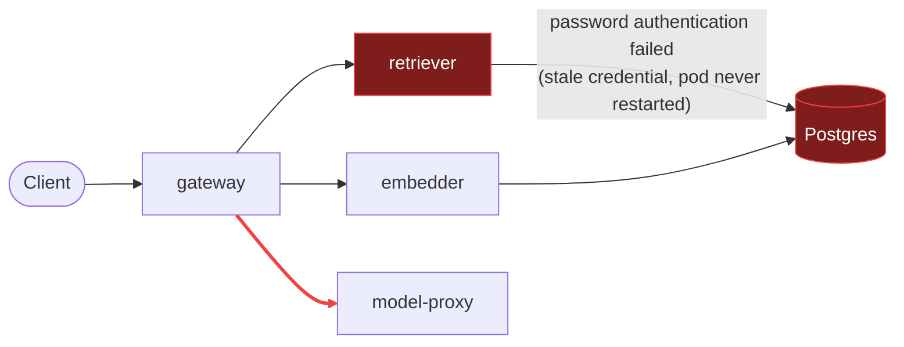

# Postmortem: gateway availability error budget burning fast (2% of the 28d budget in 1h; 5m & 1h windows)

- **Status:** open
- **Severity:** sev1
- **Verified:** no
- **Opened:** 2026-08-03 20:40:43Z
- **Resolved:** (still open)

## Timeline (machine-generated)

All times UTC on 2026-08-03 unless a full date is shown.

| Time (UTC) | Source | Event |
| --- | --- | --- |
| 20:40:10Z | alert | alert firing: SLO gateway availability — fast burn |
| 20:40:32Z | log-spike | log-spike onset: {"level":"warn","service":"retriever","message":"lineage emit failed","trace_id":"2c726dd3b315e6709361061c9859c9c5","span_id":"59c5559cf7c9601d","time":"2026-08-03T20:40:32.255Z","reason":"The operation timed out.","job":"… |

## Evidence links

- [Loki — logs over the incident window](http://localhost:3001/explore?schemaVersion=1&panes=%7B%22pm%22%3A+%7B%22datasource%22%3A+%22loki%22%2C+%22queries%22%3A+%5B%7B%22refId%22%3A+%22A%22%2C+%22datasource%22%3A+%7B%22type%22%3A+%22loki%22%2C+%22uid%22%3A+%22loki%22%7D%2C+%22expr%22%3A+%22%7Bnamespace%3D%5C%22subject%5C%22%7D+%7C~+%5C%22%28%3Fi%29error%7Cfailed%5C%22%22%7D%5D%2C+%22range%22%3A+%7B%22from%22%3A+%221785789643212%22%2C+%22to%22%3A+%221785790396854%22%7D%7D%7D&orgId=1)
- [Mimir — metrics over the incident window](http://localhost:3001/explore?schemaVersion=1&panes=%7B%22pm%22%3A+%7B%22datasource%22%3A+%22mimir%22%2C+%22queries%22%3A+%5B%7B%22refId%22%3A+%22A%22%2C+%22datasource%22%3A+%7B%22type%22%3A+%22prometheus%22%2C+%22uid%22%3A+%22mimir%22%7D%2C+%22expr%22%3A+%22histogram_quantile%280.95%2C+sum%28rate%28http_server_duration_milliseconds_bucket%5B5m%5D%29%29+by+%28le%29%29%22%7D%5D%2C+%22range%22%3A+%7B%22from%22%3A+%221785789643212%22%2C+%22to%22%3A+%221785790396854%22%7D%7D%7D&orgId=1)

## Investigation context

**Runbook match (2):** `gateway-high-error-rate.md`, `stale-secret.md` — toolset narrowed to 13 tools: alert_status, deploy_history, kubectl_read, loki_query, mimir_query, publish_postmortem, request_approval, restart_workload, runbook_lookup, runbook_read, save_artifact, tempo_query, update_db_secret

Pre-check battery (as injected at run start)

## Pre-check leads

### recent_deploys — LEAD
No deploy in the last 60m — rule out the reflex answer.
- No deploy in the last 60m — rule out the reflex answer.

### log_spike — LEAD
error/failed log rate 200/10min vs baseline 0/10min (200x baseline) — onset: {"level":"warn","service":"retriever","message":"lineage emit failed","trace_id":"2c726dd3b315e6709361061c9859c9c5","span_id":"59c5559cf7c9601d","time":"2026-08-03T20:40:32.255Z","reason":"The operation timed out.","job":"rag.retrieve","eventType":"COMPLETE"} at 2026-08-03T20:40:32.255771+00:00
- error/failed log rate 200/10min vs baseline 0/10min (200x baseline) — onset: {"level":"warn","service":"retriever","message":"lineage emit failed","trace_id":"2c726dd3b315e6709361061c9859… (truncated)

### kube_scan — UNAVAILABLE
error: You must be logged in to the server (Unauthorized)

### rollout_state — UNAVAILABLE
gateway: E0803 22:40:50.278876    7924 memcache.go:265] "Unhandled Error" err="couldn't get current server API group list: the server has asked for the client to provide credentials"
E0803 22:40:51.204658    7924 memcache.go:265] "Unhandled Error" err="couldn't get current server API group list: the server has asked for the client to provide credentials"
E0803 22:40:51.647642    7924 memcache.go:265] "Unhandled Error" err="couldn't get current server API group list: the server has asked for the client to; gateway analysis: E0803 22:40:49.931775   28112 memcache.go:265] "Unhandled Error" err="couldn't get current server API group list: the server has asked for the client to provide credentials"
E0803 22:40:50.137711   28112 memcache.go:265] "Unhandled Error"
… (section truncated)

### secret_age — UNAVAILABLE
error: You must be logged in to the server (Unauthorized)

## Narrative

## Summary

Gateway availability fast-burn (`sev1`, tenant `acme`) fired because the `retriever` service has been unable to authenticate to Postgres. Requests that require RAG retrieval fail or time out, which the gateway surfaces as 5xx and which drives the availability SLO burn-rate alert.

## Impact

Gateway 5xx / availability error ratio (`slo:gateway_availability:error_ratio5m`) shows two episodes: a transient spike to ~97% shortly after the credential started failing, a brief recovery window, then a sustained climb that is still ongoing at the time of writing (~32% error ratio, well above the 2%/1h fast-burn threshold). See the attached `report.html` chart for the full series. Any request path touching retrieval (RAG queries for tenant `acme` and others) is degraded or failing.

## Root cause

`retriever` (pod `retriever-dc7ddd494-jv9j7`) has been throwing `PostgresError: password authentication failed for user "lab"` continuously, corroborated by a matching Postgres-side `FATAL: password authentication failed for user "lab"` log line at the identical instant. This onset **predates** both the alert (fires later) and the log-spike lead (`lineage emit failed` warnings, which are a downstream symptom of retrieval calls timing out, not the cause). `deploy_history` shows zero deploys in the lookback window, ruling out a bad release. This matches the stale-secret failure signature described in the `stale-secret.md` runbook: the Secret a pod reads at startup does not auto-refresh on a Kubernetes Secret change, so a pod started before a credential change keeps authenticating with the old value until it is restarted. Checking `update_db_secret` confirmed the vault has no pending rotation to sync — i.e. the current Secret value is already correct, but the long-running retriever pod never restarted to pick it up.

Other services (`gateway`, `embedder`, `model-proxy`) show no matching auth-failure log lines — this is isolated to `retriever`'s direct Postgres dependency.

## What fixed it

**Remediation did not complete.** A rolling restart of `deployment/retriever` was correctly identified as the fix (dry-run confirmed a no-spec-change `restartedAt` annotation patch), and was approved by the operator. Three execution attempts all failed at the cluster write path: the first timed out client-side, the next two returned `Unauthorized`. This mirrors the `Unauthorized` errors already seen on unrelated read paths in this environment (`kubectl_read describe`, `kube_scan`, `rollout_state`, `secret_age` pre-checks) — the cluster credential used for privileged operations appears to be rejecting requests right now. Re-querying `alert_status` after the attempts shows the alert still **active** (firing since first detected), and the error-ratio metric is unchanged (~32%, flat) — confirming no recovery. The incident remains open; the retriever restart still needs to be applied once cluster write access is restored.

## Lessons

- The credential-drift failure mode (Secret is correct, running pod is not) doesn't require a runbook's exact vault-rotation trigger to be present — `secret_age` was unavailable this run, but the Loki timestamp correlation (Postgres FATAL vs. alert/log-spike onset) was sufficient standalone evidence.
- The `lineage emit failed` / "operation timed out" log spike is a downstream symptom of retriever's broken Postgres path, not an independent root cause — worth teaching the log-spike lead to look one hop further back before surfacing it.
- Remediation tooling should distinguish a true `Unauthorized` (credential/RBAC problem) from a transient timeout in its error surface — right now both look like generic failures to the on-call agent, making it hard to know whether retrying is worthwhile.
- Retriever has no automatic reconciliation (e.g. a controller that restarts pods on Secret checksum change) — it depends entirely on an operator or CD step catching the drift.

