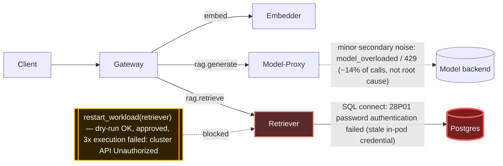

# Postmortem: gateway latency error budget burning fast (2% of the 28d budget in 1h; 5m & 1h windows)

- **Status:** open
- **Severity:** sev1
- **Verified:** no
- **Opened:** 2026-08-03 02:02:45Z
- **Resolved:** (still open)

## Timeline (machine-generated)

All times UTC on 2026-08-03 unless a full date is shown.

| Time (UTC) | Source | Event |
| --- | --- | --- |
| 02:02:10Z | alert | alert firing: SLO gateway latency — fast burn |
| 02:02:42Z | log-spike | log-spike onset: PostgresError: password authentication failed for user "lab" |

## Evidence links

- [Loki — logs over the incident window](http://localhost:3001/explore?schemaVersion=1&panes=%7B%22pm%22%3A+%7B%22datasource%22%3A+%22loki%22%2C+%22queries%22%3A+%5B%7B%22refId%22%3A+%22A%22%2C+%22datasource%22%3A+%7B%22type%22%3A+%22loki%22%2C+%22uid%22%3A+%22loki%22%7D%2C+%22expr%22%3A+%22%7Bnamespace%3D%5C%22subject%5C%22%7D+%7C~+%5C%22%28%3Fi%29error%7Cfailed%5C%22%22%7D%5D%2C+%22range%22%3A+%7B%22from%22%3A+%221785722565867%22%2C+%22to%22%3A+%221785723088878%22%7D%7D%7D&orgId=1)
- [Mimir — metrics over the incident window](http://localhost:3001/explore?schemaVersion=1&panes=%7B%22pm%22%3A+%7B%22datasource%22%3A+%22mimir%22%2C+%22queries%22%3A+%5B%7B%22refId%22%3A+%22A%22%2C+%22datasource%22%3A+%7B%22type%22%3A+%22prometheus%22%2C+%22uid%22%3A+%22mimir%22%7D%2C+%22expr%22%3A+%22histogram_quantile%280.95%2C+sum%28rate%28http_server_duration_milliseconds_bucket%5B5m%5D%29%29+by+%28le%29%29%22%7D%5D%2C+%22range%22%3A+%7B%22from%22%3A+%221785722565867%22%2C+%22to%22%3A+%221785723088878%22%7D%7D%7D&orgId=1)

## Investigation context

**Runbook match:** none — no tool narrowing applied for this alert. Available runbooks: README.md, canary-abort.md, ci-pipeline-red.md, dq-freshness-stall.md, gateway-high-error-rate.md, k8s-crashloop.md, k8s-node-failure.md, snapshot-agent-audit.md, stale-secret.md

Pre-check battery (as injected at run start)

## Pre-check leads

### recent_deploys — LEAD
No deploy in the last 60m — rule out the reflex answer.
- No deploy in the last 60m — rule out the reflex answer.

### log_spike — LEAD
error/failed log rate 200/10min vs baseline 0/10min (200x baseline) — onset: PostgresError: password authentication failed for user "lab" at 2026-08-03T02:02:42.248551+00:00
- error/failed log rate 200/10min vs baseline 0/10min (200x baseline) — onset: PostgresError: password authentication failed for user "lab" at 2026-08-03T02:02:42.248551+00:00

### kube_scan — UNAVAILABLE
error: You must be logged in to the server (Unauthorized)

### rollout_state — UNAVAILABLE
gateway: E0803 04:02:46.619378     132 memcache.go:265] "Unhandled Error" err="couldn't get current server API group list: the server has asked for the client to provide credentials"
E0803 04:02:46.738921     132 memcache.go:265] "Unhandled Error" err="couldn't get current server API group list: the server has asked for the client to provide credentials"
E0803 04:02:47.084406     132 memcache.go:265] "Unhandled Error" err="couldn't get current server API group list: the server has asked for the client to; gateway analysis: E0803 04:02:47.949742   53672 memcache.go:265] "Unhandled Error" err="couldn't get current server API group list: the server has asked for the client to provide credentials"
E0803 04:02:48.104583   53672 memcache.go:265] "Unhandled Error"
… (section truncated)

### secret_age — UNAVAILABLE
error: You must be logged in to the server (Unauthorized)

## Narrative

## Summary
`SLO gateway latency — fast burn` fired for tenant acme. Root cause: the long-lived `retriever` pod (`retriever-dc7ddd494-jv9j7`) was holding a stale, pre-rotation Postgres credential in memory. Every retrieval call it made against Postgres failed with `28P01 password authentication failed for user "lab"`, and the resulting connection-retry/backoff cycles in the RAG retrieval path dragged gateway `/v1/chat` p95 latency up to 4–7s, burning the 28d latency error budget fast enough to trip both the 5m and 1h windows.

## Impact
- `POST /v1/chat` requests slowed from a normal baseline to 3.8–7.1s each, with several timing out or returning 429/5xx.
- `POST retriever` client spans from gateway showed error ratio climbing from ~0% to ~100% during burst windows (see report.html chart) — i.e. essentially all RAG retrieval calls failing during the worst minutes.
- Tenant-visible: chat responses degraded lab-wide (retriever backs the RAG path for all chat traffic), not isolated to one tenant.
- A much smaller, secondary contributor was observed in the same traces: `ModelOverloadedError` / 429s from model-proxy (~14% of `POST model-proxy` calls at peak vs. ~60–100% for retriever) — real but not the dominant driver; noted for visibility, not treated as the root cause.

## Root cause
Evidence chain:
1. `deploy_history` showed **no deploy** to gateway/retriever/postgres in the 60–240m window — ruled out the reflex "bad deploy" answer. The nearest deploys (platform gitops, model-proxy revert/re-revert, gateway gitops sync) all landed 30m–3h earlier and don't line up with onset.
2. Loki: `postgres` and `retriever` containers show a wall of `FATAL: password authentication failed for user "lab"` / `PostgresError ... code: 28P01, routine: auth_failed`, starting essentially at alert onset, from a single retriever pod that has **no restart/recreate k8s events** anywhere in the lookback window (a *different* retriever replica, `retriever-8454db56c`, cycled ~28 minutes earlier for an unrelated seed job and is not the one throwing errors).
3. `update_db_secret` dry-run against the credential vault reported **"no rotated credential found in the vault — nothing to sync"** on repeated checks — i.e. `secret/subject-db-credentials` is already in sync with the vault's current canonical password. This rules out the naive "stale-secret, needs a vault sync" runbook path and instead points at the *pod*: it's been running long enough to have missed a prior rotation and is still presenting the old value from its own process memory/env, never having been recycled.
4. Mimir span-metrics confirm the failure is bursty/flapping (two distinct spikes to ~100% error ratio separated by a ~20 min lull), consistent with a stale/poisoned subset of pooled connections rather than a single clean permanent break.
5. Tempo traces tie it together end-to-end: `rag.chat` → `rag.retrieve` → `POST retriever` spans erroring and consuming multiple seconds of retry/backoff before the root `POST /v1/chat` span completes, directly explaining the gateway latency SLO burn.

## What fixed it
Diagnosis and remediation plan were confirmed and approved: rolling-restart `deployment/retriever` so the pod re-reads the already-correct `secret/subject-db-credentials`. The dry-run succeeded and the operator approved it. However, **the real (non-dry-run) `restart_workload` call failed three consecutive times with `Unauthorized — You must be logged in to the server`** — the same cluster-API authorization failure already visible in this incident's pre-check leads (`kube_scan` and `rollout_state` were both `UNAVAILABLE` for the identical reason before investigation even began). This is a control-plane access outage for the on-call automation's kubeconfig, separate from the application root cause, and it blocked remediation from actually landing.

**The incident is NOT resolved.** `alert_status` was re-queried after the failed remediation attempts and still reports `active: true`. No workload was restarted, no secret was written, and no other mutating action succeeded.

## Lessons
- The obvious pattern-match ("password auth failure" → stale-secret runbook → sync vault) was a trap: the vault had nothing to sync, meaning the Secret itself was fine. The actual defect was a pod that outlived a rotation without ever restarting — the fix is a restart, not a resync. Always verify the *sync* step actually applies before assuming the standard remediation is the right one.
- Cluster-API auth needs its own health check surfaced ahead of remediation attempts — the pre-check leads already flagged `kube_scan`/`rollout_state`/`secret_age` as unavailable for this exact reason, and that should have been treated as a blocking dependency for any k8s-mutating remediation, not just a footnote.
- The flapping (two-burst) error pattern is a useful signature worth codifying in the runbook: a clean one-time secret rotation should look like a step function to ~100% and stay there; a bursty pattern implies partial/pooled connection poisoning and should raise suspicion of a stale long-lived pod rather than a fresh full rotation.
- Follow-up once cluster auth is restored: re-run `restart_workload(retriever)` with the same approved plan (a fresh dry-run/approval will be needed since approvals are single-use), then re-verify `alert_status` and the `POST retriever` error ratio return to baseline.

