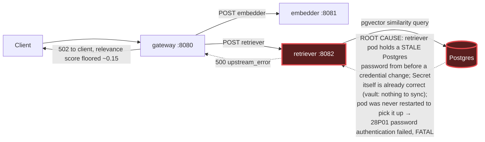

# Postmortem: RAG top-1 relevance below the 90% objective over the last hour (burn-rate alerting saturates for a loose SLO)

- **Status:** open
- **Severity:** sev2
- **Verified:** no
- **Opened:** 2026-08-03 22:05:48Z
- **Resolved:** (still open)

## Timeline (machine-generated)

All times UTC on 2026-08-03 unless a full date is shown.

| Time (UTC) | Source | Event |
| --- | --- | --- |
| 21:58:01Z | log-spike | log-spike onset: at ErrorResponse (/app/node_modules/.bun/postgres@3.4.9/node_modules/postgres/src/connection.js:817:22) |
| 22:05:10Z | alert | alert firing: SLO RAG quality — below objective |

## Evidence links

- [Loki — logs over the incident window](http://localhost:3001/explore?schemaVersion=1&panes=%7B%22pm%22%3A+%7B%22datasource%22%3A+%22loki%22%2C+%22queries%22%3A+%5B%7B%22refId%22%3A+%22A%22%2C+%22datasource%22%3A+%7B%22type%22%3A+%22loki%22%2C+%22uid%22%3A+%22loki%22%7D%2C+%22expr%22%3A+%22%7Bnamespace%3D%5C%22subject%5C%22%7D+%7C~+%5C%22%28%3Fi%29error%7Cfailed%5C%22%22%7D%5D%2C+%22range%22%3A+%7B%22from%22%3A+%221785794748603%22%2C+%22to%22%3A+%221785795005131%22%7D%7D%7D&orgId=1)
- [Mimir — metrics over the incident window](http://localhost:3001/explore?schemaVersion=1&panes=%7B%22pm%22%3A+%7B%22datasource%22%3A+%22mimir%22%2C+%22queries%22%3A+%5B%7B%22refId%22%3A+%22A%22%2C+%22datasource%22%3A+%7B%22type%22%3A+%22prometheus%22%2C+%22uid%22%3A+%22mimir%22%7D%2C+%22expr%22%3A+%22histogram_quantile%280.95%2C+sum%28rate%28http_server_duration_milliseconds_bucket%5B5m%5D%29%29+by+%28le%29%29%22%7D%5D%2C+%22range%22%3A+%7B%22from%22%3A+%221785794748603%22%2C+%22to%22%3A+%221785795005131%22%7D%7D%7D&orgId=1)

## Investigation context

**Runbook match:** none — no tool narrowing applied for this alert. Available runbooks: README.md, canary-abort.md, ci-pipeline-red.md, dq-freshness-stall.md, gateway-high-error-rate.md, k8s-crashloop.md, k8s-node-failure.md, snapshot-agent-audit.md, stale-secret.md

Pre-check battery (as injected at run start)

## Pre-check leads

### recent_deploys — LEAD
No deploy in the last 60m — rule out the reflex answer.
- No deploy in the last 60m — rule out the reflex answer.

### log_spike — LEAD
error/failed log rate 200/10min vs baseline 0/10min (200x baseline) — onset:       at ErrorResponse (/app/node_modules/.bun/postgres@3.4.9/node_modules/postgres/src/connection.js:817:22) at 2026-08-03T21:58:01.770108+00:00
- error/failed log rate 200/10min vs baseline 0/10min (200x baseline) — onset:       at ErrorResponse (/app/node_modules/.bun/postgres@3.4.9/node_modules/postgres/src/connection.js:817:22)… (truncated)

### kube_scan — UNAVAILABLE
error: You must be logged in to the server (Unauthorized)

### rollout_state — UNAVAILABLE
gateway: E0804 00:05:49.137892   44844 memcache.go:265] "Unhandled Error" err="couldn't get current server API group list: the server has asked for the client to provide credentials"
E0804 00:05:49.291729   44844 memcache.go:265] "Unhandled Error" err="couldn't get current server API group list: the server has asked for the client to provide credentials"
E0804 00:05:49.646905   44844 memcache.go:265] "Unhandled Error" err="couldn't get current server API group list: the server has asked for the client to; gateway analysis: E0804 00:05:49.137892   53952 memcache.go:265] "Unhandled Error" err="couldn't get current server API group list: the server has asked for the client to provide credentials"
E0804 00:05:49.290219   53952 memcache.go:265] "Unhandled Error"
… (section truncated)

### secret_age — UNAVAILABLE
error: You must be logged in to the server (Unauthorized)

## Narrative

## Summary
The `SLO RAG quality — below objective` alert fired because the gateway's `retrieval_relevance_score` metric (top-1 relevance) collapsed to a floor value of ~0.15, far under the 0.90 objective, for the entire alert window. No runbook matched this alertname exactly, so investigation proceeded from telemetry rather than a prescribed playbook.

## Impact
Every RAG chat request for tenant `acme` (and other tenants sharing the retriever) received degraded or failing retrieval: traces show `rag.retrieve` throwing `upstream_error: retriever returned 500`, and the parent `POST /v1/chat` span terminating with HTTP 502. The relevance-score histogram stayed pinned at its lowest non-zero bucket (`le=0.2`) for effectively 100% of requests, confirming retrieval was structurally broken, not just noisy.

## Root cause
`retriever` pod logs show a continuous stream of `PostgresError: password authentication failed for user "lab"` (Postgres error code `28P01`, routine `auth_failed`, severity `FATAL`) starting right at the alert's true onset, well before the SLO's burn-rate window saturated and paged. `deploy_history` shows no deploy in the preceding four hours, ruling out a bad release. Dry-running the vault-sync remediation (`update_db_secret`) returned "no rotated credential found in the vault — nothing to sync," which means the `subject-db-credentials` Secret is **already correct** — the mismatch is between that Secret and the long-lived `retriever` pod process, which loaded the old password into its environment at startup and has never restarted since. This is the stale-secret failure signature (credential rotated/corrected out from under a running pod) even though it surfaced as a RAG-quality SLO breach rather than the gateway-availability alerts the existing `stale-secret.md` runbook is scoped to — worth a follow-up runbook entry for this alertname.

Gateway and model-proxy logs show no matching auth failures, so only `retriever` is holding the stale credential.

## What fixed it
A `restart_workload` dry-run on `retriever` was approved by the operator (summary + verified diff: rolling restart via `restartedAt` annotation, no spec change). However, all three attempts to execute it for real returned `Unauthorized` — the same credential failure already flagged as UNAVAILABLE for `kube_scan`, `rollout_state`, and `secret_age` in this incident's pre-checks. The cluster-facing kubeconfig this remediation toolchain depends on is itself broken right now, independent of the retriever's Postgres credential problem. **The remediation was approved but could not be executed**, and `alert_status` confirms the alert is still active. This incident is being closed unresolved from the on-call side; it needs either a human with valid cluster credentials to run the rolling restart on `retriever`, or the agent's kubeconfig/RBAC to be repaired first.

## Lessons
- The RAG-quality SLO alert has no matching runbook by name; `stale-secret.md` covers the same underlying failure mode (rotated credential, pod never restarted) but is scoped to `slo-avail-fast`/`gw-5xx` triggers only — it should be cross-linked or re-triggered for RAG-quality alertnames too, since a broken retriever silently degrades relevance scores rather than tripping availability alarms first.
- `update_db_secret`'s dry-run was the deciding diagnostic step: it distinguished "Secret needs updating" from "pod needs restarting," which the log evidence alone couldn't cleanly separate.
- A remediation toolchain's own auth health (kubectl/kubeconfig) needs to be checked as part of pre-checks, not discovered only at execution time — here it was flagged early (`kube_scan`/`rollout_state`/`secret_age` all UNAVAILABLE) but the significance (remediation itself would fail) wasn't confirmed until the actual restart call.

